[TOC]

# Nacos介绍

## 一、背景

```bash
当我们需要将微服务中不同模块之间实现服务调用时，我们需要使用到远程调用的方式或工具
```

## 二、主流的配置中心对比

### 1、常见注册中心对比

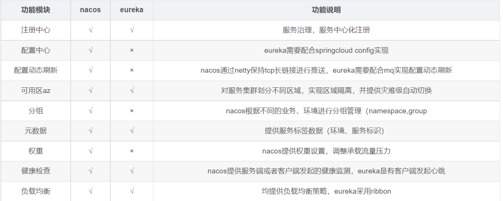

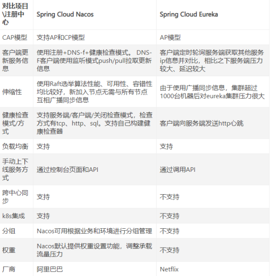

#### 1.nacos与eureka的区别

##### 1)nacos和eureka的范围不同

```bash
    Nacos的阈值是针对某个具体Service的，而不是针对所有服务的;但Eureka的自我保护阈值是针对所有服务的。nacos支持CP和AP两种;eureka只支持AP。nacos使用netty，是长连接; eureka是短连接，定时发送。
```

##### 2)保护方式不同

```bash
     Eureka保护方式:当在短时间内，统计续约失败的比例，如果达到一定阈值，则会触发自我保护的机制，在该机制下，Eureka Server不会剔除任何的微服务，等到正常后，再退出自我保护机制。自我保护开关(eureka.server. enab1e-self-preservation:false)
     
    Nacos保护方式:当域名健康实例(Instance)占总服务实例(Instance)的比例小于阈值时，无论实例(Instance)是否健康，都会将这个实例(Instance)返回给客户端。这样做虽然损失了一部分流量，但是保证了集群的剩余健康实例(Instance)能正常工作。
```

##### 3)nacos具备流量管理功能

```bash
    Nacos具备服务优雅上下线和流量管理（API+后台管理页面），而Eureka的后台页面仅供展示，需要使用api操作上下线且不具备流量管理功能。
```

##### 4)部署方便

```bash
     从部署来看，Nacos整合了注册中心、配置中心功能，把原来两套集群整合成一套，简化了部署维护
```

##### 5)支持伸缩扩容

```bash
    从伸缩性和扩展性来看Nacos支持跨注册中心同步，而Eureka不支持，且在伸缩扩容方面，Nacos比Eureka更优（nacos支持大数量级的集群）。
```

##### 6)支撑多套项目

```bash
Nacos具有分组隔离功能，一套Nacos集群可以支撑多项目、多环境
```


#### 2.Nacos相对于Eureka来说，Nacos更强大

```bash
1.Nacos = Spring Cloud Eureka + Spring Cloud Config
2.Nacos 可以与 Spring, Spring Boot, Spring Cloud 集成，并能代替 Spring Cloud Eureka, Spring Cloud Config。
3.通过 Nacos Server 和 spring-cloud-starter-alibaba-nacos-config 实现配置的动态变更。
4.通过 Nacos Server 和 spring-cloud-starter-alibaba-nacos-discovery 实现服务的注册与发现
5.nacos支持a（高可用）p（分区容错）和c（一致性）p的切换默认为ap, eureka仅支持ap，zookeeper仅支持cp
```

### 2、主流配置中心对比

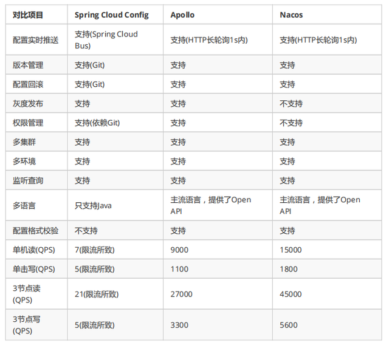

```bash
     从配置中心角度来看，性能方面Nacos的读写性能最高，Apollo次之SpringCloudConfig依赖Git场景不适合开放的大规模自动化运维API。
     功能方面Apollo最为完善，nacos具有Apollo大部分配置管理功能，而SpringCloudConfig不带运维管理界面，需要自行开发。
     Nacos的一大优势是整合了注册中心、配置中心功能，部署和操作相比Apollo都要直观简单，因此它简化了架构复杂度，并减轻运维及部署工作。
     综合来看，Nacos的特点和优势还是比较明显的
```

### 3、Nacos的价值

#### 1.Nacos Sync的价值

```bash
    NacosSync是一个支持多种注册中心的同步组件,基于Spring boot开发框架,数据层采用Spring Data JPA,遵循了标准的JPA访问规范,支持多种数据源存储,默认使用Hibernate实现,更加方便的支持表的自动创建更新
    使用了高效的事件异步驱动模型, 支持多种自定义事件,使得同步任务处理的延时控制在3s,8C16G的单机能够支持6K的同步任务
    NacosSync除了单机部署,也提供了高可用的集群部署模式,NacosSync是无状态设计,将任务等状态数据迁移到了数据库,使得集群扩展非常方便
    抽象出了Sync组件核心接口,通过注解对同步类型进行区分,使得开发者可以很容易的根据自己需求,去扩展不同注册中心,目前已支持的同步类型:
    
    Nacos数据同步到Nacos
    Zookeeper数据同步到Nacos
    Nacos数据同步到Zookeeper
    Eureka数据同步到Nacos
    Consul数据同步到Nacos
```

**系统模块架构**

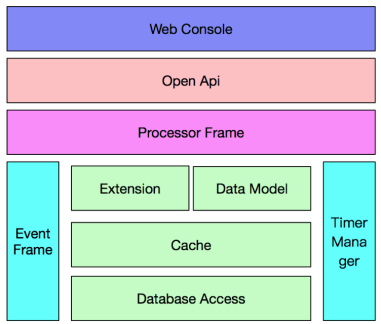

**使用场景**

```bash
多个网络互通的Region之间服务共享,打破Region之间的服务调用限制
```

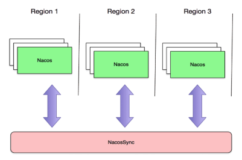

#### 2.DNS-F的技术价值

```bash
Nacos提供DNS-F功能
DNS-F落地的技术价值

    填补了内部微服务业务没有全局动态调度能力的空白
    解决了服务端棉铃挑战：时延大、解析不准、故障牵引慢
    支持服务端多种调度需要
    加速外部域名解析
    服务故障牵引秒级生效
    提供专线流量牵引能力
```

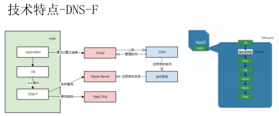

## 三、Nacos简介


```bash
1.Nacos是阿里的一个开源产品，它是针对微服务架构中的服务发现、配置管理、服务治理的综合性解决方案。

官方介绍是这样的：

Nacos致力于帮助您发现、配置和管理微服务。Nacos提供了一组简单易用的特性集，帮助您实现动态服务发现、服务配置管理、服务及流量管理。Nacos帮助您更敏捷和容易地构建、交付和管理微服务平台。Nacos是构建以“服务”为中心的现代应用架构的服务基础设施。
```

## 四、Nacos特性

### 1、服务发现与服务健康检查

```bash
1.Nacos使服务更容易注册，并通过DNS或HTTP接口发现其他服务，Nacos还提供服务的实时健康检查，以防止向不健康的主机或服务实例发送请求。
2.支持 DNS 与 RPC 服务发现，也提供原生 SDK 、OpenAPI 等多种服务注册方式和 DNS、HTTP 与 API 等多种服务发现方式
3.Nacos 提供对服务的实时的健康检查，阻止向不健康的主机或服务实例发送请求。
```

### 2、动态配置管理

```bash
1.动态配置服务允许您在所有环境中以集中和动态的方式管理所有服务的配置。Nacos消除了在更新配置时重新部署应用程序，这使配置的更改更加高效和灵活
2.Nacos 提供配置统一管理功能，能够帮助我们将配置以中心化、外部化和动态化的方式管理所有环境的应用配置和服务配置。
3.接触过SpringCloud应该对config有所了解，那么配置中心也就很好理解，Nacos支持动态的配置管理，将服务的配置信息分环境分类别外部管理，并且支持热更新。不过与Config不同Nacos的配置信息存储与数据库中，支持配置信息的监听和版本回滚。
```

### 3、动态DNS服务

```bash
1.Nacos提供基于DNS协议的服务发现能力，旨在支持异构语言的服务发现，支持将注册在Nacos上的服务以域名的方式暴露端点，让三方应用方便地查阅及发现。
2.Nacos 支持动态 DNS 服务权重路由，能够让我们很容易地实现中间层负载均衡、更灵活的路由策略、流量控制以及数据中心内网的简单 DNS 解析服务。
```

### 4、服务和元数据管理

```bash
1.Nacos能让您从微服务平台建设的视角管理数据中心的所有服务及元数据，包括管理服务的描述、生命周期、服务的静态依赖分析、服务的健康状态、服务的流量管理、路由及安全策略、服务的 SLA 以及最首要的 metrics 统计数据。可以搭建搭建prometheus采集Nacos metrics数据也可以搭建搭建grafana图形化展示metrics数据
```

## 五、一图看懂Nacos

### 1、Nacos地图

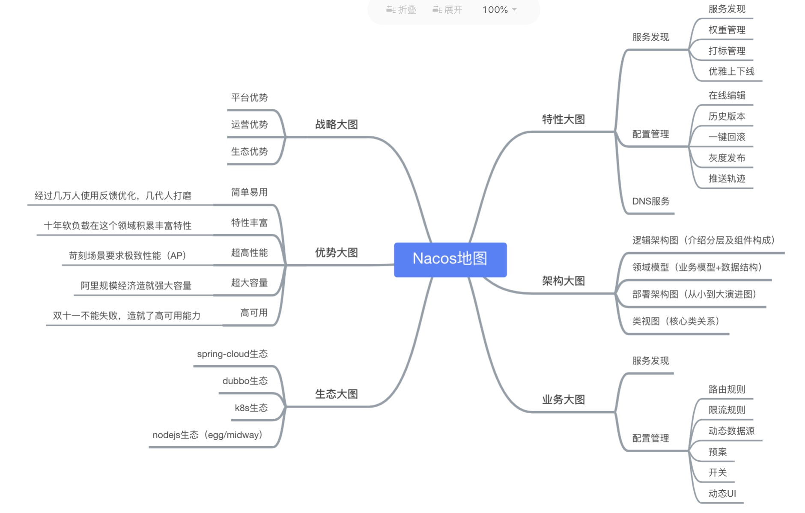

### 2、Nacos生态

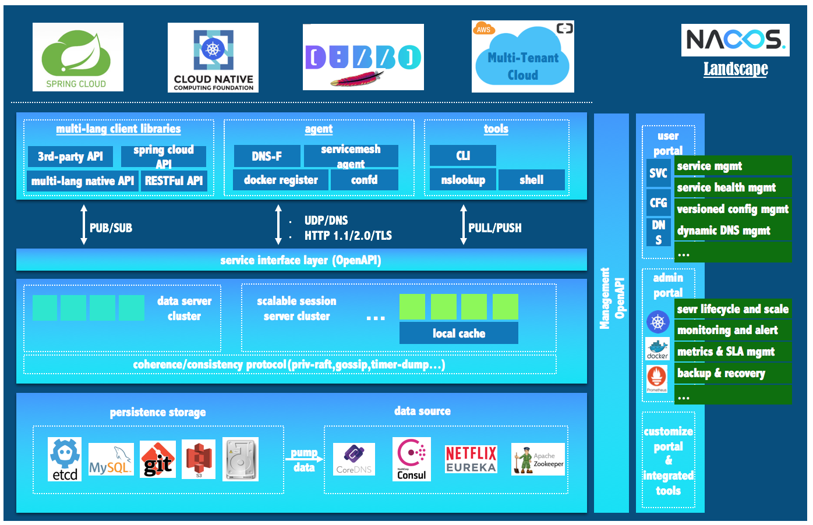

### 3、Nacos架构

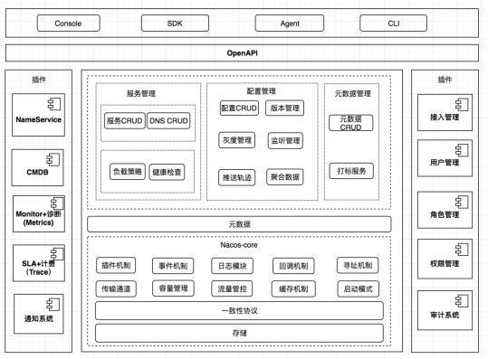

## 六、Nacos原理

### 1、简单介绍

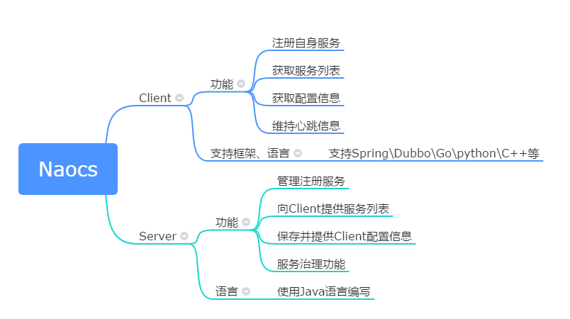

```bash
    Nacos注册中心分为server与client，server采用Java编写，为client提供注册发现服务与配置服务。而client可以用多语言实现，client与微服务嵌套在一起，nacos提供sdk和openApi，如果没有sdk也可以根据openApi手动写服务注册与发现和配置拉取的逻辑
```

### 2、服务领域模型

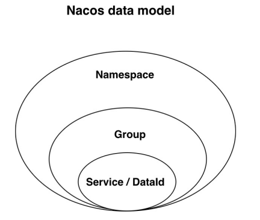

```bash
    Nacos服务领域模型主要分为命名空间、集群、服务。在下图的分级存储模型可以看到，在服务级别，保存了健康检查开关、元数据、路由机制、保护阈值等设置，而集群保存了健康检查模式、元数据、同步机制等数据，实例保存了该实例的ip、端口、权重、健康检查状态、下线状态、元数据、响应时间
```

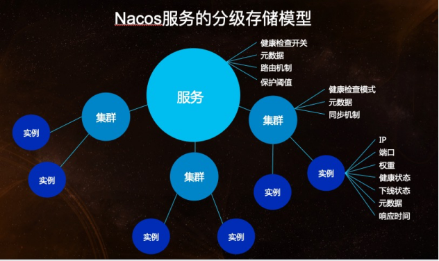

### 3、注册中心原理

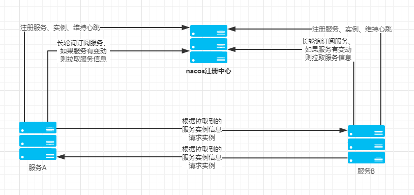

```ba
     服务注册方法：以Java nacos client v1.0.1 为例子，服务注册的策略的是每5秒向nacos server发送一次心跳，心跳带上了服务名，服务ip，服务端口等信息。同时 nacos server也会向client 主动发起健康检查，支持tcp/http检查。如果15秒内无心跳且健康检查失败则认为实例不健康，如果30秒内健康检查失败则剔除实例。
```

### 4、配置中心原理

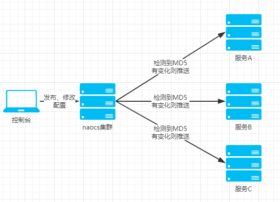

