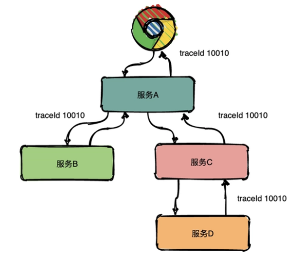
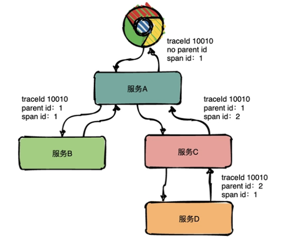
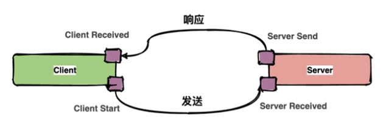
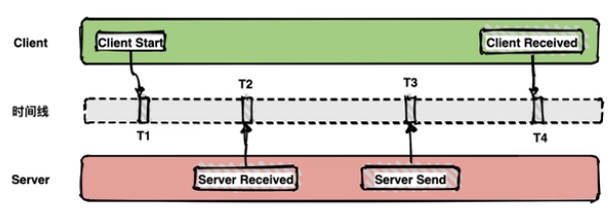
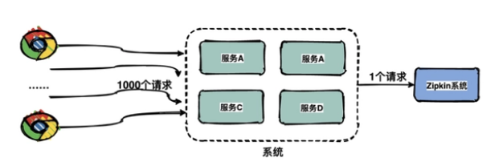
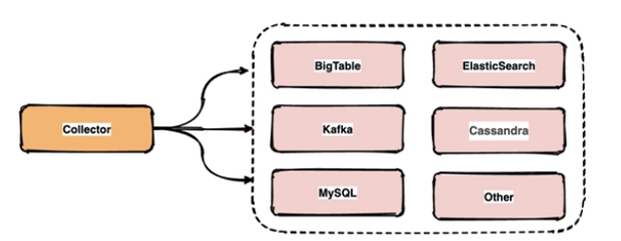
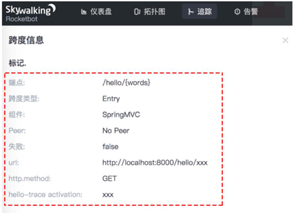
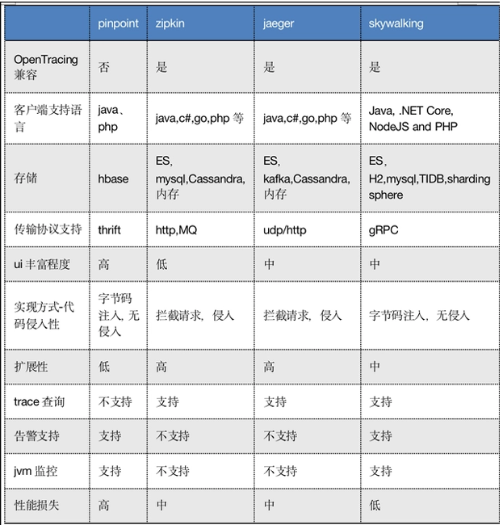
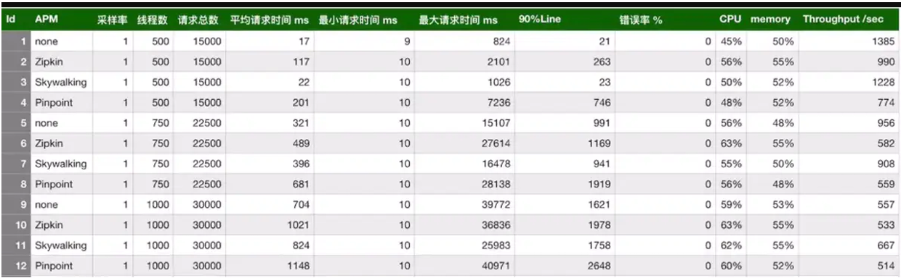

# 分布式链路追踪系统介绍

##  一、分布式链路追踪系统的起源

### 1 、需求背景

>​    在较大型的web集群和微服务环境中，客户端的一次请求可能需要经过多个不同的模块、多个不同中间件、多台不同机器的一起相互协作才能处理完成客户端的请求，而在这一系列的请求过程之中，处理流程可能是串行执行也可能是并行执行的，那么如何确定客户端的一次请求到结束的背后究竟调用了哪些应用以及哪些模块并经过了哪些节点，且每个模块的调用先后顺序是怎样的、每个模块的处理相应性能如何？后期着业务系统的不断增多，业务处理逻辑会越来越复杂，而分布式系统中急需一套链路追踪（Trace）系统来解决这些痛点，从而让运维人员对整个业务系统一目了然、了如指掌。

> ​    分布式服务跟踪系统是整个分布式系统中跟踪一个用户请求的完整过程，包括数据采集、数据传输、数据存储、数据分析和数据可视化，获取并存储和分享此类跟踪可以让运维清晰了解用户请求与业务系统交互背后的整个调用链的调用关系，链路追踪系统是针对调试和监控微服务不可或缺的好帮手。

### 2 、 Dapper-> 分布式链路追踪的前身

#### 1. 简介

>​    现代分布式链路追踪系统进入大众视野还要追溯到 Google 内部使用的 Dapper 这个分布式链路追踪系统。Google 虽未开源 Dapper ，但在 2010 年的时候发布了一篇名为《Dapper, a Large-Scale Distributed Systems Tracing Infrastructure》 的论文。这篇论文对于后续分布式链路追踪系统的发展产生了非常大的影响。据 Dapper 的设计者所言：“Dapper设计之初，参考了一些其他分布式系统的理念，尤其是Magpie和X-Trace。不过，Dapper 之所以能成功应用在生产环境上，还是做了一些巧妙的优化和设计，例如采样率的使用”。

#### 2. 论文大致内容

>1. Dapper 诞生的原因 ： 简单来说就是一个 Web 查询可能会调用上千台服务器，涉及各种服务，当这次 Web 查询出现问题（比如突然响应速度很慢）的时候，我们需要知道这个问题到底是由哪个服务调用造成的，或者为什么这个调用性能差强人意。
>2. Dapper 的基本要求 ：低消耗（对整个系统性能的影响应该做到足够小）、应用级的透明（简单来说就是业务代码无侵入）、扩展性（能够满足日益增长的服务和集群的规模）
>3. Dapper 的设计 ： 涉及到链路跟踪原理的介绍，
>4. Dapper 的使用经验
>5. ......

### 3 、面临的业务环境

>- 业务系统是使用复杂的、大规模的分布式集群实现，并且有服务很多服务组 成。 
>
>- 每个服务可能使用不同的软件模块或开发框架。
>- 每个服务可能使用不同的编程语言开发。
>- 服务可能运行在数千台服务器，并且分布在不同的数据中心运行，对管理和监 控产生挑战。

>​    当一个前端服务作为访问入口，用户的请求可能会被转发至多个后端服务处理， 当出现系统响应慢的时候，运维工程师很难对各个请求链路都了如指掌，因为其中每一个服务都可能是由不同的团队开发和维护的，而且不同的后端服务还可能被不 同的前端进行调用，因此人工去梳理和排错将会变得非常耗时和困难。

>​    因此需要有专门的工具去跟踪请求、理解整体系统的瓶颈和实时的表现，假如一 个请求太慢，那么 要通过工具可以快速的找到问题所在。

### 4 、针对 dapper 的设计要求

#### 1. 无处不在的部署

> 任何服务都应该被监控到，任何服务出问题都要做到有据可查。

#### 2. 持续的监控

> 做到7*24小时全天候监控，任何时候出了问题都要基于监控数据追踪问题根源。

### 5 、针对 dapper 的设计目标

#### 1.低消耗：

>​    dapper跟踪系统对服务的影响应该做到最小，在一些高并发的场合，即使很小的影响也可能会导致服务出现延迟、负载变高或不可用，从而导致业务团队可能会停止dapper系统。

#### 2.对应用透明：

>​    应用程序对dapper系统无感知甚至不知道dapper系统的存在，假如一个跟踪系统必须依赖于应用的开发者配合才能实现跟踪，也即是需要在应用中植入跟踪代码，那么可能会因为代码产生bug或导致应用出问题。

#### 3.可伸缩性：

>​    针对未来众多的服务和大规模业务集群，dapper系统应该能满足未来在性能的压力和功能上的需求

## # 二、 dapper 的关键技术点

### 1 、 Trace ：追踪

>​    Trace的含义比较直观，就是链路，指一个请求经过所有服务的路径，可以用下面树状的图形表示。

>​    图中一条完整的链路是：chrome -> 服务A -> 服务B -> 服务C -> 服务D -> 服务E ->服务C -> 服务A -> chrome。服务间经过的局部链路构成了一条完整的链路，其中每一条局部链路都用一个全局唯一的traceid来标识。

### 2 、 Span ：父子、跨度

> ​    在上图中可以看出来请求经过了服务A，同时服务A又调用了服务B和服务C，但是先调的服务B还是服务C呢？从图中很难看出来，只有通过查看源码才知道顺序。

>​    为了表达这种父子关系引入了Span的概念。

>​     同一层级parent id相同，span id不同，span id从小到大表示请求的顺序，从下图中可以很明显看出服务A是先调了服务B然后再调用了C。上下层级代表调用关系，如下图服务C的span id为 2 ，服务D的parent id为 2 ，这就表示服务C和服务D形成了父子关系，很明显是服务C调用了服务D。

**总结：通过事先在日志中埋点，找出相同 traceId的日志，再加上 parent id 和span id就可以将一条完整的请求调用链串联起来。**

### 3 、 Annotations

> Dapper中还定义了annotation的概念，用于用户自定义事件，用来辅助定位问题。

通常包含四个注解信息：

>cs：Client Start，表示客户端发起请求；
>sr：ServerReceived，表示服务端收到请求；
>ss：Server Send，表示服务端完成处理，并将结果发送给客户端；
>cr：ClientReceived，表示客户端获取到服务端返回信息；

>上图中描述了一次请求和响应的过程，四个点也就是对应四个Annotation事件。
>
>如下面的图表示从客户端调用服务端的一次完整过程。如果要计算一次调用的耗时，只需要将客户端接收的时间点减去客户端开始的时间点，也就是图中时间线上的T4 - T1。如果要计算客户端发送网络耗时，也就是图中时间线上的T2 - T1，其他类似可计算。

### 4 、带内数据与带外数据

> 链路信息的还原依赖于带内和带外两种数据

>- 带外数据是各个节点产生的事件，如cs，ss，这些数据可以由节点独立生成，并且需要集中上报到存储端。通过带外数据，可以在存储端分析更多链路的细节。
>- 带内数据如traceid,spanid,parentid，用来标识trace，span，以及span在一个trace中的位置，这些数据需要从链路的起点一直传递到终点。通过带内数据的传递，可以将一个链路的所有过程串起来。

### 5 、采样

> ​    由于每一个请求都会生成一个链路，为了减少性能消耗，避免存储资源的浪费，dapper并不会上报所有的span数据，而是使用采样的方式。举个例子，每秒有 1000个请求访问系统，如果设置采样率为1/1000，那么只会上报一个请求到存储端。通过采集端自适应地调整采样率，控制span上报的数量，可以在发现性能瓶颈的同时，有效减少性能损耗。

>通过采集端自适应地调整采样率，控制span上报的数量，可以在发现性能瓶颈的同 时，有效减少性能损耗。

### 6 、存储

>链路中的span数据经过收集和上报后会集中存储在一个地方，Dapper使用了 BigTable数据仓库，常用的存储还有ElasticSearch, HBase, In-memory DB等。

## # 三、分布式链路追踪系统简介

### 1 、 APM 概述

> APM 系统（Application Performance Management，即应用性能管理）

### 2 、发展史

> - 早期APM工具功能比较单一，主要以监控CPU使用率、I/O、内存资源、网速等网络基础设施为主(cacti、nagios)
> - 后来随着中间件技术的不断发展，APM也开始监控缓存、数据库、MQ等各种基础组件的性能(zabbix、prometheus)
> - 微服务兴起之后，系统功能被模块化，再加上k8s与容器化的兴起及应用数量的爆炸式增长，各模块和服务之的调用链路、响应时间、负载等越来越不好通过传统的工具进行监控和统计，此时APM系统诞生了(应运而生)。

### 3 、常见 APM 项目

>Google Dapper论文发出来之后，很多公司基于链路追踪的基本原理给出了各自的解决方案，如Twitter的Zipkin，Uber的Jaeger，pinpoint，Apache开源的skywalking，还有国产如阿里的鹰眼，美团的Mtrace，滴滴Trace，新浪的Watchman，京东的Hydra，不过国内的这些基本都没有开源。

#### 1 .CAT

>由国内美团点评开源的，基于Java语言开发，目前提供Java、C/C++、Node.js、Python、Go等语言的客户端，监控数据会全量统计，国内很多公司在用，例如美团点评、携程、拼多多等，CAT需要开发人员手动在应用程序中埋点，对代码侵入性比较强。

#### 2 .zipkin

>由Twitter公司开发并开源，基于Java 语言实现，侵入性相对于CAT要低一点，需要对web.xml等相关配置文件进行修改，但依然对系统有一定的侵入性，Zipkin可以轻松与Spring Cloud进行集成，也是SpringCloud推荐的APM系统

#### 3 .jaeger

>是Uber推出的一款开源分布式追踪系统，主要使用go语言开发，对业务代码侵入性较少。

#### 4 .Pinpoint:

> ​    韩国团队开源的APM产品，运用了字节码增强技术，只需要在启动时添加启动参数即可实现APM功能，对代码无侵入，目前支持Java和 PHP语言，底层采用HBase来存储数据，探针收集的数据粒度非常细，但性能损耗较大，因其出现的时间较长，完成度也很高，文档也较为丰富，应用的公司较多。

#### 5 .SkyWalking

>​    Skywalking是由国内开源爱好者吴晟开源并提交到Apache孵化器的开源项目， 2017年 12 月SkyWalking成为Apache国内首个个人孵化项目， 2019 年 4 月 17 日SkyWalking从Apache基金会的孵化器毕业成为顶级项目，目前SkyWalking支持Java、.Net、Node.js、go、python等探针，数据存储支持MySQL、ElasticSearch等，SkyWalking与Pinpoint相同，对业务代码无侵入，不过探针采集数据粒度相较于Pinpoint来说略粗，但性能表现优秀，目前SkyWalking增长势头强劲，社区活跃，中文文档齐全，没有语言障碍，支持多语言探针，这些都是 SkyWalking的优势所在，还有就是SkyWalking支持很多框架，包括很多国产框架，例如，Dubbo、gRPC、SOFARPC等等，同时也有很多开发者正在不断向社区提供更多插件以支持更多组件无缝接入SkyWalking。

### 4 、 OpenTracing 规范

>为了便于各系统间能彼此兼容互通，OpenTracing组织制定了一系列标准，旨在让各系统提供统一的接口。

> ​    由于以上APM系统较多，各个分布式链路追踪产品的 API 并不兼容，如果用户在各个产品之间进行切换，成本非常高，因此社区成立了OpenTracing组织，OpenTracing通过制定统一的API标准和数据结构模型，从而帮助开发人员和用户能够方便地使用或更换追踪系统。https://opentracing.io/

#### 1 .OpenTracing Data Model-Trace

> 一个 Trace 代表一个事务、请求或是流程在分布式系统中的执行过程。OpenTracing中的一条 Trace 被认为是一个由多个 Span 组成的有向无环图（ DAG 图），一个 Span 代表系统中具有开始时间和执行时长的逻辑单元，Span一般会有一个名称，一条 Trace 中 Span是首尾连接的(从请求开始到响应结束)。

#### 2 .OpenTracing Data Model-Span

>Span 代表系统中具有开始时间和执行时长的请求跨度，Span之间通过嵌套或者顺序排列建立逻辑因果关系。
>每个Span中可以包含以下的信息：
>
>- 操作名称：例如访问的具体 RPC 服务，访问的 URL 地址等；
>- 起始时间；
>- 结束时间；
>- Span Tag：一组键值对构成的 Span 标签集合，其中键必须为字符串类型，值可以是字符串、bool 值或者数字；
>- Span Log：一组 Span 的日志集合；
>- SpanContext：Trace 的全局上下文信息；
>- References：Span 之间的引用关系，下面详细说明 Span 之间的引用关系；Span的请求会产生logs，logs会携带一个时间戳以及一个可选的附加信息。

#### 3 .OpenTracing Data Model-Tags

>每个 Span 可以有多个键值对形式的 Tags，Tags 是没有时间戳的，只是为 Span 添 加一些简单解释和补充信息

### 5 、常见 apm 项目对比

> 模拟了三种并发用户： 500 ， 750 ， 1000 。使用jmeter测试，每个线程发送 30 个请求，设置思考时间为10ms,使用的采样率为 1 ，即100%组合起来，一共有 12 种