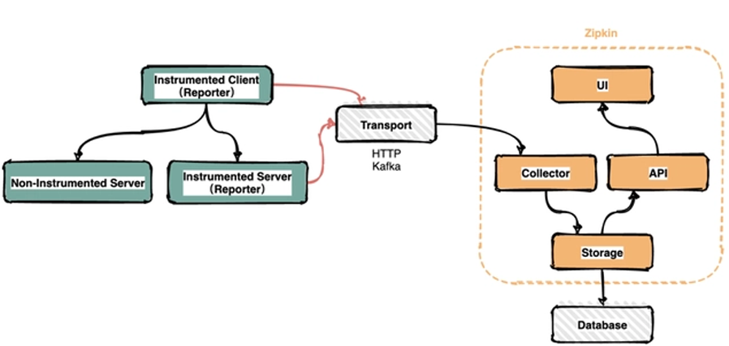
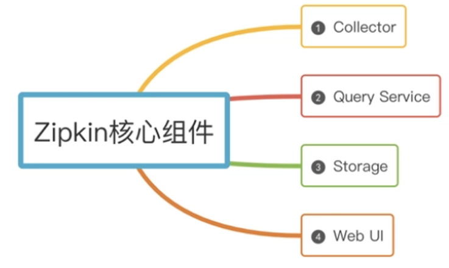

# zipkin介绍

>Zipkin 是 Twitter 的一个开源项目，它基于 Google Dapper 实现，它致力于收集服务 的定时数据，以解决微服务架构中的延迟问题，包括数据的收集、存储、查找和展现。

## 一、基本架构

>​    在服务运行的过程中会产生很多链路信息，产生数据的地方可以称之为Reporter。将 链路信息通过多种传输方式如HTTP，RPC，kafka消息队列等发送到Zipkin的采集 器，Zipkin处理后最终将链路信息保存到存储器中。运维人员通过UI界面调用接口 即可查询调用链信息

## 二、核心组件

### 1、Collector

>一旦Collector采集线程获取到链路追踪数据，Zipkin就会对其进行验证、存储和索 引，并调用存储接口保存数据，以便进行查找。

### 2、Storage

>Zipkin Storage最初是为了在Cassandra上存储数据而构建的，因为Cassandra是可伸缩 的，具有灵活的模式，并且在Twitter中大量使用。除了Cassandra，还支持支持 ElasticSearch和MySQL存储，后续可能会提供第三方扩展。

### 3、Query Service

>链路追踪数据被存储和索引之后，webui 可以调用query service查询任意数据帮助运 维人员快速定位线上问题。query service提供了简单的json api来查找和检索数据。

### 4、Web UI

>Zipkin 提供了基本查询、搜索的web界面，运维人员可以根据具体的调用链信息快 速识别线上问题。