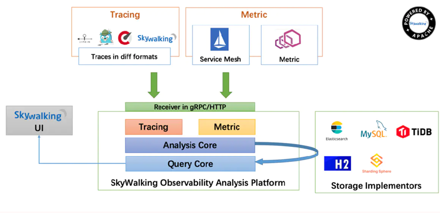

# Skywalking介绍

## 一、特点

>- 实现从请求跟踪、指标收集和日志记录的完整信息记录。 
>- 多语言自动探针，支持Java、GO、Python、PHP、NodeJS、LUA、Rust等客户端。 
>- 内置服务网格可观察性，支持从Istio+Envoy Service Mesh收集和分析数据。 
>- 支持告警。 
>- 模块化架构，存储、集群管理、使用插件集合都可以进行自由选择。 
>- 优秀的可视化效果。

## 二、总体架构

>- OAP平台(Observability Analysis Platform，可观测性分析平台)或OAP Server，它 是一个高度件化的轻量级分析程序，由兼容各种探针Receiver、流式分析内核和 查询内核三部分构成。
>- 探针：基于无侵入式的收集，并通过HTTP或者gRPC方式发送数据到OAP  Server。
>- 存储实现(Storage Implementors)，SkyWalking OAP Server支持多种存储实现并 且提供了标准接口，可支持不同的存储后端。
>- UI模块(SkyWalking)，通过标准的GraphQL(Facebook在2012年开源)协议进行统 计数据查询和展示 。

## 三、设计模式

>面向协议设计：面向协议设计是SkyWalking从5.x开始严格遵守的首要设计原则，组件之间使用标准的协议进行数据交互。 
>
>协议有探针协议和查询协议

### 1、探针协议

>- 探针上报协议：协议包括语言探针的注册、Metrics数据上报、Tracing数据据上 报等标准，Java、Go等探针都需要严格遵守此协议的标准。 
>- 探针交互协议：因为分布式追踪环境，探针间需要借助HTTP Header、MQ  Header在应用之间进行通信和交互，探针交互协议就定义了交互的数据格式。 
>- Service Mesh协议：是SkyWalking对Service Mesh抽象的专有协议，任何Mesh类 的服务都可以通过此协议直接上传指标数据，用于计算服务的指标数据和绘制 拓扑图。 
>- 第三方协议： 对大型的第三方开源项目 尤其是Service Mesh核心平台Istio和 Envoy,提供核心协议适配，支持针对Istio+Envoy Service Mesh进行无缝对接。

### 2、数据查询协议

>- 元数据查询：查询在SkyWalking注册的服务、服务实例、Endpoint等元数据信息。
>- 拓扑关系查询：查询全局、或者单个服务、Endpoint的拓扑图及依赖关系。
>- Metrics指标查询： 查询指标数据。 
>- 聚合指标查询：区间范围均值查询及Top N排名数据查询等。
>- Trace查询：追踪数据的明细查询。
>- 告警查询：基于表达式，判断指标数据是否超出阈值

### 3、项目设计

>- 模块化设计：
>
> ​        探针收负责集数据  
>
> ​        前端负责展示数据 
>
> ​        OAP Server负责从后端存储读写数据 
>
> ​        后端存储负责持久化数据  
>
>- 轻量化设计：  
>
>  ​        SkyWalking在设计之初就提出了轻量化的设计理念，SkyWalking使用最轻量级的jar 包模式，实现强大的数据处理和分析能力、可扩展能力和模块化能力。

## 四、告警

>​      Skywalking每隔一段时间根据收集到的链路追踪的数据和配置的告警规则（如服务 响应时间、服务响应时间百分比）等，判断如果达到阈值则发送相应的告警信息。 发送告警信息是通过调用webhook接口完成，具体的webhook接口可以使用者自行定 义，从而开发者可以在指定的webhook接口中编写各种告警方式，比如邮件、短信 等。告警的信息也可以在RocketBot中查看到。

### 1、默认告警规则

>- 最近3分钟内服务的平均响应时间超过1秒 
>- 最近2分钟服务成功率低于80% 
>- 最近3分钟90%服务响应时间超过1秒
>- 最近2分钟内服务实例的平均响应时间超过1秒

## 五、优势

>- 兼容性好：  支持传统的分部署架构dubbo和spring cloud，也支持云原生中的Istio和envoy。
>- 易于部署和后期维护 
>- 组件化，可以自定义部署，后期横向扩容简单  高性能  每天数T的数据无压力
>- 易于二次开发  标准的http和grpc协议，开源的项目，企业可以自主二次开发
