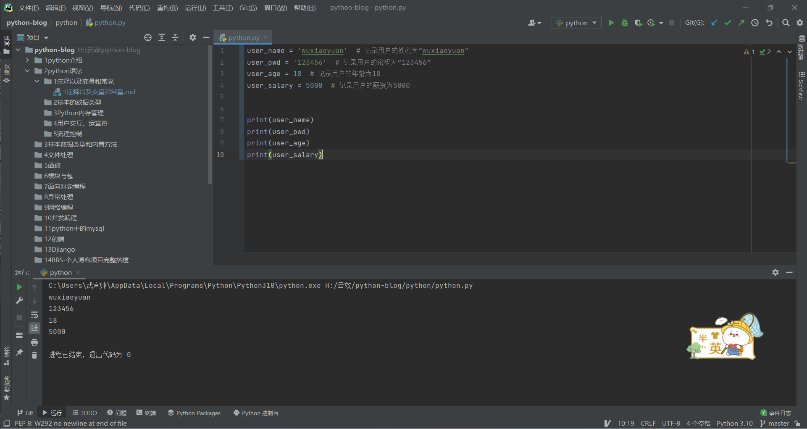

# 注释以及变量和常量

## 前提

```bash
根据网上教程安装python环境和pycharm
```

## 一、注释

### 1、什么是注释

```bash
注释就是对代码的注解说明，被注释的代码不会被解释器执行
```

### 2、为什么要有注释

```bash
为了增强代码的可读性
```

### 3、如何使用注释

#### 1.单行注释

```python
# 单行注释使用一个“#”开头，可以跟在代码的正上方亦或者是正后方
# 注意，如果跟在代码的正后方，需要与代码之间间隙两个空格，且注释内容与#间应该有一个空格，如下所示：
print('Hello World!')  # 与前方代码间隙两个空格，且与#符号间隙一个空格

# ⚠️ 在 11_开发学习 中，缩进是尤为重要的，因此不要随便进行缩进
```

#### 2.多行注释

```python
'''
多行注释使用三个单引号或者三个双引号
'''

"""
多行注释使用三个单引号或者三个双引号
"""
```

#### 3.添加注释原则

```bash
•不需要所有的代码都加注释，只需要对于核心、关键、重要的部分加注释即可
•注释可以用中文亦或者英文，但是不可以使用拼音
```

## 二、变量

### 1、什么是变量

```bash
所谓的变量就是可以变化的量，量指的是事物的状态，比如说：人的年龄、游戏角色等级、金钱等。
```

### 2、为什么要有变量

```bash
    11_开发学习 中所有的语法都是为了想让计算机具备人类的某一项技能，那么变量语法的存在意义就是为了让计算机能够像我们人类一样去记忆事物的某种状态，并且事物的状态是可以发生变化的。
    
   程序执行的本质就是一系列状态的变化，变是程序执行的直接体现，所以我们需要有一种机制能够反映或者保存下来程序执行时候的状态以及状态的变化。
```

### 3、如何使用变量

```bash
原则：先定义、后使用
```

### 4、变量的定义

#### 1.变量组成的三大部分

```bash
变量名      =       变量值
```

##### 1)变量名

```bash
变量名相当于门牌号，指向变量值所在的内存地址，是访问变量值的唯一方式
```

##### 2）= 赋值符号

```bash
=是赋值符号，用来将变量值的内存地址绑定给变量名
```

##### 3）变量值

```bash
变量值就是我们存储的真正的数据
```

#### 2.定义变量示范

```python
user_name = 'wuxiaoyuan'  # 记录用户的姓名为“wuxiaoyuan”
user_pwd = '123456'  # 记录用户的密码为“123456”
user_age = 18  # 记录用户的年龄为18
user_salary = 5000  # 记录用户的薪资为5000
```

解释器执行到变量定义的代码时会申请内存空间存放变量值，然后将变量值的内存地址绑定给变量名

### 5、变量的使用

> 通过变量名即可访问到对应的值

```python
# 通过变量名即可引用到变量值，我们可以结合 print() 功能将其打印出来
print(user_name)  # 通过变量名 user_name 找到变量值 'wuxiaoyuan' ，然后执行print('wuxiaoyuan')，输出：wuxiaoyuan
```



### 6、变量的命名规范

#### 1.变量名要做到"见名知其意"

```python
# 如果我们要存储的数据18代表一个人的年龄，那么变量名应该使用age相关
user_age = 18

# 如果我们要存储的数据18代表一个人的薪资，那么变量名应该使用salary相关
user_salary = 18
```

#### 2.变量名不可以是中文和拼音

```python
用户名字 = 'xiaowu'  # 错误
yonghumingzi = 'xiaowu'  # 错误
user_name = 'xiaowu'  # 正确


```


#### 3.变量名可以是字母、数字、下划线的任意组合,但是不能以数字开头

```bash
user_name = 'Nagase Ren'
user1 = 'Jack'
_class = '洛杉矶班'

*user = 'jerry'  # 错误
$PATH = 100  # 错误
PATH$ = 'xxx'  # 错误

2_user = 'tom'  # 错误
123 = 'hello'  # 错误
```


#### 4.变量名不能是Python内置的关键字

```bash
'and', 'as', 'assert', 'break', 'class', 'continue', 'def', 'del', 'elif', 'else', 'except', 'exec', 'finally', 'for', 'from','global', 'if', 'import', 'in', 'is', 'lambda', 'not', 'or', 'pass', 'print', 'raise', 'return', 'try', 'while', 'with', 'yield'
```

#### 5.不推荐使用驼峰体（类名使用此方式）

```bash
class Animal(object):
    """ 动物类 """
```

#### 6.纯小写+下划线（python中推荐使用这种方式，变量名、函数名等都使用此方式）

```python
age_of_tim = 54
number_of_students = 32
```


### 7、变量值的三大特性

```
ID：反映的是变量在内存中的唯一编号，内存地址不同，ID 则不同
类型：反映的是变量值的数据类型
值：反映的是变量值的值本身
```

```python
user_name = 'wuxiaoyuan'
print(id(user_name))
print(type(user_name))

#结果
1883852259504
<class 'str'>
```

### 8、is和==的区别

```python
# is: 比较左右两个值的id是否相等
# ==：比较左右两个值的他们的值是否相等

>>> x = 'wuxiaoyuan'
>>> y = 'wuxiaoyuan'
>>>
>>> print(x,y)
wuxiaoyuan wuxiaoyuan
>>> print(id(x),id(y))
2649074221232 2649074221232
>>>
>>> print(x == y)
True
>>> print('########')
########
>>> print(x is y)
True
```


## 三、常量

### 1、什么是常量

```python
直白地讲，所谓的常量指的就是在程序运行的过程中状态不发生变化的量，称之为常量。
python语法中没有常量的概念，但是在程序的开发中会涉及到常量的概念
```

### 2、为什么要有常量

```python
在程序运行的过程中，有些状态是不应该发生变化的，比如：圆周率π
```

### 3、如何使用常量

```python
在 Python 中没有专门的语法定义常量，但是我们约定俗成，使用全部大写的方式命名的变量名，我们称之为常量。
PI = 3.1415926
所以，单从语法的角度上看，常量的使用与变量的使用是一致的。
```

