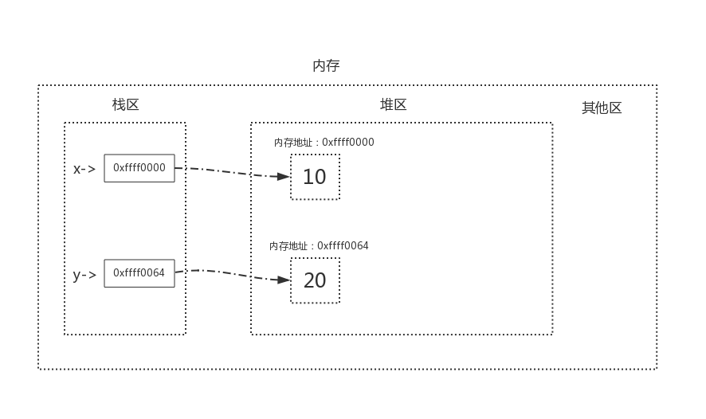
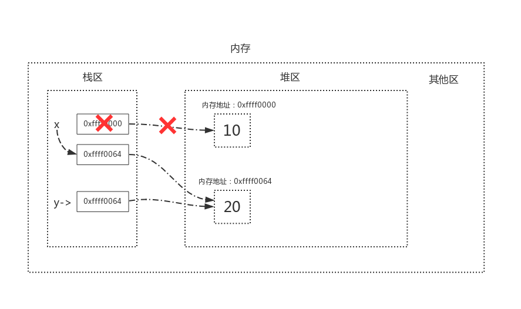
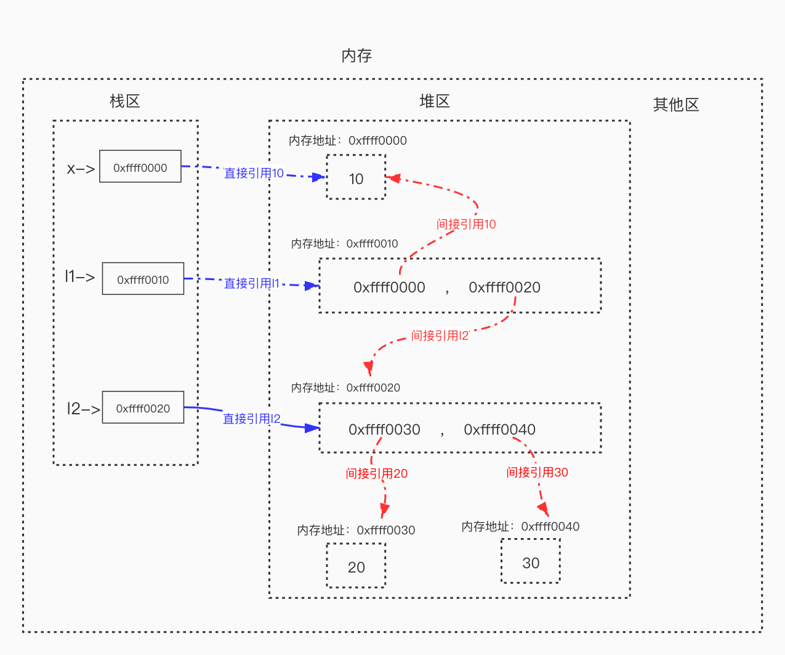
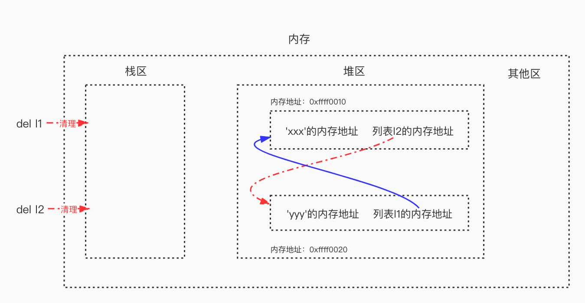
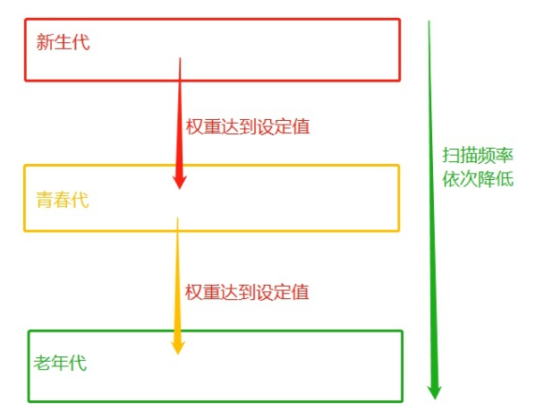

# Python内存管理

## 一、引入

```bash
    11_开发学习 解释器在执行到定义变量的语法时，会申请内存空间来存放变量的值，而内存的容量是有限的，这就涉及到变量值所占用内存空间的回收问题，当一个变量值没有用了（简称垃圾）就应该将其占用的内存给回收掉，那什么样的变量值是没有用的呢？
    单从逻辑层面分析，我们定义变量将变量值存起来的目的是为了以后取出来使用，而取得变量值需要通过其绑定的直接引用（如x=10，10被x直接引用）或间接引用（如l=[x,]，x=10，10被x直接引用，而被容器类型l间接引用），所以当一个变量值不再绑定任何引用时，我们就无法再访问到该变量值了，该变量值自然就是没有用的，就应该被当成一个垃圾回收。
    内存空间的申请与回收都是非常耗费精力的事情，而且存在很大的危险性，稍有不慎就有可能引发内存溢出问题，不过不用担心， Cpython 解释器提供了自动的垃圾回收机制来帮我们解决了这件事。
```

## 二、垃圾回收机制

### 1、什么是垃圾回收机制

```bash
    垃圾回收机制（简称GC），是 Python解释器自带的一种内存管理机制，它专门用来回收没有存在价值的变量值所占用的内存空间。
```

### 2、为什么要有垃圾回收机制

```bash
    因为在程序的运行过程中会申请大量的内存空间，然而对于一些没用的内存空间如果不及时清理，最终就会导致内存溢出，进而导致程序崩溃、系统宕机。因此，内存管理是一件很重要且繁杂的事情，那么较好的是，11_开发学习 解释器自带的垃圾回收机制把开发人员从繁杂的内存管理中解放出来了。
```

### 3、相关知识了解

#### 1.栈区与堆区

> ​    在定义变量的时候，变量名与变量值都是需要存储的，分别对应内存中的两块区域：栈区与堆区

```bash
1.变量名与变量值的内存地址的关联关系存放于栈区 。
2.变量值存放于堆区中，内存管理回收的就是堆区的空间。
```

**定义了两个变量x = 10、y = 20，详解如下图**



**如果执行x=y时，内存中的栈区与堆区变化如下**



#### 2.直接引用和间接引用

```bash
直接引用:从栈区出发直接引用到的内存地址。
间接引用:从栈区出发引用到堆区后，再通过进一步引用才能到达的内存地址。
```

```python
l1 = [10, 20]
x = 100
l2 = [x, l1]

print(l2)

# 结果
[100, [10, 20]]
```



### 4、垃圾回收机制：引用计数

>​    Python 的 GC 机制主要运用了 ***\*引用计数（reference counting）\**** 来跟踪和回收垃圾。在引用计数的基础上，还可以通过 ***\*标记-清除（mark and sweep）\**** 解决容器对象可能产生的循环引用的问题，并且通过 ***\*分代回收（generation collection）\**** 以空间换取时间的方式来进一步提高垃圾回收的效率。

#### 1.什么是引用计数？

> 引用计数：变量值被变量名关联的次数

```python
x = 1
# 变量值1被关联一个变量名x，此时引用次数为1
```

#### 2.引用计数的增减

##### 1)引用计数增加

```python
x = 1
y = x
# 变量值1被关联一个变量名x，把x的内存地址给了y，x和y都关联了1，此时引用次数为2
```

##### 2)引用计数减少

```python
x = 1
y = x
x = 3 # x与1解除关联，与3建立联系，此时变量值1的引用计数为1 
print(x, y)
# 结果
3 1
```

```python
x = 1
del x # del的意思是解除变量名x和1的关联关系，此时变量值1的引用计数为0
```

> 当变量值的引用变量为0，其占用的内存地址就会被解释器的垃圾回收机制回收

#### 3.引用计数的问题和解决方案

##### 1）循环引用

> 引用计数机制存在着一个致命的弱点，即循环引用（又称之为交叉引用）

```python
# 如下我们定义了两个列表，简称列表1与列表2，变量名l1指向列表1，变量名l2指向列表2
l1 = ['x'] # 列表1被引用一次，列表1的引用计数变为1 
l2 = ['y'] # 列表2被引用一次，列表2的引用计数变为1
l1.append(l2) # 把列表2追加到l1中作为第二个元素，列表2的引用计数变为2
l2.append(l1) # 把列表1追加到l2中作为第二个元素，列表1的引用计数变为2
# 此时发生的事情：l1与l2之间有相互引用
# l1 = ['x'的内存地址,列表2的内存地址]
# l2 = ['y'的内存地址,列表1的内存地址]
print(l1)
print(l2)

# 结果
['x', ['y', [...]]]
['y', ['x', [...]]]
```

>那么以上这种情况就是循环引用，变量值不再被任何变量名关联，但是变量值的引用计数并不为0，应该被回收的空间却不能被回收，什么意思呢？试想一下，请看如下操作：

```python
del l1  # lis1的引用计数减1，lis1的引用计数变成了1
del l2  # lis2的引用计数减1，lis2的引用计数变成了1
```

>这种情况下，变量名 *l1* 与 *l2* 已经解除了与 x 和 y 的关联

###### ①内存泄漏

> 由于 *l1* 与 *l2* 之间相互引用，此时两个列表的引用计数均不为 0，但是两个列表不再被任何其他对象关联，没有任何人可以再次访问到这两个列表，那么理论上这两个列表所占用的内存空间应该被回收，但是由于两个列表之间有相互引用，导致引用计数不为 0，因此这些对象所占用的内存空间永远不会被释放，所以说，循环引用是致命的，循环引用会导致内存泄漏。

###### ②标记 清除

>   容器对象（比如：list，set，dict，class，instance）都可以包含对其他对象的引用，所以都可能产生循环引用。而“标记-清除”计数就是为了解决循环引用的问题。

>    标记/清除算法的做法是当应用程序可用的内存空间被耗尽的时，就会停止整个程序，然后进行两项工作，第一项则是标记，第二项则是清除

**1、标记**

>​    栈区相当于“根”，凡是从根出发可以访达（直接或间接引用）的，都称之为“有根之人”
>
>​    标记的过程其实就是，遍历所有的GC Roots对象(栈区中的所有内容或者线程都可以作为GC Roots对象），然后将所有GC Roots的对象可以直接或间接访问到的对象标记为存活的对象，其余的均为非存活对象，应该被清除。

**2、清除**

> ​    清除的过程将遍历堆中所有的对象，将没有标记的对象全部清除掉。
>
> ​    基于上例的循环引用，当我们同时删除l1与l2时，会清理到栈区中l1与l2的内容以及直接引用关系



> ​    这样在启用标记清除算法时，从栈区出发，没有任何一条直接或间接引用可以访达l1与l2，即l1与l2成了“无根之人”，于是l1与l2都没有被标记为存活，二者会被清理掉，这样就解决了循环引用带来的内存泄漏问题。

##### 2）效率问题

>**引用计数** 除了具有 **循环引用** 带来的 **内存溢出** 的问题，还有 **效率问题** 。

>    基于引用计数的回收机制，每次回收内存，都需要把所有对象的 **引用计数** 全部都遍历一遍，这是非常消耗时间的，于是引入了 **分代回收** 来提高回收效率，分代回收采用的是用 **空间换取时间** 的策略。

###### ①分代回收

**分代**

>   分代回收的核心思想是：在历经多次扫描的情况下，都没有被回收的变量，gc机制就会认为，该变量是常用变量，gc对其扫描的频率会降低，具体实现原理如下：

>    分代指的是根据存活时间来为变量划分不同等级（也就是不同的代）
>    新定义的变量，放到新生代这个等级中，假设每隔1分钟扫描新生代一次，如果发现变量依然被引用，那么该对象的权重（权重本质就是个整数）加一，当变量的权重大于某个设定得值（假设为3），会将它移动到更高一级的青春代，青春代的gc扫描的频率低于新生代（扫描时间间隔更长），假设5分钟扫描青春代一次，这样每次gc需要扫描的变量的总个数就变少了，节省了扫描的总时间，接下来，青春代中的对象，也会以同样的方式被移动到老年代中。也就是等级（代）越高，被垃圾回收机制扫描的频率越低。

**回收**

> 回收依然是使用引用计数作为回收的依据



> 虽然分代回收可以起到提升效率的效果，但也存在一定的缺点：

```bash
    例如一个变量刚刚从新生代移入青春代，该变量的绑定关系就解除了，该变量应该被回收，但青春代的扫描频率低于新生代，这就到导致了应该被回收的垃圾没有得到及时地清理。

没有十全十美的方案：
   毫无疑问，如果没有分代回收，即引用计数机制一直不停地对所有变量进行全体扫描，可以更及时地清理掉垃圾占用的内存，但这种一直不停地对所有变量进行全体扫描的方式效率极低，所以我们只能将二者中和。

综上
    垃圾回收机制是在清理垃圾&释放内存的大背景下，允许分代回收以极小部分垃圾不会被及时释放为代价，以此换取引用计数整体扫描频率的降低，从而提升其性能，这是一种以空间换时间的解决方案。
```

#### 4.总结

>​    垃圾回收机制是在清理垃圾以及释放内存的大背景下，允许分代回收以及小部分垃圾不会被及时释放为代价，以此换取引用计数整体扫描频率的降低，从而提升性能，这是一种以空间换取时间的解决方案。

## 三、小整数对象池

> ​    在Python中，Python解释器为了优化其自身的性能，于是具有了小整数对象池的概念。那么究竟什么是小整数池呢？

### 1、什么是小整数对象池

>​    在 Python 中，小整数对象池的定义是：在 [-5, 256] 的这个范围之内的整数对象是提前创建好的，不会被垃圾回收机制回收。在一个 Python 的程序中，所有位于这个范围内的整数使用的都是同一个对象。

### 2、代码展示

```python
x = 256
y = 256
print(id(x), id(y))

a = 257
b = 257
print(id(a), id(b))

# 结果
2447498420432 2447498420432
2447499455440 2447498420904
```

>id() 函数可以用来查看一个对象的唯一标志，可以认为是内存地址。

## 四、字符串驻留机制（String Interning）

>   字符串类型作为 Python 中最常用的数据类型之一，Python 解释器为了提高字符串使用的效率和使用性能，Python解释器中使用了 intern（驻留）的技术来提高字符串效率。

### 1、什么是字符串驻留机制

>    什么是 intern 机制？也就是值同样的字符串对象仅仅会保存一份，放在一个字符串储蓄池中，是共用的，当然，肯定不能改变，这也决定了字符串类型必须是不可变对象。

### 2、原理

>​    实现 intern 机制的方式非常简单，就是通过维护一个字符串储蓄池，这个池子是一个字典结构，如果字符串已经存在于池子中就不再去创建新的字符串，直接返回之前创建好的字符串对象，如果之前还没有加入到该池子中，则先构造一个字符串对象，并把这个对象加入到池子中去，方便下一次获取。

>    但是，解释器内部对 intern 机制的使用策略是有讲究的，有些场景会自动使用 intern ，有些地方需要通过手动方式才能启动，看下面几个常见的小陷阱。

>    并非全部的字符串都会采用intern机制。仅仅包括下划线、数字、字母的字符串才会被intern，当然不能超过20个字符。因为如果超过20个字符的话，解释器认为这个字符串不常用，不用放入字符串池中。

### 3、代码展示

#### 1.正常

```python
s1 = 'test'
s2 = 'test'
print(s1 is s2)

# 结果
True
```

#### 2.有空格不启用

```python
s1 = 'tes t'
s2 = 'tes t'
print(s1 is s2)

# 结果
Flase
```

#### 3.超过20个字符长度不启用

```python
s1 = 't'*20
s2 = 't'*20
print(s1 is s2)

# 结果
True

s1 = 't'*21
s2 = 't'*21
print(s1 is s2)

# 结果
Flase
```

### 4、字符串拼接

```python
s1 = 'tes'
s2 = 'test'
print(s1 + 't' is s2)

# 结果
False
```

```python
s1 = 'tes'
s2 = 'test'
print('tes' + 't' is s2)

# 结果
True
```
