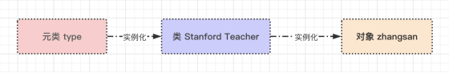
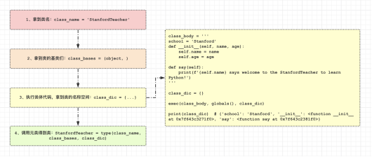
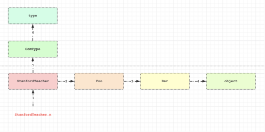
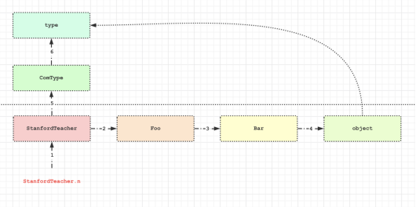

# 元类

## 一、什么是元类？

>什么是元类呢？一切源自于一句话：Python 中一切皆对象。让我们先定义一个类，然后逐步分析。

```python
class StanfordTeacher(object):
    school = 'Stanford'

    def __init__(self, name, age):
        self.name = name
        self.age = age

    def say(self):
        print(f'{self.name} says: Welcome to the Stanford to learn Python')


zhangsan = StanfordTeacher('张三', 18)
zhangsan.say()
print(type(zhangsan))


# 结果
张三 says: Welcome to the Stanford to learn Python
<class '__main__.StanfordTeacher'>
```

>所有的对象都是实例化或者说调用类而得到的（调用类的过程称为类的实例化），比如对象zhangsan是调用类 StanfordTeacher得到的。

>如果一切皆对象，那么类 StanfordTeacher的本质也是一个对象，既然所有的对象都是调用类得到的，那么 StanfordTeacher必然也是调用了一个类得到的，这个类我们称之为 元类 。



## 二、`exec(__source, __globals, __locals)`内置函数

### 1、*exec()* 简介

>`exec(__source, __globals, __locals)` 是一个内置的函数。
>`__source` 参数：字符串形式的命令
>
>`__gloabals `参数：全局作用域，采用字典的形式，如果不指定，默认是：globals()
>
>`__locals `参数：局部作用域，采用字典的形式，如果不指定，默认是：locals()

### 2、exec()的作用

>我们知道了 exec() 是 Python 内置的函数，那么这个函数是用来干什么的呢？
>
>作用：exec() 内置函数用于将字符串形式的命令执行之后产生的变量存放于局部名称空间中。

### 3、*exec()* 的使用

```python
glb = {
    'x': 1,
    'y': 2
}

loc = {}


def main():
    exec('''
global x, z
x = 100
z = 200

m = 300
    ''', glb, loc)

    print(glb)  # {'x': 100, 'y': 2, ..., 'z': 200}
    print(loc)  # {'m': 300}


if __name__ == '__main__':
    main()
```

## 三、*class* 关键字创建类的流程分析

>上文我们基于 Python 中一切皆对象的概念分析出：我们用 class 关键字定义的类本身也是一个对象，负责产生该对象的类称之为 元类（元类可以简称为类的类），内置的元类为 type。

>*class* 关键字在帮我们创建类时，必然帮我们调用了元类 Stanford Teacher = type(...) ，那调用 type 的时候传入的参数是什么呢？必然是类的关键组成部分，一个类有三大组成部分，分别是：
>
>类名：class_name = ‘StanfordTeacher’
>
>基类：class_bases = (object, )
>
>类的名称空间：class_dic，类的名称空间是执行类体代码而得到的
>
>调用 type 的时候会依次传入以上三个参数，综上所述，*class* 关键字帮我们创建一个类应该细分为以下四个过程：



## 四、自定义元类控制类 StanfordTeacher 的创建

>一个类没有声明自己的元类，默认它的元类就是 type，除了使用内置元类 type ，我们也可以通过继承 type 来自定义元类，然后使用 *metaclass* 关键字参数为一个类指定元类。

```python
class Mymeta(type):  # 只有继承了type类才能称之为一个元类，否则就是一个普通的自定义类
    pass


# StanfordTeacher = Mymeta('StanfordTeacher',(object, ),{...})
class StanfordTeacher(object, metaclass=Mymeta):
    school = 'Stanford'

    def __init__(self, name, age):
        self.name = name
        self.age = age

    def say(self):
        print(f'{self.name} says: Welcome to the Stanford to learn Python!')
```

>自定义元类可以控制类的产生过程，类的产生过程其实就是元类的调用过程，即 `StanfordTeacher = Mymeta('StanfordTeacher', (object, ), {})` ，调用 Mymeta 会先产生一个空对象 StanfordTeacher ，然后连同调用 Mymeta 括号内的参数一同传给 Mymeta 下的 `__init__` 方法，完成初始化，于是我们可以

```python
import re


class Mymeta(type):  # 只有继承了type类才能称之为一个元类，否则就是一个普通的自定义类
    def is_camel_case(s):
        return bool(re.match(r'^[A-Z][a-zA-Z]*$', s))

    def __init__(self, class_name, class_bases, class_dic):

        if '__doc__' not in class_dic or not class_dic.get('__doc__').strip():
            raise TypeError('必须为类编写类文档注释！')

        if not Mymeta.is_camel_case(class_name):
            raise TypeError('类名必须驼峰体！')

        print(self)  # <class '__main__.StanfordTeacher'>
        print(class_bases)  # (<class 'object'>,)
        print(class_dic)  # {'__module__': '__main__', '__qualname__': 'StanfordTeacher', '__doc__': ' 类 StanfordTeacher 的文档注释 ', 'school': 'Stanford', '__init__': <function StanfordTeacher.__init__ at 0x7f8d05055700>, 'say': <function StanfordTeacher.say at 0x7f8d05055790>}

        super(Mymeta, self).__init__(class_name, class_bases, class_dic)  # 重用父类的功能


# StanfordTeacher = Mymeta('StanfordTeacher', (object, ), {...})
class StanfordTeacher(object, metaclass=Mymeta):
    """ 类 StanfordTeacher 的文档注释 """

    school = 'Stanford'

    def __init__(self, name, age):
        self.name = name
        self.age = age

    def say(self):
        print(f'{self.name} says welcome to the Stanford to learn Python')
```

## 五、自定义元类控制类 Stanford Teacher 的调用

### 1、`__new__`造一个空对象

>造一个空对象，调用的类内的`__new__`方法，然后调用的类内`__init__`

```python
import re


class Mymeta(type):  # 只有继承了type类才能称之为一个元类，否则就是一个普通的自定义类
    def is_camel_case(s):
        return bool(re.match(r'^[A-Z][a-zA-Z]*$', s))

    def __init__(self, class_name, class_bases, class_dic):

        if '__doc__' not in class_dic or not class_dic.get('__doc__').strip():
            raise TypeError('必须为类编写类文档注释！')

        if not Mymeta.is_camel_case(class_name):
            raise TypeError('类名必须驼峰体！')

        print(f'init.self: {self}')  # <class '__main__.StanfordTeacher'>
        print(f'init.class_bases: {class_bases}')  # (<class 'object'>,)
        print(f'init.class_dic: {class_dic}')  # {'__module__': '__main__', '__qualname__': 'StanfordTeacher', '__doc__': ' 类 StanfordTeacher 的文档注释 ', 'school': 'Stanford', '__init__': <function StanfordTeacher.__init__ at 0x7f8d05055700>, 'say': <function StanfordTeacher.say at 0x7f8d05055790>}

        super(Mymeta, self).__init__(class_name, class_bases, class_dic)  # 重用父类的功能

    # __new__ 方法（Mymeta）cls：当前类名，args：调用类的参数，kwargs：调用类的关键字参数
    def __new__(cls, *args, **kwargs):
        print('这个是new方法')
        print(f'new.cls: {cls}')
        print(f'new.args: {args}')
        print(f'new.kwargs: {kwargs}')
        # 造空对象的两种方式
        # return super().__new__(cls, *args, **kwargs)
        return type.__new__(cls, *args, **kwargs)

# StanfordTeacher = ComType('StanfordTeacher', (object, ), {...})
class StanfordTeacher(object, metaclass=Mymeta):
    """ 类 StanfordTeacher 的文档注释 """

    school = 'Stanford'

    def __init__(self, name, age):
        self.name = name
        self.age = age

    def say(self):
        print(f'{self.name} says welcome to the Stanford to learn Python')


# 结果
这个是new方法
new.cls: <class '__main__.Mymeta'>
new.args: ('StanfordTeacher', (<class 'object'>,), {'__module__': '__main__', '__qualname__': 'StanfordTeacher', '__doc__': ' 类 StanfordTeacher 的文档注释 ', 'school': 'Stanford', '__init__': <function StanfordTeacher.__init__ at 0x000001CAAD882378>, 'say': <function StanfordTeacher.say at 0x000001CAAD882400>})
new.kwargs: {}
init.self: <class '__main__.StanfordTeacher'>
init.class_bases: (<class 'object'>,)
init.class_dic: {'__module__': '__main__', '__qualname__': 'StanfordTeacher', '__doc__': ' 类 StanfordTeacher 的文档注释 ', 'school': 'Stanford', '__init__': <function StanfordTeacher.__init__ at 0x000001CAAD882378>, 'say': <function StanfordTeacher.say at 0x000001CAAD882400>}
```

### 2、利用 `__call__` 修改类的调用

#### 1.类调用

```python
class Foo(object):

    def __call__(self, *args, **kwargs):
        print(self)
        print(args)
        print(kwargs)


obj = Foo()
res = obj(1, 2, 3, x=4, y=5, z=6)


# 结果
<__main__.Foo object at 0x000001741C2AF208>
(1, 2, 3)
{'x': 4, 'y': 5, 'z': 6}
```

>\# 1、想要让 obj 这个对象变成一个可调用的对象，需要在该对象的类中定义一个方法 `__call__` 方法，该方法会在调用对象时自动触发
>\# 2、调用 obj 的返回值就是 `__call__` 方法的返回值res = obj(1, 2, 3, x=4, y=5, z=6)

#### 2.元类调用

>由上述例子我们可以得知，调用一个对象，就是触发对象所在类中的 `__call__` 方法的执行，如果把StanfordTeacher 也当作一个对象，那么在StanfordTeacher这个对象的类中也必然存在一个 `__call__` 方法。

```python
class ComType(type):

    def __call__(self, *args, **kwargs):
        print(self)  # <class '__main__.StanfordTeacher'>
        print(args)  # ('zhangsan', 18)
        print(kwargs)  # {}
        return 123


class StanfordTeacher(object, metaclass=ComType):
    school = 'StanfordTeacher'

    def __init__(self, name, age):
        self.name = name
        self.age = age

    def say(self):
        print(f'{self.name} says welcome to the Stanford to learn Python!')

zhangsan = StanfordTeacher('张三', 18)
print(zhangsan)
```

>默认情况下，调用 *zhangsan = StanfordTeacher('zhangsan', 18)* 会做三件事：
>
>• 1、产生一个空对象 obj
>
>• 2、调用 *__init__* 方法初始化对象 obj
>
>• 3、返回初始化完成的 obj
>
>对应着，StanfordTeacher 类中的 `__call__` 方法也应该做这三件事。

```python
class ComType(type):  # 只有继承了 type 类才能称之为一个元类，否则就是一个普通的自定义类
    def __call__(self, *args, **kwargs):
        # 1、调用 __new__ 产生一个空对象 obj
        obj = self.__new__(self)  # 此处的 self 是类StanfordTeacher，必须传参数，代表创建一个StanfordTeacher的对象obj

        # 2、调用 __init__ 初始化空对象 obj
        self.__init__(obj, *args, **kwargs)

        # 3、返回初始化完成的对象 obj
        return obj


class StanfordTeacher(object, metaclass=ComType):
    school = 'Stanford'

    def __init__(self, name, age):
        self.name = name
        self.age = age

    def say(self):
        print(f'{self.name} says: Welcome to the Stanford to learn Python!')


zhangsan = StanfordTeacher('张三', 18)
print(zhangsan.__dict__)  # {'name': '张三', 'age': 18}


# 结果
{'name': '张三', 'age': 18}
```

### 3、利用 `__call__` 修改类的调用

>上例的 `__call__` 相当于一个模板，我们可以在该基础上改写 `__call__` 的逻辑从而控制调用StanfordTeacher的过程，比如：将 StanfordTeacher 的对象的所有属性都变成私有的。

```python
class ComType(type):

    def __call__(self, *args, **kwargs):
        # 1、调用 __new__ 产生一个空对象 obj
        obj = self.__new__(self)  # 此处的 self 是类 StanfordTeacher ，必须传参，代表创建一个  StanfordTeacher 的的对象 obj

        # 2、调用 __init__ 初始化空对象 obj
        self.__init__(obj, *args, **kwargs)

        # 在初始化之后，obj.__dict__ 里面就有值了
        obj.__dict__ = {f'_{self.__name__}__{k}': v for k, v in obj.__dict__.items()}

        # 3、返回初始化完成的对象 obj
        return obj


class StanfordTeacher(object, metaclass=ComType):
    school = 'Stanford'

    def __init__(self, name, age):
        self.name = name
        self.age = age

    def say(self):
        print(f'{self.name} says welcome to Stanford to learn Python!')


zhangsan = StanfordTeacher('张三', 18)
print(zhangsan.__dict__)  # {'_StanfordTeacher__name': '张三', '_StanfordTeacher__age': 18}
```

## 六、属性的查找顺序

>结合 Python 继承的实现原理与元类重新来看属性的查找应该是什么样子呢？
>
>在学习完元类后，其实我们用 *class* 关键字自定义的类也全都是对象（包括 *object* 类本身也是元类 *type* 的一个实例，可以用 *type(object)* 查看），我们学习过继承的实现原理，如果把类当成对象去看，将下述继承应该说成是：对象StanfordTeacher 继承对象Foo ，对象Foo 继承对象Bar，对象Bar继承对象object。

```python
class ComType(type):  # 只有继承了type类才能称之为一个元类，否则就是一个普通的自定义类
    n = 444

    def __call__(self, *args, **kwargs):  # self = <class '__main__.StanfordTeacher'>
        obj = self.__new__(self)
        self.__init__(obj, *args, **kwargs)
        return obj


class Bar(object):
    n = 333


class Foo(Bar):
    n = 222


class StanfordTeacher(Foo, metaclass=ComType):
    n = 111

    school = 'Stanford'

    def __init__(self, name, age):
        self.name = name
        self.age = age

    def say(self):
        print(f'{self.name} says welcome to the Stanford to learn Python!')


print(StanfordTeacher.n)  # 111
# 自下而上依次注释各个类中的 n = xxx，然后重新运行程序，发现n的查找顺序为：StanfordTeacher -> Foo -> Bar -> object -> ComType -> type
```

>于是属性查找应该分为两层，一层是对象层（基于C3算法的MRO）的查找，另外一层则是类层（即元类层）的查找。



>*合Python的继承与元类来看属性的查找顺序*
>
>查找顺序是：
>
>1、先对象层：StanfordTeacher -> Foo -> Bar -> object
>
>2、然后元类层：ComType -> type
>
>依据上述总结，我们来分析下元类ComType中`__call__`里的 `self.__new__`的查找

```python
class ComType(type):
    n = 444

    def __call__(self, *args, **kwargs):  # self = <class '__main__.StanfordTeacher'>
        obj = self.__new__(self)
        print(self.__new__ is object.__new__)  # True


class Bar(object):
    n = 333

    # def __new__(cls, *args, **kwargs):
    #     print('Bar.__new__')


class Foo(Bar):
    n = 222

    # def __new__(cls, *args, **kwargs):
    #     print('Foo.__new__')


class StanfordTeacher(Foo, metaclass=ComType):
    n = 111

    school = 'Stanford'

    def __init__(self, name, age):
        self.name = name
        self.age = age

    def say(self):
        print(f'{self.name} says welcome to the Stanford to learn Python')

    # def __new__(cls, *args, **kwargs):
    #     print('StanfordTeacher.__new__')


StanfordTeacher('张三', 18)  # 触发 StanfordTeacher 的类中的 __call__ 方法的执行，进而执行 self.__new__  开始查找
```

>总结，ComType 下的 `__call__` 里的 `self.__new__` 在`StanfordTeacher、Foo、Bar`里都没有找到 `__new__` 的情况下，会去找`object`里的`__new__`，而`object`下默认就有一个 `__new__` ，所以即便是之前的类均未实现`__new__` ,也一定会在`object`中找到一个，根本不会、也根本没必要再去找元类`ComType -> type`中查找 *__new__* 。
>
>我们在元类的 `__call__` 中也可以用 `object.__new__(self)` 去造对象。



>但我们还是推荐在 `__call__` 中使用 `self.__new__(self)`去创造空对象，因为这种方式会检索三个类`StanfordTeacher -> Foo -> Bar` ,而 `object.__new__` 则是直接跨过了他们三个。

>最后说明一点

```python
class ComType(type):  # 只有继承了type类才能称之为一个元类，否则就是一个普通的自定义类
    n = 444

    def __new__(cls, *args, **kwargs):
        obj = type.__new__(cls, *args, **kwargs)  # 必须按照这种传值方式
        print(obj.__dict__)
        # return obj  # 只有在返回值是 type 的对象时，才会触发下面的 __init__
        return 123

    def __init__(self, class_name, class_bases, class_dic):
        print('run。。。')


class StanfordTeacher(object, metaclass=ComType):  # StanfordTeacher = ComType('StanfordTeacher',(object),{...})
    n = 111

    school = 'Stanford'

    def __init__(self, name, age):
        self.name = name
        self.age = age

    def say(self):
        print(f'{self.name} says welcome to the Stanford to learn Python')


print(type(ComType))  # <class 'type'>
# 产生类 StanfordTeacher 的过程就是在调用 ComType ，而 ComType 也是 type 类的一个对象，那么 ComType 之所以可以调用，一定是在元类 type 中有一个 __call__ 方法
# 该方法中同样需要做至少三件事：
# class type:
#     def __call__(self, *args, **kwargs): # self = <class '__main__.ComType'>
#         obj = self.__new__(self,*args,**kwargs) # 产生 ComType 的一个对象
#         self.__init__(obj,*args,**kwargs)
#         return obj
```

## 七、练习

### 1、在元类中控制把自定义类的数据属性都变成大写

```python
class ComType(type):
    def __new__(cls, name, bases, attrs):
        update_attrs = {}
        for k, v in attrs.items():
            if not callable(v) and not k.startswith('__'):
                update_attrs[k.upper()] = v
            else:
                update_attrs[k] = v
        return type.__new__(cls, name, bases, update_attrs)


class Chinese(metaclass=ComType):
    country = 'China'
    tag = 'Legend of the Dragon'  # 龙的传人

    def __init__(self, name, age):
        self.name = name
        self.age = age

    def walk(self):
        print(f'{self.name}%s is walking')


print(Chinese.__dict__)

# {'__module__': '__main__', 'COUNTRY': 'China', 'TAG': 'Legend of the Dragon', 'walk': <function Chinese.walk at 0x7f15e0ab70d0>, '__dict__': <attribute '__dict__' of 'Chinese' objects>, '__weakref__': <attribute '__weakref__' of 'Chinese' objects>, '__doc__': None}
```

### 2、在元类中控制自定义的类无需 `__init__` 方法

>1、元类帮助其完成创建对象，以及初始化操作
>
>2、要求实例化时传参必须为关键字形式，否则抛出异常 TypeError: must be keyword argument
>
>3、key 作为用户自定义类产生对象的属性，且所有属性变成大写

```python
class ComType(type):
    # def __new__(cls,name,bases,attrs):
    #     update_attrs={}
    #     for k,v in attrs.items():
    #         if not callable(v) and not k.startswith('__'):
    #             update_attrs[k.upper()]=v
    #         else:
    #             update_attrs[k]=v
    #     return type.__new__(cls,name,bases,update_attrs)

    def __call__(self, *args, **kwargs):
        if args:
            raise TypeError('must use keyword argument for key function')
        obj = object.__new__(self)  # 创建对象，self为类Foo

        for k, v in kwargs.items():
            obj.__dict__[k.upper()] = v
        return obj


class Chinese(metaclass=ComType):
    country = 'China'
    tag = 'Legend of the Dragon'  # 龙的传人

    def __init__(self, name, age):
        self.name = name
        self.age = age

    def walk(self):
        print('%s is walking' % self.name)


zhangsan = Chinese(name='张三', age=18)
print(zhangsan.__dict__)  # {'NAME': '张三', 'AGE': 18}
```


### 3、在元类中控制自定义的类产生的对象相关的属性全部为隐藏属性

```python
class ComType(type):
    def __init__(self, class_name, class_bases, class_dic):
        # 控制类Foo的创建
        super(ComType, self).__init__(class_name, class_bases, class_dic)

    def __call__(self, *args, **kwargs):
        # 控制Foo的调用过程，即Foo对象的产生过程
        obj = self.__new__(self)
        self.__init__(obj, *args, **kwargs)
        obj.__dict__ = {'_%s__%s' % (self.__name__, k): v for k, v in obj.__dict__.items()}

        return obj


class Foo(object, metaclass=ComType):  # Foo = ComType(...)
    def __init__(self, name, age):
        self.name = name
        self.age = age


zhangsan = Foo('张三', 18)
print(zhangsan.__dict__)  # {'_Foo__name': '张三', '_Foo__age': 18}
```

### 4、基于元类实现单例模式

>\# 单例：即单个实例，指的是同一个类实例化多次的结果指向同一个对象，用于节省内存空间
>\# 如果我们从配置文件中读取配置来进行实例化，在配置相同的情况下，就没必要重复产生对象浪费内存了

```python
# settings.py文件内容如下
HOST = '1.1.1.1'
PORT = 3306

# 方式一:定义一个类方法实现单例模式
import settings


class Mysql:
    __instance = None

    def __init__(self, host, port):
        self.host = host
        self.port = port

    @classmethod
    def singleton(cls):
        if not cls.__instance:
            cls.__instance = cls(settings.HOST, settings.PORT)
        return cls.__instance


obj1 = Mysql('1.1.1.2', 3306)
obj2 = Mysql('1.1.1.3', 3307)
print(obj1 is obj2)  # False

obj3 = Mysql.singleton()
obj4 = Mysql.singleton()
print(obj3 is obj4)  # True

# 方式二：定制元类实现单例模式
import settings


class ComType(type):
    def __init__(self, name, bases, dic):  # 定义类Mysql时就触发
        # 事先先从配置文件中取配置来造一个Mysql的实例出来
        self.__instance = object.__new__(self)  # 产生对象
        self.__init__(self.__instance, settings.HOST, settings.PORT)  # 初始化对象
        # 上述两步可以合成下面一步
        # self.__instance=super().__call__(*args,**kwargs)
        super().__init__(name, bases, dic)

    def __call__(self, *args, **kwargs):  # Mysql(...)时触发
        if args or kwargs:  # args或kwargs内有值
            obj = object.__new__(self)
            self.__init__(obj, *args, **kwargs)
            return obj
        return self.__instance


class Mysql(metaclass=ComType):
    def __init__(self, host, port):
        self.host = host
        self.port = port


obj1 = Mysql()  # 没有传值则默认从配置文件中读配置来实例化，所有的实例应该指向一个内存地址
obj2 = Mysql()
obj3 = Mysql()
print(obj1 is obj2 is obj3)
obj4 = Mysql('1.1.1.4', 3307)

# 方式三:定义一个装饰器实现单例模式
import settings


def singleton(cls):  # cls=Mysql
    __instance = cls(settings.HOST, settings.PORT)

    def wrapper(*args, **kwargs):
        if args or kwargs:
            obj = cls(*args, **kwargs)
            return obj
        return __instance

    return wrapper


@singleton  # Mysql=singleton(Mysql)
class Mysql:
    def __init__(self, host, port):
        self.host = host
        self.port = port


obj1 = Mysql()
obj2 = Mysql()
obj3 = Mysql()
print(obj1 is obj2 is obj3)  # True

obj4 = Mysql('1.1.1.3', 3307)
obj5 = Mysql('1.1.1.4', 3308)
print(obj3 is obj4)  # False
```


