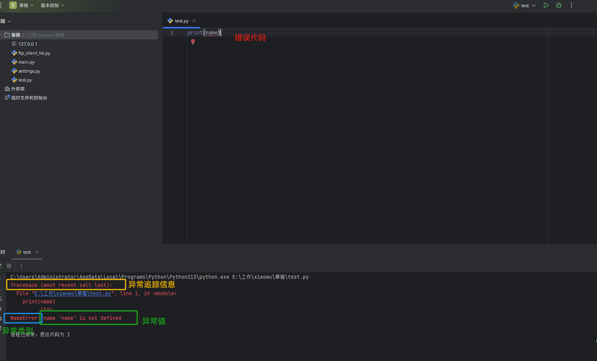

# 异常处理

## 一、什么是异常？

>异常就是程序运行的过程中发生错误的信号。
>
>直白的讲，就是在程序出现错误 的时候，会出现一个 异常，如果程序没有处理它，则会抛出该异常，程序的运行也随之终止 。



## 二、错误的种类

>知道了什么是异常，那么接下来就要看一下错误的种类。
>
>错误总共分为两种，分别是语法错误以及逻辑错误。

### 1、语法错误（SyntaxError）

>语法错误是非常致命的错误，也是非常低级的错误！这种错误应该在程序运行前就应该修改正确！

### 2、逻辑错误

>除了语法错误就是逻辑错误了，那么常见的逻辑错误如下所示。
>
>• *TypeError* 类型错误
>
>• *NameError* 名字错误
>
>• *ValueError* 值错误
>
>• *IndexError* 索引错误
>
>• *KeyError* 键错误
>
>• *AttributeError* 属性错误
>
>• *FileNotFoundError* 文件未找到错误
>
>• *ZeroDivisionError* 除0错误

## 三、异常的种类

>在Python中，不同的异常可以用不同的类型（Python 中统一了类与类型，类型即类）去标识，一个异常标识一种错误。

### 1、常见异常

>- *TypeError* 传入对象类型与要求的不符
>
>- *NameError* 使用一个还未被赋予对象的变量
>
>- *ValueError* 传入一个调用者不期望的值，即使值的类型是正确的
>
>- *IndexError* 下标索引超出序列边界，比如当lis只有三个元素，但是却试图访问第四个元素 *lis[3]*
>
>- *KeyError* 试图访问字典里不存在的键
>
>- *AttributeError* 试图访问一个对象没有的属性，比如：*Person.name* ，但是 *Person* 没有属性 *name*
>
>- *IOError* 输入/输出异常；基本上无法打开文件
>
>- *ImportError* 无法导入模块/包；基本上是由于路径问题或者名称错误
>
>- *IndentationError* 语法错误（子类）；代码没有正确的缩进对齐
>
>- *KeyboardInterrupt* CTRL + C 被按下
>
>- *UnboundLocalError* 试图访问一个还未被设置的局部变量，基本上是由于另有一个同名的全局变量，导致你以为正在访问它

### 2、更多异常

#### 1.内置异常的类层级结构

>*BaseException*
> *+--* *SystemExit*
> *+--* *KeyboardInterrupt*
> *+--* *GeneratorExit*
> *+--* *Exception*
>   *+--* *StopIteration*
>   *+--* *StopAsyncIteration*
>   *+--* *ArithmeticError*
>   *|*  *+--* *FloatingPointError*
>   *|*  *+--* *OverflowError*
>   *|*  *+--* *ZeroDivisionError*
>   *+--* *AssertionError*
>   *+--* *AttributeError*
>   *+--* *BufferError*
>   *+--* *EOFError*
>   *+--* *ImportError*
>   *|*  *+--* *ModuleNotFoundError*
>   *+--* *LookupError*
>   *|*  *+--* *IndexError*
>   *|*  *+--* *KeyError*
>   *+--* *MemoryError*
>   *+--* *NameError*
>   *|*  *+--* *UnboundLocalError*
>   *+--* *OSError*
>   *|*  *+--* *BlockingIOError*
>   *|*  *+--* *ChildProcessError*
>   *|*  *+--* *ConnectionError*
>   *|*  *|*  *+--* *BrokenPipeError*
>   *|*  *|*  *+--* *ConnectionAbortedError*
>   *|*  *|*  *+--* *ConnectionRefusedError*
>   *|*  *|*  *+--* *ConnectionResetError*
>   *|*  *+--* *FileExistsError*
>   *|*  *+--* *FileNotFoundError*
>   *|*  *+--* *InterruptedError*
>   *|*  *+--* *IsADirectoryError*
>   *|*  *+--* *NotADirectoryError*
>   *|*  *+--* *PermissionError*
>   *|*  *+--* *ProcessLookupError*
>   *|*  *+--* *TimeoutError*
>   *+--* *ReferenceError*
>   *+--* *RuntimeError*
>   *|*  *+--* *NotImplementedError*
>   *|*  *+--* *RecursionError*
>   *+--* *SyntaxError*
>   *|*  *+--* *IndentationError*
>   *|*     *+--* *TabError*
>   *+--* *SystemError*
>   *+--* *TypeError*
>   *+--* *ValueError*
>   *|*  *+--* *UnicodeError*
>   *|*     *+--* *UnicodeDecodeError*
>   *|*     *+--* *UnicodeEncodeError*
>   *|*     *+--* *UnicodeTranslateError*
>   *+--* *Warning*
>      *+--* *DeprecationWarning*
>      *+--* *PendingDeprecationWarning*
>      *+--* *RuntimeWarning*
>      *+--* *SyntaxWarning*
>      *+--* *UserWarning*
>      *+--* *FutureWarning*
>      *+--* *ImportWarning*
>      *+--* *UnicodeWarning*
>      *+--* *BytesWarning*
>      *+--* *ResourceWarning*

## 四、异常的处理

>为了保证程序的容错性与可靠性，即在遇到错误时有相应的处理机制不会任由程序崩溃掉，我们需要对异常进行处理

### 1、异常基本语法

```python
#!/usr/bin/env python3
# -*- coding: UTF-8 -*-


try:
    # todo: 被检测的代码块
    pass
except 异常类型:
    # todo: try中一旦检测到异常，就执行这个位置的逻辑
    pass
```

示例

```python
#!/usr/bin/env python3
# -*- coding: UTF-8 -*-


f = None
try:
    f = open('user')  # 读取了一个不存在的文件，触发异常 FileNotFoundError
except FileNotFoundError as e:  # as 语法将异常类型的 值 赋值给变量 e，这样我们通过打印 e便可以知道错误的原因
    if f:
        f.close()
    print(f'异常的值是：{e}')
    
"""
异常的值是：[Errno 2] No such file or directory: 'user'
"""
```

>本来程序一旦出现异常就整体结束掉了，有了异常处理以后，在被检测的代码块出现异常时，被检测的代码块中异常发生位置之后的代码将不会执行，取而代之的是执行匹配异常的except子代码块，其余代码均正常运行。

### 2、异常进阶

#### 1.多except处理

>异常类只能用来处理指定的异常情况，如果发生了非指定的异常类型将无法处理

```python
#!/usr/bin/env python3
# -*- coding: UTF-8 -*-


string = 'Hello World'
try:
    int(string)
except IndexError as e:  # 未捕获到异常，程序直接报错
    print(e)
    
"""
Traceback (most recent call last):
  File "/Users/liumingyang/PycharmProjects/pythonProject/main.py", line 3, in <module>
    int(string)
ValueError: invalid literal for int() with base 10: 'Hello World'
"""
```

>当被检测的代码块中有可能触发不同类型的异常时，针对不同类型的异常
>
>如果我们想分别用不同的逻辑处理，需要用到多分支的except（类似于多分支的elif，从上到下依次匹配，匹配成功一次便不再匹配其他）
>
>以上情况的解决方案：使用多分支

```python
#!/usr/bin/env python3
# -*- coding: UTF-8 -*-


string = 'Hello World'

try:
    int(string)
except IndexError as e:
    print(e)
except KeyError as e:
    print(e)
except ValueError as e:  # 捕获到异常：invalid literal for int() with base 10: 'Hello World'
    print(e)
    
"""
invalid literal for int() with base 10: 'Hello World'
"""
```

>如果我们想多种类型的异常统一用一种逻辑处理，可以将多个异常放到一个元组内，用一个except匹配

```python
#!/usr/bin/env python3
# -*- coding: UTF-8 -*-


try:
    被检测的代码块
except (NameError, IndexError, TypeError):
    触发NameError或IndexError或TypeError时对应的处理逻辑
```

#### 2.Exception通用处理

>如果我们想捕获所有异常并用一种逻辑处理，Python提供了一个万能异常类型Exception
>
>更加通用的解决方案：Exception

```python
#!/usr/bin/env python3
# -*- coding: UTF-8 -*-


string = 'Hello World'

try:
    int(string)
except Exception as e:
    print(e)
    
"""
invalid literal for int() with base 10: 'Hello World'
"""
```

>既有各自的处理方式又有统一的处理方式

```python
#!/usr/bin/env python3
# -*- coding: UTF-8 -*-


string = 'Hello World'

try:
    int(string)
except IndexError as e:
    print(e)
except KeyError as e:
    print(e)
except ValueError as e:  # 如果具体的异常类型捕捉到了异常，那么便不会执行 Exception
    print(f'😂😂😂')
    print(e)
except Exception as e:  # 只有具体的异常类型都没有捕捉到的时候才会执行
    print(e)

"""
😂😂😂
invalid literal for int() with base 10: 'Hello World'
"""
```

>小总结
>
>- 如果你想要的效果是：无论出现什么异常，我们统一丢弃，或者使用同一段代码去处理他们，那么只需要一个 ***\*Exception\**** 即可。
>
>- 如果你想要的效果是：对于不同的异常我们需要有不同的处理方式，那么这个时候就需要用到多分支了
>
>- 如果既需要具体的异常处理又需要统一的异常处理，那么便可以将两者结合！

### 3、异常高级

>在多分支except之后还可以跟一个else（else必须跟在except之后，不能单独存在），只有在被检测的代码块没有触发任何异常的情况下才会执行else的子代码块。
>
>此外try还可以与finally连用，从语法上讲finally必须放到else之后，但可以使用try-except-finally的形式，也可以直接使用try-finally的形式。
>
>无论被检测的代码块是否触发异常，都会执行finally的子代码块，因此通常在finally的子代码块做一些回收资源的操作，比如关闭打开的文件、关闭数据库连接等。

```python
#!/usr/bin/env python3
# -*- coding: UTF-8 -*-


string = 'Hello World'
try:
    str(string)
except IndexError as e:
    print(e)
except KeyError as e:
    print(e)
except ValueError as e:
    print(e)
else:
    print(f'try内代码块没有异常则执行 else 中的代码块')
finally:
    print(f'无论是否发生异常，都会执行 finally 中的代码块！通常用于清理工作！')
    
"""
try内代码块没有异常则执行 else 中的代码块
无论是否发生异常，都会执行 finally 中的代码块！通常用于清理工作！
"""
```

### 4、主动抛出异常

>在不符合Python解释器的语法或逻辑规则时，是由Python解释器主动触发的各种类型的异常，而对于违反程序员自定制的各类规则，则需要由程序员自己来明确地触发异常，这就用到了raise语句，raise后必须是一个异常的类或者是异常的实例

```python
#!/usr/bin/env python3
# -*- coding: UTF-8 -*-


try:
    raise TypeError('类型错误！')
except Exception as e:
    print(e)
    
"""
类型错误！
"""
```

### 5、自定义异常

>在内置异常不够用的情况下，我们可以通过继承内置的异常类来自定义异常类

```python
#!/usr/bin/env python3
# -*- coding: UTF-8 -*-


class NagaseException(BaseException):

    def __init__(self, data):
        self.data = data

    def __str__(self):
        return self.data


try:
    raise NagaseException('类型错误')
except NagaseException as e:
    print(e)
    
"""
类型错误
"""
```

```python
try:
    a = input("输入一个数：")
    #判断用户输入的是否为数字
    if(not a.isdigit()):
        raise ValueError("a 必须是数字")
except ValueError as e:
    print("引发异常：", repr(e))


# 结果
runfile('E:/09-code/01-turbulence/test/test04.py', wdir='E:/09-code/01-turbulence/test')
输入一个数：>? a
引发异常： ValueError('a 必须是数字')
```

### 6、断言：assert 条件

>Python还提供了一个断言语句assert expression，断定表达式expression成立，否则触发异常AssertionError，与raise-if-not的语义相同，如下

```py
#!/usr/bin/env python3
# -*- coding: UTF-8 -*-


age = 18

# 如果表达式isinstance(age, int)返回值为 False 则触发异常AssertError
assert isinstance(age, int)

# 等同于
if not isinstance(age, int):
    raise AssertionError
```

### 7、总结

>- 把错误处理和真正的工作分开来
>
>- 代码更容易组织，更加清晰，复杂的工作任务更加容易实现
>
>- 毫无疑问，更安全了，不至于由于一些小的疏忽而使得整个程序意外崩溃了

## 五、什么时候使用异常处理？

> 在了解了异常处理机制后，本着提高程序容错性和可靠性的目的，读者可能会错误地认为应该尽可能多地为程序加上try…except…，这其是在过度消费程序的可读性，因为try…except本来就是你附加给程序的一种额外的逻辑，与你的主要工作是没有多大关系的。

>如果错误发生的条件是可预知的，我们需要用if进行处理：在错误发生之前进行预防

```python
#!/usr/bin/env python3
# -*- coding: UTF-8 -*-


inp_uage = input('请输入年龄：').strip()

if inp_uage.isdigit():  # 只有在inp_uage为字符串形式的整数时,下列代码才不会出错,该条件是可预知的
    inp_uage = int(inp_uage)
    print(inp_uage)
else:
    print(f'值错误！！！')
    
"""
请输入年龄：你好
值错误！！！
"""
```

>如果错误发生的条件是不可预知的，那么需要用到try…except：在错误发生之后进行处理

>例如我们编写一个下载网页内容的功能，网络发生延迟之类的异常是很正常的事，而我们根本无法预知在满足什么条件的情况下才会出现延迟，因而只能用异常处理机制了。

```python
#!/usr/bin/env python3
# -*- coding: UTF-8 -*-


import requests
from requests.exceptions import ConnectTimeout  # 导入requests模块内自定义的异常


def get(url):
    res = None

    try:
        response = requests.get(url, timeout=3)  # 超过3秒未下载成功则触发ConnectTimeOut异常
        res = response.text
    except ConnectTimeout:
        print(f'连接请求超时！')
    except Exception as e:
        print(f'异常的值是：{e}')
        print(f'请检查您的网络！')
    return res


get('https://www.python.org')
```

>别让异常处理大幅度影响程序的可读性。


