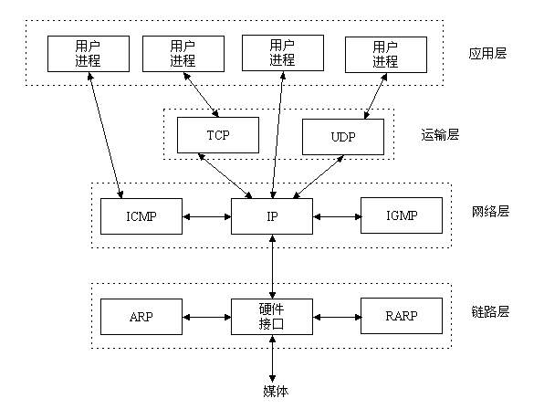
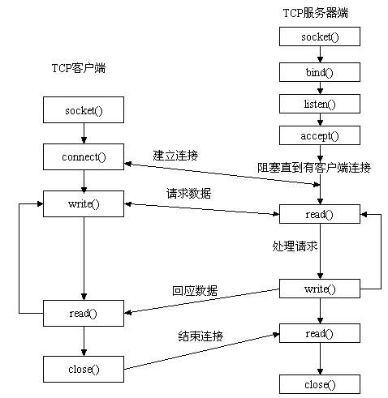
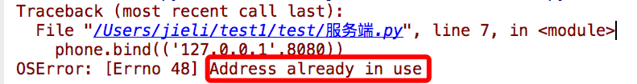
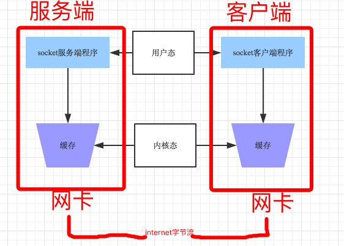
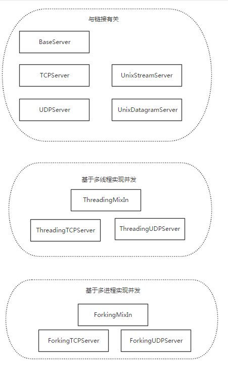
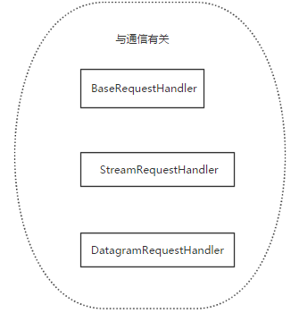
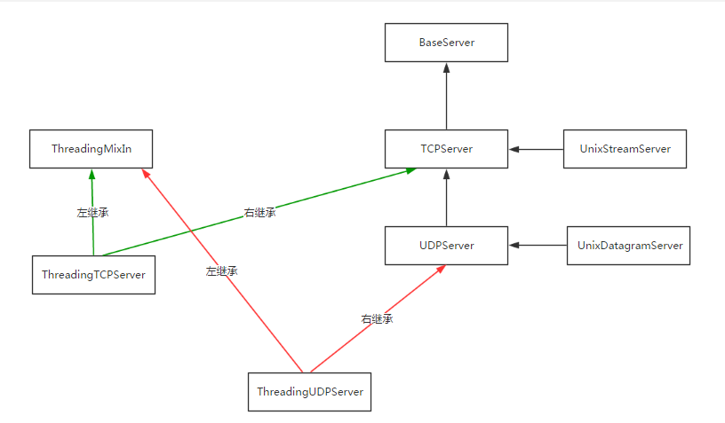
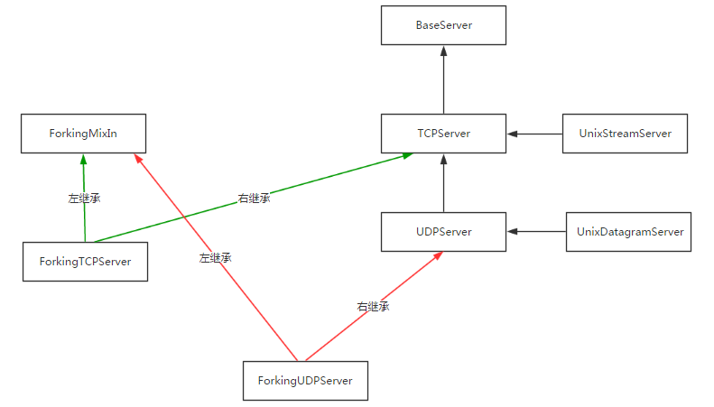
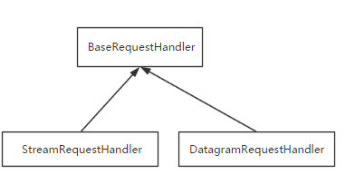

# 网络编程

## 一、知识了解

>操作系统由来、操作系统基础
>
>互联网发展历史、网络通信原理（OSI七层协议、TCP/IP五层模型）
>
>互联网开发架构

## 二、socket层

>Socket它到底在哪里呢？还是用图来说话，一目了然。



### 1、socket是什么

>Socket是应用层与TCP/IP协议族通信的中间软件抽象层，它是一组接口。在设计模式中，Socket其实就是一个门面模式，它把复杂的TCP/IP协议族隐藏在Socket接口后面，对用户来说，一组简单的接口就是全部，让Socket去组织数据，以符合指定的协议。

>所以，我们无需深入理解tcp/udp协议，socket已经为我们封装好了，我们只需要遵循socket的规定去编程，写出的程序自然就是遵循tcp/udp标准的。

>也有人将socket说成ip+port，ip是用来标识互联网中的一台主机的位置，而port是用来标识这台机器上的一个应用程序，ip地址是配置到网卡上的，而port是应用程序开启的，ip与port的绑定就标识了互联网中独一无二的一个应用程序而程序的pid是同一台机器上不同进程或者线程的标识

### 2、套接字发展史及分类

>套接字起源于 20 世纪 70 年代加利福尼亚大学伯克利分校版本的 Unix,即人们所说的 BSD Unix。 因此,有时人们也把套接字称为伯克利套接字或BSD 套接字。一开始,套接字被设计用在同 一台主机上多个应用程序之间的通讯。这也被称进程间通讯,或 IPC。套接字有两种（或者称为有两个种族）,分别是基于文件型的和基于网络型的。

#### 1.基于文件类型的套接字家族

>套接字家族的名字：AF_UNIX
>
>unix一切皆文件，基于文件的套接字调用的就是底层的文件系统来取数据，两个套接字进程运行在同一机器，可以通过访问同一个文件系统间接完成通信

#### 2.基于网络类型的套接字家族

>套接字家族的名字：AF_INET
>
>(还有AF_INET6被用于ipv6，还有一些其他的地址家族，不过，他们要么是只用于某个平台，要么就是已经被废弃，或者是很少被使用，或者是根本没有实现，所有地址家族中，AF_INET是使用最广泛的一个，python支持很多种地址家族，但是由于我们只关心网络编程，所以大部分时候我么只使用AF_INET)

### 3、套接字工作流程

>一个生活中的场景。你要打电话给一个朋友，先拨号，朋友听到电话铃声后提起电话，这时你和你的朋友就建立起了连接，就可以讲话了。等交流结束，挂断电话结束此次交谈。 生活中的场景就解释了这工作原理。



>先从服务器端说起。服务器端先初始化Socket，然后与端口绑定(bind)，对端口进行监听(listen)，调用accept阻塞，等待客户端连接。在这时如果有个客户端初始化一个Socket，然后连接服务器(connect)，如果连接成功，这时客户端与服务器端的连接就建立了。客户端发送数据请求，服务器端接收请求并处理请求，然后把回应数据发送给客户端，客户端读取数据，最后关闭连接，一次交互结束

```python
import socket
# socket_family 可以是 AF_UNIX 或 AF_INET。socket_type 可以是 SOCK_STREAM 或 SOCK_DGRAM。protocol 一般不填,默认值为 0。
# socket.socket(socket_family,socket_type,protocal=0)

# 获取tcp/ip套接字
tcpSock = socket.socket(socket.AF_INET, socket.SOCK_STREAM)

# 获取udp/ip套接字
udpSock = socket.socket(socket.AF_INET, socket.SOCK_DGRAM)

#由于 socket 模块中有太多的属性。我们在这里破例使用了'from module import *'语句。使用 'from socket import *',我们就把 socket 模块里的所有属性都带到我们的命名空间里了,这样能 大幅减短我们的代码。
#例如tcpSock = socket(AF_INET, SOCK_STREAM)
```

### 4、函数及方法

#### 1.服务端套接字函数

```python
s.bind()    绑定(主机,端口号)到套接字
s.listen()  开始TCP监听
s.accept()  被动接受TCP客户的连接,(阻塞式)等待连接的到来
```

#### 2.客户端套接字函数

```python
s.connect()     主动初始化TCP服务器连接
s.connect_ex()  connect()函数的扩展版本,出错时返回出错码,而不是抛出异常
```

#### 3.公共用途的套接字函数

```python
s.recv()            接收TCP数据
s.send()            发送TCP数据(send在待发送数据量大于己端缓存区剩余空间时,数据丢失,不会发完)
s.sendall()         发送完整的TCP数据(本质就是循环调用send,sendall在待发送数据量大于己端缓存区剩余空间时,数据不丢失,循环调用send直到发完)
s.recvfrom()        接收UDP数据
s.sendto()          发送UDP数据
s.getpeername()     连接到当前套接字的远端的地址
s.getsockname()     当前套接字的地址
s.getsockopt()      返回指定套接字的参数
s.setsockopt()      设置指定套接字的参数
s.close()           关闭套接字
```

#### 4.面向锁的套接字方法

```python
s.setblocking()     设置套接字的阻塞与非阻塞模式
s.settimeout()      设置阻塞套接字操作的超时时间
s.gettimeout()      得到阻塞套接字操作的超时时间
```

#### 5.面向文件的套接字的函数

```python
s.fileno()          套接字的文件描述符
s.makefile()        创建一个与该套接字相关的文件
```

### 5、基于TCP的套接字

>tcp是基于链接的，必须先启动服务端，然后再启动客户端去链接服务端

#### 1.服务端

```python
import socket
ip_port=('127.0.0.1',8081)#电话卡
BUFSIZE=1024
s=socket.socket(socket.AF_INET,socket.SOCK_STREAM) #买手机
s.bind(ip_port) #手机插卡
s.listen(5)     #手机待机


while True:                         #新增接收链接循环,可以不停的接电话
    conn,addr=s.accept()            #手机接电话
    # print(conn)
    # print(addr)
    print('接到来自%s的电话' %addr[0])
    while True:                         #新增通信循环,可以不断的通信,收发消息
        msg=conn.recv(BUFSIZE)             #听消息,听话

        # if len(msg) == 0:break        #如果不加,那么正在链接的客户端突然断开,recv便不再阻塞,死循环发生

        print(msg,type(msg))

        conn.send(msg.upper())          #发消息,说话

    conn.close()                    #挂电话

s.close()                       #手机关机
```

#### 2.客户端

```python
import socket
ip_port=('127.0.0.1',8081)
BUFSIZE=1024
s=socket.socket(socket.AF_INET,socket.SOCK_STREAM)

s.connect_ex(ip_port)           #拨电话

while True:                             #新增通信循环,客户端可以不断发收消息
    msg=input('>>: ').strip()
    if len(msg) == 0:continue
    s.send(msg.encode('utf-8'))         #发消息,说话(只能发送字节类型)

    feedback=s.recv(BUFSIZE)                           #收消息,听话
    print(feedback.decode('utf-8'))

s.close()
```

#### 3.端口占用问题

##### 1）现象



>这个是由于你的服务端仍然存在四次挥手的time_wait状态在占用地址（如果不懂，请深入研究1.tcp三次握手，四次挥手 2.syn洪水攻击 3.服务器高并发情况下会有大量的time_wait状态的优化方法）

##### 2）解决办法

```python
#加入一条socket配置，重用ip和端口

phone=socket(AF_INET,SOCK_STREAM)
phone.setsockopt(SOL_SOCKET,SO_REUSEADDR,1) #就是它，在bind前加
phone.bind(('127.0.0.1',8080))
```

```bash
发现系统存在大量TIME_WAIT状态的连接，通过调整linux内核参数解决，
vi /etc/sysctl.conf

编辑文件，加入以下内容：
net.ipv4.tcp_syncookies = 1
net.ipv4.tcp_tw_reuse = 1
net.ipv4.tcp_tw_recycle = 1
net.ipv4.tcp_fin_timeout = 30
 
然后执行 /sbin/sysctl -p 让参数生效。
 
net.ipv4.tcp_syncookies = 1 表示开启SYN Cookies。当出现SYN等待队列溢出时，启用cookies来处理，可防范少量SYN攻击，默认为0，表示关闭；

net.ipv4.tcp_tw_reuse = 1 表示开启重用。允许将TIME-WAIT sockets重新用于新的TCP连接，默认为0，表示关闭；

net.ipv4.tcp_tw_recycle = 1 表示开启TCP连接中TIME-WAIT sockets的快速回收，默认为0，表示关闭。

net.ipv4.tcp_fin_timeout 修改系統默认的 TIMEOUT 时间
```

### 6、基于UDP的套接字

#### 1.服务端

```python
import socket
ip_port=('127.0.0.1',9000)
BUFSIZE=1024
udp_server_client=socket.socket(socket.AF_INET,socket.SOCK_DGRAM)

udp_server_client.bind(ip_port)

while True:
    msg,addr=udp_server_client.recvfrom(BUFSIZE)
    print(msg,addr)

    udp_server_client.sendto(msg.upper(),addr)
```

#### 2.客户端

```python
import socket
ip_port=('127.0.0.1',9000)
BUFSIZE=1024
udp_server_client=socket.socket(socket.AF_INET,socket.SOCK_DGRAM)

while True:
    msg=input('>>: ').strip()
    if not msg:continue

    udp_server_client.sendto(msg.encode('utf-8'),ip_port)

    back_msg,addr=udp_server_client.recvfrom(BUFSIZE)
    print(back_msg.decode('utf-8'),addr)
```

### 7、粘包

#### 1.什么是粘包



>发送端可以是一K一K地发送数据，而接收端的应用程序可以两K两K地提走数据，当然也有可能一次提走3K或6K数据，或者一次只提走几个字节的数据，也就是说，应用程序所看到的数据是一个整体，或说是一个流（stream），一条消息有多少字节对应用程序是不可见的，因此TCP协议是面向流的协议，这也是容易出现粘包问题的原因。而UDP是面向消息的协议，每个UDP段都是一条消息，应用程序必须以消息为单位提取数据，不能一次提取任意字节的数据，这一点和TCP是很不同的。怎样定义消息呢？可以认为对方一次性write/send的数据为一个消息，需要明白的是当对方send一条信息的时候，无论底层怎样分段分片，TCP协议层会把构成整条消息的数据段排序完成后才呈现在内核缓冲区。

>例如基于tcp的套接字客户端往服务端上传文件，发送时文件内容是按照一段一段的字节流发送的，在接收方看了，根本不知道该文件的字节流从何处开始，在何处结束

**所谓粘包问题主要还是因为接收方不知道消息之间的界限，不知道一次性提取多少字节的数据所造成的。**

>此外，发送方引起的粘包是由TCP协议本身造成的，TCP为提高传输效率，发送方往往要收集到足够多的数据后才发送一个TCP段。若连续几次需要send的数据都很少，通常TCP会根据优化算法把这些数据合成一个TCP段后一次发送出去，这样接收方就收到了粘包数据。
>
>>TCP（transport control  protocol，传输控制协议）是面向连接的，面向流的，提供高可靠性服务。收发两端（客户端和服务器端）都要有一一成对的socket，因此，发送端为了将多个发往接收端的包，更有效的发到对方，使用了优化方法（Nagle算法），将多次间隔较小且数据量小的数据，合并成一个大的数据块，然后进行封包。这样，接收端，就难于分辨出来了，必须提供科学的拆包机制。 即面向流的通信是无消息保护边界的。
>
>>UDP（user datagram protocol，用户数据报协议）是无连接的，面向消息的，提供高效率服务。不会使用块的合并优化算法，,  由于UDP支持的是一对多的模式，所以接收端的skbuff(套接字缓冲区）采用了链式结构来记录每一个到达的UDP包，在每个UDP包中就有了消息头（消息来源地址，端口等信息），这样，对于接收端来说，就容易进行区分处理了。 即面向消息的通信是有消息保护边界的。
>
>>tcp是基于数据流的，于是收发的消息不能为空，这就需要在客户端和服务端都添加空消息的处理机制，防止程序卡住，而udp是基于数据报的，即便是你输入的是空内容（直接回车），那也不是空消息，udp协议会帮你封装上消息头。

#### 2.拆包的发生情况

>当发送端缓冲区的长度大于网卡的MTU时，tcp会将这次发送的数据拆成几个数据包发送出去。

#### 3.补充问题一：为何tcp是可靠传输，udp是不可靠传输

>tcp在数据传输时，发送端先把数据发送到自己的缓存中，然后协议控制将缓存中的数据发往对端，对端返回一个ack=1，发送端则清理缓存中的数据，对端返回ack=0，则重新发送数据，所以tcp是可靠的。

>而udp发送数据，对端是不会返回确认信息的，因此不可靠。

#### 4.补充问题二：send(字节流)和recv(1024)及sendall

>recv里指定的1024意思是从缓存里一次拿出1024个字节的数据。
>
>send的字节流是先放入己端缓存，然后由协议控制将缓存内容发往对端，如果待发送的字节流大小大于缓存剩余空间，那么数据丢失，用sendall就会循环调用send，数据不会丢失。

### 8、解决粘包

>为字节流加上自定义固定长度报头，报头中包含字节流长度，然后一次send到对端，对端在接收时，先从缓存中取出定长的报头，然后再取真实数据。

#### 1.struct模块

>该模块可以把一个类型，如数字，转成固定长度的bytes

#### 2.自定义报头

##### 1）服务端

```python
import socket,struct,json
import subprocess
phone=socket.socket(socket.AF_INET,socket.SOCK_STREAM)
phone.setsockopt(socket.SOL_SOCKET,socket.SO_REUSEADDR,1) #就是它，在bind前加

phone.bind(('127.0.0.1',8080))

phone.listen(5)

while True:
    conn,addr=phone.accept()
    while True:
        cmd=conn.recv(1024)
        if not cmd:break
        print('cmd: %s' %cmd)

        res=subprocess.Popen(cmd.decode('utf-8'),
                             shell=True,
                             stdout=subprocess.PIPE,
                             stderr=subprocess.PIPE)
        err=res.stderr.read()
        print(err)
        if err:
            back_msg=err
        else:
            back_msg=res.stdout.read()


        conn.send(struct.pack('i',len(back_msg))) #先发back_msg的长度
        conn.sendall(back_msg) #在发真实的内容

    conn.close()
```

##### 2）客户端

```python
import socket,time,struct

s=socket.socket(socket.AF_INET,socket.SOCK_STREAM)
res=s.connect_ex(('127.0.0.1',8080))

while True:
    msg=input('>>: ').strip()
    if len(msg) == 0:continue
    if msg == 'quit':break

    s.send(msg.encode('utf-8'))


    l=s.recv(4)
    x=struct.unpack('i',l)[0]
    print(type(x),x)
    # print(struct.unpack('I',l))
    r_s=0
    data=b''
    while r_s < x:
        r_d=s.recv(1024)
        data+=r_d
        r_s+=len(r_d)

    # print(data.decode('utf-8'))
    print(data.decode('gbk')) #windows默认gbk编码
```

#### 3.稍微复杂的自定义报头

>我们可以把报头做成字典，字典里包含将要发送的真实数据的详细信息，然后json序列化，然后用struck将序列化后的数据长度打包成4个字节（4个自己足够用了）
>
>发送时：
>
>先发报头长度
>
>再编码报头内容然后发送
>
>最后发真实内容
>
> 
>
>接收时：
>
>先手报头长度，用struct取出来
>
>根据取出的长度收取报头内容，然后解码，反序列化
>
>从反序列化的结果中取出待取数据的详细信息，然后去取真实的数据内容

##### 1）服务端

```python
import socket,struct,json
import subprocess
phone=socket.socket(socket.AF_INET,socket.SOCK_STREAM)
phone.setsockopt(socket.SOL_SOCKET,socket.SO_REUSEADDR,1) #就是它，在bind前加

phone.bind(('127.0.0.1',8080))

phone.listen(5)

while True:
    conn,addr=phone.accept()
    while True:
        cmd=conn.recv(1024)
        if not cmd:break
        print('cmd: %s' %cmd)

        res=subprocess.Popen(cmd.decode('utf-8'),
                             shell=True,
                             stdout=subprocess.PIPE,
                             stderr=subprocess.PIPE)
        err=res.stderr.read()
        print(err)
        if err:
            back_msg=err
        else:
            back_msg=res.stdout.read()

        headers={'data_size':len(back_msg)}
        head_json=json.dumps(headers)
        head_json_bytes=bytes(head_json,encoding='utf-8')

        conn.send(struct.pack('i',len(head_json_bytes))) #先发报头的长度
        conn.send(head_json_bytes) #再发报头
        conn.sendall(back_msg) #在发真实的内容

    conn.close()
```

##### 2）客户端

```python
from socket import *
import struct,json

ip_port=('127.0.0.1',8080)
client=socket(AF_INET,SOCK_STREAM)
client.connect(ip_port)

while True:
    cmd=input('>>: ')
    if not cmd:continue
    client.send(bytes(cmd,encoding='utf-8'))

    head=client.recv(4)
    head_json_len=struct.unpack('i',head)[0]
    head_json=json.loads(client.recv(head_json_len).decode('utf-8'))
    data_len=head_json['data_size']

    recv_size=0
    recv_data=b''
    while recv_size < data_len:
        recv_data+=client.recv(1024)
        recv_size+=len(recv_data)

    print(recv_data.decode('utf-8'))
    #print(recv_data.decode('gbk')) #windows默认gbk编码
```

### 9、socketserver实现并发

>基于tcp的套接字，关键就是两个循环，一个链接循环，一个通信循环
>
>socketserver模块中分两大类：server类（解决链接问题）和request类（解决通信问题）

#### 1.server类：



#### 2.request类：



#### 3.继承关系:







>以下述代码为例，分析socketserver源码：
>
>```python
>ftpserver=socketserver.ThreadingTCPServer(('127.0.0.1',8080),FtpServer)
>ftpserver.serve_forever()
>```

>查找属性的顺序：ThreadingTCPServer->ThreadingMixIn->TCPServer->BaseServer
>
>1. 实例化得到ftpserver，先找类ThreadingTCPServer的__init__,在TCPServer中找到，进而执行server_bind,server_active
>2. 找ftpserver下的serve_forever,在BaseServer中找到，进而执行self._handle_request_noblock()，该方法同样是在BaseServer中
>3. 执行self._handle_request_noblock()进而执行request, client_address =  self.get_request()（就是TCPServer中的self.socket.accept()），然后执行self.process_request(request, client_address)
>4. 在ThreadingMixIn中找到process_request，开启多线程应对并发，进而执行process_request_thread，执行self.finish_request(request, client_address)
>5. 上述四部分完成了链接循环，本部分开始进入处理通讯部分，在BaseServer中找到finish_request,触发我们自己定义的类的实例化，去找__init__方法，而我们自己定义的类没有该方法，则去它的父类也就是BaseRequestHandler中找....

>源码分析总结：
>
>基于tcp的socketserver我们自己定义的类中的
>
>1. 　　self.server即套接字对象
>2. 　　self.request即一个链接
>3. 　　self.client_address即客户端地址
>
>基于udp的socketserver我们自己定义的类中的
>
>1. 　　self.request是一个元组（第一个元素是客户端发来的数据，第二部分是服务端的udp套接字对象），如(b'adsf',  <socket.socket fd=200, family=AddressFamily.AF_INET,  type=SocketKind.SOCK_DGRAM, proto=0, laddr=('127.0.0.1', 8080)>)
>2. 　　self.client_address即客户端地址

#### 4.ftp服务

##### 1）服务端

```python
import socketserver
import struct
import json
import os
class FtpServer(socketserver.BaseRequestHandler):
    coding='utf-8'
    server_dir='file_upload'
    max_packet_size=1024
    BASE_DIR=os.path.dirname(os.path.abspath(__file__))
    def handle(self):
        print(self.request)
        while True:
            data=self.request.recv(4)
            data_len=struct.unpack('i',data)[0]
            head_json=self.request.recv(data_len).decode(self.coding)
            head_dic=json.loads(head_json)
            # print(head_dic)
            cmd=head_dic['cmd']
            if hasattr(self,cmd):
                func=getattr(self,cmd)
                func(head_dic)
    def put(self,args):
        file_path = os.path.normpath(os.path.join(
            self.BASE_DIR,
            self.server_dir,
            args['filename']
        ))

        filesize = args['filesize']
        recv_size = 0
        print('----->', file_path)
        with open(file_path, 'wb') as f:
            while recv_size < filesize:
                recv_data = self.request.recv(self.max_packet_size)
                f.write(recv_data)
                recv_size += len(recv_data)
                print('recvsize:%s filesize:%s' % (recv_size, filesize))


ftpserver=socketserver.ThreadingTCPServer(('127.0.0.1',8080),FtpServer)
ftpserver.serve_forever()
```

##### 2）客户端

```python
import socket
import struct
import json
import os


class MYTCPClient:
    address_family = socket.AF_INET

    socket_type = socket.SOCK_STREAM

    allow_reuse_address = False

    max_packet_size = 8192

    coding='utf-8'

    request_queue_size = 5

    def __init__(self, server_address, connect=True):
        self.server_address=server_address
        self.socket = socket.socket(self.address_family,
                                    self.socket_type)
        if connect:
            try:
                self.client_connect()
            except:
                self.client_close()
                raise

    def client_connect(self):
        self.socket.connect(self.server_address)

    def client_close(self):
        self.socket.close()

    def run(self):
        while True:
            inp=input(">>: ").strip()
            if not inp:continue
            l=inp.split()
            cmd=l[0]
            if hasattr(self,cmd):
                func=getattr(self,cmd)
                func(l)


    def put(self,args):
        cmd=args[0]
        filename=args[1]
        if not os.path.isfile(filename):
            print('file:%s is not exists' %filename)
            return
        else:
            filesize=os.path.getsize(filename)

        head_dic={'cmd':cmd,'filename':os.path.basename(filename),'filesize':filesize}
        print(head_dic)
        head_json=json.dumps(head_dic)
        head_json_bytes=bytes(head_json,encoding=self.coding)

        head_struct=struct.pack('i',len(head_json_bytes))
        self.socket.send(head_struct)
        self.socket.send(head_json_bytes)
        send_size=0
        with open(filename,'rb') as f:
            for line in f:
                self.socket.send(line)
                send_size+=len(line)
                print(send_size)
            else:
                print('upload successful')


client=MYTCPClient(('127.0.0.1',8080))

client.run()
```


