# 并发编程

## 一、多进程-理论

### 1、什么是进程

>进程：正在进行的一个过程或者说一个任务。而负责执行任务则是cpu。

### 2、进程和程序的区别

>程序仅仅只是一堆代码而已，而进程指的是程序的运行过程。

>需要强调的是：同一个程序执行两次，那也是两个进程，比如打开QQ登录两个不同的账号，虽然都是同一个软件，但是运行两个账号是两个进程，一般情况下，进程之间信息不互通。

### 3、并发与并行

>无论是并行还是并发，在用户看来都是’同时’运行的，不管是进程还是线程，都只是一个任务而已，真是干活的是cpu，cpu来做这些任务，而一个cpu同一时刻只能执行一个任务

#### 1.并发

>是伪并行，即看起来是同时运行。单个cpu+多道技术就可以实现并发，（并行也属于并发）

#### 2.并行

>同时运行，只有具备多个cpu才能实现并行

#### 3.多道技术

>单核下，可以利用多道技术，多个核，每个核也都可以利用多道技术（多道技术是针对单核而言的）
>
>有四个核，六个任务，这样同一时间有四个任务被执行，假设分别被分配给了cpu1，cpu2，cpu3，cpu4，
>
>一旦任务1遇到I/O就被迫中断执行，此时任务5就拿到cpu1的时间片去执行，这就是单核下的多道技术
>
>而一旦任务1的I/O结束了，操作系统会重新调用它(需知进程的调度、分配给哪个cpu运行，由操作系统说了算)，可能被分配给四个cpu中的任意一个去执行

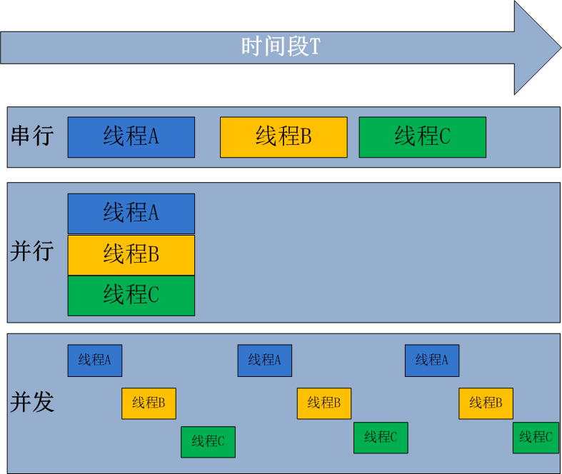

>所有现代计算机经常会在同一时间做很多件事，一个用户的PC（无论是单cpu还是多cpu），都可以同时运行多个任务（一个任务可以理解为一个进程）。
>
>启动一个进程来杀毒（360软件）
>
>启动一个进程来看电影（暴风影音）
>
>启动一个进程来聊天（腾讯QQ）
>
>所有的这些进程都需被管理，于是一个支持多进程的多道程序系统是至关重要的
>
>多道技术概念回顾：内存中同时存入多道（多个）程序，cpu从一个进程快速切换到另外一个，使每个进程各自运行几十或几百毫秒，这样，虽然在某一个瞬间，一个cpu只能执行一个任务，但在1秒内，cpu却可以运行多个进程，这就给人产生了并行的错觉，即伪并发，以此来区分多处理器操作系统的真正硬件并行（多个cpu共享同一个物理内存）

### 4、同步、异步、阻塞、非阻塞

#### 1.同步

>所谓同步，就是在发出一个功能调用时，在没有得到结果之前，该调用就不会返回。按照这个定义，其实绝大多数函数都是同步调用。但是一般而言，我们在说同步、异步的时候，特指那些需要其他部件协作或者需要一定时间完成的任务。

#### 2.异步

>异步的概念和同步相对。当一个异步功能调用发出后，调用者不能立刻得到结果。当该异步功能完成后，通过状态、通知或回调来通知调用者。如果异步功能用状态来通知，那么调用者就需要每隔一定时间检查一次，效率就很低（有些初学多线程编程的人，总喜欢用一个循环去检查某个变量的值，这其实是一 种很严重的错误）。如果是使用通知的方式，效率则很高，因为异步功能几乎不需要做额外的操作。至于回调函数，其实和通知没太多区别。

#### 3.阻塞

>阻塞调用是指调用结果返回之前，当前线程会被挂起（如遇到io操作）。函数只有在得到结果之后才会将阻塞的线程激活。有人也许会把阻塞调用和同步调用等同起来，实际上他是不同的。对于同步调用来说，很多时候当前线程还是激活的，只是从逻辑上当前函数没有返回而已。

#### 4.非阻塞

>非阻塞和阻塞的概念相对应，指在不能立刻得到结果之前也会立刻返回，同时该函数不会阻塞当前线程。

#### 5.小结

>1. 同步与异步针对的是函数/任务的调用方式：同步就是当一个进程发起一个函数（任务）调用的时候，一直等到函数（任务）完成，而进程继续处于激活状态。而异步情况下是当一个进程发起一个函数（任务）调用的时候，不会等函数返回，而是继续往下执行当，函数返回的时候通过状态、通知、事件等方式通知进程任务完成。
>2. 阻塞与非阻塞针对的是进程或线程：阻塞是当请求不能满足的时候就将进程挂起，而非阻塞则不会阻塞当前进程

### 5、进程的创建（了解）

>但凡是硬件，都需要有操作系统去管理，只要有操作系统，就有进程的概念，就需要有创建进程的方式，一些操作系统只为一个应用程序设计，比如微波炉中的控制器，一旦启动微波炉，所有的进程都已经存在。

>而对于通用系统（跑很多应用程序），需要有系统运行过程中创建或撤销进程的能力，主要分为4中形式创建新的进程

>系统初始化（查看进程linux中用ps命令，windows中用任务管理器，前台进程负责与用户交互，后台运行的进程与用户无关，运行在后台并且只在需要时才唤醒的进程，称为守护进程，如电子邮件、web页面、新闻、打印）

>一个进程在运行过程中开启了子进程（如nginx开启多进程，os.fork,subprocess.Popen等）
>
>用户的交互式请求，而创建一个新进程（如用户双击暴风影音）
>
>一个批处理作业的初始化（只在大型机的批处理系统中应用）
>
>无论哪一种，新进程的创建都是由一个已经存在的进程执行了一个用于创建进程的系统调用而创建的：
>
>在UNIX中该系统调用是：fork，fork会创建一个与父进程一模一样的副本，二者有相同的存储映像、同样的环境字符串和同样的打开文件（在shell解释器进程中，执行一个命令就会创建一个子进程）
>
>在windows中该系统调用是：CreateProcess，CreateProcess既处理进程的创建，也负责把正确的程序装入新进程。　
>
>关于创建的子进程，UNIX和windows
>
>相同的是：进程创建后，父进程和子进程有各自不同的地址空间（***\*多道技术要求物理层面实现进程之间内存的隔离\****），任何一个进程的在其地址空间中的修改都不会影响到另外一个进程。
>
>不同的是：在UNIX中，子进程的初始地址空间是父进程的一个副本，提示：子进程和父进程是可以有只读的共享内存区的。但是对于windows系统来说，从一开始父进程与子进程的地址空间就是不同的。

### 6、进程的终止（了解）

>正常退出（自愿，如用户点击交互式页面的叉号，或程序执行完毕调用发起系统调用正常退出，在linux中用exit，在windows中用ExitProcess）
>
>出错退出（自愿，python a.py中a.py不存在）
>
>严重错误（非自愿，执行非法指令，如引用不存在的内存，1/0等，可以捕捉异常，try…except…）
>
>被其他进程杀死（非自愿，如kill -9）

### 7、进程的层次结构

>无论UNIX还是windows，进程只有一个父进程，不同的是：
>
>在UNIX中所有的进程，都是以init进程为根，组成树形结构。父子进程共同组成一个进程组，这样，当从键盘发出一个信号时，该信号被送给当前与键盘相关的进程组中的所有成员。
>
>在windows中，没有进程层次的概念，所有的进程都是地位相同的，唯一类似于进程层次的暗示，是在创建进程时，父进程得到一个特别的令牌（称为句柄）,该句柄可以用来控制子进程，但是父进程有权把该句柄传给其他子进程，这样就没有层次了。

### 8、进程的状态

>tail -f access.log **|** grep '404'
>
>执行程序tail，开启一个子进程，执行程序grep，开启另外一个子进程，两个进程之间基于管道’|’通讯，将tail的结果作为grep的输入。
>
>进程grep在等待输入（即I/O）时的状态称为阻塞，此时grep命令都无法运行
>
>其实在两种情况下会导致一个进程在逻辑上不能运行，
>
>进程挂起是自身原因，遇到I/O阻塞，便要让出CPU让其他进程去执行，这样保证CPU一直在工作
>
>与进程无关，是操作系统层面，可能会因为一个进程占用时间过多，或者优先级等原因，而调用其他的进程去使用CPU。
>
>因而一个进程由三种状态

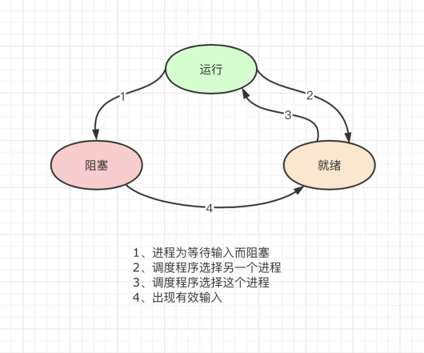

### 9、进程并发的实现（了解）

>进程并发的实现在于，硬件中断一个正在运行的进程，把此时进程运行的所有状态保存下来，为此，操作系统维护一张表格，即进程表（process table），每个进程占用一个进程表项（这些表项也称为进程控制块）

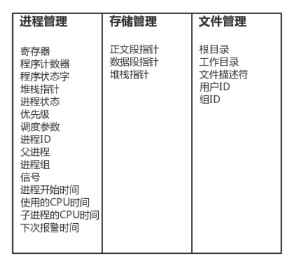

> 该表存放了进程状态的重要信息：程序计数器、堆栈指针、内存分配状况、所有打开文件的状态、帐号和调度信息，以及其他在进程由运行态转为就绪态或阻塞态时，必须保存的信息，从而保证该进程在再次启动时，就像从未被中断过一样。

## 二、多进程-实操

### 1、multiprocessing模块介绍

>python中的多线程无法利用多核优势，如果想要充分地使用多核CPU的资源（os.cpu_count()查看），在python中大部分情况需要使用多进程。Python提供了multiprocessing。 multiprocessing模块用来开启子进程，并在子进程中执行我们定制的任务（比如函数），该模块与多线程模块threading的编程接口类似。
>
>multiprocessing模块的功能众多：支持子进程、通信和共享数据、执行不同形式的同步，提供了Process、Queue、Pipe、Lock等组件。
>
>需要再次强调的一点是：与线程不同，进程没有任何共享状态，进程修改的数据，改动仅限于该进程内。

### 2、Process类的介绍

#### 1.创建进程的类

>Process([group [, target [, name [, args [, kwargs]]]]])，由该类实例化得到的对象，表示一个子进程中的任务（尚未启动）

>强调：
>
>1. 需要使用关键字的方式来指定参数
>2. args指定的为传给target函数的位置参数，是一个元组形式，必须有逗号

#### 2.参数介绍

>group参数未使用，值始终为None
>target表示调用对象，即子进程要执行的任务
>args表示调用对象的位置参数元组，args=(1,2,'xiaowu',)
>kwargs表示调用对象的字典,kwargs={'name':'xiaowu','age':18}
>name为子进程的名称

#### 3.方法介绍

>- p.start()：启动进程，并调用该子进程中的p.run()*
>- p.run():进程启动时运行的方法，正是它去调用target指定的函数，我们自定义类的类中一定要实现该方法
>- p.terminate():强制终止进程p，不会进行任何清理操作，如果p创建了子进程，该子进程就成了僵尸进程，使用该方法需要特别小心这种情况。如果p还保存了一个锁那么也将不会被释放，进而导致死锁
>- p.is_alive():如果p仍然运行，返回True
>- p.join([timeout]):主线程等待p终止（强调：是主线程处于等的状态，而p是处于运行的状态）。timeout是可选的超时时间，需要强调的是，p.join只能join住start开启的进程，而不能join住run开启的进程

#### 4.属性介绍

>p.daemon：默认值为False，如果设为True，代表p为后台运行的守护进程，当p的父进程终止时，p也随之终止，并且设定为True后，p不能创建自己的新进程，必须在p.start()之前设置
>p.name:进程的名称
>p.pid：进程的pid
>p.exitcode:进程在运行时为None、如果为–N，表示被信号N结束(了解即可)
>p.authkey:进程的身份验证键,默认是由os.urandom()随机生成的32字符的字符串。这个键的用途是为涉及网络连接的底层进程间通信提供安全性，这类连接只有在具有相同的身份验证键时才能成功（了解即可）

### 3、Process类的使用

#### 1.注意：在windows中Process()必须放到# if __name__ == '__main__':下

>Since Windows has no fork, the multiprocessing module starts a new Python process and imports the calling module. 
>If Process() gets called upon import, then this sets off an infinite succession of new processes (or until your machine runs out of resources). 
>This is the reason for hiding calls to Process() inside
>
>if __name__ == "__main__"
>since statements inside this if-statement will not get called upon import.
>由于Windows没有fork，多处理模块启动一个新的Python进程并导入调用模块。 
>如果在导入时调用Process（），那么这将启动无限继承的新进程（或直到机器耗尽资源）。 
>这是隐藏对Process（）内部调用的原，使用if __name__ == “__main __”，这个if语句中的语句将不会在导入时被调用。

#### 2.开启子进程的两种方式

##### 1）方式一：

```python
import time
import random
from multiprocessing import Process


def work(name):
    print('%s 开始' % name)
    time.sleep(random.randrange(1, 5))
    print('%s 结束' % name)


if __name__ == '__main__':
    p1 = Process(target=work, args=('aaa',))  # 必须加,号
    p2 = Process(target=work, args=('bbb',))
    p3 = Process(target=work, args=('ccc',))
    p4 = Process(target=work, args=('ddd',))

    p1.start()
    p2.start()
    p3.start()
    p4.start()
    print('主线程')


# 结果
主线程
aaa 开始
ccc 开始
bbb 开始
ddd 开始
aaa 结束
ccc 结束
bbb 结束
ddd 结束
```

##### 2）方式二：

```python
import time
import random
from multiprocessing import Process


class MyProcess(Process):
    def __init__(self, name):
        super().__init__()
        self.name = name

    def run(self):
        print('%s 开始' % self.name)
        time.sleep(random.randrange(1, 5))
        print('%s 结束' % self.name)


if __name__ == '__main__':
    p1 = MyProcess('aaa')
    p2 = MyProcess('bbb')
    p3 = MyProcess('ccc')
    p4 = MyProcess('ddd')

    p1.start()
    p2.start()
    p3.start()
    p4.start()
    print('主线程')


# 结果
主线程
bbb 开始
aaa 开始
ddd 开始
ccc 开始
aaa 结束
bbb 结束
ddd 结束
ccc 结束
```

#### 3.进程直接的内存空间是隔离的

```python
from multiprocessing import Process

n = 100  # 在windows系统中应该把全局变量定义在if __name__ == '__main__'之上就可以了


def work():
    global n
    n = 0
    print('子进程内: ', n)


if __name__ == '__main__':
    p = Process(target=work)
    p.start()
    print('主进程内: ', n)


# 结果
主进程内:  100
子进程内:  0
```

#### 4.Process对象的join方法

```python
from multiprocessing import Process
import time
import random


class work(Process):
    def __init__(self, name):
        self.name = name
        super().__init__()

    def run(self):
        print('%s is work' % self.name)
        time.sleep(random.randrange(1, 3))
        print('%s is work end' % self.name)


if __name__ == '__main__':
    p = work('xiaowu')
    p.start()
    p.join(0.0001)  # 等待p停止,等0.0001秒就不再等了
    print('开始')


# 结果
开始
work-1 is work
work-1 is work end
```

```python
from multiprocessing import Process
import time
import random
def work(name):
    print('%s is working' %name)
    time.sleep(random.randint(1,3))
    print('%s is work end' %name)

p1=Process(target=work,args=('xiaowu',))
p2=Process(target=work,args=('aqiao',))
p3=Process(target=work,args=('baifa',))
p4=Process(target=work,args=('trevor',))

if __name__ == '__main__':

    p1.start()
    p2.start()
    p3.start()
    p4.start()

    #有的同学会有疑问:既然join是等待进程结束,那么我像下面这样写,进程不就又变成串行的了吗?
    #当然不是了,必须明确：p.join()是让谁等？
    #很明显p.join()是让主线程等待p的结束，卡住的是主线程而绝非进程p，

    #详细解析如下：
    #进程只要start就会在开始运行了,所以p1-p4.start()时,系统中已经有四个并发的进程了
    #而我们p1.join()是在等p1结束,没错p1只要不结束主线程就会一直卡在原地,这也是问题的关键
    #join是让主线程等,而p1-p4仍然是并发执行的,p1.join的时候,其余p2,p3,p4仍然在运行,等#p1.join结束,可能p2,p3,p4早已经结束了,这样p2.join,p3.join.p4.join直接通过检测，无需等待
    # 所以4个join花费的总时间仍然是耗费时间最长的那个进程运行的时间
    p1.join()
    p2.join()
    p3.join()
    p4.join()

    print('主线程')


    #上述启动进程与join进程可以简写为
    # p_l=[p1,p2,p3,p4]
    #
    # for p in p_l:
    #     p.start()
    #
    # for p in p_l:
    #     p.join()


# 结果
xiaowu is working
baifa is working
aqiao is working
trevor is working
baifa is work end
aqiao is work end
trevor is work end
xiaowu is work end
主线程
```

#### 5.Process对象的其他方法或属性（了解）

##### 1）terminate,is_alive

```python
from multiprocessing import Process
import time
import random


class work(Process):
    def __init__(self, name):
        self.name = name
        super().__init__()

    def run(self):
        print('%s is working' % self.name)
        time.sleep(1)
        print('%s is work end' % self.name)

if __name__ == '__main__':
    p1 = work('xiaowu')
    p1.start()
    p1.terminate()  # 关闭进程,不会立即关闭,所以is_alive立刻查看的结果可能还是存活
    print(p1.is_alive())  # 结果为True

    time.sleep(5)
    print(p1.is_alive())  # 结果为False

    
# 结果
True
False
```

##### 2）name，pid，ppid

```python
from multiprocessing import Process
import time
import random
import os

class work(Process):
    def __init__(self, name):
        # self.name=name
        # super().__init__() #Process的__init__方法会执行self.name=work-1,
        #                    #所以加到这里,会覆盖我们的self.name=name
        # 为我们开启的进程设置名字的做法
        super().__init__()
        print(self.name)
        self.name = name

    def run(self):
        print('%s is working' % self.name)
        time.sleep(random.randrange(1, 3))
        print('%s is work end' % self.name)
        print(f'子进程父pid：{os.getppid()}')
        print(f'子进程pid：{os.getpid()}')

if __name__ == '__main__':
    p = work('xiaowu')
    p.start()
    print('主进程')
    print(f'从主进程看子进程pid：{p.pid}')  # 查看pid
    print(f'主进程父pid：{os.getppid()}')
    print(f'主进程pid：{os.getpid()}')


# 结果
work-1
主进程
从主进程看子进程pid：20976
主进程父pid：12356
主进程pid：25952
xiaowu is working
xiaowu is work end
子进程父pid：25952
子进程pid：20976
```

#### 6.僵尸进程与孤儿进程

>https://www.cnblogs.com/Anker/p/3271773.html

##### 1）僵尸进程

>　　僵尸进程：一个进程使用fork创建子进程，如果子进程退出，而父进程并没有调用wait或waitpid获取子进程的状态信息，那么子进程的进程描述符仍然保存在系统中。这种进程称之为僵死进程。详解如下
>
>我们知道在unix/linux中，正常情况下子进程是通过父进程创建的，子进程在创建新的进程。子进程的结束和父进程的运行是一个异步过程,即父进程永远无法预测子进程到底什么时候结束，如果子进程一结束就立刻回收其全部资源，那么在父进程内将无法获取子进程的状态信息。
>
>因此，UNⅨ提供了一种机制可以保证父进程可以在任意时刻获取子进程结束时的状态信息：
>1、在每个进程退出的时候，内核释放该进程所有的资源，包括打开的文件，占用的内存等。但是仍然为其保留一定的信息（包括进程号the process ID，退出状态the termination status of the process，运行时间the amount of CPU time taken by the process等）
>2、直到父进程通过wait / waitpid来取时才释放. 但这样就导致了问题，如果进程不调用wait / waitpid的话，那么保留的那段信息就不会释放，其进程号就会一直被占用，但是系统所能使用的进程号是有限的，如果大量的产生僵死进程，将因为没有可用的进程号而导致系统不能产生新的进程. 此即为僵尸进程的危害，应当避免。
>
>　　任何一个子进程(init除外)在exit()之后，并非马上就消失掉，而是留下一个称为僵尸进程(Zombie)的数据结构，等待父进程处理。这是每个子进程在结束时都要经过的阶段。如果子进程在exit()之后，父进程没有来得及处理，这时用ps命令就能看到子进程的状态是“Z”。如果父进程能及时 处理，可能用ps命令就来不及看到子进程的僵尸状态，但这并不等于子进程不经过僵尸状态。  如果父进程在子进程结束之前退出，则子进程将由init接管。init将会以父进程的身份对僵尸状态的子进程进行处理。

##### 2）孤儿进程

>　　孤儿进程：一个父进程退出，而它的一个或多个子进程还在运行，那么那些子进程将成为孤儿进程。孤儿进程将被init进程(进程号为1)所收养，并由init进程对它们完成状态收集工作。
>
>　　孤儿进程是没有父进程的进程，孤儿进程这个重任就落到了init进程身上，init进程就好像是一个民政局，专门负责处理孤儿进程的善后工作。每当出现一个孤儿进程的时候，内核就把孤 儿进程的父进程设置为init，而init进程会循环地wait()它的已经退出的子进程。这样，当一个孤儿进程凄凉地结束了其生命周期的时候，init进程就会代表党和政府出面处理它的一切善后工作。因此孤儿进程并不会有什么危害。
>
>我们来测试一下（创建完子进程后，主进程所在的这个脚本就退出了，当父进程先于子进程结束时，子进程会被init收养，成为孤儿进程，而非僵尸进程），文件内容

### 4、守护进程

>主进程创建守护进程
>
>　　其一：守护进程会在主进程代码执行结束后就终止
>
>　　其二：守护进程内无法再开启子进程,否则抛出异常：AssertionError: daemonic processes are not allowed to have children
>
>注意：进程之间是互相独立的，主进程代码运行结束，守护进程随即终止

```python
from multiprocessing import Process
import time
import random
from time import sleep


class work(Process):
    def __init__(self, name):
        self.name = name
        super().__init__()

    def run(self):
        print('%s is working' % self.name)
        time.sleep(random.randrange(1, 3))
        print('%s is work end' % self.name)

if __name__ == '__main__':
    p = work('xiaowu')
    p.daemon = True  # 一定要在p.start()前设置,设置p为守护进程,禁止p创建子进程,并且父进程代码执行结束,p即终止运行
    p.start()
    print('主')
    sleep(5)
```

### 5、进程同步(锁)

>进程之间数据不共享,但是共享同一套文件系统,所以访问同一个文件,或同一个打印终端,是没有问题的,
>
>而共享带来的是竞争，竞争带来的结果就是错乱，如何控制，就是加锁处理

#### 1.多个进程共享同一打印终端

```python
from multiprocessing import Process
import os,time
def work():
    print('%s is running' %os.getpid())
    time.sleep(2)
    print('%s is done' %os.getpid())

if __name__ == '__main__':
    for i in range(3):
        p=Process(target=work)
        p.start()


# 结果
26156 is running
23080 is running
4568 is running
23080 is done26156 is done

4568 is done
```

**加锁**

```python
from multiprocessing import Process,Lock
import os,time
def work(lock):
    lock.acquire()
    print('%s is running' %os.getpid())
    time.sleep(2)
    print('%s is done' %os.getpid())
    lock.release()
if __name__ == '__main__':
    lock=Lock()
    for i in range(3):
        p=Process(target=work,args=(lock,))
        p.start()


# 结果
26320 is running
26320 is done
17484 is running
17484 is done
22136 is running
22136 is done
```

#### 2.多个进程共享同一文件

```python
#文件db的内容为：{"count":1}
#注意一定要用双引号，不然json无法识别
from multiprocessing import Process,Lock
import time,json,random
def search():
    dic=json.load(open('db.txt'))
    print('\033[43m剩余票数%s\033[0m' %dic['count'])

def get():
    dic=json.load(open('db.txt'))
    time.sleep(0.1) #模拟读数据的网络延迟
    if dic['count'] >0:
        dic['count']-=1
        time.sleep(0.2) #模拟写数据的网络延迟
        json.dump(dic,open('db.txt','w'))
        print('\033[43m购票成功\033[0m')

def task(lock):
    search()
    get()
if __name__ == '__main__':
    lock=Lock()
    for i in range(5): #模拟并发5个客户端抢票
        p=Process(target=task,args=(lock,))
        p.start()
```

**加锁**

```python
#文件db的内容为：{"count":1}
#注意一定要用双引号，不然json无法识别
from multiprocessing import Process,Lock
import time,json,random
def search():
    dic=json.load(open('db.txt'))
    print('\033[43m剩余票数%s\033[0m' %dic['count'])

def get():
    dic=json.load(open('db.txt'))
    time.sleep(0.1) #模拟读数据的网络延迟
    if dic['count'] >0:
        dic['count']-=1
        time.sleep(0.2) #模拟写数据的网络延迟
        json.dump(dic,open('db.txt','w'))
        print('\033[43m购票成功\033[0m')
    else:
        print('\033[43m没有余票了\033[0m')

def task(lock):
    search()
    lock.acquire()
    get()
    lock.release()
if __name__ == '__main__':
    lock=Lock()
    for i in range(5): #模拟并发5个客户端抢票
        p=Process(target=task,args=(lock,))
        p.start()
```

#### 3.总结

>#加锁可以保证多个进程修改同一块数据时，同一时间只能有一个任务可以进行修改，即串行的修改，没错，速度是慢了，但牺牲了速度却保证了数据安全。
>虽然可以用文件共享数据实现进程间通信，但问题是：
>1.效率低（共享数据基于文件，而文件是硬盘上的数据）
>2.需要自己加锁处理
>
>
>
>#因此我们最好找寻一种解决方案能够兼顾：1、效率高（多个进程共享一块内存的数据）2、帮我们处理好锁问题。这就是mutiprocessing模块为我们提供的基于消息的IPC通信机制：队列和管道。
>1 队列和管道都是将数据存放于内存中
>2 队列又是基于（管道+锁）实现的，可以让我们从复杂的锁问题中解脱出来，
>我们应该尽量避免使用共享数据，尽可能使用消息传递和队列，避免处理复杂的同步和锁问题，而且在进程数目增多时，往往可以获得更好的可获展性。

### 6、队列（推荐使用）

>进程彼此之间互相隔离，要实现进程间通信（IPC），multiprocessing模块支持两种形式：队列和管道，这两种方式都是使用消息传递的

#### 1.**创建队列的类（底层就是以管道和锁定的方式实现）**：

>Queue([maxsize]):创建共享的进程队列，Queue是多进程安全的队列，可以使用Queue实现多进程之间的数据传递。

#### 2.参数介绍：

>maxsize是队列中允许最大项数，省略则无大小限制。 

#### 3.方法介绍

##### 1）主要方法

>- q.put方法用以插入数据到队列中，put方法还有两个可选参数：blocked和timeout。如果blocked为True（默认值），并且timeout为正值，该方法会阻塞timeout指定的时间，直到该队列有剩余的空间。如果超时，会抛出Queue.Full异常。如果blocked为False，但该Queue已满，会立即抛出Queue.Full异常。
>- q.get方法可以从队列读取并且删除一个元素。同样，get方法有两个可选参数：blocked和timeout。如果blocked为True（默认值），并且timeout为正值，那么在等待时间内没有取到任何元素，会抛出Queue.Empty异常。如果blocked为False，有两种情况存在，如果Queue有一个值可用，则立即返回该值，否则，如果队列为空，则立即抛出Queue.Empty异常.
>- q.get_nowait():同q.get(False)
>- q.put_nowait():同q.put(False)
>- q.empty():调用此方法时q为空则返回True，该结果不可靠，比如在返回True的过程中，如果队列中又加入了项目。
>- q.full()：调用此方法时q已满则返回True，该结果不可靠，比如在返回True的过程中，如果队列中的项目被取走。
>- q.qsize():返回队列中目前项目的正确数量，结果也不可靠，理由同q.empty()和q.full()一样

##### 2）其他方法

>- q.cancel_join_thread():不会在进程退出时自动连接后台线程。可以防止join_thread()方法阻塞
>- q.close():关闭队列，防止队列中加入更多数据。调用此方法，后台线程将继续写入那些已经入队列但尚未写入的数据，但将在此方法完成时马上关闭。如果q被垃圾收集，将调用此方法。关闭队列不会在队列使用者中产生任何类型的数据结束信号或异常。例如，如果某个使用者正在被阻塞在get()操作上，关闭生产者中的队列不会导致get()方法返回错误。
>- q.join_thread()：连接队列的后台线程。此方法用于在调用q.close()方法之后，等待所有队列项被消耗。默认情况下，此方法由不是q的原始创建者的所有进程调用。调用q.cancel_join_thread方法可以禁止这种行为

#### 4.应用

```python
'''
multiprocessing模块支持进程间通信的两种主要形式:管道和队列
都是基于消息传递实现的,但是队列接口
'''

from multiprocessing import Process,Queue
import time
q=Queue(3)


#put ,get ,put_nowait,get_nowait,full,empty
q.put(3)
q.put(3)
q.put(3)
print(q.full()) #满了

print(q.get())
print(q.get())
print(q.get())
print(q.empty()) #空了


# 结果
True
3
3
3
True
```

#### 5.生产者消费者模型

>在并发编程中使用生产者和消费者模式能够解决绝大多数并发问题。该模式通过平衡生产线程和消费线程的工作能力来提高程序的整体处理数据的速度。

#### 6.为什么要使用生产者和消费者模式

>在线程世界里，生产者就是生产数据的线程，消费者就是消费数据的线程。在多线程开发当中，如果生产者处理速度很快，而消费者处理速度很慢，那么生产者就必须等待消费者处理完，才能继续生产数据。同样的道理，如果消费者的处理能力大于生产者，那么消费者就必须等待生产者。为了解决这个问题于是引入了生产者和消费者模式。

#### 7.什么是生产者消费者模式

>生产者消费者模式是通过一个容器来解决生产者和消费者的强耦合问题。生产者和消费者彼此之间不直接通讯，而通过阻塞队列来进行通讯，所以生产者生产完数据之后不用等待消费者处理，直接扔给阻塞队列，消费者不找生产者要数据，而是直接从阻塞队列里取，阻塞队列就相当于一个缓冲区，平衡了生产者和消费者的处理能力。

#### 8.基于队列实现生产者消费者模型

```python
from multiprocessing import Process,Queue
import time,random,os
def consumer(q):
    while True:
        res=q.get()
        time.sleep(random.randint(1,3))
        print('\033[45m%s 吃 %s\033[0m' %(os.getpid(),res))

def producer(q):
    for i in range(10):
        time.sleep(random.randint(1,3))
        res='包子%s' %i
        q.put(res)
        print('\033[44m%s 生产了 %s\033[0m' %(os.getpid(),res))

if __name__ == '__main__':
    q=Queue()
    #生产者们:即厨师们
    p1=Process(target=producer,args=(q,))

    #消费者们:即吃货们
    c1=Process(target=consumer,args=(q,))

    #开始
    p1.start()
    c1.start()
    print('主')


# 结果
主
25720 生产了 包子0
25720 生产了 包子1
26224 吃 包子0
25720 生产了 包子2
26224 吃 包子1
25720 生产了 包子3
26224 吃 包子2
26224 吃 包子3
25720 生产了 包子4
26224 吃 包子4
25720 生产了 包子5
26224 吃 包子5
25720 生产了 包子6
26224 吃 包子6
25720 生产了 包子7
25720 生产了 包子8
25720 生产了 包子9
26224 吃 包子7
26224 吃 包子8
26224 吃 包子9
```

#### 9.生产者消费者模型总结

>#程序中有两类角色
>    一类负责生产数据（生产者）
>    一类负责处理数据（消费者）
>
>#引入生产者消费者模型为了解决的问题是：
>    平衡生产者与消费者之间的工作能力，从而提高程序整体处理数据的速度
>
>#如何实现：
>    生产者<-->队列<——>消费者
>#生产者消费者模型实现类程序的解耦和

#### 10.一些问题解决

>此时的问题是主进程永远不会结束，原因是：生产者p在生产完后就结束了，但是消费者c在取空了q之后，则一直处于死循环中且卡在q.get()这一步。
>
>解决方式无非是让生产者在生产完毕后，往队列中再发一个结束信号，这样消费者在接收到结束信号后就可以break出死循环

```python
from multiprocessing import Process,Queue
import time,random,os
def consumer(q):
    while True:
        res=q.get()
        if res is None:break #收到结束信号则结束
        time.sleep(random.randint(1,3))
        print('\033[45m%s 吃 %s\033[0m' %(os.getpid(),res))

def producer(q):
    for i in range(10):
        time.sleep(random.randint(1,3))
        res='包子%s' %i
        q.put(res)
        print('\033[44m%s 生产了 %s\033[0m' %(os.getpid(),res))
    q.put(None) #发送结束信号
if __name__ == '__main__':
    q=Queue()
    #生产者们:即厨师们
    p1=Process(target=producer,args=(q,))

    #消费者们:即吃货们
    c1=Process(target=consumer,args=(q,))

    #开始
    p1.start()
    c1.start()
    print('主')


# 结果
主
13904 生产了 包子0
13904 生产了 包子1
5396 吃 包子0
5396 吃 包子1
13904 生产了 包子2
5396 吃 包子2
13904 生产了 包子3
5396 吃 包子3
13904 生产了 包子4
5396 吃 包子4
13904 生产了 包子5
5396 吃 包子5
13904 生产了 包子6
13904 生产了 包子7
5396 吃 包子6
5396 吃 包子7
13904 生产了 包子8
5396 吃 包子8
13904 生产了 包子9
5396 吃 包子9
```

>注意：结束信号None，不一定要由生产者发，主进程里同样可以发，但主进程需要等生产者结束后才应该发送该信号

```python
from multiprocessing import Process,Queue
import time,random,os
def consumer(q):
    while True:
        res=q.get()
        if res is None:break #收到结束信号则结束
        time.sleep(random.randint(1,3))
        print('\033[45m%s 吃 %s\033[0m' %(os.getpid(),res))

def producer(q):
    for i in range(2):
        time.sleep(random.randint(1,3))
        res='包子%s' %i
        q.put(res)
        print('\033[44m%s 生产了 %s\033[0m' %(os.getpid(),res))

if __name__ == '__main__':
    q=Queue()
    #生产者们:即厨师们
    p1=Process(target=producer,args=(q,))

    #消费者们:即吃货们
    c1=Process(target=consumer,args=(q,))

    #开始
    p1.start()
    c1.start()

    p1.join()
    q.put(None) #发送结束信号
    print('主')


# 结果
5064 生产了 包子0
19444 吃 包子0
5064 生产了 包子1
主
19444 吃 包子1
```

>但上述解决方式，在有多个生产者和多个消费者时，我们则需要用一个很low的方式去解决

```python
from multiprocessing import Process,Queue
import time,random,os
def consumer(q):
    while True:
        res=q.get()
        if res is None:break #收到结束信号则结束
        time.sleep(random.randint(1,3))
        print('\033[45m%s 吃 %s\033[0m' %(os.getpid(),res))

def producer(name,q):
    for i in range(2):
        time.sleep(random.randint(1,3))
        res='%s%s' %(name,i)
        q.put(res)
        print('\033[44m%s 生产了 %s\033[0m' %(os.getpid(),res))


if __name__ == '__main__':
    q=Queue()
    #生产者们:即厨师们
    p1=Process(target=producer,args=('包子',q))
    p2=Process(target=producer,args=('骨头',q))
    p3=Process(target=producer,args=('泔水',q))

    #消费者们:即吃货们
    c1=Process(target=consumer,args=(q,))
    c2=Process(target=consumer,args=(q,))

    #开始
    p1.start()
    p2.start()
    p3.start()
    c1.start()

    p1.join() #必须保证生产者全部生产完毕,才应该发送结束信号
    p2.join()
    p3.join()
    q.put(None) #有几个消费者就应该发送几次结束信号None
    q.put(None) #发送结束信号
    print('主')


# 结果
25308 生产了 包子0
24824 生产了 泔水0
8452 生产了 骨头0
25152 吃 包子0
25308 生产了 包子1
8452 生产了 骨头1
24824 生产了 泔水1
主
25152 吃 泔水0
25152 吃 骨头0
25152 吃 包子1
25152 吃 骨头1
25152 吃 泔水1
```

#### 11.JoinableQueue

>其实我们的思路无非是发送结束信号而已，有另外一种队列提供了这种机制

>   #JoinableQueue([maxsize])：这就像是一个Queue对象，但队列允许项目的使用者通知生成者项目已经被成功处理。通知进程是使用共享的信号和条件变量来实现的。
>
>   #参数介绍：
>    maxsize是队列中允许最大项数，省略则无大小限制。    
>　 #方法介绍：
>    JoinableQueue的实例p除了与Queue对象相同的方法之外还具有：
>    q.task_done()：使用者使用此方法发出信号，表示q.get()的返回项目已经被处理。如果调用此方法的次数大于从队列中删除项目的数量，将引发ValueError异常
>    q.join():生产者调用此方法进行阻塞，直到队列中所有的项目均被处理。阻塞将持续到队列中的每个项目均调用q.task_done（）方法为止

```python
from multiprocessing import Process, JoinableQueue
import time, random, os


def consumer(q):
    while True:
        res = q.get()
        time.sleep(random.randint(1, 3))
        print('\033[45m%s 吃 %s\033[0m' % (os.getpid(), res))

        q.task_done()  # 向q.join()发送一次信号,证明一个数据已经被取走了，内部计数器-1


def producer(name, q):
    for i in range(10):
        time.sleep(random.randint(1, 3))
        res = '%s%s' % (name, i)
        q.put(res)
        print('\033[44m%s 生产了 %s\033[0m' % (os.getpid(), res))


if __name__ == '__main__':
    q = JoinableQueue()
    # 生产者们:即厨师们
    p1 = Process(target=producer, args=('包子', q))
    p2 = Process(target=producer, args=('骨头', q))
    p3 = Process(target=producer, args=('泔水', q))

    # 消费者们:即吃货们
    c1 = Process(target=consumer, args=(q,))
    c2 = Process(target=consumer, args=(q,))
    c1.daemon = True
    c2.daemon = True

    # 开始
    p_l = [p1, p2, p3, c1, c2]
    for p in p_l:
        p.start()

    p1.join()
    p2.join()
    p3.join()
    q.join()
    print('主')

    # 主进程等--->p1,p2,p3等---->c1,c2
    # p1,p2,p3结束了,证明c1,c2肯定全都收完了p1,p2,p3发到队列的数据
    # 因而c1,c2也没有存在的价值了,应该随着主进程的结束而结束,所以设置成守护进程


# 结果
23544 生产了 包子0
14216 生产了 骨头0
18864 吃 包子0
10840 生产了 泔水0
14216 生产了 骨头1
18864 吃 泔水0
14216 生产了 骨头223544 生产了 包子1

10840 生产了 泔水1
26620 吃 骨头0
18864 吃 骨头1
10840 生产了 泔水2
18864 吃 包子1
14216 生产了 骨头323544 生产了 包子2

26620 吃 骨头2
23544 生产了 包子3
10840 生产了 泔水3
18864 吃 泔水1
26620 吃 泔水2
10840 生产了 泔水4
14216 生产了 骨头4
23544 生产了 包子4
26620 吃 包子2
18864 吃 骨头3
26620 吃 包子3
14216 生产了 骨头5
18864 吃 泔水3
10840 生产了 泔水5
26620 吃 泔水4
14216 生产了 骨头623544 生产了 包子5

23544 生产了 包子614216 生产了 骨头7

18864 吃 骨头4
10840 生产了 泔水6
26620 吃 包子4
23544 生产了 包子7
14216 生产了 骨头8
18864 吃 骨头5
10840 生产了 泔水7
26620 吃 泔水5
23544 生产了 包子8
10840 生产了 泔水8
14216 生产了 骨头923544 生产了 包子9

18864 吃 骨头6
26620 吃 包子5
10840 生产了 泔水9
26620 吃 骨头7
18864 吃 包子6
26620 吃 泔水6
18864 吃 包子7
26620 吃 骨头8
26620 吃 包子8
18864 吃 泔水7
26620 吃 泔水8
18864 吃 骨头9
26620 吃 包子9
18864 吃 泔水9
主
```

### 7、管道

>进程间通信（IPC）方式二：管道（不推荐使用，了解即可）

>#创建管道的类：
>Pipe([duplex]):在进程之间创建一条管道，并返回元组（conn1,conn2）,其中conn1，conn2表示管道两端的连接对象，强调一点：必须在产生Process对象之前产生管道
>#参数介绍：
>dumplex:默认管道是全双工的，如果将duplex射成False，conn1只能用于接收，conn2只能用于发送。
>#主要方法：
>    conn1.recv():接收conn2.send(obj)发送的对象。如果没有消息可接收，recv方法会一直阻塞。如果连接的另外一端已经关闭，那么recv方法会抛出EOFError。
>    conn1.send(obj):通过连接发送对象。obj是与序列化兼容的任意对象
> #其他方法：
>conn1.close():关闭连接。如果conn1被垃圾回收，将自动调用此方法
>conn1.fileno():返回连接使用的整数文件描述符
>conn1.poll([timeout]):如果连接上的数据可用，返回True。timeout指定等待的最长时限。如果省略此参数，方法将立即返回结果。如果将timeout射成None，操作将无限期地等待数据到达。
>
>conn1.recv_bytes([maxlength]):接收c.send_bytes()方法发送的一条完整的字节消息。maxlength指定要接收的最大字节数。如果进入的消息，超过了这个最大值，将引发IOError异常，并且在连接上无法进行进一步读取。如果连接的另外一端已经关闭，再也不存在任何数据，将引发EOFError异常。
>conn.send_bytes(buffer [, offset [, size]])：通过连接发送字节数据缓冲区，buffer是支持缓冲区接口的任意对象，offset是缓冲区中的字节偏移量，而size是要发送字节数。结果数据以单条消息的形式发出，然后调用c.recv_bytes()函数进行接收    
>
>conn1.recv_bytes_into(buffer [, offset]):接收一条完整的字节消息，并把它保存在buffer对象中，该对象支持可写入的缓冲区接口（即bytearray对象或类似的对象）。offset指定缓冲区中放置消息处的字节位移。返回值是收到的字节数。如果消息长度大于可用的缓冲区空间，将引发BufferTooShort异常。

```python
from multiprocessing import Process,Pipe

import time,os
def consumer(p,name):
    left,right=p
    left.close()
    while True:
        try:
            baozi=right.recv()
            print('%s 收到包子:%s' %(name,baozi))
        except EOFError:
            right.close()
            break
def producer(seq,p):
    left,right=p
    right.close()
    for i in seq:
        left.send(i)
        # time.sleep(1)
    else:
        left.close()
if __name__ == '__main__':
    left,right=Pipe()

    c1=Process(target=consumer,args=((left,right),'c1'))
    c1.start()


    seq=(i for i in range(10))
    producer(seq,(left,right))

    right.close()
    left.close()

    c1.join()
    print('主进程')


# 结果
c1 收到包子:0
c1 收到包子:1
c1 收到包子:2
c1 收到包子:3
c1 收到包子:4
c1 收到包子:5
c1 收到包子:6
c1 收到包子:7
c1 收到包子:8
c1 收到包子:9
主进程
```

>注意：生产者和消费者都没有使用管道的某个端点，就应该将其关闭，如在生产者中关闭管道的右端，在消费者中关闭管道的左端。如果忘记执行这些步骤，程序可能再消费者中的`recv()`操作上挂起。管道是由操作系统进行引用计数的,必须在所有进程中关闭管道后才能生产EOFError异常。因此在生产者中关闭管道不会有任何效果，付费消费者中也关闭了相同的管道端点。

## 三、多线程-理论

### 1、什么是线程？

>　　在传统操作系统中，每个进程有一个地址空间，而且默认就有一个控制线程
>
>　　线程顾名思义，就是一条流水线工作的过程，一条流水线必须属于一个车间，一个车间的工作过程是一个进程
>
>   车间负责把资源整合到一起，是一个资源单位，而一个车间内至少有一个流水线
>
>   流水线的工作需要电源，电源就相当于cpu
>
>　　所以，进程只是用来把资源集中到一起（进程只是一个资源单位，或者说资源集合），而线程才是cpu上的执行单位。
>
> 
>
>　　多线程（即多个控制线程）的概念是，在一个进程中存在多个控制线程，多个控制线程共享该进程的地址空间，相当于一个车间内有多条流水线，都共用一个车间的资源。
>
>   例如，北京地铁与上海地铁是不同的进程，而北京地铁里的13号线是一个线程，北京地铁所有的线路共享北京地铁所有的资源，比如所有的乘客可以被所有线路拉。

### 2、线程的创建开销小

>创建进程的开销要远大于线程？
>
>如果我们的软件是一个工厂，该工厂有多条流水线，流水线工作需要电源，电源只有一个即cpu（单核cpu）
>
>一个车间就是一个进程，一个车间至少一条流水线（一个进程至少一个线程）
>
>创建一个进程，就是创建一个车间（申请空间，在该空间内建至少一条流水线）
>
>而建线程，就只是在一个车间内造一条流水线，无需申请空间，所以创建开销小
>
> 
>
>进程之间是竞争关系，线程之间是协作关系？
>
>车间直接是竞争/抢电源的关系，竞争（不同的进程直接是竞争关系，是不同的程序员写的程序运行的，迅雷抢占其他进程的网速，360把其他进程当做病毒干死）
>一个车间的不同流水线式协同工作的关系（同一个进程的线程之间是合作关系，是同一个程序写的程序内开启动，迅雷内的线程是合作关系，不会自己干自己）

### 3、进程和线程的区别

>1. Threads share the address space of the process that created it; processes have their own address space. 线程共享创建它的进程的地址空间； 进程具有自己的地址空间。
>2. Threads have direct access to the data segment of its process; processes have their own copy of the data segment of the parent process. 线程可以直接访问其进程的数据段； 进程具有其父进程数据段的副本。
>3. Threads can directly communicate with other threads of its process; processes must use interprocess communication to communicate with sibling processes. 线程可以直接与其进程中的其他线程通信； 进程必须使用进程间通信与同级进程进行通信。
>4. New threads are easily created; new processes require duplication of the parent process. 新线程很容易创建； 新进程需要复制父进程。
>5. Threads can exercise considerable control over threads of the same process; processes can only exercise control over child processes. 线程可以对同一进程的线程行使相当大的控制权。 进程只能控制子进程。
>6. Changes to the main thread (cancellation, priority change, etc.) may affect the behavior of the other threads of the process; changes to the parent process does not affect child processes. 对主线程的更改（取消，优先级更改等）可能会影响该进程其他线程的行为； 对父进程的更改不会影响子进程。

### 4、为什么要用多线程

>多线程指的是，在一个进程中开启多个线程，简单的讲：如果多个任务共用一块地址空间，那么必须在一个进程内开启多个线程。详细的讲分为4点：
>
>　　1. 多线程共享一个进程的地址空间
>
>2. 线程比进程更轻量级，线程比进程更容易创建可撤销，在许多操作系统中，创建一个线程比创建一个进程要快10-100倍，在有大量线程需要动态和快速修改时，这一特性很有用
>3. 若多个线程都是cpu密集型的，那么并不能获得性能上的增强，但是如果存在大量的计算和大量的I/O处理，拥有多个线程允许这些活动彼此重叠运行，从而会加快程序执行的速度。
>4. 在多cpu系统中，为了最大限度的利用多核，可以开启多个线程，比开进程开销要小的多。（这一条并不适用于python）

### 5、多线程的应用举例

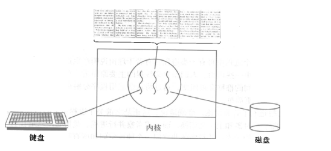

>开启一个字处理软件进程，该进程肯定需要办不止一件事情，比如监听键盘输入，处理文字，定时自动将文字保存到硬盘，这三个任务操作的都是同一块数据，因而不能用多进程。只能在一个进程里并发地开启三个线程,如果是单线程，那就只能是，键盘输入时，不能处理文字和自动保存，自动保存时又不能输入和处理文字。

### 6、经典的线程模型（了解）

>　　多个线程共享同一个进程的地址空间中的资源，是对一台计算机上多个进程的模拟，有时也称线程为轻量级的进程
>
>　　而对一台计算机上多个进程，则共享物理内存、磁盘、打印机等其他物理资源。
>
>　　多线程的运行和也多进程的运行类似，是cpu在多个线程之间的快速切换。

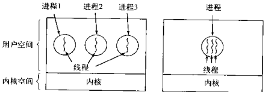

>　　不同的进程之间是充满敌意的，彼此是抢占、竞争cpu的关系，如果迅雷会和QQ抢资源。而同一个进程是由一个程序员的程序创建，所以同一进程内的线程是合作关系，一个线程可以访问另外一个线程的内存地址，大家都是共享的，一个线程干死了另外一个线程的内存，那纯属程序员脑子有问题。
>
>　　类似于进程，每个线程也有自己的堆栈

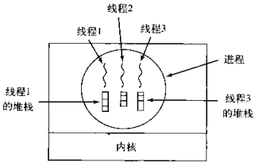

>　　不同于进程，线程库无法利用时钟中断强制线程让出CPU，可以调用thread_yield运行线程自动放弃cpu，让另外一个线程运行。
>
>　　
>
>　　线程通常是有益的，但是带来了不小程序设计难度，线程的问题是：
>
>　　1. 父进程有多个线程，那么开启的子线程是否需要同样多的线程
>
>　　　如果是，那么附近中某个线程被阻塞，那么copy到子进程后，copy版的线程也要被阻塞吗，想一想nginx的多线程模式接收用户连接。
>
>　　2. 在同一个进程中，如果一个线程关闭了问题，而另外一个线程正准备往该文件内写内容呢？
>
>​     如果一个线程注意到没有内存了，并开始分配更多的内存，在工作一半时，发生线程切换，新的线程也发现内存不够用了，又开始分配更多的内存，这样内存就被分配了多次，这些问题都是多线程编程的典型问题，需要仔细思考和设计。

### 7、POSIX线程（了解）

>为了实现可移植的线程程序,IEEE在IEEE标准1003.1c中定义了线程标准，它定义的线程包叫Pthread。大部分UNIX系统都支持该标准，简单介绍如下

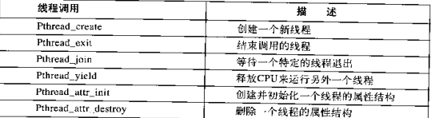

### 8、在用户空间实现的线程（了解）

>  线程的实现可以分为两类：用户级线程(User-Level Thread)和内核线线程(Kernel-Level  Thread)，后者又称为内核支持的线程或轻量级进程。在多线程操作系统中，各个系统的实现方式并不相同，在有的系统中实现了用户级线程，有的系统中实现了内核级线程。
>
>  用户级线程内核的切换由用户态程序自己控制内核切换,不需要内核干涉，少了进出内核态的消耗，但不能很好的利用多核Cpu,目前Linux pthread大体是这么做的。

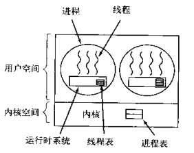

> 　在用户空间模拟操作系统对进程的调度，来调用一个进程中的线程，每个进程中都会有一个运行时系统，用来调度线程。此时当该进程获取cpu时，进程内再调度出一个线程去执行，同一时刻只有一个线程执行。

### 9、在内核空间实现的线程（了解）

>  内核级线程:切换由内核控制，当线程进行切换的时候，由用户态转化为内核态。切换完毕要从内核态返回用户态；可以很好的利用smp，即利用多核cpu。windows线程就是这样的。

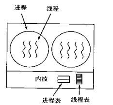

### 10、用户级与内核级线程的对比（了解）

#### 1.区别

>1. 内核支持线程是OS内核可感知的，而用户级线程是OS内核不可感知的。
>2. 用户级线程的创建、撤消和调度不需要OS内核的支持，是在语言（如Java）这一级处理的；而内核支持线程的创建、撤消和调度都需OS内核提供支持，而且与进程的创建、撤消和调度大体是相同的。
>3. 用户级线程执行系统调用指令时将导致其所属进程被中断，而内核支持线程执行系统调用指令时，只导致该线程被中断。
>4. 在只有用户级线程的系统内，CPU调度还是以进程为单位，处于运行状态的进程中的多个线程，由用户程序控制线程的轮换运行；在有内核支持线程的系统内，CPU调度则以线程为单位，由OS的线程调度程序负责线程的调度。
>5. 用户级线程的程序实体是运行在用户态下的程序，而内核支持线程的程序实体则是可以运行在任何状态下的程序。

#### 2.内核线程的优缺点

>**优点：**
>
>1. 当有多个处理机时，一个进程的多个线程可以同时执行。
>
>**缺点：**
>
>1. 由内核进行调度。

#### 3.用户进程的优缺点

>**优点：**
>
>1. 线程的调度不需要内核直接参与，控制简单。
>2. 可以在不支持线程的操作系统中实现。
>3. 创建和销毁线程、线程切换代价等线程管理的代价比内核线程少得多。
>4. 允许每个进程定制自己的调度算法，线程管理比较灵活。
>5. 线程能够利用的表空间和堆栈空间比内核级线程多。
>6. 同一进程中只能同时有一个线程在运行，如果有一个线程使用了系统调用而阻塞，那么整个进程都会被挂起。另外，页面失效也会产生同样的问题。
>
>**缺点：**
>
>1. 资源调度按照进程进行，多个处理机下，同一个进程中的线程只能在同一个处理机下分时复用

### 11、混合实现（了解）

>用户级与内核级的多路复用，内核同一调度内核线程，每个内核线程对应n个用户线程

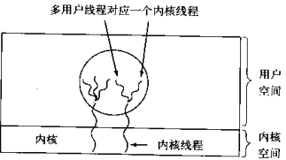

## 四、多线程-实操

### 1、threading模块介绍

>multiprocess模块的完全模仿了threading模块的接口，二者在使用层面，有很大的相似性，因而不再详细介绍
>
>[官网链接：https://docs.python.org/3/library/threading.html?highlight=threading#](https://docs.python.org/3/library/threading.html?highlight=threading#)

### 2、开启线程的两种方式

```python
import time
from threading import Thread


def sayhi(name):
    time.sleep(2)
    print('%s say hello' % name)


if __name__ == '__main__':
    t = Thread(target=sayhi, args=('xiaowu',))
    t.start()
    print('主线程')


# 结果
主线程
xiaowu say hello
```

```python
import time
from threading import Thread


class Sayhi(Thread):
    def __init__(self, name):
        super().__init__()
        self.name = name

    def run(self):
        time.sleep(2)
        print('%s say hello' % self.name)


if __name__ == '__main__':
    t = Sayhi('xiaowu')
    t.start()
    print('主线程')


# 结果
主线程
xiaowu say hello
```

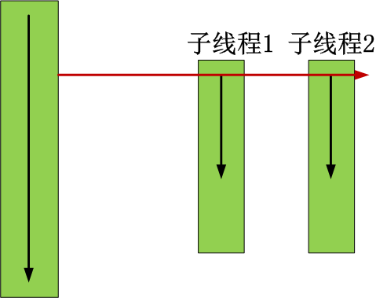

### 3、在一个进程下开启多个线程与在一个进程下开启多个子进程的区别

#### 1.谁的开启速度快

```python
from multiprocessing import Process
from threading import Thread


def work():
    print('hello')


if __name__ == '__main__':
    # 在主进程下开启线程
    t = Thread(target=work)
    t.start()
    print('主线程/主进程')
    '''
    打印结果:
    hello
    主线程/主进程
    '''

    # 在主进程下开启子进程
    t = Process(target=work)
    t.start()
    print('主线程/主进程')
    '''
    打印结果:
    主线程/主进程
    hello
    '''


# 结果
hello
主线程/主进程
主线程/主进程
hello
```

#### 2.瞅一瞅pid

```python
import os
from multiprocessing import Process
from threading import Thread


def work():
    print('hello', os.getpid())


if __name__ == '__main__':
    # part1:在主进程下开启多个线程,每个线程都跟主进程的pid一样
    t1 = Thread(target=work)
    t2 = Thread(target=work)
    t1.start()
    t2.start()
    print('主线程/主进程pid', os.getpid())

    # part2:开多个进程,每个进程都有不同的pid
    p1 = Process(target=work)
    p2 = Process(target=work)
    p1.start()
    p2.start()
    print('主线程/主进程pid', os.getpid())


# 结果
hello 222144
hello 222144
主线程/主进程pid 222144
主线程/主进程pid 222144
hello 218240
hello 221556
```

#### 3.同一进程内的线程共享该进程的数据

```python
from threading import Thread


def work():
    global n
    n = 0


if __name__ == '__main__':
    # n=100
    # p=Process(target=work)
    # p.start()
    # p.join()
    # print('主',n) #毫无疑问子进程p已经将自己的全局的n改成了0,但改的仅仅是它自己的,查看父进程的n仍然为100

    n = 1
    t = Thread(target=work)
    t.start()
    t.join()
    print('主', n)  # 查看结果为0,因为同一进程内的线程之间共享进程内的数据


# 结果
主 0
```

### 4、练习

#### 1.练习一：tcp服务

**服务端**

```python
import socket
import threading

s = socket.socket(socket.AF_INET, socket.SOCK_STREAM)
s.bind(('127.0.0.1', 8080))
s.listen(5)


def action(conn):
    while True:
        data = conn.recv(1024)
        print(data)
        conn.send(data.upper())


if __name__ == '__main__':

    while True:
        conn, addr = s.accept()

        p = threading.Thread(target=action, args=(conn,))
        p.start()

```

**客户端**

```python
import socket

s = socket.socket(socket.AF_INET, socket.SOCK_STREAM)
s.connect(('127.0.0.1', 8080))

while True:
    msg = input('>>: ').strip()
    if not msg: continue

    s.send(msg.encode('utf-8'))
    data = s.recv(1024)
    print(data)
```

#### 2.练习二：

>三个任务，一个接收用户输入，一个将用户输入的内容格式化成大写，一个将格式化后的结果存入文件

```python
from threading import Thread

msg_l = []
format_l = []


def talk():
    while True:
        msg = input('>>: ').strip()
        if not msg: continue
        msg_l.append(msg)


def format_msg():
    while True:
        if msg_l:
            res = msg_l.pop()
            format_l.append(res.upper())


def save():
    while True:
        if format_l:
            with open('db.txt', 'a', encoding='utf-8') as f:
                res = format_l.pop()
                f.write('%s\n' % res)


if __name__ == '__main__':
    t1 = Thread(target=talk)
    t2 = Thread(target=format_msg)
    t3 = Thread(target=save)
    t1.start()
    t2.start()
    t3.start()

```

### 5、线程相关的其他方法

>```python
>Thread实例对象的方法
>  # isAlive(): 返回线程是否活动的。
>  # getName(): 返回线程名。
>  # setName(): 设置线程名。
>
>threading模块提供的一些方法：
>  # threading.currentThread(): 返回当前的线程变量。
>  # threading.enumerate(): 返回一个包含正在运行的线程的list。正在运行指线程启动后、结束前，不包括启动前和终止后的线程。
>  # threading.activeCount(): 返回正在运行的线程数量，与len(threading.enumerate())有相同的结果。
>```

```python
import threading
from threading import Thread


def work():
    import time
    time.sleep(3)
    print(threading.current_thread().getName())


if __name__ == '__main__':
    # 在主进程下开启线程
    t = Thread(target=work)
    t.start()

    print(threading.current_thread().getName())
    print(threading.current_thread())  # 主线程
    print(threading.enumerate())  # 连同主线程在内有两个运行的线程
    print(threading.active_count())
    print('主线程/主进程')

'''
打印结果:
MainThread
<_MainThread(MainThread, started 140735268892672)>
[<_MainThread(MainThread, started 140735268892672)>, <Thread(Thread-1, started 123145307557888)>]
主线程/主进程
Thread-1
'''
```

#### 1.主线程等待子线程结束

```python
import time
from threading import Thread


def sayhi(name):
    time.sleep(2)
    print('%s say hello' % name)


if __name__ == '__main__':
    t = Thread(target=sayhi, args=('xiaowu',))
    t.start()
    t.join()
    print('主线程')
    print(t.is_alive())

'''
xiaowu say hello
主线程
False
'''
```

### 6、守护线程

>**无论是进程还是线程，都遵循：守护xxx会等待主xxx运行完毕后被销毁**
>
>**需要强调的是：运行完毕并非终止运行**

>#1.对主进程来说，运行完毕指的是主进程代码运行完毕
>
>#2.对主线程来说，运行完毕指的是主线程所在的进程内所有非守护线程统统运行完毕，主线程才算运行完毕

**详细解释：**

>#1 主进程在其代码结束后就已经算运行完毕了（守护进程在此时就被回收）,然后主进程会一直等非守护的子进程都运行完毕后回收子进程的资源(否则会产生僵尸进程)，才会结束，
>
>#2 主线程在其他非守护线程运行完毕后才算运行完毕（守护线程在此时就被回收）。因为主线程的结束意味着进程的结束

```py
from threading import Thread
import time


def sayhi(name):
    time.sleep(2)
    print('%s say hello' % name)


if __name__ == '__main__':
    t = Thread(target=sayhi, args=('xiaowu',))
    t.daemon = True  # 必须在t.start()之前设置
    t.start()

    print('主线程')
    print(t.is_alive())


# 结果
'''
主线程
True
'''
```

### 7、Python GIL(Global Interpreter Lock)

#### 1.介绍

>In CPython, the global interpreter lock, or GIL, is a mutex that prevents multiple native threads from executing Python bytecodes at once. This lock is necessary mainly because CPython’s memory management is not thread-safe. (However, since the GIL exists, other features have grown to depend on the guarantees that it enforces.)

>结论：在Cpython解释器中，同一个进程下开启的多线程，同一时刻只能有一个线程执行，无法利用多核优势

>首先需要明确的一点是`GIL`并不是Python的特性，它是在实现Python解析器(CPython)时所引入的一个概念。就好比C++是一套语言（语法）标准，但是可以用不同的编译器来编译成可执行代码。有名的编译器例如GCC，INTEL C++，Visual  C++等。Python也一样，同样一段代码可以通过CPython，PyPy，Psyco等不同的Python执行环境来执行。像其中的JPython就没有GIL。然而因为CPython是大部分环境下默认的Python执行环境。所以在很多人的概念里CPython就是Python，也就想当然的把`GIL`归结为Python语言的缺陷。所以这里要先明确一点：GIL并不是Python的特性，Python完全可以不依赖于GIL

#### 2.GIL介绍

>GIL本质就是一把互斥锁，既然是互斥锁，所有互斥锁的本质都一样，都是将并发运行变成串行，以此来控制同一时间内共享数据只能被一个任务所修改，进而保证数据安全。

>可以肯定的一点是：保护不同的数据的安全，就应该加不同的锁。

>要想了解GIL，首先确定一点：每次执行python程序，都会产生一个独立的进程。例如python test.py，python aaa.py，python bbb.py会产生3个不同的python进程

>在一个python的进程内，不仅有test.py的主线程或者由该主线程开启的其他线程，还有解释器开启的垃圾回收等解释器级别的线程，总之，所有线程都运行在这一个进程内，毫无疑问

>#1 所有数据都是共享的，这其中，代码作为一种数据也是被所有线程共享的（test.py的所有代码以及Cpython解释器的所有代码）
>例如：test.py定义一个函数work，在进程内所有线程都能访问到work的代码，于是我们可以开启三个线程然后target都指向该代码，能访问到意味着就是可以执行。
>
>#2 所有线程的任务，都需要将任务的代码当做参数传给解释器的代码去执行，即所有的线程要想运行自己的任务，首先需要解决的是能够访问到解释器的代码。

>综上：
>
>如果多个线程的target=work，那么执行流程是
>
>多个线程先访问到解释器的代码，即拿到执行权限，然后将target的代码交给解释器的代码去执行
>
>解释器的代码是所有线程共享的，所以垃圾回收线程也可能访问到解释器的代码而去执行，这就导致了一个问题:对于同一个数据100，可能线程1执行x=100的同时，而垃圾回收执行的是回收100的操作，解决这种问题没有什么高明的方法，就是加锁处理，如下图的GIL，保证python解释器同一时间只能执行一个任务的代码

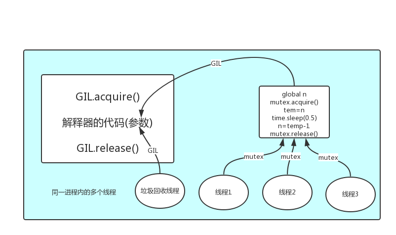

#### 3.GIL与Lock

>**GIL保护的是解释器级的数据，保护用户自己的数据则需要自己加锁处理，如下图**

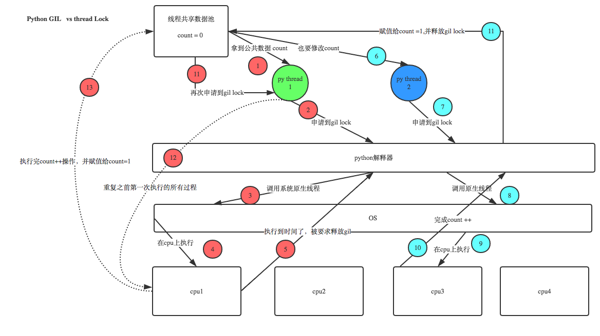

#### 4.GIL与多线程

>有了GIL的存在，同一时刻同一进程中只有一个线程被执行
>
>听到这里，有的同学立马质问：进程可以利用多核，但是开销大，而python的多线程开销小，但却无法利用多核优势，也就是说python没用了，php才是最牛逼的语言？
>
>要解决这个问题，我们需要在几个点上达成一致：
>
>>#1. cpu到底是用来做计算的，还是用来做I/O的？
>>
>>#2. 多cpu，意味着可以有多个核并行完成计算，所以多核提升的是计算性能
>>
>>#3. 每个cpu一旦遇到I/O阻塞，仍然需要等待，所以多核对I/O操作没什么用处 

>一个工人相当于cpu，此时计算相当于工人在干活，I/O阻塞相当于为工人干活提供所需原材料的过程，工人干活的过程中如果没有原材料了，则工人干活的过程需要停止，直到等待原材料的到来。
>
>如果你的工厂干的大多数任务都要有准备原材料的过程（I/O密集型），那么你有再多的工人，意义也不大，还不如一个人，在等材料的过程中让工人去干别的活，
>
>反过来讲，如果你的工厂原材料都齐全，那当然是工人越多，效率越高

>结论：
>
>　　对计算来说，cpu越多越好，但是对于I/O来说，再多的cpu也没用
>
>　　当然对运行一个程序来说，随着cpu的增多执行效率肯定会有所提高（不管提高幅度多大，总会有所提高），这是因为一个程序基本上不会是纯计算或者纯I/O，所以我们只能相对的去看一个程序到底是计算密集型还是I/O密集型，从而进一步分析python的多线程到底有无用武之地

>#分析：
>我们有四个任务需要处理，处理方式肯定是要玩出并发的效果，解决方案可以是：
>方案一：开启四个进程
>方案二：一个进程下，开启四个线程
>
>#单核情况下，分析结果: 
>　　如果四个任务是计算密集型，没有多核来并行计算，方案一徒增了创建进程的开销，方案二胜
>　　如果四个任务是I/O密集型，方案一创建进程的开销大，且进程的切换速度远不如线程，方案二胜
>
>#多核情况下，分析结果：
>　　如果四个任务是计算密集型，多核意味着并行计算，在python中一个进程中同一时刻只有一个线程执行用不上多核，方案一胜
>　　如果四个任务是I/O密集型，再多的核也解决不了I/O问题，方案二胜
>
>#结论：现在的计算机基本上都是多核，python对于计算密集型的任务开多线程的效率并不能带来多大性能上的提升，甚至不如串行(没有大量切换)，但是，对于IO密集型的任务效率还是有显著提升的。

#### 5.多线程性能测试

##### 1）计算密集型：多进程效率高

```python
from multiprocessing import Process
from threading import Thread
import os, time


def work():
    res = 0
    for i in range(100000000):
        res *= i


if __name__ == '__main__':
    print(os.cpu_count())
    print('多进程计算')
    l = []
    start = time.time()
    for i in range(12):
        p = Process(target=work)
        l.append(p)
        p.start()
    for p in l:
        p.join()
    stop = time.time()
    print('run time is %s' % (stop - start))

    print('多线程计算')
    l = []
    start = time.time()
    for i in range(12):
        t = Thread(target=work)
        l.append(t)
        t.start()
    for t in l:
        t.join()
    stop = time.time()
    print('run time is %s' % (stop - start))


'''
12
多进程计算
run time is 6.440251111984253
多线程计算
run time is 28.704187393188477
'''
```

##### 2）IO密集型：多线程效率高

```python
from multiprocessing import Process
from threading import Thread
import os, time


def work():
    time.sleep(2)


if __name__ == '__main__':
    print(os.cpu_count())
    print('多进程计算')
    l = []
    start = time.time()
    for i in range(12):
        p = Process(target=work)
        l.append(p)
        p.start()
    for p in l:
        p.join()
    stop = time.time()
    print('run time is %s' % (stop - start))

    print('多线程计算')
    l = []
    start = time.time()
    for i in range(12):
        t = Thread(target=work)
        l.append(t)
        t.start()
    for t in l:
        t.join()
    stop = time.time()
    print('run time is %s' % (stop - start))


'''
12
多进程计算
run time is 2.3074002265930176
多线程计算
run time is 2.0022919178009033
'''
```

### 8、同步锁

>三个需要注意的点：
>#1.线程抢的是GIL锁，GIL锁相当于执行权限，拿到执行权限后才能拿到互斥锁Lock，其他线程也可以抢到GIL，但如果发现Lock仍然没有被释放则阻塞，即便是拿到执行权限GIL也要立刻交出来
>
>#2.join是等待所有，即整体串行，而锁只是锁住修改共享数据的部分，即部分串行，要想保证数据安全的根本原理在于让并发变成串行，join与互斥锁都可以实现，毫无疑问，互斥锁的部分串行效率要更高
>
>#3. 一定要看本小节最后的GIL与互斥锁的经典分析

#### 1.**GIL VS Lock**

>Python已经有一个GIL来保证同一时间只能有一个线程来执行了，为什么这里还需要lock?
>
>  **首先我们需要达成共识：锁的目的是为了保护共享的数据，同一时间只能有一个线程来修改共享的数据**
>
>  **然后，我们可以得出结论：保护不同的数据就应该加不同的锁。**
>
>　**最后，问题就很明朗了，GIL 与Lock是两把锁，保护的数据不一样，前者是解释器级别的（当然保护的就是解释器级别的数据，比如垃圾回收的数据），后者是保护用户自己开发的应用程序的数据，很明显GIL不负责这件事，只能用户自定义加锁处理，即Lock**

>**过程分析：所有线程抢的是GIL锁，或者说所有线程抢的是执行权限**
>
>　　**线程1抢到GIL锁，拿到执行权限，开始执行，然后加了一把Lock，还没有执行完毕，即线程1还未释放Lock，有可能线程2抢到GIL锁，开始执行，执行过程中发现Lock还没有被线程1释放，于是线程2进入阻塞，被夺走执行权限，有可能线程1拿到GIL，然后正常执行到释放Lock。。。这就导致了串行运行的效果**
>
>　　**既然是串行，那我们执行**
>
>　　**t1.start()**
>
>　　**t1.join**
>
>　　**t2.start()**
>
>　　**t2.join()**
>
>　　**这也是串行执行啊，为何还要加Lock呢，需知join是等待t1所有的代码执行完，相当于锁住了t1的所有代码，而Lock只是锁住一部分操作共享数据的代码。**

>因为Python解释器帮你自动定期进行内存回收，你可以理解为python解释器里有一个独立的线程，每过一段时间它起wake up做一次全局轮询看看哪些内存数据是可以被清空的，此时你自己的程序 里的线程和 py解释器自己的线程是并发运行的，假设你的线程删除了一个变量，py解释器的垃圾回收线程在清空这个变量的过程中的clearing时刻，可能一个其它线程正好又重新给这个还没来及得清空的内存空间赋值了，结果就有可能新赋值的数据被删除了，为了解决类似的问题，python解释器简单粗暴的加了锁，即当一个线程运行时，其它人都不能动，这样就解决了上述的问题，  这可以说是Python早期版本的遗留问题。　

```python
from threading import Thread
import os,time
def work():
    global n
    temp=n
    time.sleep(0.1)
    n=temp-1
if __name__ == '__main__':
    n=100
    l=[]
    for i in range(100):
        p=Thread(target=work)
        l.append(p)
        p.start()
    for p in l:
        p.join()

    print(n) #结果可能为99
```

>**锁通常被用来实现对共享资源的同步访问。为每一个共享资源创建一个Lock对象，当你需要访问该资源时，调用acquire方法来获取锁对象（如果其它线程已经获得了该锁，则当前线程需等待其被释放），待资源访问完后，再调用release方法释放锁：**

```python
from threading import Thread,Lock
import os,time
def work():
    global n
    lock.acquire()
    temp=n
    time.sleep(0.1)
    n=temp-1
    lock.release()
if __name__ == '__main__':
    lock=Lock()
    n=100
    l=[]
    for i in range(100):
        p=Thread(target=work)
        l.append(p)
        p.start()
    for p in l:
        p.join()

    print(n) #结果肯定为0，由原来的并发执行变成串行，牺牲了执行效率保证了数据安全
```

#### 2.分析

>分析：
>　　#1.100个线程去抢GIL锁，即抢执行权限
>     #2. 肯定有一个线程先抢到GIL（暂且称为线程1），然后开始执行，一旦执行就会拿到lock.acquire()
>     #3. 极有可能线程1还未运行完毕，就有另外一个线程2抢到GIL，然后开始运行，但线程2发现互斥锁lock还未被线程1释放，于是阻塞，被迫交出执行权限，即释放GIL
>    #4.直到线程1重新抢到GIL，开始从上次暂停的位置继续执行，直到正常释放互斥锁lock，然后其他的线程再重复2 3 4的过程

### 9、死锁和递归锁

>进程也有死锁与递归锁，在进程那里忘记说了，放到这里一切说了额
>
>所谓死锁： 是指两个或两个以上的进程或线程在执行过程中，因争夺资源而造成的一种互相等待的现象，若无外力作用，它们都将无法推进下去。此时称系统处于死锁状态或系统产生了死锁，这些永远在互相等待的进程称为死锁进程，如下就是死锁

```python
from threading import Thread,Lock
import time
mutexA=Lock()
mutexB=Lock()

class MyThread(Thread):
    def run(self):
        self.func1()
        self.func2()
    def func1(self):
        mutexA.acquire()
        print('\033[41m%s 拿到A锁\033[0m' %self.name)

        mutexB.acquire()
        print('\033[42m%s 拿到B锁\033[0m' %self.name)
        mutexB.release()

        mutexA.release()

    def func2(self):
        mutexB.acquire()
        print('\033[43m%s 拿到B锁\033[0m' %self.name)
        time.sleep(2)

        mutexA.acquire()
        print('\033[44m%s 拿到A锁\033[0m' %self.name)
        mutexA.release()

        mutexB.release()

if __name__ == '__main__':
    for i in range(10):
        t=MyThread()
        t.start()

'''
Thread-1 拿到A锁
Thread-1 拿到B锁
Thread-1 拿到B锁
Thread-2 拿到A锁
然后就卡住，死锁了
'''
```

>解决方法，递归锁，在Python中为了支持在同一线程中多次请求同一资源，python提供了可重入锁RLock。
>
>这个RLock内部维护着一个Lock和一个counter变量，counter记录了acquire的次数，从而使得资源可以被多次require。直到一个线程所有的acquire都被release，其他的线程才能获得资源。上面的例子如果使用RLock代替Lock，则不会发生死锁：

```py
from threading import Thread, RLock
import time

mutexA = mutexB = RLock()  # 一个线程拿到锁，counter加1,该线程内又碰到加锁的情况，则counter继续加1，这期间所有其他线程都只能等待，等待该线程释放所有锁，即counter递减到0为止


class MyThread(Thread):
    def run(self):
        self.func1()
        self.func2()

    def func1(self):
        mutexA.acquire()
        print('\033[41m%s 拿到A锁\033[0m' % self.name)

        mutexB.acquire()
        print('\033[42m%s 拿到B锁\033[0m' % self.name)
        mutexB.release()

        mutexA.release()

    def func2(self):
        mutexB.acquire()
        print('\033[43m%s 拿到B锁\033[0m' % self.name)
        time.sleep(2)

        mutexA.acquire()
        print('\033[44m%s 拿到A锁\033[0m' % self.name)
        mutexA.release()

        mutexB.release()


if __name__ == '__main__':
    for i in range(10):
        t = MyThread()
        t.start()

'''
Thread-1 拿到A锁
Thread-1 拿到B锁
Thread-1 拿到B锁
Thread-1 拿到A锁
Thread-2 拿到A锁
Thread-2 拿到B锁
Thread-2 拿到B锁
Thread-2 拿到A锁
Thread-4 拿到A锁
Thread-4 拿到B锁
Thread-4 拿到B锁
Thread-4 拿到A锁
Thread-6 拿到A锁
Thread-6 拿到B锁
Thread-6 拿到B锁
Thread-6 拿到A锁
Thread-8 拿到A锁
Thread-8 拿到B锁
Thread-8 拿到B锁
Thread-8 拿到A锁
Thread-10 拿到A锁
Thread-10 拿到B锁
Thread-10 拿到B锁
Thread-10 拿到A锁
Thread-5 拿到A锁
Thread-5 拿到B锁
Thread-5 拿到B锁
Thread-5 拿到A锁
Thread-9 拿到A锁
Thread-9 拿到B锁
Thread-9 拿到B锁
Thread-9 拿到A锁
Thread-7 拿到A锁
Thread-7 拿到B锁
Thread-7 拿到B锁
Thread-7 拿到A锁
Thread-3 拿到A锁
Thread-3 拿到B锁
Thread-3 拿到B锁
Thread-3 拿到A锁
'''
```

### 10、信号量

>同进程的一样
>
>Semaphore管理一个内置的计数器，
>每当调用acquire()时内置计数器-1；
>调用release() 时内置计数器+1；
>计数器不能小于0；当计数器为0时，acquire()将阻塞线程直到其他线程调用release()。
>
>实例：(同时只有5个线程可以获得semaphore,即可以限制最大连接数为5)：

```py
from threading import Thread, Semaphore
import threading
import time


# def func():
#     if sm.acquire():
#         print (threading.currentThread().getName() + ' get semaphore')
#         time.sleep(2)
#         sm.release()
def func():
    sm.acquire()
    print('%s get sm' % threading.current_thread().name)
    time.sleep(3)
    sm.release()


if __name__ == '__main__':
    sm = Semaphore(5)
    for i in range(23):
        t = Thread(target=func)
        t.start()
```

>**与进程池是完全不同的概念，进程池Pool(4)，最大只能产生4个进程，而且从头到尾都只是这四个进程，不会产生新的，而信号量是产生一堆线程/进程**

### 11、Event

>同进程的一样
>
>线程的一个关键特性是每个线程都是独立运行且状态不可预测。如果程序中的其  他线程需要通过判断某个线程的状态来确定自己下一步的操作,这时线程同步问题就会变得非常棘手。为了解决这些问题,我们需要使用threading库中的Event对象。 对象包含一个可由线程设置的信号标志,它允许线程等待某些事件的发生。在  初始情况下,Event对象中的信号标志被设置为假。如果有线程等待一个Event对象,  而这个Event对象的标志为假,那么这个线程将会被一直阻塞直至该标志为真。一个线程如果将一个Event对象的信号标志设置为真,它将唤醒所有等待这个Event对象的线程。如果一个线程等待一个已经被设置为真的Event对象,那么它将忽略这个事件, 继续执行

>event.isSet()：返回event的状态值；
>
>event.wait()：如果 event.isSet()==False将阻塞线程；
>
>event.set()： 设置event的状态值为True，所有阻塞池的线程激活进入就绪状态， 等待操作系统调度；
>
>event.clear()：恢复event的状态值为False。

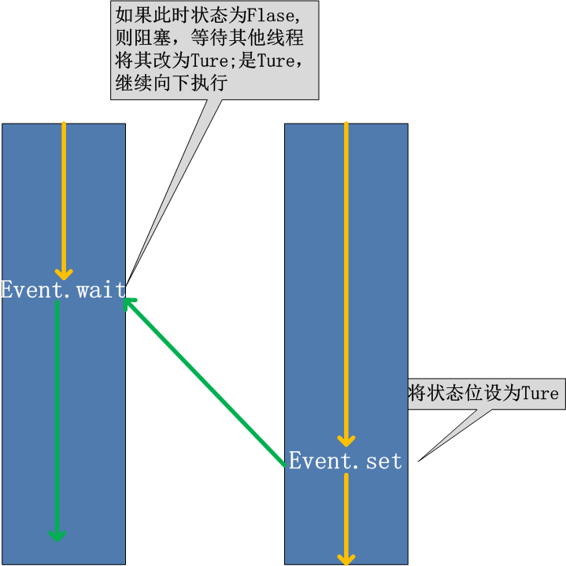

>例如，有多个工作线程尝试链接MySQL，我们想要在链接前确保MySQL服务正常才让那些工作线程去连接MySQL服务器，如果连接不成功，都会去尝试重新连接。那么我们就可以采用threading.Event机制来协调各个工作线程的连接操作

```py
from threading import Event,Thread,current_thread

e=Event()

def check_mysql():
    print('正则检测mysql',e.is_set())
    import time
    time.sleep(2)
    e.set()

def conn_mysql():
    count=0
    while count < 3:
        print('<%s>第%s次尝试链接' % (current_thread().getName(), count))
        e.wait(0.5)
        if e.is_set():
            print('<%s> 链接成功' % current_thread().getName())
            break
        count+=1
    else:
        # raise TimeoutError("链接超时")
        print("<%s> 链接超时" % current_thread().getName())

if __name__ == '__main__':
    t1=Thread(target=check_mysql)
    t2=Thread(target=conn_mysql)
    t1.start()
    t2.start()
```

```python
import time
from threading import Event,Thread,current_thread

e=Event()

def f1():
    while True:
        e.clear()
        print("红灯亮,请等待2秒")
        time.sleep(2)

        e.set()
        print('绿灯亮,持续2秒')
        time.sleep(2)


def f2():
    while True:
        if e.is_set():
            print('%s 过马路' %current_thread().getName())
        else:
            print("%s 等待" % current_thread().getName())
            e.wait()

if __name__ == '__main__':
    t1=Thread(target=f1)
    t2=Thread(target=f2)
    t1.start()
    t2.start()
```

```python
from threading import Event,Thread,current_thread
import time
import random

e = Event()  # 全局变量 = False

def task1():
    while True:
        e.clear()
        print("红灯亮")
        time.sleep(2)

        e.set()
        print('绿灯亮')
        time.sleep(3)


def task2():
    while True:
        if e.is_set():
            print('%s 走你' %current_thread().name)
            break
        else:
            print("%s 等灯" %current_thread().name)
            e.wait()

if __name__ == '__main__':
    Thread(target=task1).start()

    while True:
        time.sleep(random.randint(1,5))
        Thread(target=task2).start()
```

### 12、条件Condition

>使得线程等待，只有满足某条件时，才释放n个线程

```python
import threading


def run(n):
    con.acquire()
    con.wait()
    print("run the thread: %s" % n)
    con.release()


if __name__ == '__main__':

    con = threading.Condition()
    for i in range(10):
        t = threading.Thread(target=run, args=(i,))
        t.start()

    while True:
        inp = input('>>>')
        if inp == 'q':
            break
        con.acquire()
        con.notify(int(inp))
        con.release()
```

```python
def condition_func():

    ret = False
    inp = input('>>>')
    if inp == '1':
        ret = True

    return ret


def run(n):
    con.acquire()
    con.wait_for(condition_func)
    print("run the thread: %s" %n)
    con.release()

if __name__ == '__main__':

    con = threading.Condition()
    for i in range(10):
        t = threading.Thread(target=run, args=(i,))
        t.start()
```

### 13、定时器

>**定时器，指定n秒后执行某操作**

```python
from threading import Timer
 
 
def hello():
    print("hello, world")
 
t = Timer(1, hello)
t.start()  # after 1 seconds, "hello, world" will be printed
```

```python
from threading import Timer
import random,time

class Code:
    def __init__(self):
        self.make_cache()

    def make_cache(self,interval=5):
        self.cache=self.make_code()
        print(self.cache)
        self.t=Timer(interval,self.make_cache)
        self.t.start()

    def make_code(self,n=4):
        res=''
        for i in range(n):
            s1=str(random.randint(0,9))
            s2=chr(random.randint(65,90))
            res+=random.choice([s1,s2])
        return res

    def check(self):
        while True:
            inp=input('>>: ').strip()
            if inp.upper() ==  self.cache:
                print('验证成功',end='\n')
                self.t.cancel()
                break


if __name__ == '__main__':
    obj=Code()
    obj.check()
```

### 14、线程queue

>queue队列 ：使用import queue，用法与进程Queue一样
>
>queue is especially useful in threaded programming when information must be exchanged safely between multiple threads.

#### 1.class `queue.Queue`(maxsize=0) 先进先出

```python
import queue

q=queue.Queue()
q.put('first')
q.put('second')
q.put('third')

print(q.get())
print(q.get())
print(q.get())
'''
结果(先进先出):
first
second
third
```

#### 2.class `queue.LifoQueue`(maxsize=0) 后进先出

```python
import queue

q=queue.LifoQueue()
q.put('first')
q.put('second')
q.put('third')

print(q.get())
print(q.get())
print(q.get())
'''
结果(后进先出):
third
second
first
'''
```

#### 3.class`queue.PriorityQueue`(maxsize=0) VIP队列

```python
import queue

q=queue.PriorityQueue()
#put进入一个元组,元组的第一个元素是优先级(通常是数字,也可以是非数字之间的比较),数字越小优先级越高
q.put((20,'a'))
q.put((10,'b'))
q.put((30,'c'))

print(q.get())
print(q.get())
print(q.get())
'''
结果(数字越小优先级越高,优先级高的优先出队):
(10, 'b')
(20, 'a')
(30, 'c')
'''
```

### 15、Python标准模块--concurrent.futures

#### 1.介绍

>concurrent.futures模块提供了高度封装的异步调用接口
>ThreadPoolExecutor：线程池，提供异步调用
>ProcessPoolExecutor: 进程池，提供异步调用
>Both implement the same interface, which is defined by the abstract Executor class.

#### 2.基本方法

```python
#submit(fn, *args, **kwargs)
异步提交任务

#map(func, *iterables, timeout=None, chunksize=1) 
取代for循环submit的操作

#shutdown(wait=True) 
相当于进程池的pool.close()+pool.join()操作
wait=True，等待池内所有任务执行完毕回收完资源后才继续
wait=False，立即返回，并不会等待池内的任务执行完毕
但不管wait参数为何值，整个程序都会等到所有任务执行完毕
submit和map必须在shutdown之前

#result(timeout=None)
取得结果

#add_done_callback(fn)
回调函数
```

#### 3.ProcessPoolExecutor

```python
#介绍
The ProcessPoolExecutor class is an Executor subclass that uses a pool of processes to execute calls asynchronously. ProcessPoolExecutor uses the multiprocessing module, which allows it to side-step the Global Interpreter Lock but also means that only picklable objects can be executed and returned.

class concurrent.futures.ProcessPoolExecutor(max_workers=None, mp_context=None)
An Executor subclass that executes calls asynchronously using a pool of at most max_workers processes. If max_workers is None or not given, it will default to the number of processors on the machine. If max_workers is lower or equal to 0, then a ValueError will be raised.


#用法
from concurrent.futures import ThreadPoolExecutor,ProcessPoolExecutor

import os,time,random
def task(n):
    print('%s is runing' %os.getpid())
    time.sleep(random.randint(1,3))
    return n**2

if __name__ == '__main__':

    executor=ProcessPoolExecutor(max_workers=3)

    futures=[]
    for i in range(11):
        future=executor.submit(task,i)
        futures.append(future)
    executor.shutdown(True)
    print('+++>')
    for future in futures:
        print(future.result())
```

#### 4.ThreadPoolExecutor

```python
#介绍
ThreadPoolExecutor is an Executor subclass that uses a pool of threads to execute calls asynchronously.
class concurrent.futures.ThreadPoolExecutor(max_workers=None, thread_name_prefix='')
An Executor subclass that uses a pool of at most max_workers threads to execute calls asynchronously.

Changed in version 3.5: If max_workers is None or not given, it will default to the number of processors on the machine, multiplied by 5, assuming that ThreadPoolExecutor is often used to overlap I/O instead of CPU work and the number of workers should be higher than the number of workers for ProcessPoolExecutor.

New in version 3.6: The thread_name_prefix argument was added to allow users to control the threading.Thread names for worker threads created by the pool for easier debugging.

#用法
与ProcessPoolExecutor相同
```

#### 5.map的用法

```python
from concurrent.futures import ThreadPoolExecutor,ProcessPoolExecutor

import os,time,random
def task(n):
    print('%s is runing' %os.getpid())
    time.sleep(random.randint(1,3))
    return n**2

if __name__ == '__main__':

    executor=ThreadPoolExecutor(max_workers=3)

    # for i in range(11):
    #     future=executor.submit(task,i)

    executor.map(task,range(1,12)) #map取代了for+submit
```

#### 6.回调函数

```python
from concurrent.futures import ThreadPoolExecutor,ProcessPoolExecutor
from multiprocessing import Pool
import requests
import json
import os

def get_page(url):
    print('<进程%s> get %s' %(os.getpid(),url))
    respone=requests.get(url)
    if respone.status_code == 200:
        return {'url':url,'text':respone.text}

def parse_page(res):
    res=res.result()
    print('<进程%s> parse %s' %(os.getpid(),res['url']))
    parse_res='url:<%s> size:[%s]\n' %(res['url'],len(res['text']))
    with open('db.txt','a') as f:
        f.write(parse_res)


if __name__ == '__main__':
    urls=[
        'https://www.baidu.com',
        'https://www.python.org',
        'https://www.openstack.org',
        'https://help.github.com/',
        'http://www.sina.com.cn/'
    ]

    # p=Pool(3)
    # for url in urls:
    #     p.apply_async(get_page,args=(url,),callback=pasrse_page)
    # p.close()
    # p.join()

    p=ProcessPoolExecutor(3)
    for url in urls:
        p.submit(get_page,url).add_done_callback(parse_page) #parse_page拿到的是一个future对象obj，需要用obj.result()拿到结果
```

## 五、协程

### 1、引子

>  本节的主题是基于单线程来实现并发，即只用一个主线程（很明显可利用的cpu只有一个）情况下实现并发，为此我们需要先回顾下并发的本质：切换+保存状态
>
>  cpu正在运行一个任务，会在两种情况下切走去执行其他的任务（切换由操作系统强制控制），一种情况是该任务发生了阻塞，另外一种情况是该任务计算的时间过长或有一个优先级更高的程序替代了它

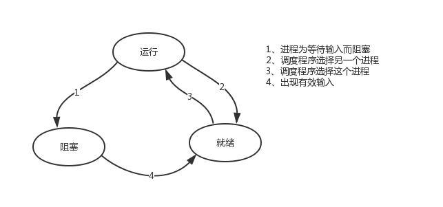

ps：在介绍进程理论时，提及进程的三种执行状态，而线程才是执行单位，所以也可以将上图理解为线程的三种状态 

>其中第二种情况并不能提升效率，只是为了让cpu能够雨露均沾，实现看起来所有任务都被“同时”执行的效果，如果多个任务都是纯计算的，这种切换反而会降低效率。为此我们可以基于yield来验证。yield本身就是一种在单线程下可以保存任务运行状态的方法，我们来简单复习一下：
>
>>#1 yiled可以保存状态，yield的状态保存与操作系统的保存线程状态很像，但是yield是代码级别控制的，更轻量级
>>#2 send可以把一个函数的结果传给另外一个函数，以此实现单线程内程序之间的切换

>1、协程：
>    单线程实现并发
>    在应用程序里控制多个任务的切换+保存状态
>    优点：
>        应用程序级别速度要远远高于操作系统的切换
>    缺点：
>        多个任务一旦有一个阻塞没有切，整个线程都阻塞在原地
>        该线程内的其他的任务都不能执行了
>
>​        一旦引入协程，就需要检测单线程下所有的IO行为,
>​        实现遇到IO就切换,少一个都不行，以为一旦一个任务阻塞了，整个线程就阻塞了，
>​        其他的任务即便是可以计算，但是也无法运行了
>
>2、协程序的目的：
>    想要在单线程下实现并发
>    并发指的是多个任务看起来是同时运行的
>    并发=切换+保存状态

```python
import time

def func1():
    for i in range(10000000):
        i+1

def func2():
    for i in range(10000000):
        i+1

start = time.time()
func1()
func2()
stop = time.time()
print(stop - start)


#基于yield并发执行
import time
def func1():
    while True:
        yield

def func2():
    g=func1()
    for i in range(10000000):
        i+1
        next(g)

start=time.time()
func2()
stop=time.time()
print(stop-start)
```

>第一种情况的切换。在任务一遇到io情况下，切到任务二去执行，这样就可以利用任务一阻塞的时间完成任务二的计算，效率的提升就在于此。

```python
import time
def func1():
    while True:
        print('func1')
        yield

def func2():
    g=func1()
    for i in range(10000000):
        i+1
        next(g)
        time.sleep(3)
        print('func2')
start=time.time()
func2()
stop=time.time()
print(stop-start)
```

>   对于单线程下，我们不可避免程序中出现io操作，但如果我们能在自己的程序中（即用户程序级别，而非操作系统级别）控制单线程下的多个任务能在一个任务遇到io阻塞时就切换到另外一个任务去计算，这样就保证了该线程能够最大限度地处于就绪态，即随时都可以被cpu执行的状态，相当于我们在用户程序级别将自己的io操作最大限度地隐藏起来，从而可以迷惑操作系统，让其看到：该线程好像是一直在计算，io比较少，从而更多的将cpu的执行权限分配给我们的线程。

>  协程的本质就是在单线程下，由用户自己控制一个任务遇到io阻塞了就切换另外一个任务去执行，以此来提升效率。为了实现它，我们需要找寻一种可以同时满足以下条件的解决方案：
>
>>#1. 可以控制多个任务之间的切换，切换之前将任务的状态保存下来，以便重新运行时，可以基于暂停的位置继续执行。
>>
>>#2. 作为1的补充：可以检测io操作，在遇到io操作的情况下才发生切换

### 2、协程介绍

>协程：是单线程下的并发，又称微线程，纤程。英文名Coroutine。一句话说明什么是线程：**协程是一种用户态的轻量级线程，即协程是由用户程序自己控制调度的。**

#### 1.强调

>#1. python的线程属于内核级别的，即由操作系统控制调度（如单线程遇到io或执行时间过长就会被迫交出cpu执行权限，切换其他线程运行）
>#2. 单线程内开启协程，一旦遇到io，就会从应用程序级别（而非操作系统）控制切换，以此来提升效率（！！！非io操作的切换与效率无关）

#### 2.优缺点

>对比操作系统控制线程的切换，用户在单线程内控制协程的切换

##### 1）优点

>#1. 协程的切换开销更小，属于程序级别的切换，操作系统完全感知不到，因而更加轻量级
>#2. 单线程内就可以实现并发的效果，最大限度地利用cpu

##### 2）缺点

>#1. 协程的本质是单线程下，无法利用多核，可以是一个程序开启多个进程，每个进程内开启多个线程，每个线程内开启协程
>#2. 协程指的是单个线程，因而一旦协程出现阻塞，将会阻塞整个线程

#### 3.特点

>1. **必须在只有一个单线程里实现并发**
>2. **修改共享数据不需加锁**
>3. **用户程序里自己保存多个控制流的上下文栈**
>4. **附加：一个协程遇到IO操作自动切换到其它协程（如何实现检测IO，yield、greenlet都无法实现，就用到了gevent模块（select机制））**

### 3、Greenlet

>如果我们在单个线程内有20个任务，要想实现在多个任务之间切换，使用yield生成器的方式过于麻烦（需要先得到初始化一次的生成器，然后再调用send。。。非常麻烦），而使用greenlet模块可以非常简单地实现这20个任务直接的切换

```bash
pip3 install greenlet
```

```python
from greenlet import greenlet

def eat(name):
    print('%s eat 1' %name)
    g2.switch('egon')
    print('%s eat 2' %name)
    g2.switch()
def play(name):
    print('%s play 1' %name)
    g1.switch()
    print('%s play 2' %name)

g1=greenlet(eat)
g2=greenlet(play)

g1.switch('egon')#可以在第一次switch时传入参数，以后都不需要
```

>单纯的切换（在没有io的情况下或者没有重复开辟内存空间的操作），反而会降低程序的执行速度

```python
#顺序执行
import time
def f1():
    res=1
    for i in range(100000000):
        res+=i

def f2():
    res=1
    for i in range(100000000):
        res*=i

start=time.time()
f1()
f2()
stop=time.time()
print('run time is %s' %(stop-start)) #10.985628366470337

#切换
from greenlet import greenlet
import time
def f1():
    res=1
    for i in range(100000000):
        res+=i
        g2.switch()

def f2():
    res=1
    for i in range(100000000):
        res*=i
        g1.switch()

start=time.time()
g1=greenlet(f1)
g2=greenlet(f2)
g1.switch()
stop=time.time()
print('run time is %s' %(stop-start)) # 52.763017892837524
```

>greenlet只是提供了一种比generator更加便捷的切换方式，当切到一个任务执行时如果遇到io，那就原地阻塞，仍然是没有解决遇到IO自动切换来提升效率的问题。
>
>单线程里的这20个任务的代码通常会既有计算操作又有阻塞操作，我们完全可以在执行任务1时遇到阻塞，就利用阻塞的时间去执行任务2。。。。如此，才能提高效率，这就用到了Gevent模块。

### 4、Gevent介绍

```bash
pip3 install gevent
```

>Gevent 是一个第三方库，可以轻松通过gevent实现并发同步或异步编程，在gevent中用到的主要模式是**Greenlet**, 它是以C扩展模块形式接入Python的轻量级协程。 Greenlet全部运行在主程序操作系统进程的内部，但它们被协作式地调度。

```python
#用法
g1=gevent.spawn(func,1,,2,3,x=4,y=5)创建一个协程对象g1，spawn括号内第一个参数是函数名，如eat，后面可以有多个参数，可以是位置实参或关键字实参，都是传给函数eat的

g2=gevent.spawn(func2)

g1.join() #等待g1结束

g2.join() #等待g2结束

#或者上述两步合作一步：gevent.joinall([g1,g2])

g1.value#拿到func1的返回值
```

>**遇到IO阻塞时会自动切换任务**

```python
import gevent
def eat(name):
    print('%s eat 1' %name)
    gevent.sleep(2)
    print('%s eat 2' %name)

def play(name):
    print('%s play 1' %name)
    gevent.sleep(1)
    print('%s play 2' %name)


g1=gevent.spawn(eat,'xiaowu')
g2=gevent.spawn(play,name='xiaowu')
g1.join()
g2.join()
#或者gevent.joinall([g1,g2])
print('主')
```

### 5、猴子补丁

>**上例gevent.sleep(2)模拟的是gevent可以识别的io阻塞,**
>
>**而time.sleep(2)或其他的阻塞,gevent是不能直接识别的需要用下面一行代码,打补丁,就可以识别了**
>
>**from gevent import monkey;monkey.patch_all()必须放到被打补丁者的前面，如time，socket模块之前**
>
>**或者我们干脆记忆成：要用gevent，需要将from gevent import monkey;monkey.patch_all()放到文件的开头**

```python
from gevent import monkey;monkey.patch_all()

import gevent
import time
def eat():
    print('eat food 1')
    time.sleep(2)
    print('eat food 2')

def play():
    print('play 1')
    time.sleep(1)
    print('play 2')

g1=gevent.spawn(eat)
g2=gevent.spawn(play_phone)
gevent.joinall([g1,g2])
print('主')
```

>我们可以用threading.current_thread().getName()来查看每个g1和g2，查看的结果为DummyThread-n，即假线程

### 6、Gevent之同步与异步

```python
from gevent import spawn,joinall,monkey;monkey.patch_all()

import time
def task(pid):
    """
    Some non-deterministic task
    """
    time.sleep(0.5)
    print('Task %s done' % pid)


def synchronous():
    for i in range(10):
        task(i)

def asynchronous():
    g_l=[spawn(task,i) for i in range(10)]
    joinall(g_l)

if __name__ == '__main__':
    print('Synchronous:')
    synchronous()

    print('Asynchronous:')
    asynchronous()
#上面程序的重要部分是将task函数封装到Greenlet内部线程的gevent.spawn。 初始化的greenlet列表存放在数组threads中，此数组被传给gevent.joinall 函数，后者阻塞当前流程，并执行所有给定的greenlet。执行流程只会在 所有greenlet执行完后才会继续向下走。
```

### 7、应用举例

```python
from gevent import monkey;monkey.patch_all()
import gevent
import requests
import time

def get_page(url):
    print('GET: %s' %url)
    response=requests.get(url)
    if response.status_code == 200:
        print('%d bytes received from %s' %(len(response.text),url))


start_time=time.time()
gevent.joinall([
    gevent.spawn(get_page,'https://www.python.org/'),
    gevent.spawn(get_page,'https://www.yahoo.com/'),
    gevent.spawn(get_page,'https://github.com/'),
])
stop_time=time.time()
print('run time is %s' %(stop_time-start_time))
```

>通过gevent实现单线程下的socket并发（from gevent import monkey;monkey.patch_all()一定要放到导入socket模块之前，否则gevent无法识别socket的阻塞）

**服务端**

```python
from gevent import monkey;monkey.patch_all()
from socket import *
import gevent

#如果不想用money.patch_all()打补丁,可以用gevent自带的socket
# from gevent import socket
# s=socket.socket()

def server(server_ip,port):
    s=socket(AF_INET,SOCK_STREAM)
    s.setsockopt(SOL_SOCKET,SO_REUSEADDR,1)
    s.bind((server_ip,port))
    s.listen(5)
    while True:
        conn,addr=s.accept()
        gevent.spawn(talk,conn,addr)

def talk(conn,addr):
    try:
        while True:
            res=conn.recv(1024)
            print('client %s:%s msg: %s' %(addr[0],addr[1],res))
            conn.send(res.upper())
    except Exception as e:
        print(e)
    finally:
        conn.close()

if __name__ == '__main__':
    server('127.0.0.1',8080)
```

**客户端**

```python
from socket import *

client=socket(AF_INET,SOCK_STREAM)
client.connect(('127.0.0.1',8080))


while True:
    msg=input('>>: ').strip()
    if not msg:continue

    client.send(msg.encode('utf-8'))
    msg=client.recv(1024)
    print(msg.decode('utf-8'))
```

**多线程并发客户端**

```python
from threading import Thread
from socket import *
import threading

def client(server_ip,port):
    c=socket(AF_INET,SOCK_STREAM) #套接字对象一定要加到函数内，即局部名称空间内，放在函数外则被所有线程共享，则大家公用一个套接字对象，那么客户端端口永远一样了
    c.connect((server_ip,port))

    count=0
    while True:
        c.send(('%s say hello %s' %(threading.current_thread().getName(),count)).encode('utf-8'))
        msg=c.recv(1024)
        print(msg.decode('utf-8'))
        count+=1
if __name__ == '__main__':
    for i in range(500):
        t=Thread(target=client,args=('127.0.0.1',8080))
        t.start()
```

## 六、IO模型

### 1、介绍

#### 1.同步、异步、阻塞、非阻塞

> 同步（synchronous）  IO和异步（asynchronous） IO，阻塞（blocking）  IO和非阻塞（non-blocking）IO分别是什么，到底有什么区别？这个问题其实不同的人给出的答案都可能不同，比如wiki，就认为asynchronous IO和non-blocking  IO是一个东西。这其实是因为不同的人的知识背景不同，并且在讨论这个问题的时候上下文(context)也不相同。所以，为了更好的回答这个问题，我先限定一下本文的上下文。

#### 2.分类

> 本文讨论的背景是Linux环境下的network  IO。本文最重要的参考文献是Richard Stevens的“UNIX® Network Programming Volume 1, Third Edition: The Sockets Networking ”，6.2节“I/O Models  ”，Stevens在这节中详细说明了各种IO的特点和区别，如果英文够好的话，推荐直接阅读。Stevens的文风是有名的深入浅出，所以不用担心看不懂。本文中的流程图也是截取自参考文献。
>
>  Stevens在文章中一共比较了五种IO Model：
>  \* blocking IO
>  \* nonblocking IO
>  \* IO multiplexing
>  \* signal driven IO
>  \* asynchronous IO
>  由signal driven IO（信号驱动IO）在实际中并不常用，所以主要介绍其余四种IO Model。

>再说一下IO发生时涉及的对象和步骤。对于一个network IO  (这里我们以read举例)，它会涉及到两个系统对象，一个是调用这个IO的process (or  thread)，另一个就是系统内核(kernel)。当一个read操作发生时，该操作会经历两个阶段：
>
>>#1）等待数据准备 (Waiting for the data to be ready)
>>#2）将数据从内核拷贝到进程中(Copying the data from the kernel to the process)
>
> 记住这两点很重要，因为这些IO模型的区别就是在两个阶段上各有不同的情况。
>
>>#1、输入操作：read、readv、recv、recvfrom、recvmsg共5个函数，如果会阻塞状态，则会经理wait data和copy data两个阶段，如果设置为非阻塞则在wait 不到data时抛出异常
>>
>>#2、输出操作：write、writev、send、sendto、sendmsg共5个函数，在发送缓冲区满了会阻塞在原地，如果设置为非阻塞，则会抛出异常
>>
>>#3、接收外来链接：accept，与输入操作类似
>>
>>#4、发起外出链接：connect，与输出操作类似

### 2、阻塞IO（blocking IO）

>  在linux中，默认情况下所有的socket都是blocking，一个典型的读操作流程大概是这样：

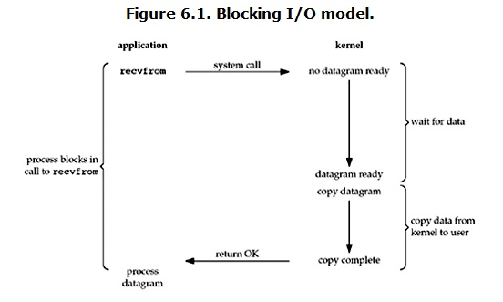

> 当用户进程调用了recvfrom这个系统调用，kernel就开始了IO的第一个阶段：准备数据。对于network io来说，很多时候数据在一开始还没有到达（比如，还没有收到一个完整的UDP包），这个时候kernel就要等待足够的数据到来。
>
> 而在用户进程这边，整个进程会被阻塞。当kernel一直等到数据准备好了，它就会将数据从kernel中拷贝到用户内存，然后kernel返回结果，用户进程才解除block的状态，重新运行起来。
>  **所以，blocking IO的特点就是在IO执行的两个阶段（等待数据和拷贝数据两个阶段）都被block了。**
>
>  几乎所有的程序员第一次接触到的网络编程都是从listen()、send()、recv() 等接口开始的，使用这些接口可以很方便的构建服务器/客户机的模型。然而大部分的socket接口都是阻塞型的。如下图
>
>  ps：所谓阻塞型接口是指系统调用（一般是IO接口）不返回调用结果并让当前线程一直阻塞，只有当该系统调用获得结果或者超时出错时才返回。

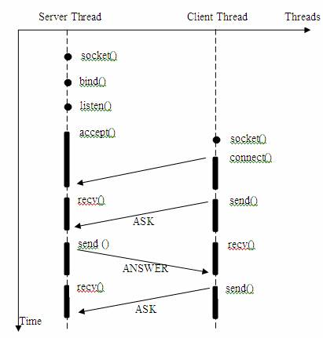

>实际上，除非特别指定，几乎所有的IO接口 ( 包括socket接口 ) 都是阻塞型的。这给网络编程带来了一个很大的问题，如在调用recv(1024)的同时，线程将被阻塞，在此期间，线程将无法执行任何运算或响应任何的网络请求。

  一个简单的解决方案：

> 在服务器端使用多线程（或多进程）。多线程（或多进程）的目的是让每个连接都拥有独立的线程（或进程），这样任何一个连接的阻塞都不会影响其他的连接。

  该方案的问题是：

> 开启多进程或都线程的方式，在遇到要同时响应成百上千路的连接请求，则无论多线程还是多进程都会严重占据系统资源，降低系统对外界响应效率，而且线程与进程本身也更容易进入假死状态。

  改进方案：   

> 很多程序员可能会考虑使用“线程池”或“连接池”。“线程池”旨在减少创建和销毁线程的频率，其维持一定合理数量的线程，并让空闲的线程重新承担新的执行任务。“连接池”维持连接的缓存池，尽量重用已有的连接、减少创建和关闭连接的频率。这两种技术都可以很好的降低系统开销，都被广泛应用很多大型系统，如websphere、tomcat和各种数据库等。

  改进后方案其实也存在着问题：

> “线程池”和“连接池”技术也只是在一定程度上缓解了频繁调用IO接口带来的资源占用。而且，所谓“池”始终有其上限，当请求大大超过上限时，“池”构成的系统对外界的响应并不比没有池的时候效果好多少。所以使用“池”必须考虑其面临的响应规模，并根据响应规模调整“池”的大小。

   **对应上例中的所面临的可能同时出现的上千甚至上万次的客户端请求，“线程池”或“连接池”或许可以缓解部分压力，但是不能解决所有问题。总之，多线程模型可以方便高效的解决小规模的服务请求，但面对大规模的服务请求，多线程模型也会遇到瓶颈，可以用非阻塞接口来尝试解决这个问题。**

### 3、非阻塞IO(non-blocking IO)

>Linux下，可以通过设置socket使其变为non-blocking。当对一个non-blocking socket执行读操作时，流程是这个样子：

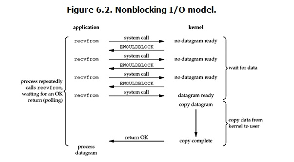

>   从图中可以看出，当用户进程发出read操作时，如果kernel中的数据还没有准备好，那么它并不会block用户进程，而是立刻返回一个error。从用户进程角度讲  ，它发起一个read操作后，并不需要等待，而是马上就得到了一个结果。用户进程判断结果是一个error时，它就知道数据还没有准备好，于是用户就可以在本次到下次再发起read询问的时间间隔内做其他事情，或者直接再次发送read操作。一旦kernel中的数据准备好了，并且又再次收到了用户进程的system call，那么它马上就将数据拷贝到了用户内存（这一阶段仍然是阻塞的），然后返回。
>
>   也就是说非阻塞的recvform系统调用调用之后，进程并没有被阻塞，内核马上返回给进程，如果数据还没准备好，此时会返回一个error。进程在返回之后，可以干点别的事情，然后再发起recvform系统调用。重复上面的过程，循环往复的进行recvform系统调用。这个过程通常被称之为轮询。轮询检查内核数据，直到数据准备好，再拷贝数据到进程，进行数据处理。需要注意，拷贝数据整个过程，进程仍然是属于阻塞的状态。
>
>  **所以，在非阻塞式IO中，用户进程其实是需要不断的主动询问kernel数据准备好了没有。**

**服务端**

```python
import socket
import time

server=socket.socket()
server.setsockopt(socket.SOL_SOCKET,socket.SO_REUSEADDR,1)
server.bind(('127.0.0.1',8083))
server.listen(5)

server.setblocking(False)
r_list=[]
w_list={}

while 1:
    try:
        conn,addr=server.accept()
        r_list.append(conn)
    except BlockingIOError:
        # 强调强调强调：！！！非阻塞IO的精髓在于完全没有阻塞！！！
        # time.sleep(0.5) # 打开该行注释纯属为了方便查看效果
        print('在做其他的事情')
        print('rlist: ',len(r_list))
        print('wlist: ',len(w_list))


        # 遍历读列表，依次取出套接字读取内容
        del_rlist=[]
        for conn in r_list:
            try:
                data=conn.recv(1024)
                if not data:
                    conn.close()
                    del_rlist.append(conn)
                    continue
                w_list[conn]=data.upper()
            except BlockingIOError: # 没有收成功，则继续检索下一个套接字的接收
                continue
            except ConnectionResetError: # 当前套接字出异常，则关闭，然后加入删除列表，等待被清除
                conn.close()
                del_rlist.append(conn)


        # 遍历写列表，依次取出套接字发送内容
        del_wlist=[]
        for conn,data in w_list.items():
            try:
                conn.send(data)
                del_wlist.append(conn)
            except BlockingIOError:
                continue


        # 清理无用的套接字,无需再监听它们的IO操作
        for conn in del_rlist:
            r_list.remove(conn)

        for conn in del_wlist:
            w_list.pop(conn)
```

**客户端**

```python
import socket
import os

client=socket.socket()
client.connect(('127.0.0.1',8083))

while 1:
    res=('%s hello' %os.getpid()).encode('utf-8')
    client.send(res)
    data=client.recv(1024)

    print(data.decode('utf-8'))
```

 **但是非阻塞IO模型绝不被推荐。**

  我们不能否则其优点：能够在等待任务完成的时间里干其他活了（包括提交其他任务，也就是 “后台” 可以有多个任务在“”同时“”执行）。

  但是也难掩其缺点：

>循环调用recv()将大幅度推高CPU占用率；这也是我们在代码中留一句time.sleep(2)的原因,否则在低配主机下极容易出现卡机情况
>任务完成的响应延迟增大了，因为每过一段时间才去轮询一次read操作，而任务可能在两次轮询之间的任意时间完成。这会导致整体数据吞吐量的降低。

  **此外，在这个方案中recv()更多的是起到检测“操作是否完成”的作用，实际操作系统提供了更为高效的检测“操作是否完成“作用的接口，例如select()多路复用模式，可以一次检测多个连接是否活跃。**

### 4、多路复用IO(IO multiplexing)

>  IO multiplexing这个词可能有点陌生，但是如果我说select/epoll，大概就都能明白了。有些地方也称这种IO方式为**事件驱动IO**(event driven  IO)。我们都知道，select/epoll的好处就在于单个process就可以同时处理多个网络连接的IO。它的基本原理就是select/epoll这个function会不断的轮询所负责的所有socket，当某个socket有数据到达了，就通知用户进程。它的流程如图：

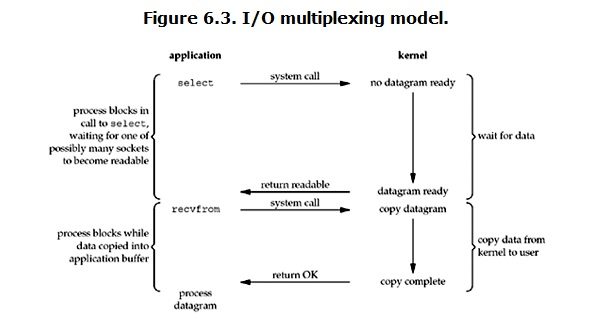

>   当用户进程调用了select，那么整个进程会被block，而同时，kernel会“监视”所有select负责的socket，当任何一个socket中的数据准备好了，select就会返回。这个时候用户进程再调用read操作，将数据从kernel拷贝到用户进程。
>   这个图和blocking  IO的图其实并没有太大的不同，事实上还更差一些。因为这里需要使用两个系统调用(select和recvfrom)，而blocking  IO只调用了一个系统调用(recvfrom)。但是，用select的优势在于它可以同时处理多个connection。

>  **强调：**
>
>  **1.  如果处理的连接数不是很高的话，使用select/epoll的web server不一定比使用multi-threading + blocking IO的web server性能更好，可能延迟还更大。select/epoll的优势并不是对于单个连接能处理得更快，而是在于能处理更多的连接。**
>
>   **2. 在多路复用模型中，对于每一个socket，一般都设置成为non-blocking，但是，如上图所示，整个用户的process其实是一直被block的。只不过process是被select这个函数block，而不是被socket IO给block。**
>
>  **结论: select的优势在于可以处理多个连接，不适用于单个连接** 

**服务端**

```python
from socket import *
import select
server = socket(AF_INET, SOCK_STREAM)
server.bind(('127.0.0.1',8093))
server.listen(5)
server.setblocking(False)
print('starting...')

rlist=[server,]
wlist=[]
wdata={}

while True:
    rl,wl,xl=select.select(rlist,wlist,[],0.5)
    print(wl)
    for sock in rl:
        if sock == server:
            conn,addr=sock.accept()
            rlist.append(conn)
        else:
            try:
                data=sock.recv(1024)
                if not data:
                    sock.close()
                    rlist.remove(sock)
                    continue
                wlist.append(sock)
                wdata[sock]=data.upper()
            except Exception:
                sock.close()
                rlist.remove(sock)

    for sock in wl:
        sock.send(wdata[sock])
        wlist.remove(sock)
        wdata.pop(sock)
```

**客户端**

```python
from socket import *

client=socket(AF_INET,SOCK_STREAM)
client.connect(('127.0.0.1',8093))


while True:
    msg=input('>>: ').strip()
    if not msg:continue
    client.send(msg.encode('utf-8'))
    data=client.recv(1024)
    print(data.decode('utf-8'))

client.close()
```

  **select监听fd变化的过程分析：**

>用户进程创建socket对象，拷贝监听的fd到内核空间，每一个fd会对应一张系统文件表，内核空间的fd响应到数据后，就会发送信号给用户进程数据已到；
>用户进程再发送系统调用，比如（accept）将内核空间的数据copy到用户空间，同时作为接受数据端内核空间的数据清除，这样重新监听时fd再有新的数据又可以响应到了（发送端因为基于TCP协议所以需要收到应答后才会清除）。

  **该模型的优点：**

>相比其他模型，使用select() 的事件驱动模型只用单线程（进程）执行，占用资源少，不消耗太多 CPU，同时能够为多客户端提供服务。如果试图建立一个简单的事件驱动的服务器程序，这个模型有一定的参考价值。

  **该模型的缺点：**

>首先select()接口并不是实现“事件驱动”的最好选择。因为当需要探测的句柄值较大时，select()接口本身需要消耗大量时间去轮询各个句柄。很多操作系统提供了更为高效的接口，如linux提供了epoll，BSD提供了kqueue，Solaris提供了/dev/poll，…。如果需要实现更高效的服务器程序，类似epoll这样的接口更被推荐。遗憾的是不同的操作系统特供的epoll接口有很大差异，所以使用类似于epoll的接口实现具有较好跨平台能力的服务器会比较困难。
>其次，该模型将事件探测和事件响应夹杂在一起，一旦事件响应的执行体庞大，则对整个模型是灾难性的。

### 5、异步IO(Asynchronous I/O)

> Linux下的asynchronous IO其实用得不多，从内核2.6版本才开始引入。先看一下它的流程：

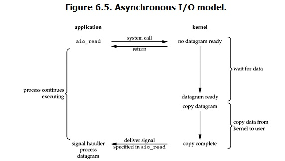

>  用户进程发起read操作之后，立刻就可以开始去做其它的事。而另一方面，从kernel的角度，当它受到一个asynchronous  read之后，首先它会立刻返回，所以不会对用户进程产生任何block。然后，kernel会等待数据准备完成，然后将数据拷贝到用户内存，当这一切都完成之后，kernel会给用户进程发送一个signal，告诉它read操作完成了。

### 6、IO模型比较分析

>  到目前为止，已经将四个IO Model都介绍完了。现在回过头来回答最初的那几个问题：blocking和non-blocking的区别在哪，synchronous IO和asynchronous IO的区别在哪。
>   先回答最简单的这个：blocking vs non-blocking。前面的介绍中其实已经很明确的说明了这两者的区别。调用blocking IO会一直block住对应的进程直到操作完成，而non-blocking IO在kernel还准备数据的情况下会立刻返回。
>
>  再说明synchronous IO和asynchronous IO的区别之前，需要先给出两者的定义。Stevens给出的定义（其实是POSIX的定义）是这样子的：
>  A synchronous I/O operation causes the requesting process to be blocked until that I/O operationcompletes;
>  An asynchronous I/O operation does not cause the requesting process to be blocked; 
>   两者的区别就在于synchronous IO做”IO  operation”的时候会将process阻塞。按照这个定义，四个IO模型可以分为两大类，之前所述的blocking  IO，non-blocking IO，IO multiplexing都属于synchronous IO这一类，而 asynchronous  I/O后一类 。
>
>  有人可能会说，non-blocking IO并没有被block啊。这里有个非常“狡猾”的地方，定义中所指的”IO  operation”是指真实的IO操作，就是例子中的recvfrom这个system call。non-blocking  IO在执行recvfrom这个system  call的时候，如果kernel的数据没有准备好，这时候不会block进程。但是，当kernel中数据准备好的时候，recvfrom会将数据从kernel拷贝到用户内存中，这个时候进程是被block了，在这段时间内，进程是被block的。而asynchronous IO则不一样，当进程发起IO  操作之后，就直接返回再也不理睬了，直到kernel发送一个信号，告诉进程说IO完成。在这整个过程中，进程完全没有被block。

>各个IO Model的比较如图所示：

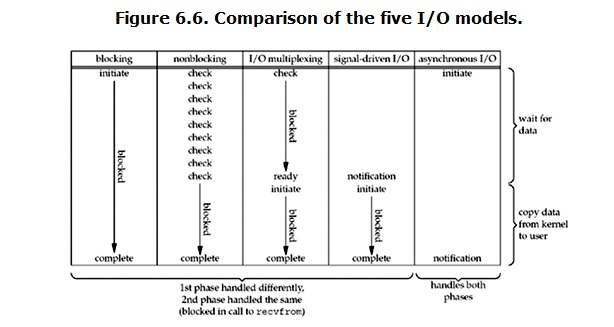

>  经过上面的介绍，会发现non-blocking IO和asynchronous IO的区别还是很明显的。在non-blocking  IO中，虽然进程大部分时间都不会被block，但是它仍然要求进程去主动的check，并且当数据准备完成以后，也需要进程主动的再次调用recvfrom来将数据拷贝到用户内存。而asynchronous  IO则完全不同。它就像是用户进程将整个IO操作交给了他人（kernel）完成，然后他人做完后发信号通知。在此期间，用户进程不需要去检查IO操作的状态，也不需要主动的去拷贝数据。

### 7、selectors模块

>IO复用：为了解释这个名词，首先来理解下复用这个概念，复用也就是共用的意思，这样理解还是有些抽象，为此，咱们来理解下复用在通信领域的使用，在通信领域中为了充分利用网络连接的物理介质，往往在同一条网络链路上采用时分复用或频分复用的技术使其在同一链路上传输多路信号，到这里我们就基本上理解了复用的含义，即公用某个“介质”来尽可能多的做同一类(性质)的事，那IO复用的“介质”是什么呢？为此我们首先来看看服务器编程的模型，客户端发来的请求服务端会产生一个进程来对其进行服务，每当来一个客户请求就产生一个进程来服务，然而进程不可能无限制的产生，因此为了解决大量客户端访问的问题，引入了IO复用技术，即：一个进程可以同时对多个客户请求进行服务。也就是说IO复用的“介质”是进程(准确的说复用的是select和poll，因为进程也是靠调用select和poll来实现的)，复用一个进程(select和poll)来对多个IO进行服务，虽然客户端发来的IO是并发的但是IO所需的读写数据多数情况下是没有准备好的，因此就可以利用一个函数(select和poll)来监听IO所需的这些数据的状态，一旦IO有数据可以进行读写了，进程就来对这样的IO进行服务。
>
>  
>
>理解完IO复用后，我们在来看下实现IO复用中的三个API(select、poll和epoll)的区别和联系
>
>select，poll，epoll都是IO多路复用的机制，I/O多路复用就是通过一种机制，可以监视多个描述符，一旦某个描述符就绪（一般是读就绪或者写就绪），能够通知应用程序进行相应的读写操作。但select，poll，epoll本质上都是同步I/O，因为他们都需要在读写事件就绪后自己负责进行读写，也就是说这个读写过程是阻塞的，而异步I/O则无需自己负责进行读写，异步I/O的实现会负责把数据从内核拷贝到用户空间。三者的原型如下所示：
>
>int select(int nfds, fd_set *readfds, fd_set *writefds, fd_set *exceptfds, struct timeval *timeout);
>
>int poll(struct pollfd *fds, nfds_t nfds, int timeout);
>
>int epoll_wait(int epfd, struct epoll_event *events, int maxevents, int timeout);
>
>
>
> 1.select的第一个参数nfds为fdset集合中最大描述符值加1，fdset是一个位数组，其大小限制为__FD_SETSIZE（1024），位数组的每一位代表其对应的描述符是否需要被检查。第二三四参数表示需要关注读、写、错误事件的文件描述符位数组，这些参数既是输入参数也是输出参数，可能会被内核修改用于标示哪些描述符上发生了关注的事件，所以每次调用select前都需要重新初始化fdset。timeout参数为超时时间，该结构会被内核修改，其值为超时剩余的时间。
>
> select的调用步骤如下：
>
>（1）使用copy_from_user从用户空间拷贝fdset到内核空间
>
>（2）注册回调函数__pollwait
>
>（3）遍历所有fd，调用其对应的poll方法（对于socket，这个poll方法是sock_poll，sock_poll根据情况会调用到tcp_poll,udp_poll或者datagram_poll）
>
>（4）以tcp_poll为例，其核心实现就是__pollwait，也就是上面注册的回调函数。
>
>（5）__pollwait的主要工作就是把current（当前进程）挂到设备的等待队列中，不同的设备有不同的等待队列，对于tcp_poll 来说，其等待队列是sk->sk_sleep（注意把进程挂到等待队列中并不代表进程已经睡眠了）。在设备收到一条消息（网络设备）或填写完文件数 据（磁盘设备）后，会唤醒设备等待队列上睡眠的进程，这时current便被唤醒了。
>
>（6）poll方法返回时会返回一个描述读写操作是否就绪的mask掩码，根据这个mask掩码给fd_set赋值。
>
>（7）如果遍历完所有的fd，还没有返回一个可读写的mask掩码，则会调用schedule_timeout是调用select的进程（也就是 current）进入睡眠。当设备驱动发生自身资源可读写后，会唤醒其等待队列上睡眠的进程。如果超过一定的超时时间（schedule_timeout 指定），还是没人唤醒，则调用select的进程会重新被唤醒获得CPU，进而重新遍历fd，判断有没有就绪的fd。
>
>（8）把fd_set从内核空间拷贝到用户空间。
>
>总结下select的几大缺点：
>
>（1）每次调用select，都需要把fd集合从用户态拷贝到内核态，这个开销在fd很多时会很大
>
>（2）同时每次调用select都需要在内核遍历传递进来的所有fd，这个开销在fd很多时也很大
>
>（3）select支持的文件描述符数量太小了，默认是1024
>
> 
>
>2．  poll与select不同，通过一个pollfd数组向内核传递需要关注的事件，故没有描述符个数的限制，pollfd中的events字段和revents分别用于标示关注的事件和发生的事件，故pollfd数组只需要被初始化一次。
>
> poll的实现机制与select类似，其对应内核中的sys_poll，只不过poll向内核传递pollfd数组，然后对pollfd中的每个描述符进行poll，相比处理fdset来说，poll效率更高。poll返回后，需要对pollfd中的每个元素检查其revents值，来得指事件是否发生。
>
> 
>
>3．直到Linux2.6才出现了由内核直接支持的实现方法，那就是epoll，被公认为Linux2.6下性能最好的多路I/O就绪通知方法。epoll可以同时支持水平触发和边缘触发（Edge Triggered，只告诉进程哪些文件描述符刚刚变为就绪状态，它只说一遍，如果我们没有采取行动，那么它将不会再次告知，这种方式称为边缘触发），理论上边缘触发的性能要更高一些，但是代码实现相当复杂。epoll同样只告知那些就绪的文件描述符，而且当我们调用epoll_wait()获得就绪文件描述符时，返回的不是实际的描述符，而是一个代表就绪描述符数量的值，你只需要去epoll指定的一个数组中依次取得相应数量的文件描述符即可，这里也使用了内存映射（mmap）技术，这样便彻底省掉了这些文件描述符在系统调用时复制的开销。另一个本质的改进在于epoll采用基于事件的就绪通知方式。在select/poll中，进程只有在调用一定的方法后，内核才对所有监视的文件描述符进行扫描，而epoll事先通过epoll_ctl()来注册一个文件描述符，一旦基于某个文件描述符就绪时，内核会采用类似callback的回调机制，迅速激活这个文件描述符，当进程调用epoll_wait()时便得到通知。
>
> 
>
>epoll既然是对select和poll的改进，就应该能避免上述的三个缺点。那epoll都是怎么解决的呢？在此之前，我们先看一下epoll 和select和poll的调用接口上的不同，select和poll都只提供了一个函数——select或者poll函数。而epoll提供了三个函 数，epoll_create,epoll_ctl和epoll_wait，epoll_create是创建一个epoll句柄；epoll_ctl是注 册要监听的事件类型；epoll_wait则是等待事件的产生。
>
>　　对于第一个缺点，epoll的解决方案在epoll_ctl函数中。每次注册新的事件到epoll句柄中时（在epoll_ctl中指定 EPOLL_CTL_ADD），会把所有的fd拷贝进内核，而不是在epoll_wait的时候重复拷贝。epoll保证了每个fd在整个过程中只会拷贝 一次。
>
>　　对于第二个缺点，epoll的解决方案不像select或poll一样每次都把current轮流加入fd对应的设备等待队列中，而只在 epoll_ctl时把current挂一遍（这一遍必不可少）并为每个fd指定一个回调函数，当设备就绪，唤醒等待队列上的等待者时，就会调用这个回调 函数，而这个回调函数会把就绪的fd加入一个就绪链表）。epoll_wait的工作实际上就是在这个就绪链表中查看有没有就绪的fd（利用 schedule_timeout()实现睡一会，判断一会的效果，和select实现中的第7步是类似的）。
>
>　　对于第三个缺点，epoll没有这个限制，它所支持的FD上限是最大可以打开文件的数目，这个数字一般远大于2048,举个例子, 在1GB内存的机器上大约是10万左右，具体数目可以cat /proc/sys/fs/file-max察看,一般来说这个数目和系统内存关系很大。
>
>总结：
>
>（1）select，poll实现需要自己不断轮询所有fd集合，直到设备就绪，期间可能要睡眠和唤醒多次交替。而epoll其实也需要调用 epoll_wait不断轮询就绪链表，期间也可能多次睡眠和唤醒交替，但是它是设备就绪时，调用回调函数，把就绪fd放入就绪链表中，并唤醒在 epoll_wait中进入睡眠的进程。虽然都要睡眠和交替，但是select和poll在“醒着”的时候要遍历整个fd集合，而epoll在“醒着”的 时候只要判断一下就绪链表是否为空就行了，这节省了大量的CPU时间，这就是回调机制带来的性能提升。
>
>（2）select，poll每次调用都要把fd集合从用户态往内核态拷贝一次，并且要把current往设备等待队列中挂一次，而epoll只要 一次拷贝，而且把current往等待队列上挂也只挂一次（在epoll_wait的开始，注意这里的等待队列并不是设备等待队列，只是一个epoll内 部定义的等待队列），这也能节省不少的开销。

>这三种IO多路复用模型在不同的平台有着不同的支持，而epoll在windows下就不支持，好在我们有selectors模块，帮我们默认选择当前平台下最合适的

**服务端**

```python
from socket import *
import selectors

sel=selectors.DefaultSelector()
def accept(server_fileobj,mask):
    conn,addr=server_fileobj.accept()
    sel.register(conn,selectors.EVENT_READ,read)

def read(conn,mask):
    try:
        data=conn.recv(1024)
        if not data:
            print('closing',conn)
            sel.unregister(conn)
            conn.close()
            return
        conn.send(data.upper()+b'_SB')
    except Exception:
        print('closing', conn)
        sel.unregister(conn)
        conn.close()


server_fileobj=socket(AF_INET,SOCK_STREAM)
server_fileobj.setsockopt(SOL_SOCKET,SO_REUSEADDR,1)
server_fileobj.bind(('127.0.0.1',8088))
server_fileobj.listen(5)
server_fileobj.setblocking(False) #设置socket的接口为非阻塞
sel.register(server_fileobj,selectors.EVENT_READ,accept) #相当于网select的读列表里append了一个文件句柄server_fileobj,并且绑定了一个回调函数accept

while True:
    events=sel.select() #检测所有的fileobj，是否有完成wait data的
    for sel_obj,mask in events:
        callback=sel_obj.data #callback=accpet
        callback(sel_obj.fileobj,mask) #accpet(server_fileobj,1)
```

**客户端**

```python
from socket import *
c=socket(AF_INET,SOCK_STREAM)
c.connect(('127.0.0.1',8088))

while True:
    msg=input('>>: ')
    if not msg:continue
    c.send(msg.encode('utf-8'))
    data=c.recv(1024)
    print(data.decode('utf-8'))
```
