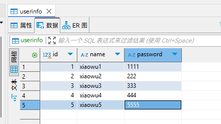
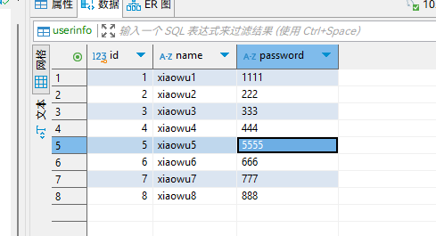

# Mysql数据库

>数据库大部分与运维方向数据库知识重复，不做重复记录。本文只记录未重复部分。

## 一、pymysql模块

### 1、安装模块

```bash
pip3 install pymysql
```

### 2、链接、执行sql、关闭（游标）



```python
import pymysql

user = input('用户名: ').strip()
pwd = input('密码: ').strip()

# 链接
conn = pymysql.connect(host='10.11.0.1', port=3306, user='root', password='123456', database='pythonstudy',
                       charset='utf8')
print(f'conn: {conn}')

# 游标
cursor = conn.cursor()  # 执行完毕返回的结果集默认以元组显示
# cursor = conn.cursor(cursor=pymysql.cursors.DictCursor)
print(f'cursor: {cursor}')

# 执行sql语句
sql = 'select * from userinfo where name="%s" and password="%s"' % (user, pwd)  # 注意%s需要加引号
print(f'sql: {sql}')
res = cursor.execute(sql)  # 执行sql语句，返回sql查询成功的记录数目
print(f'res: {res}')

cursor.close()
conn.close()

if res:
    print('登录成功')
else:
    print('登录失败')

'''
成功登录结果
用户名: xiaowu1
密码: 1111
conn: <pymysql.connections.Connection object at 0x00000157BFBF92B0>
cursor: <pymysql.cursors.Cursor object at 0x00000157BFBF96A0>
sql: select * from userinfo where name="xiaowu1" and password="1111"
res: 1
登录成功


登录失败结果
用户名: xiaowu1
密码: 222
conn: <pymysql.connections.Connection object at 0x000001B2948092B0>
cursor: <pymysql.cursors.Cursor object at 0x000001B2948096A0>
sql: select * from userinfo where name="xiaowu1" and password="222"
res: 0
登录失败
'''
```

## 二、execute()之sql注入

>注意：符号--会注释掉它之后的sql，正确的语法：--后至少有一个任意字符
>
>根本原理：就根据程序的字符串拼接name='%s'，我们输入一个***xxx' -- haha***,用我们输入的xxx加'在程序中拼接成一个判断条件name='***xxx' -- haha***'

### 1、注入示范

```python
'''
用户名: xiaowu1" -- jshajfhsahfsk
密码: 
conn: <pymysql.connections.Connection object at 0x00000200580192B0>
cursor: <pymysql.cursors.Cursor object at 0x00000200580196A0>
sql: select * from userinfo where name="xiaowu1" -- jshajfhsahfsk" and password=""
res: 1
登录成功
'''
```

```python
'''
用户名: xxx" or 1=1 -- knaskfnksf
密码: 
conn: <pymysql.connections.Connection object at 0x00000257888592B0>
cursor: <pymysql.cursors.Cursor object at 0x00000257888596A0>
sql: select * from userinfo where name="xxx" or 1=1 -- knaskfnksf" and password=""
res: 5
登录成功
'''
```

### 2、解决方法

```python
# 原来是我们对sql进行字符串拼接
# sql="select * from userinfo where name='%s' and password='%s'" %(user,pwd)
# print(sql)
# res=cursor.execute(sql)

#改写为（execute帮我们做字符串拼接，我们无需且一定不能再为%s加引号了）
sql="select * from userinfo where name=%s and password=%s" #！！！注意%s需要去掉引号，因为pymysql会自动为我们加上
res=cursor.execute(sql,[user,pwd]) #pymysql模块自动帮我们解决sql注入的问题，只要我们按照pymysql的规矩来。
```

```python
'''
用户名: xiaowu1" -- jshajfhsahfsk
密码: 
conn: <pymysql.connections.Connection object at 0x0000026F32CE92B0>
cursor: <pymysql.cursors.Cursor object at 0x0000026F32CE96A0>
sql: select * from userinfo where name=%s and password=%s
res: 0
登录失败
'''
```

```python
'''
用户名: xxx" or 1=1 -- knaskfnksf
密码: 
conn: <pymysql.connections.Connection object at 0x0000017094AD92B0>
cursor: <pymysql.cursors.Cursor object at 0x0000017094AD96A0>
sql: select * from userinfo where name=%s and password=%s
res: 0
登录失败
'''
```

## 三、增、删、改：conn.commit()

```python
import pymysql

# 链接
conn = pymysql.connect(host='10.11.0.1', port=3306, user='root', password='123456', database='pythonstudy',
                       charset='utf8')
print(f'conn: {conn}')

# 游标
cursor = conn.cursor()  # 执行完毕返回的结果集默认以元组显示
# cursor = conn.cursor(cursor=pymysql.cursors.DictCursor)
print(f'cursor: {cursor}')

# 执行sql语句
sql = 'insert into userinfo(name,password) values(%s,%s);'  # 注意%s需要加引号
print(f'sql: {sql}')
res = cursor.executemany(sql, [("xiaowu6", "666"), ("xiaowu7", "777"), ("xiaowu8", "888")])  # 执行sql语句，返回sql查询成功的记录数目
print(f'res: {res}')

conn.commit()
cursor.close()
conn.close()


'''
conn: <pymysql.connections.Connection object at 0x00000144F6DC92B0>
cursor: <pymysql.cursors.Cursor object at 0x00000144F6DC96A0>
sql: insert into userinfo(name,password) values(%s,%s);
res: 3
'''
```



## 四、查：fetchone，fetchmany，fetchall

```python
import pymysql

# 链接
conn = pymysql.connect(host='10.11.0.1', port=3306, user='root', password='123456', database='pythonstudy',
                       charset='utf8')
print(f'conn: {conn}')

# 游标
cursor = conn.cursor()  # 执行完毕返回的结果集默认以元组显示
# cursor = conn.cursor(cursor=pymysql.cursors.DictCursor)
print(f'cursor: {cursor}')

# 执行sql语句
sql = 'select * from userinfo;'
print(f'sql: {sql}')
rows = cursor.execute(sql)  # 执行sql语句，返回sql影响成功的行数rows,将结果放入一个集合，等待被查询
print(f'rows: {rows}')
res1 = cursor.fetchone()  # 打印下一个
res2 = cursor.fetchone()
res3 = cursor.fetchone()
res4 = cursor.fetchmany(2)  # 连续打印n个
res5 = cursor.fetchall()  # 打印剩余全部
print(res1)
print(res2)
print(res3)
print(res4)
print(res5)

cursor.close()
conn.close()


'''
sql: select * from userinfo;
rows: 8
(1, 'xiaowu1', '1111')
(2, 'xiaowu2', '222')
(3, 'xiaowu3', '333')
((4, 'xiaowu4', '444'), (5, 'xiaowu5', '5555'))
((6, 'xiaowu6', '666'), (7, 'xiaowu7', '777'), (8, 'xiaowu8', '888'))
'''
```

```python
import pymysql

# 链接
conn = pymysql.connect(host='10.11.0.1', port=3306, user='root', password='123456', database='pythonstudy',
                       charset='utf8')
print(f'conn: {conn}')

# 游标
cursor = conn.cursor()  # 执行完毕返回的结果集默认以元组显示
# cursor = conn.cursor(cursor=pymysql.cursors.DictCursor)
print(f'cursor: {cursor}')

# 执行sql语句
sql = 'select * from userinfo;'
print(f'sql: {sql}')
rows = cursor.execute(sql)  # 执行sql语句，返回sql影响成功的行数rows,将结果放入一个集合，等待被查询
print(f'rows: {rows}')

# cursor.scroll(3,mode='absolute') # 相对绝对位置移动
cursor.scroll(1, mode='relative')  # 相对当前位置移动
res1 = cursor.fetchone()  # 打印下一个
cursor.scroll(1, mode='absolute')  # 相对绝对位置移动
res2 = cursor.fetchone()
cursor.scroll(1, mode='relative')  # 相对当前位置移动
res3 = cursor.fetchone()
cursor.scroll(3, mode='absolute')  # 相对绝对位置移动
res4 = cursor.fetchmany(2)  # 连续打印n个
cursor.scroll(3, mode='absolute')  # 相对绝对位置移动
res5 = cursor.fetchall()  # 打印剩余全部
print(res1)
print(res2)
print(res3)
print(res4)
print(res5)

cursor.close()
conn.close()


'''
conn: <pymysql.connections.Connection object at 0x00000225FC8192B0>
cursor: <pymysql.cursors.Cursor object at 0x00000225FC8196A0>
sql: select * from userinfo;
rows: 8
(2, 'xiaowu2', '222')
(2, 'xiaowu2', '222')
(4, 'xiaowu4', '444')
((4, 'xiaowu4', '444'), (5, 'xiaowu5', '5555'))
((4, 'xiaowu4', '444'), (5, 'xiaowu5', '5555'), (6, 'xiaowu6', '666'), (7, 'xiaowu7', '777'), (8, 'xiaowu8', '888'))
'''
```

## 五、获取插入的最后一条数据的自增ID

```python
import pymysql

# 链接
conn = pymysql.connect(host='10.11.0.1', port=3306, user='root', password='123456', database='pythonstudy',
                       charset='utf8')
print(f'conn: {conn}')

# 游标
cursor = conn.cursor()  # 执行完毕返回的结果集默认以元组显示
# cursor = conn.cursor(cursor=pymysql.cursors.DictCursor)
print(f'cursor: {cursor}')

# 执行sql语句
sql = 'insert into userinfo(name,password) values("xxx","123");'
print(f'sql: {sql}')
rows = cursor.execute(sql)  # 执行sql语句，返回sql影响成功的行数rows,将结果放入一个集合，等待被查询
print(f'rows: {rows}')
print(cursor.lastrowid)  # 在插入语句后查看

conn.commit()
cursor.close()
conn.close()

'''
conn: <pymysql.connections.Connection object at 0x0000019AEF4192B0>
cursor: <pymysql.cursors.Cursor object at 0x0000019AEF4196A0>
sql: insert into userinfo(name,password) values("xxx","123");
rows: 1
9
'''
```

