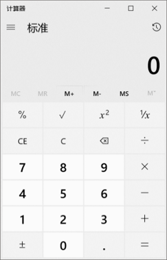
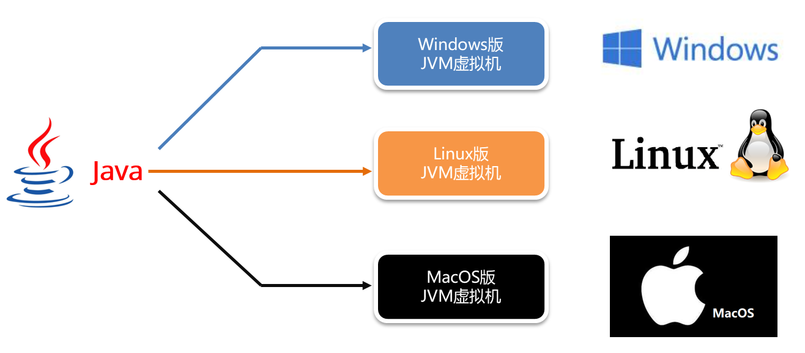
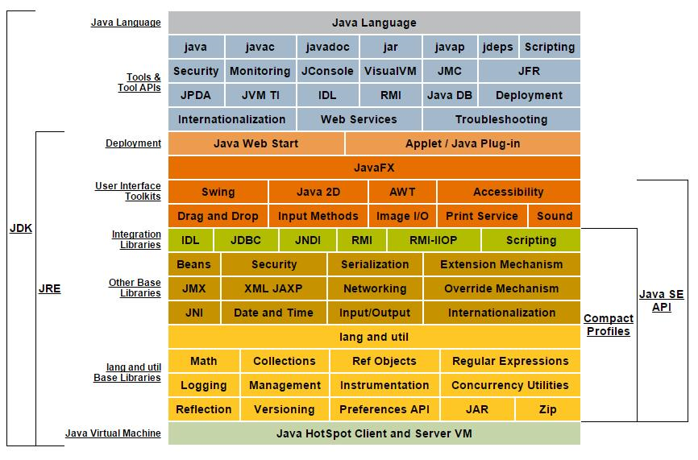
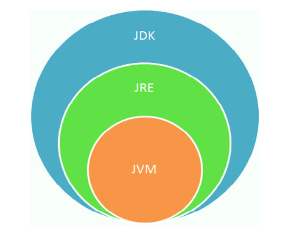

# Java介绍

## 一、什么是Java？

>- Java是美国 Sun 公司（Stanford University Network）在1995年推出的计算机编程语言，后被Oracle公司收购。
>- Java 早期称为Oak(橡树)，后期改名为Java。
>- Java 之父：詹姆斯·高斯林（James Gosling）。

## 二、为什么选择Java？

### 1、Java优势

>- 世界上最流行的编程语言之一，在国内使用最为广泛的编程语言。
>- 可移植性、安全可靠、性能较好。
>- 开发社区最完善，功能最为丰富。
>- 国内市场需求大。
>- 运维进阶架构师的必经之路
>- 主流微服务方案使用的变成语言

>Python后来居上和最近火爆的AI有着一定的关系。
>
>埋下个伏笔，后面会去学AI

### 2、生活中处处是Java

>- 使用Java开发的软件：https://blog.csdn.net/qq_39900031/article/details/131565003
>- 企业项目应用开发：微服务、应用后台
>- 移动服务开发：Android开发
>- 大数据开发：hadoop
>- 游戏开发：我的世界

>叠甲：上面的别的语言也能开发

## 三、Java技术体系平台

### 1、Java SE(Java Standard Edition) 标准版

>Java技术的核心和基础，是学习Java EE，JavaME的基础，支持开发桌面级应用（如Windows下的应用程序）的Java平台
>
>桌面应用 ：
>
>​	用户只要打开程序，程序的界面会让用户在最短的时间内找到他们需要的功能，同时主动带领用户完成他们的工作并得到最好的体验。
>
>​	比如：操作系统里面的计算器。
>
>​	比如：坦克大战小游戏。

### 2、Java EE(Java Enterprise Edition)企业版

>为开发企业环境下的应用程序提供的一套解决方案，主要针对于Web应用程序开发，多用于大型网站开发。
>
>网站：通过跟后台服务器的交互，将查询到的真实数据再通过网页展示出来。
>
>简单理解：网站 = 网页浏览器数据展示 + 后台服务器

### 3、Java ME(Java Micro Edition)小型版

>是为机顶盒、移动电话和PDA之类嵌入式消费电子设备提供的Java语言平台，现在移动终端基本上都是使用Android和IOS的技术平台了。

### 4、Java Card

>支持一些Java小程序（Applets）运行在小内存设备（如智能卡）上的平台 ，此技术也被广泛运用在SIM卡、提款卡上。

## 四、Java的跨平台工作原理

### 1、平台

>平台：指的是操作系统。 
>
>* Windows
>* MacOS
>* Linux

### 2、跨平台

>Java 程序不需要进行任何修改，就可以在任意操作系统上运行。 
>

### 3、原理

> 编写的Java代码并不是直接运行在操作系统当中的。而是运行在安装的JVM虚拟机中的。每一个操作系统都会对应各自版本的虚拟机。

>JVM 虚拟机本身不允许跨平台，每一个操作系统都有对应版本的虚拟机。允许跨平台的是 Java 程序

## 五、什么是JDK、JRE?

- **JDK**  (`J`ava `D`evelopment `K`it)：是Java程序开发工具包，包含`JRE` 和开发人员使用的工具。
- **JRE ** (`J`ava `R`untime `E`nvironment) ：是Java程序的运行时环境，包含`JVM` 和运行时所需要的`核心类库`。

如下是Java 8.0 Platform：

> 小结：
>
> JDK = JRE + 开发工具集（例如Javac编译工具等）
>
> JRE = JVM + Java SE标准类库