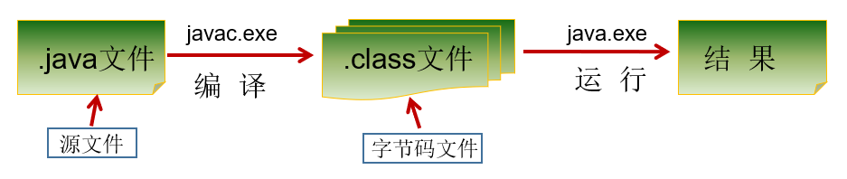
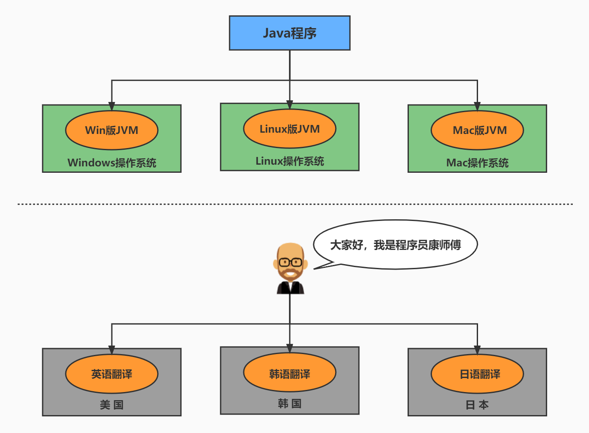
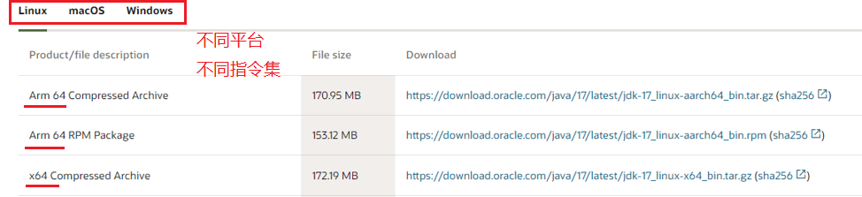
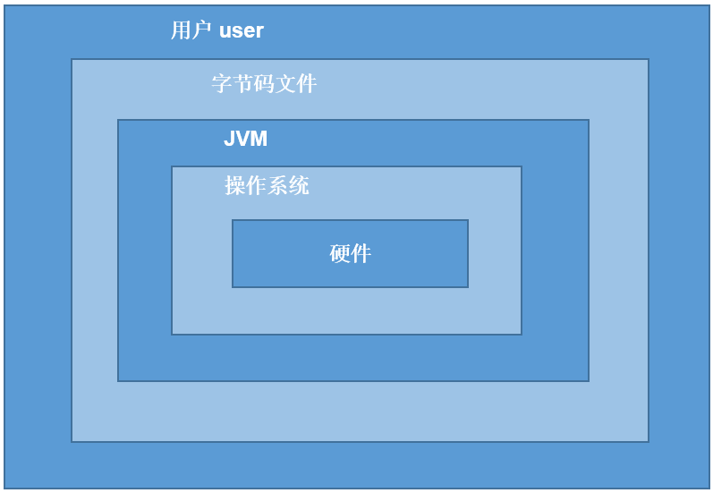
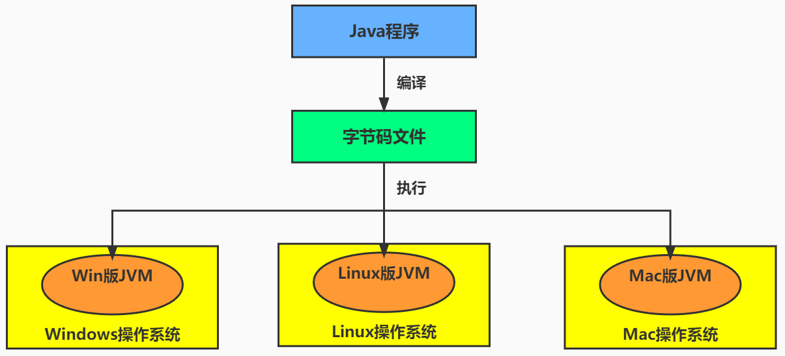
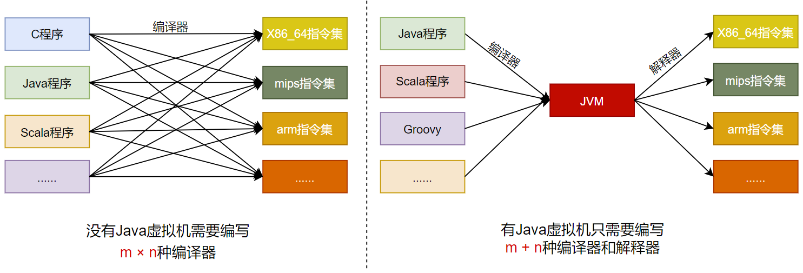
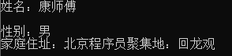
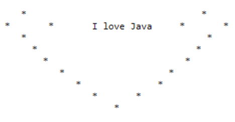

# Java入门

## 一、开发步骤了解

### 1、开发步骤

>Java程序开发三步骤：**编写**、**编译**、**运行**。
>
>- 将 Java 代码**编写**到扩展名为 .java 的源文件中
>- 通过 javac.exe 命令对该 java 文件进行**编译**，生成一个或多个字节码文件
>- 通过 java.exe 命令对生成的 class 文件进行**运行**



### 2、编写

> （1）在`F:\JavaSE\chapter01` 目录下新建文本文件，完整的文件名修改为`HelloWorld.java`，其中文件名为`HelloWorld`，后缀名必须为`.java`。

```java
class HelloChina {
  	public static void main(String[] args) {
    	System.out.println("HelloWorld!!");
  	}
}
```

> 第一个`HelloWord` 源程序就编写完成了，但是这个文件是程序员编写的，JVM是看不懂的，也就不能运行，因此我们必须将编写好的`Java源文件` 编译成JVM可以看懂的`字节码文件` ，也就是`.class`文件。

### 3、编译

```powershell
javac HelloWorld.java
```

### 4、运行

```powershell
java HelloChina

# 结果
F:\JavaSE\chapter01>java HelloChina
HelloWorld!!
```

## 二、Java中常见的问题

### 1、拼写问题

#### 1.单词拼写问题

>* 正确：class		         错误：Class
>* 正确：String                    错误：string
>* 正确：System                  错误：system
>* 正确：main		         错误：mian

#### 2.Java语言是一门严格区分大小写的语言

#### 3.标点符号

>* 不能用中文符号，英文半角的标点符号（正确）
>* 括号问题，成对出现

### 2、路径问题

>- 源文件名不存在或者写错
>- 当前路径错误
>- 后缀名隐藏问题
>- 类文件名写错，尤其文件名与类名不一致时，要小心
>- 类文件不在当前路径下，或者不在classpath指定路径下

### 3、语法问题

>- 声明为public的类应与文件名一致，否知编译失败。
>- 编译失败，注意错误出现的行数，再到源代码中指定位置改错

### 4、字符编码问题

>- 当cmd命令行窗口的字符编码与.java源文件的字符编码不一致
>
>> 在Notepad++等编辑器中，修改源文件的字符编码
>>
>> 在使用javac命令式，可以指定源文件的字符编码

```powershell
javac -encoding utf-8 Review01.java
```

### 5、良好的习惯

>- 注意缩进!
>  - 一定要有缩进。缩进就像人得体的衣着一样！
>
>  - 只要遇到{}就缩进，缩进的快捷键tab键。
>
>- 必要的空格
>
>  - 变量类型、变量、赋值符号、变量值之间填充相应空格，更美观。比如： int num = 10;

## 三、HelloWorld小结

### 1、程序格式

>（1）每一级缩进一个Tab键
>
>（2）{}的左半部分在行尾，右半部分单独一行，与和它成对的"{"的行首对齐

```java
类{
    方法{
        语句;
    }
}
```

### 2、Java程序入口

>Java程序的入口是main方法

```java
public static void main(String[] args){
    
}
```

>public：公共的，用它修改的类或成员在任意位置可见  
>
>static：静态的，用它修改的方法，可以不用创建对象就可以调用  
>
>void：表示该方法没有返回值  
>
>main：Java的主方法名，JavaSE的程序入口  
>
>String[]：字符串数组，这是main方法的形参类型，可以通过命令行参数传值  
>
>args：这是main方法的形参名，如果要在main中使用命令行参数，可以遍历该args数组。  
>
>说明：刚开始学习Java上面每个单词意思不需要掌握。只需要知道这是程序入口，`"死记硬背"下来即可`，以后会慢慢展开讲解。

### 3、常见的两种输出语句

- **换行输出语句**：输出内容，完毕后进行换行，格式如下：

  ```java
  System.out.println(输出内容);
  ```

- **直接输出语句**：输出内容，完毕后不做任何处理，格式如下

  ```java
  System.out.print(输出内容);
  ```

> 注意事项：
>
> ​	换行输出语句，括号内可以什么都不写，只做换行处理
>
> ​	直接输出语句，括号内什么都不写的话，编译报错

### 4、源文件名与类名

（1）源文件名是否必须与类名一致？public呢？

```java
如果这个类不是public，那么源文件名可以和类名不一致。但是不便于代码维护。

如果这个类是public，那么要求源文件名必须与类名一致。否则编译报错。

我们建议大家，不管是否是public，都与源文件名保持一致，而且一个源文件尽量只写一个类，目的是为了好维护。
```

（2）一个源文件中是否可以有多个类？public呢？

```java
一个源文件中可以有多个类，编译后会生成多个.class字节码文件。

但是一个源文件只能有一个public的类。
```

## 四、注释（comment）

### 1、什么是注释？

>源文件中用于解释、说明程序的文字就是注释。

>注释是一个程序员必须要具有的良好编程习惯。实际开发中，程序员可以先将自己的`思想`通过注释整理出来，再用`代码`去体现。
>
>>程序员最讨厌两件事：
>>
>>一件是自己写代码被要求加注释
>>
>>另一件是接手别人代码，发现没有注释

### 2、为什么要加注释？

#### 1.不加注释的后果

>你写的代码别人看不懂
>
>别人写的代码你看不懂
>
>业务维护难度增加

#### 2.注释的作用

>- 它提升了程序的可阅读性。
>- 调试程序的重要方法。

### 3、注释类型

#### 1.单行注释

```java
//注释文字
```

#### 2.多行注释

```java
/* 
注释文字1 
注释文字2
注释文字3
*/
```

#### 3.文档注释（java特有）

>文档注释内容可以被JDK提供的工具 javadoc 所解析，生成一套以网页文件形式体现的该程序的说明文档。

```java
/**
  @author  指定java程序的作者
  @version  指定源文件的版本
*/ 
```

#### 4.案例

```java
//单行注释
/*
多行注释
*/
/**
文档注释演示。这是我的第一个Java程序！^_^
@author xiaowu
@version 1.0
*/
public class HelloWorld{
    
	/**
	Java程序的入口
	@param args main方法的命令参数
	*/
    public static void main(String[] args){
        System.out.println("hello");
    }
```

**生成网页**

```bash
javadoc -d mydoc -author -version HelloWorld.java
```

## 五、Java API文档

>- API （Application Programming Interface，应用程序编程接口）是 Java 提供的基本编程接口。
>- Java语言提供了大量的基础类，因此 Oracle 也为这些基础类提供了相应的说明文档，用于告诉开发者如何使用这些类，以及这些类里包含的方法。大多数Java书籍中的类的介绍都要参照它来完成，它是编程者经常查阅的资料。
>- Java API文档，即为JDK使用说明书、帮助文档。

>下载API文档：
>
>> 在线看：https://docs.oracle.com/en/java/javase/17/docs/api/index.html
>>
>> 离线下载：https://www.oracle.com/java/technologies/javase-jdk17-doc-downloads.html

## 六、Java核心机制：JVM

### 1、Java语言的优缺点

>Java确实是从C语言和C++语言继承了许多成份，甚至可以将Java看成是类C语言发展和衍生的产物。“青出于蓝，而胜于蓝”。

#### 1.优点

##### 1）跨平台性

>* 这是Java的核心优势。Java在最初设计时就很注重移植和跨平台性。比如：Java的int永远都是32位。不像C++可能是16，32，可能是根据编译器厂商规定的变化。
>
>  * 通过Java语言编写的应用程序在不同的系统平台上都可以运行。“`Write once , Run Anywhere`”。
>* 原理：只要在需要运行 java 应用程序的操作系统上，先安装一个Java虚拟机 (JVM ，Java Virtual Machine) 即可。由JVM来负责Java程序在该系统中的运行。





##### 2)面相对象性

>* 面向对象是一种程序设计技术，非常`适合大型软件的设计和开发`。面向对象编程支持封装、继承、多态等特性，让程序更好达到`高内聚`，`低耦合`的标准。
>* 由于C++为了照顾大量C语言使用者而兼容了C，使得自身仅仅成为了`带类的C语言`，多少影响了其面向对象的彻底性！Java则是完全面向对象的语言。

##### 3)健壮性

>吸收了C/C++语言的优点，但去掉了其影响程序健壮性的部分（如指针、内存的申请与释放等），提供了一个相对安全的内存管理和访问机制。

##### 4)安全性高

>Java适合于网络/分布式环境，需要提供一个安全机制以防恶意代码的攻击。为了达到这个目标，在安全性方面Java投入了很大的精力，使Java可以很容易构建防病毒，防篡改的系统。如：`安全防范机制`（类ClassLoader），如分配不同的名字空间以防替代本地的同名类、字节代码检查。

##### 5)简单性

>Java就是C++语法的`简化版`，我们也可以将Java称之为“`C++--`”。比如：头文件，指针运算，结构，联合，操作符重载，虚基类等。

##### 6)高性能

>- Java最初发展阶段，总是被人诟病“`性能低`”；客观上，高级语言运行效率总是低于低级语言的，这个无法避免。Java语言本身发展中通过虚拟机的优化提升了`几十倍运行效率`。比如，通过JIT(JUST IN TIME)即时编译技术提高运行效率。 将一些“`热点字节码`”编译成本地机器码，并将结果`缓存`起来，在需要的时候重新调用。这样的话，使Java程序的执行效率大大提高，某些代码直接达到C++的效率。
>
>- 因此，`Java低性能的短腿，已经被完全解决了`。业界发展上，我们也看到很多C++应用转到Java开发，很多C++程序员转型为Java程序员。

#### 2.缺点

>- `语法过于复杂、严谨`，对程序员的约束比较多，与python、php等相比入门较难。但是一旦学会了，就业岗位需求量大，而且`薪资待遇节节攀升`。
>- 一般适用于大型网站开发，`整个架构会比较重`，对于初创公司开发和维护人员的成本比较高（即薪资高），选择用Java语言开发网站或应用系统的需要一定的经济实力。
>- `并非适用于所有领域`。在某些领域其他语言有更出色的表现，比如，Objective C、Swift在iOS设备上就有着无可取代的地位。浏览器中的处理几乎完全由JavaScript掌控。Windows程序通常都用C++或C#编写。Java在服务器端编程和跨平台客户端应用领域则很有优势。

### 2、JVM功能说明

>**JVM**（`J`ava `V`irtual `M`achine ，Java虚拟机）：是一个虚拟的计算机，是Java程序的运行环境。JVM具有指令集并使用不同的存储区域，负责执行指令，管理数据、内存、寄存器。



#### 1.功能1：实现Java程序的跨平台性

>我们编写的Java代码，都运行在**JVM** 之上。正是因为有了JVM，才使得Java程序具备了跨平台性。



>使用JVM前后对比：



#### 2.功能2：自动内存管理(内存分配、内存回收)

>- Java程序在运行过程中，涉及到运算的`数据的分配`、`存储`等都由JVM来完成
>- Java消除了程序员回收无用内存空间的职责。提供了一种系统级线程跟踪存储空间的分配情况，在内存空间达到相应阈值时，检查并释放可被释放的存储器空间。
>- GC的自动回收，提高了内存空间的利用效率，也提高了编程人员的效率，很大程度上`减少了`因为没有释放空间而导致的`内存泄漏`。

>Java程序还会出现内存溢出和内存泄漏问题吗？  Yes!

## 七、练习

### 1、个人信息输出



```java
class Exercise1{
	public static void main(String[] args){
		System.out.println("姓名：康师傅");
		System.out.println();//换行操作
		System.out.println("性别：男");
		System.out.println("家庭住址：北京程序员聚集地：回龙观");
	}
}
```

### 2、输出：心形** 

> 结合\n(换行)，\t(制表符)，空格等在控制台打印出如下图所示的效果。



**方式一**

```java
class Exercise2{
	public static void main(String[] args){
		System.out.print("\t");
		System.out.print("*");
		System.out.print("\t");
		System.out.print("\t");
		System.out.print("\t");
		System.out.print("\t");
		System.out.print("\t");
		System.out.print("\t");
		System.out.print("\t");
		
		System.out.println("*");

		
		System.out.print("*");
		System.out.print("\t");
		//System.out.print("\t");
		System.out.print("\t");
		System.out.print("\t");
		System.out.print("I love java");
		System.out.print("\t");
		System.out.print("\t");
		System.out.print("\t");
		System.out.print("\t");
		System.out.print("\t");
		System.out.println("*");

		
		System.out.print("\t");
		System.out.print("*");
		System.out.print("\t");
		System.out.print("\t");
		System.out.print("\t");
		System.out.print("\t");
		System.out.print("\t");
		System.out.print("\t");
		System.out.print("\t");
		
		System.out.println("*");

		
		System.out.print("\t");
		System.out.print("\t");
		System.out.print("*");
		System.out.print("\t");
		System.out.print("\t");
		System.out.print("\t");
		System.out.print("\t");
		System.out.print("\t");
		
		System.out.println("*");

		
		System.out.print("\t");
		System.out.print("\t");
		System.out.print("\t");
		System.out.print("*");
		System.out.print("\t");
		System.out.print("\t");
		System.out.print("\t");
		
		System.out.println("*");
		
		
		System.out.print("\t");
		System.out.print("\t");
		System.out.print("\t");
		System.out.print("\t");
		System.out.print("*");
		System.out.print("\t");
		
		System.out.println("*");

		
		System.out.print("\t");
		System.out.print("\t");
		System.out.print("\t");
		System.out.print("\t");
		System.out.print("    ");
		System.out.print("*");

	}

}
```

**方式二**

```java
class Exercise3{
	public static void main(String[] args){
		
		System.out.print("\t"+"*"+"\t\t\t\t\t\t\t\t\t\t\t\t"+"*"+"\t"+"\n");
		System.out.print("*"+"\t\t"+"*"+"\t\t\t\t"+"I love Java"+"\t\t\t\t"+"*"+"\t\t\t"+"*"+"\n");
		System.out.print("\t"+"*"+"\t\t\t\t\t\t\t\t\t\t\t\t"+"*"+"\t"+"\n");
		System.out.print("\t\t"+"*"+"\t\t\t\t\t\t\t\t\t\t"+"*"+"\t\t"+"\n");
		System.out.print("\t\t\t"+"*"+"\t\t\t\t\t\t\t\t"+"*"+"\t"+"\n");
		System.out.print("\t\t\t\t"+"*"+"\t\t\t\t\t\t"+"*"+""+"\t"+"\n");
		System.out.print("\t\t\t\t\t"+"*"+"\t\t\t\t"+"*"+""+"\t\t"+"\n");
		System.out.print("\t\t\t\t\t\t"+"*"+"\t\t"+"*"+""+"\t\t"+"\n");
		System.out.print("\t\t\t\t\t\t\t"+"*"+"\n");


	}

}
```


