# 变量与运算符

## 一、关键字

>- 定义：**被Java语言赋予了特殊含义，用做专门用途的字符串（或单词）**
>  - HelloWorld案例中，出现的关键字有 `public ` 、`class` 、 `static` 、  `void`  等，这些单词已经被Java定义好了。
>- 特点：全部关键字都是`小写字母`。
>- 关键字比较多，不需要死记硬背，学到哪里记到哪里即可。
>- 官方地址： https://docs.oracle.com/javase/tutorial/java/nutsandbolts/_keywords.html

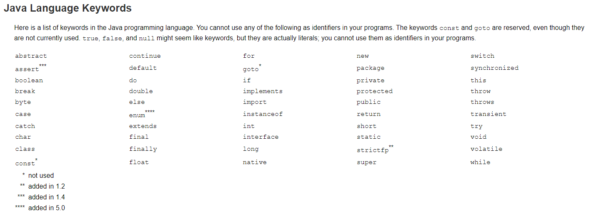

>说明：
>
>1. 关键字一共`50个`，其中`const`和`goto`是`保留字`(reserved word)。
>2. `true`，`false`，`null`不在其中，它们看起来像关键字，其实是字面量，表示特殊的布尔值和空值。

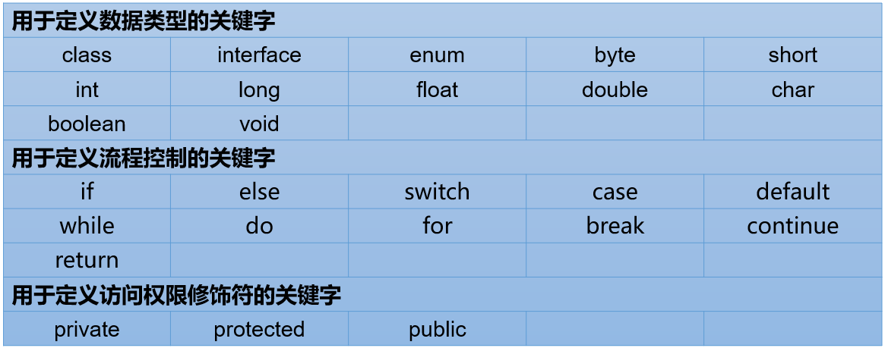

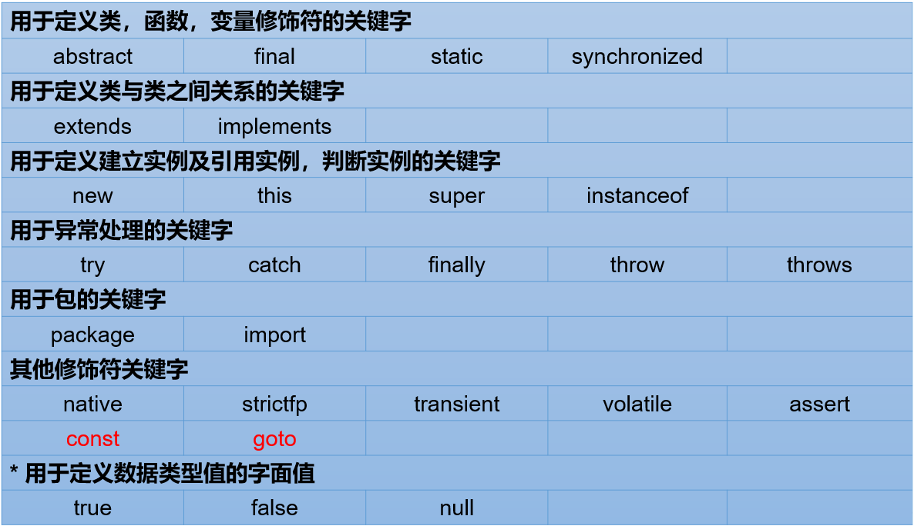

## 二、标识符( identifier)

>Java中变量、方法、类等要素命名时使用的字符序列，称为标识符。
>
>技巧：凡是自己可以起名字的地方都叫标识符。

### 1、标识符的命名规则

>必须遵守的`硬性规定`
>
>>由26个英文字母大小写，0-9 ，_或 $ 组成  
>>数字不可以开头。
>>不可以使用关键字和保留字，但能包含关键字和保留字。
>>Java中严格区分大小写，长度无限制。
>>标识符不能包含空格。

```java
练习：miles、Test、a++、 --a、4#R、$4、 #44、apps、class、public、int、x、y、radius
```

>建议遵守的`软性要求`，否则工作时容易被鄙视
>
>>> 包名：多单词组成时所有字母都小写：xxxyyyzzz。
>>> 例如：java.lang、com.atguigu.bean
>>
>>> 类名、接口名：多单词组成时，所有单词的首字母大写：XxxYyyZzz
>>> 例如：HelloWorld，String，System等
>>
>>> 变量名、方法名：多单词组成时，第一个单词首字母小写，第二个单词开始每个单词首字母大写：xxxYyyZzz
>>> 例如：age,name,bookName,main,binarySearch,getName
>>
>>> 常量名：所有字母都大写。多单词时每个单词用下划线连接：XXX_YYY_ZZZ
>>> 例如：MAX_VALUE,PI,DEFAULT_CAPACITY

### 2、注意

>注意1：在起名字时，为了提高阅读性，要尽量有意义，“见名知意”。
>
>注意2：java采用unicode字符集，因此标识符也可以使用汉字声明，但是不建议使用。 

## 三、变量

### 1、概念

>- 内存中的一个存储区域，该区域的数据可以在同一类型范围内不断变化
>
>- 变量的构成包含三个要素：`数据类型`、`变量名`、`存储的值`
>
>- Java中变量声明的格式：`数据类型 变量名 = 变量值`

### 2、作用

>变量的作用：用于在内存中保存数据

### 3、注意事项

>- Java中每个变量必须先声明，后使用
>- 使用变量名来访问这块区域的数据
>- 变量的作用域：其定义所在的一对{ }内
>- 变量只有在其作用域内才有效。出了作用域，变量不可以再被调用。
>- 同一个作用域内，不能定义重名的变量

### 4、Java中变量的数据类型

#### 1.数据类型的分类

>- **基本数据类型**：包括 `整数类型`、`浮点数类型`、`字符类型`、`布尔类型`。 
>
>- **引用数据类型**：包括`数组`、 `类`、`接口`、`枚举`、`注解`、`记录`。 

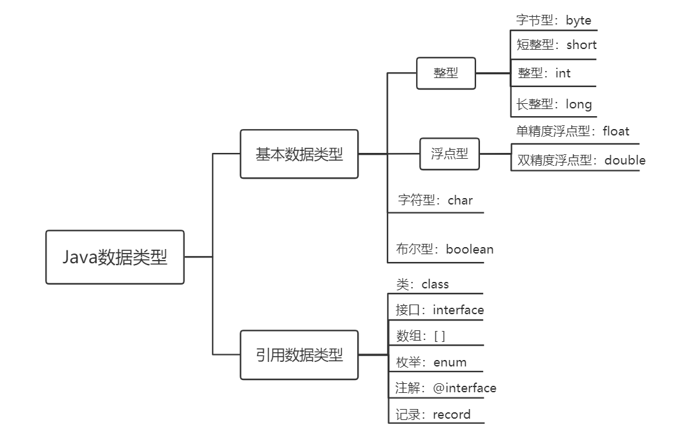

### 5、使用

#### 1.声明变量

>格式：数据类型  变量名;

```java
//例如：
//存储一个整数类型的年龄
int age; 

//存储一个小数类型的体重
double weight;

//存储一个单字符类型的性别 
char gender;

//存储一个布尔类型的婚姻状态
boolean marry;

//存储一个字符串类型的姓名
String name;

//声明多个同类型的变量
int a,b,c; //表示a,b,c三个变量都是int类型。
```

>注意：变量的数据类型可以是基本数据类型，也可以是引用数据类型。

#### 2.变量的赋值

>给变量赋值，就是把“值”存到该变量代表的内存空间中。

##### 1)语法

```java
变量名 = 值;
```

>- 给变量赋值，变量名必须在=左边，值必须在=右边
>- 给变量赋的值类型必须与变量声明的类型一致或兼容

##### 2)值的几种使用

>关于值的说明1：可以使用合适类型的`常量值`给已经声明的变量赋值

```java
age = 18;
weight = 109;
gender = '女';
```

>关于值的说明2：可以使用其他`变量`或者`表达式`给变量赋值

```java
int m = 1;
int n = m;
        
int x = 1;
int y = 2;
int z = 2 * x + y;
```

>关于值的说明3：变量可以反复赋值

```java
//先声明，后初始化
char gender;
gender = '女';

//给变量重新赋值，修改gender变量的值
gender = '男';
System.out.println("gender = " + gender);//gender = 男
```

>说明：
>
>- 变量的第一次赋值称为初始化；
>- 变量的再赋值称为修改变量的值；

>关于值的说明4：也可以将变量的声明和赋值一并执行

```java
boolean isBeauty = true;
String name = "迪丽热巴";
```

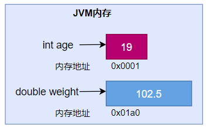

## 四、基本数据类型介绍

>变量的数据类型决定了在内存中开辟多大空间。
>
>变量的数据类型也决定了该变量可以存什么值。

### 1、整数类型：byte、short、int、long

>Java各整数类型有固定的表数范围和字段长度，不受具体OS的影响，以保证java程序的可移植性。

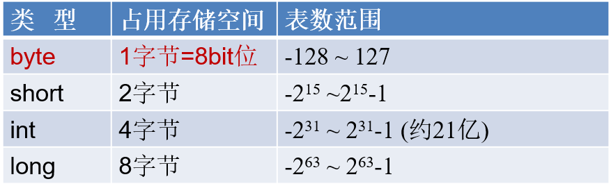

>- 定义long类型的变量，赋值时需要以"`l`"或"`L`"作为后缀。
>
>- Java程序中变量通常声明为int型，除非不足以表示较大的数，才使用long。
>
>- Java的整型`常量默认为 int 型`。

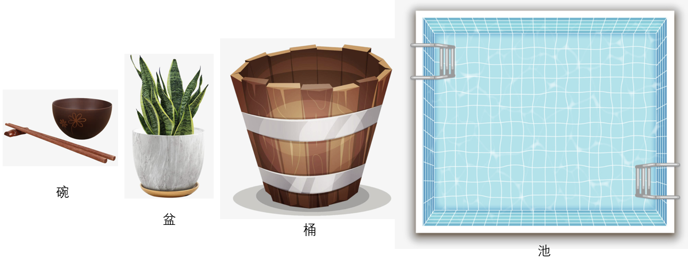

### 2、浮点类型：float、double

>与整数类型类似，Java 浮点类型也有固定的表数范围和字段长度，不受具体操作系统的影响。

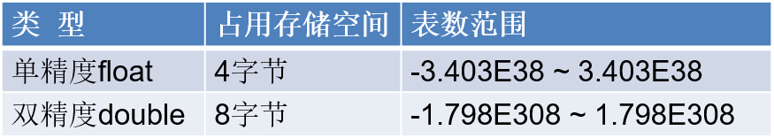

>浮点型常量有两种表示形式：
>
>- 十进制数形式。如：5.12       512.0f        .512   (必须有小数点）
>- 科学计数法形式。如：5.12e2      512E2     100E-2

>- float：`单精度`，尾数可以精确到7位有效数字。很多情况下，精度很难满足需求。    
>- double：`双精度`，精度是float的两倍。通常采用此类型。
>- 定义float类型的变量，赋值时需要以"`f`"或"`F`"作为后缀。
>- Java 的浮点型`常量默认为double型`。

#### 1.关于浮点型精度的说明

> - 并不是所有的小数都能可以精确的用二进制浮点数表示。二进制浮点数不能精确的表示0.1、0.01、0.001这样10的负次幂。
>
> - 不要使用浮点数进行`比较`！很多新人甚至很多理论不扎实的有工作经验的程序员也会犯这个错误！需要比较请使用`BigDecimal`类（后续内容讲）。
>
> - 浮点类型float、double的数据不适合在`不容许舍入误差`的金融计算领域。如果需要`精确`数字计算或保留指定位数的精度，需要使用`BigDecimal类`。

```java
/**
 * @author xiaowu
 * @create 12:36
 */
public class Test {
    public static void main(String[] args) {
        System.out.println(0.1 + 0.2);
    }
}

/*
结果: 

0.30000000000000004
*/
```

```java
/**
 * @author xiaowu
 * @create 12:36
 */
public class Test {
    public static void main(String[] args) {
        float ff = 0.1f;
        double dd = 1.0/10;
        System.out.println(ff);
        System.out.println(dd);
        System.out.println(ff == dd);
    }
}

/*
结果: 

0.1
0.1
false
*/
```

```java
/**
 * @author xiaowu
 * @create 12:36
 */
public class Test {
    public static void main(String[] args) {
        float ff1 = 123123123f;
        float ff2 = ff1 + 1;
        System.out.println(ff1);
        System.out.println(ff2);
        System.out.println(ff1 == ff2);
    }
}

/*
结果: 

1.2312312E8
1.2312312E8
true
*/
```

#### 2.应用举例

>案例1：定义圆周率并赋值为3.14，现有3个圆的半径分别为1.2、2.5、6，求它们的面积。

```java
/**
 * @author xiaowu
 * @create 12:36
 */
public class Test {
    public static void main(String[] args) {
        double PI = 3.14; //圆周率

        double radius1 = 1.2;
        double radius2 = 2.5;
        int radius3 = 6;

        System.out.println("第1个圆的面积：" + PI * radius1 * radius1);
        System.out.println("第2个圆的面积：" + PI * radius2 * radius2);
        System.out.println("第3个圆的面积：" + PI * radius3 * radius3);
    }
}

/*
结果: 

第1个圆的面积：4.521599999999999
第2个圆的面积：19.625
第3个圆的面积：113.03999999999999
*/
```

>案例2：小明要到美国旅游，可是那里的温度是以华氏度为单位记录的。
>它需要一个程序将华氏温度（80度）转换为摄氏度，并以华氏度和摄氏度为单位分别显示该温度。
>
>℃ = (℉ - 32) / 1.8

```java
/**
 * @author xiaowu
 * @create 12:36
 */
public class Test {
    public static void main(String[] args) {
        double hua = 80;
        double she = (hua-32)/1.8;
        System.out.println("华氏度" + hua+"℉转为摄氏度是" +she+"℃");
    }
}

/*
结果: 

华氏度80.0℉转为摄氏度是26.666666666666664℃
*/
```

### 3、字符类型：char

>- char 型数据用来表示通常意义上“`字符`”（占2字节）
>
>- Java中的所有字符都使用Unicode编码，故一个字符可以存储一个字母，一个汉字，或其他书面语的一个字符。

#### 1.字符型变量的三种表现形式：

>- **形式1：**使用单引号('')括起来的`单个字符`。例如：char c1 = 'a';   char c2 = '中'; char c3 =  '9';
>- **形式2：**直接使用 `Unicode 值`来表示字符型常量：‘`\uXXXX`’。其中，XXXX代表一个十六进制整数。如：\u0023 表示 '#'。
>- **形式3：**Java中还允许使用`转义字符‘\’`来将其后的字符转变为特殊字符型常量。例如：char c3 = '\n';  // '\n'表示换行符

| 转义字符 |  说明  | Unicode表示方式 |
| :------: | :----: | :-------------: |
|   `\n`   | 换行符 |     \u000a      |
|   `\t`   | 制表符 |     \u0009      |
|   `\"`   | 双引号 |     \u0022      |
|   `\'`   | 单引号 |     \u0027      |
|   `\\`   | 反斜线 |     \u005c      |
|   `\b`   | 退格符 |     \u0008      |
|   `\r`   | 回车符 |     \u000d      |

>char类型是可以进行运算的。因为它都对应有Unicode码。

### 4、布尔类型：boolean

>boolean 类型用来判断逻辑条件，一般用于程序流程控制语句中：
>
>- if条件控制语句；                  
>- while循环控制语句；     
>- for循环控制语句；
>- do-while循环控制语句； 

>**boolean类型数据只有两个值：true、false，无其它。**
>
>- 不可以使用0或非 0 的整数替代false和true，这点和C语言不同。
>- Java虚拟机中没有任何供boolean值专用的字节码指令，Java语言表达所操作的boolean值，在编译之后都使用java虚拟机中的int数据类型来代替：true用1表示，false用0表示。———《java虚拟机规范 8版》

```java
boolean isFlag = true;

if(isFlag){
    //true分支
}else{  
    //false分支
}
```

>经验之谈：
>
>Less is More！建议不要这样写：if ( isFlag = = true )，只有新手才如此。关键也很容易写错成if(isFlag = true)，这样就变成赋值isFlag为true而不是判断！`老鸟的写法`是if (isFlag)或者if ( !isFlag)。

## 五、基本数据类型变量间运算规则

>在Java程序中，不同的基本数据类型的值经常需要进行相互转换。Java语言所提供的**七种基本数据类型（不包括boolean类型）**之间可以相互转换，基本数据类型转换有两种转换方式：自动类型提升和强制类型转换。

### 1、自动类型提升

>**规则：将取值范围小（或容量小）的类型自动提升为取值范围大（或容量大）的类型 。**

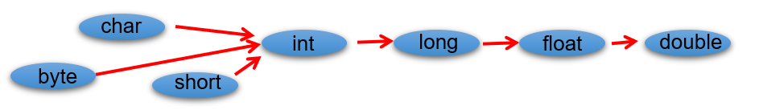

>（1）当把存储范围小的值（常量值、变量的值、表达式计算的结果值）赋值给了存储范围大的变量时

```java
int i = 'A';//char自动升级为int，其实就是把字符的编码值赋值给i变量了
double d = 10;//int自动升级为double
long num = 1234567; //右边的整数常量值如果在int范围呢，编译和运行都可以通过，这里涉及到数据类型转换

//byte bigB = 130;//错误，右边的整数常量值超过byte范围
long bigNum = 12345678912L;//右边的整数常量值如果超过int范围，必须加L，显式表示long类型。否则编译不通过
```

>（2）当存储范围小的数据类型与存储范围大的数据类型变量一起混合运算时，会按照其中最大的类型运算。

```java
int i = 1;
byte b = 1;
double d = 1.0;

double sum = i + b + d;//混合运算，升级为double
```

>（3）当byte,short,char数据类型的变量进行算术运算时，按照int类型处理。

```java
byte b1 = 1;
byte b2 = 2;
byte b3 = b1 + b2;//编译报错，b1 + b2自动升级为int

char c1 = '0';
char c2 = 'A';
int i = c1 + c2;//至少需要使用int类型来接收
System.out.println(c1 + c2);//113 
```

### 2、强制类型转换

>将`3.14` 赋值到`int` 类型变量会发生什么？产生编译失败，肯定无法赋值。

```java
int i = 3.14; // 编译报错
```

>想要赋值成功，只有通过`强制类型转换`，将`double` 类型强制转换成`int` 类型才能赋值。

>**规则：将取值范围大（或容量大）的类型强制转换成取值范围小（或容量小）的类型。**
>
>自动类型提升是Java自动执行的，而强制类型转换是自动类型提升的逆运算，需要我们自己手动执行。

**转换格式：**

```java
数据类型1 变量名 = （数据类型1）被强转数据值;  //()中的数据类型必须<=变量值的数据类型
```

>（1）当把存储范围大的值（常量值、变量的值、表达式计算的结果值）强制转换为存储范围小的变量时，可能会`损失精度`或`溢出`

```java
int i = (int)3.14;//损失精度

double d = 1.2;
int num = (int)d;//损失精度

int i = 200;
byte b = (byte)i;//溢出
```

>（2）当某个值想要提升数据类型时，也可以使用强制类型转换。这种情况的强制类型转换是`没有风险`的，通常省略。

```java
int i = 1;
int j = 2;
double bigger = (double)(i/j);
```

>（3）声明long类型变量时，可以出现省略后缀的情况。float则不同。

```java
long l1 = 123L;
long l2 = 123;//如何理解呢？ 此时可以看做是int类型的123自动类型提升为long类型

//long l3 = 123123123123; //报错，因为123123123123超出了int的范围。
long l4 = 123123123123L;


//float f1 = 12.3; //报错，因为12.3看做是double，不能自动转换为float类型
float f2 = 12.3F;
float f3 = (float)12.3;
```

>**练习：判断是否能通过编译**

```java
1）short  s = 5;
   s = s-2;                     //判断：n
2） byte b = 3;
    b = b + 4;                  //判断：n
    b = (byte)(b+4);            //判断：y
3）char c = ‘a’;
   int  i = 5;
   float d = .314F;
   double result = c+i+d;       //判断：y
4） byte b = 5;
    short s = 3;
    short t = s + b;            //判断：n
```

> **问答：为什么标识符的声明规则里要求不能数字开头？**

```java
如果允许数字开头，则如下的声明编译就可以通过：
int 123L = 12;
进而，如下的声明中l的值到底是123？还是12呢？ 出现歧义了。
long l = 123L;
```

### 3、基本数据类型与String的运算

#### 1.字符串类型：String

>- String不是基本数据类型，属于引用数据类型
>- 使用一对""来表示一个字符串，内部可以包含0个、1个或多个字符。
>- 声明方式与基本数据类型类似。例如：String str = "xiaowu";

#### 2.运算规则

1、任意八种基本数据类型的数据与String类型只能进行连接“+”运算，且结果一定也是String类型

```java
System.out.println("" + 1 + 2);//12

int num = 10;
boolean b1 = true;
String s1 = "abc";

String s2 = s1 + num + b1;
System.out.println(s2);//abc10true

//String s3 = num + b1 + s1;//编译不通过，因为int类型不能与boolean运算
String s4 = num + (b1 + s1);//编译通过 10trueabc
```

2、String类型不能通过强制类型()转换，转为其他的类型

```java
String str = "123";
int num = (int)str;//错误的

int num = Integer.parseInt(str);//正确的，后面才能讲到，借助包装类的方法才能转
```

## 六、运算符（Operator）

>运算符是一种特殊的符号，用以表示数据的运算、赋值和比较等。

### 1、分类

> 按照`功能`分为：算术运算符、赋值运算符、比较(或关系)运算符、逻辑运算符、位运算符、条件运算符、Lambda运算符

|           分类            |                        运算符                        |
| :-----------------------: | :--------------------------------------------------: |
|     算术运算符（7个）     |                +、-、*、/、%、++、--                 |
|    赋值运算符（12个）     | =、+=、-=、*=、/=、%=、>>=、<<=、>>>=、&=、\|=、^=等 |
| 比较(或关系)运算符（6个） |                 >、>=、<、<=、==、!=                 |
|     逻辑运算符（6个）     |                &、\|、^、!、&&、\|\|                 |
|      位运算符（7个）      |               &、\|、^、~、<<、>>、>>>               |
|     条件运算符（1个）     |               (条件表达式)?结果1:结果2               |
|    Lambda运算符（1个）    |                     ->（后面学）                     |

>按照`操作数个数`分为：一元运算符（单目运算符）、二元运算符（双目运算符）、三元运算符 （三目运算符）

|           分类            |                  运算符                  |
| :-----------------------: | :--------------------------------------: |
| 一元运算符（单目运算符）  |    正号（+）、负号（-）、++、--、!、~    |
| 二元运算符（双目运算符）  | 除了一元和三元运算符剩下的都是二元运算符 |
| 三元运算符 （三目运算符） |         (条件表达式)?结果1:结果2         |

### 2、算术运算符

#### 1.语法

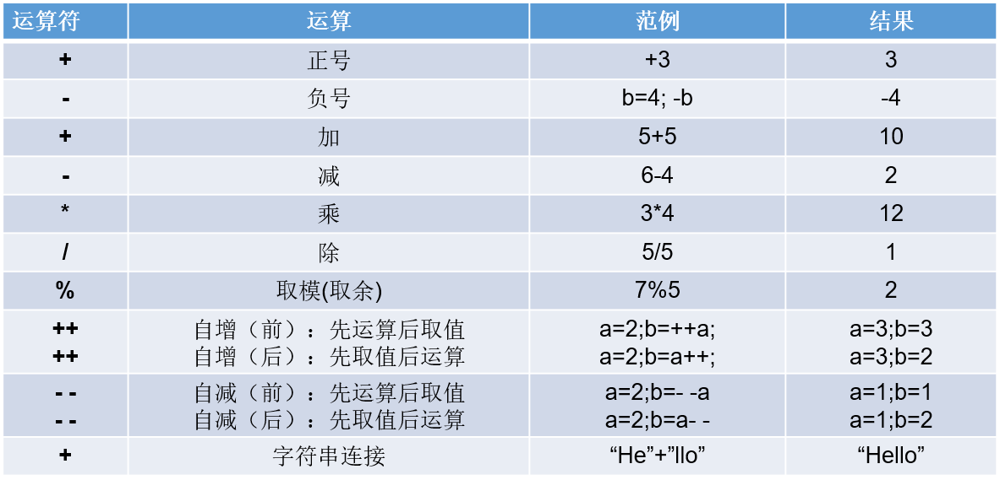

举例1：加减乘除模

```java
public class ArithmeticTest1 {
	public static void main(String[] args) {
		int a = 3;
		int b = 4;
		
		System.out.println(a + b);// 7
		System.out.println(a - b);// -1
		System.out.println(a * b);// 12
		System.out.println(a / b);// 计算机结果是0，为什么不是0.75呢？
		System.out.println(a % b);// 3
        
        //结果与被模数符号相同
        System.out.println(5%2);//1
		System.out.println(5%-2);//1
		System.out.println(-5%2);//-1
		System.out.println(-5%-2);//-1		
		//商*除数 + 余数 = 被除数
		//5%-2  ==>商是-2，余数时1    (-2)*(-2)+1 = 5
		//-5%2  ==>商是-2，余数是-1   (-2)*2+(-1) = -4-1=-5
	}
}
```

举例2：“+”号的两种用法

>* 第一种：对于`+`两边都是数值的话，`+`就是加法的意思
>* 第二种：对于`+`两边至少有一边是字符串的话，`+`就是拼接的意思

```java
public class ArithmeticTest2 {
	public static void main(String[] args) {
		// 字符串类型的变量基本使用
		// 数据类型 变量名称 = 数据值;
		String str1 = "Hello";
		System.out.println(str1); // Hello
		
		System.out.println("Hello" + "World"); // HelloWorld
		
		String str2 = "Java";
		// String + int --> String
		System.out.println(str2 + 520); // Java520
		// String + int + int
		// String		+ int
		// String
		System.out.println(str2 + 5 + 20); // Java520
	}
}
```

举例3：自加自减运算

>理解：`++`  运算，表示`自增1`。同理，`--` 运算，表示`自减1`，用法与++ 一致。
>
>1、单独使用
>
>* 变量在单独运算的时候，变量`前++`和变量`后++`，是没有区别的。
>* 变量`前++`   ：例如 `++a` 。
>* 变量`后++`   ：例如 `a++` 。

```java
public class ArithmeticTest3 {
	public static void main(String[] args) {
		// 定义一个int类型的变量a
		int a = 3;
		//++a;
		a++;
        // 无论是变量前++还是变量后++，结果都是4
		System.out.println(a);
	}
}
```

#### 2.复合使用

>* 和`其他变量放在一起使用`或者和`输出语句放在一起使用`，`前++`和`后++`就产生了不同。
>
>- 变量`前++` ：变量先自增1，然后再运算。
>- 变量`后++` ：变量先运算，然后再自增1。

```java
public class ArithmeticTest4 {
	public static void main(String[] args) {
		// 其他变量放在一起使用
		int x = 3;
		//int y = ++x; // y的值是4，x的值是4，
		int y = x++; // y的值是3，x的值是4
		
		System.out.println(x);
		System.out.println(y);
		System.out.println("==========");
        
		// 和输出语句一起
		int z = 5;
		//System.out.println(++z);// 输出结果是6，z的值也是6
		System.out.println(z++);// 输出结果是5，z的值是6
		System.out.println(z);
        
	} 
}
```

#### 3.练习

**1：**

>随意给出一个整数，打印显示它的个位数，十位数，百位数的值。
>格式如下：
>数字xxx的情况如下：
>个位数：
>十位数：
>百位数：
>
>例如：
>数字153的情况如下：
>个位数：3
>十位数：5
>百位数：1

```java
class ArithmeticExer1 {
	public static void main(String[] args) {
		
		int num = 187;
		
		int bai = num / 100;
		int shi = num % 100 / 10;//int shi = num / 10 % 10;
		int ge = num % 10;
		
		System.out.println("百位为：" + bai);
		System.out.println("十位为：" + shi);
		System.out.println("个位为：" + ge);

	}
}
```

**2：**为抵抗洪水，战士连续作战89小时，编程计算共多少天零多少小时？

```java
public class ArithmeticExer2 {
    public static void main(String[] args){
        int hours = 89;
        int day = hours / 24;
        int hour = hours % 24;
        System.out.println("为抵抗洪水，战士连续作战89小时：");
        System.out.println(hours + "是" + day + "天" + hour +"小时");
    }
}
```

### 3、赋值运算符

#### 1.基本语法

>- 符号：= 
>  - 当“=”两侧数据类型不一致时，可以使用自动类型转换或使用强制类型转换原则进行处理。
>  - 支持`连续赋值`。

>- 扩展赋值运算符： +=、 -=、*=、 /=、%=

| 赋值运算符 |                           符号解释                           |
| :--------: | :----------------------------------------------------------: |
|    `+=`    | 将符号`左边的值`和`右边的值`进行`相加`操作，最后将结果`赋值给左边的变量` |
|    `-=`    | 将符号`左边的值`和`右边的值`进行`相减`操作，最后将结果`赋值给左边的变量` |
|    `*=`    | 将符号`左边的值`和`右边的值`进行`相乘`操作，最后将结果`赋值给左边的变量` |
|    `/=`    | 将符号`左边的值`和`右边的值`进行`相除`操作，最后将结果`赋值给左边的变量` |
|    `%=`    | 将符号`左边的值`和`右边的值`进行`取余`操作，最后将结果`赋值给左边的变量` |

```java
public class SetValueTest1 {
	public static void main(String[] args) {
		int i1 = 10;
		long l1 = i1; //自动类型转换

		byte bb1 = (byte)i1; //强制类型转换

		int i2 = i1;

		//连续赋值的测试
		//以前的写法
		int a1 = 10;
		int b1 = 10;
		
		//连续赋值的写法
		int a2,b2;
		a2 = b2 = 10;
		
		int a3 = 10,b3 = 20;

		//举例说明+=  -=  *=  /=   %=  
		int m1 = 10;
		m1 += 5; //类似于 m1 = m1 + 5的操作，但不等同于。
		System.out.println(m1);//15
		
		//练习1：开发中，如何实现一个变量+2的操作呢？
		// += 的操作不会改变变量本身的数据类型。其他拓展的运算符也如此。
		//写法1：推荐
		short s1 = 10;
		s1 += 2; //编译通过，因为在得到int类型的结果后，JVM自动完成一步强制类型转换，将int类型强转成short
		System.out.println(s1);//12
		//写法2：
		short s2 = 10;
		//s2 = s2 + 2;//编译报错，因为将int类型的结果赋值给short类型的变量s时，可能损失精度
		s2 = (short)(s2 + 2);
		System.out.println(s2);


		//练习2：开发中，如何实现一个变量+1的操作呢？
		//写法1：推荐
		int num1 = 10;
		num1++;
		System.out.println(num1);

		//写法2：
		int num2 = 10;
		num2 += 1;
		System.out.println(num2);

		//写法3：
		int num3 = 10;
		num3 = num3 + 1;
		System.out.println(num3);

	}
}
```

### 4、 关系(比较)运算符

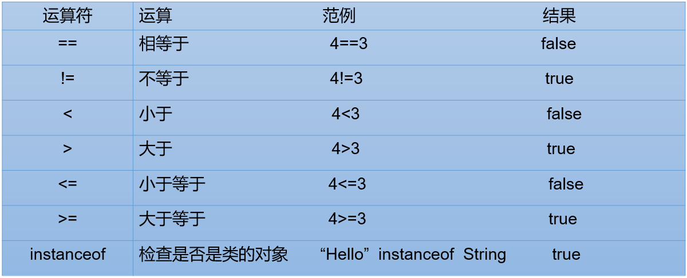

>- 比较运算符的结果都是boolean型，也就是要么是true，要么是false。
>
>- \>   <   >=  <= ：只适用于基本数据类型（除boolean类型之外）
>
>  ==   != ：适用于基本数据类型和引用数据类型
>
>- 比较运算符“==”不能误写成“=” 

```java
class CompareTest {
	public static void main(String[] args) {
		int i1 = 10;
		int i2 = 20;
		
		System.out.println(i1 == i2);//false
		System.out.println(i1 != i2);//true
		System.out.println(i1 >= i2);//false


		int m = 10;
		int n = 20;
		System.out.println(m == n);//false
		System.out.println(m = n);//20

		boolean b1 = false;
		boolean b2 = true;
		System.out.println(b1 == b2);//false
		System.out.println(b1 = b2);//true
	}
}
```

### 5、逻辑运算符

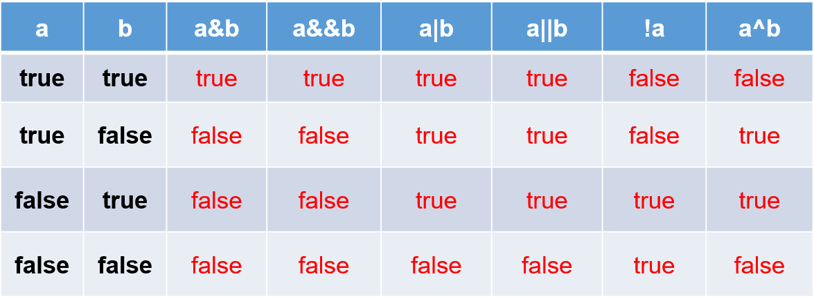

#### 1.说明

>- & 和 &&：表示"且"关系，当符号左右两边布尔值都是true时，结果才能为true。否则，为false。
>- | 和 || ：表示"或"关系，当符号两边布尔值有一边为true时，结果为true。当两边都为false时，结果为false
>- ! ：表示"非"关系，当变量布尔值为true时，结果为false。当变量布尔值为false时，结果为true。
>- ^ ：当符号左右两边布尔值不同时，结果为true。当两边布尔值相同时，结果为false。
>  - 理解：`异或，追求的是“异”！`

>逻辑运算符用于连接布尔型表达式，在Java中不可以写成 3 < x < 6，应该写成x > 3 & x < 6 。

#### 2.区分“&”和“&&”

>- 相同点：如果符号左边是true，则二者都执行符号右边的操作
>
>- 不同点：& ： 如果符号左边是false,则继续执行符号右边的操作
>
>  ​                && ：如果符号左边是false,则不再继续执行符号右边的操作
>
>  - 建议：开发中，推荐使用 && 

#### 3.区分“|”和“||”

>  - 相同点：如果符号左边是false，则二者都执行符号右边的操作
>
>  - 不同点：| ： 如果符号左边是true，则继续执行符号右边的操作
>
>    ​                || ：如果符号左边是true，则不再继续执行符号右边的操作

#### 4.练习

```java
/**
 * @author xiaowu
 * @create 12:36
 */
public class Test {
    public static void main(String[] args) {
        int a = 3;
        int b = 4;
        int c = 5;

        // & 与，且；有false则false
        System.out.println((a > b) & (a > c));
        System.out.println((a > b) & (a < c));
        System.out.println((a < b) & (a > c));
        System.out.println((a < b) & (a < c));
        System.out.println("===============");
        // | 或；有true则true
        System.out.println((a > b) | (a > c));
        System.out.println((a > b) | (a < c));
        System.out.println((a < b) | (a > c));
        System.out.println((a < b) | (a < c));
        System.out.println("===============");
        // ^ 异或；相同为false，不同为true
        System.out.println((a > b) ^ (a > c));
        System.out.println((a > b) ^ (a < c));
        System.out.println((a < b) ^ (a > c));
        System.out.println((a < b) ^ (a < c));
        System.out.println("===============");
        // ! 非；非false则true，非true则false
        System.out.println(!false);
        System.out.println(!true);

        //&和&&的区别
        System.out.println((a > b) & (a++ > c));
        System.out.println("a = " + a);
        System.out.println((a > b) && (a++ > c));
        System.out.println("a = " + a);
        System.out.println((a == b) && (a++ > c));
        System.out.println("a = " + a);

        //|和||的区别
        System.out.println((a > b) | (a++ > c));
        System.out.println("a = " + a);
        System.out.println((a > b) || (a++ > c));
        System.out.println("a = " + a);
        System.out.println((a == b) || (a++ > c));
        System.out.println("a = " + a);
    }
}

/*
结果：

false
false          
false          
true           
===============
false          
true
true
true
===============
false
true
true
false
===============
true
false
false
a = 4
false
a = 4
false
a = 5
true
a = 6
true
a = 6
true
a = 7
*/
```

### 6、位运算符

#### 1.基本语法

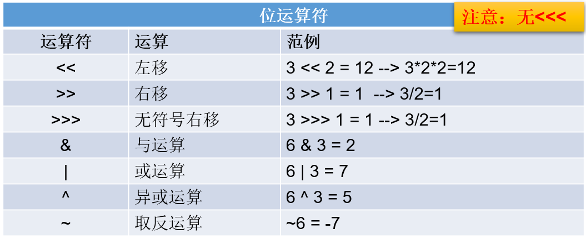

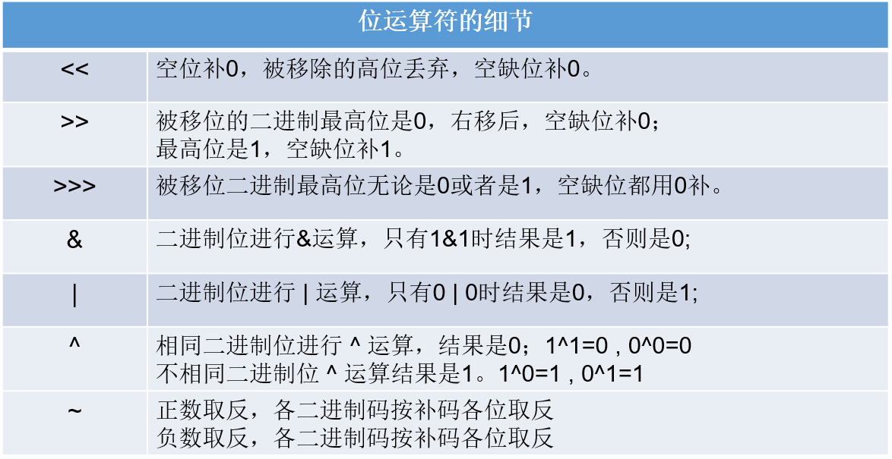

>位运算符的运算过程都是基于二进制的补码运算

##### 1)左移：<<

>运算规则：在一定范围内，数据每向左移动一位，相当于原数据*2。（正数、负数都适用）
>
>【注意】当左移的位数n超过该数据类型的总位数时，相当于左移（n-总位数）位
>
>​			      byte,short,char在计算时按照int类型处理

>3<<4  类似于  3*2的4次幂 => 3*16 => 48

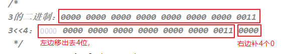

>-3<<4  类似于  -3*2的4次幂 => -3*16 => -48

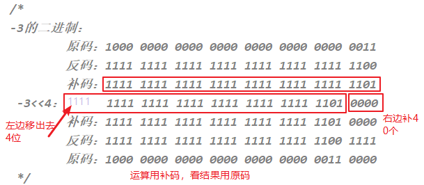

##### 2)右移：>>

> 运算规则：在一定范围内，数据每向右移动一位，相当于原数据/2。（正数、负数都适用）
>
> 【注意】如果不能整除，`向下取整`。

>69>>4  类似于  69/2的4次 = 69/16 =4

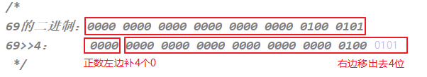

>-69>>4  类似于  -69/2的4次 = -69/16 = -5

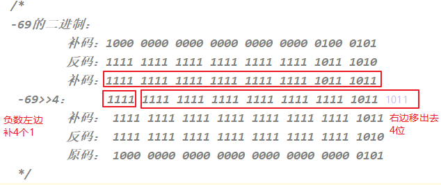

##### 3)无符号右移：>>>

>运算规则：往右移动后，左边空出来的位直接补0。（正数、负数都适用）

>69>>>4  类似于  69/2的4次 = 69/16 =4

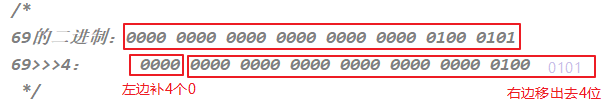

>x -69>>>4   结果：268435451

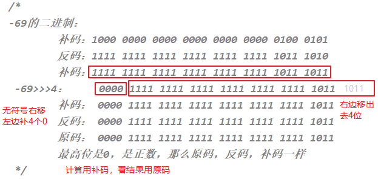

##### 4）按位与：&

>运算规则：对应位都是1才为1，否则为0。
>
>- 1 & 1 结果为1
>
>- 1 & 0 结果为0
>
>- 0 & 1 结果为0
>
>
>- 0 & 0 结果为0

>9 & 7 = 1

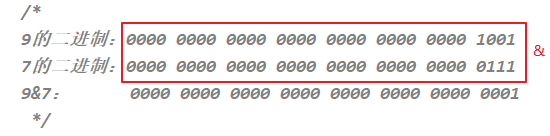

>-9 & 7 = 7

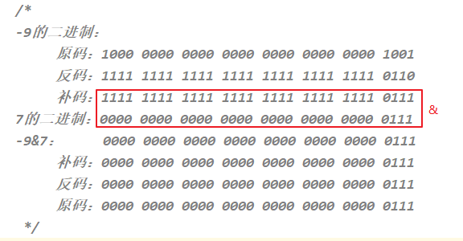

##### 5)按位或：|

>运算规则：对应位只要有1即为1，否则为0。
>
>- 1 | 1 结果为1
>
>- 1 | 0 结果为1
>
>- 0 | 1 结果为1
>
>- 0 & 0 结果为0

>9 | 7  //结果： 15

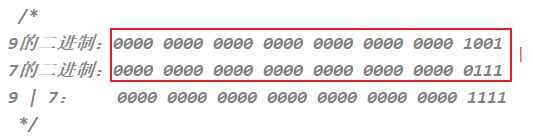

>-9 | 7 //结果： -9

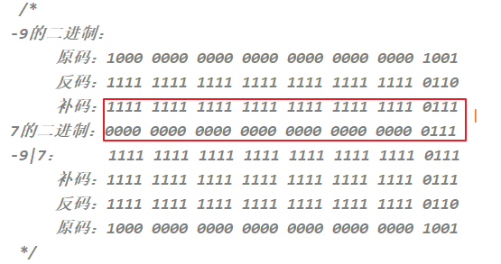

##### 6)按位异或：^

>运算规则：对应位一个为1一个为0，才为1，否则为0。
>
>- 1 ^ 1 结果为0
>
>- 1 ^ 0 结果为1
>
>- 0 ^ 1 结果为1
>
>
>- 0 ^ 0 结果为0

>9 ^ 7  //结果为14

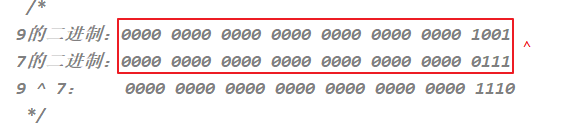

>-9 ^ 7 //结果为-16

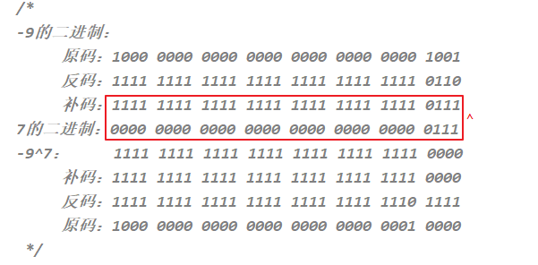

##### 7)按位取反：~

>运算规则：对应位为1，则结果为0；对应位为0，则结果为1。
>
>- ~0就是1  
>
>- ~1就是0

>~9  //结果：-10

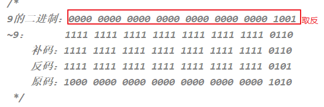

> ~-9  //结果：8

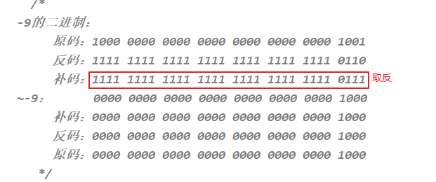

```java
    public static void main(String[] args) {
        int m = 10;
		int n = 5;

		System.out.println("m = " + m + ", n = " + n);

		//（推荐）实现方式1：优点：容易理解，适用于不同数据类型    缺点：需要额外定义变量
		//int temp = m;
		//m = n;
		//n = temp;

		//实现方式2：优点：没有额外定义变量    缺点：可能超出int的范围；只能适用于数值类型
		//m = m + n; //15 = 10 + 5
		//n = m - n;//10 = 15 - 5
		//m = m - n;//5 = 15 - 10
	
		//实现方式3：优点：没有额外定义变量    缺点：不易理解；只能适用于数值类型
		m = m ^ n; 
		n = m ^ n; //(m ^ n) ^ n
		m = m ^ n;

		System.out.println("m = " + m + ", n = " + n);
    }
```

### 7、条件运算符

#### 1.语法

>条件运算符格式：
>
>​    (条件表达式)? 表达式1:表达式2
>
>说明：条件表达式是boolean类型的结果，根据boolean的值选择表达式1或表达式2

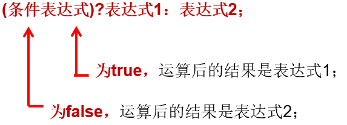

>表达式1和表达式2为同种或兼容的类型

```java
public static void main(String[] args) {
    int i = (1==2 ? 100 : 200);
    System.out.println(i);//200
    
    boolean marry = false;
	System.out.println(marry ? "已婚" : "未婚"  );
    
    double d1 = (m1 > m2)? 1 : 2.0;
	System.out.println(d1);
    
    int num = 12;
    System.out.println(num > 0? true : "num非正数");
}
```

#### 2.案例

**案例1：**获取两个数中的较大值。

```java
public class ConditionExer1 {
    public static void main(String[] args) {
        //获取两个数的较大值
        int m1 = 10;
        int m2 = 20;

        int max1 = (m1 > m2)? m1 : m2;
        System.out.println("m1和m2中的较大值为" + max1);
    }
}
```

**案例2：**获取三个数中的最大值。

```java
public class ConditionExer2 {
    public static void main(String[] args) {
        int n1 = 23;
        int n2 = 13;
        int n3 = 33;
        //写法1：
        int tempMax = (n1 > n2)? n1:n2;
        int finalMax = (tempMax > n3)? tempMax : n3;
        System.out.println("三个数中最大值为：" + finalMax);

        //写法2：不推荐，可读性差
        int finalMax1 = (((n1 > n2)? n1:n2) > n3)? ((n1 > n2)? n1:n2) : n3;
        System.out.println("三个数中最大值为：" + finalMax1);
    }
}
```

**案例3：**今天是周2，10天以后是周几？

要求：控制台输出"今天是周2，10天以后是周x"。

```java
public class ConditionExer3 {

    public static void main(String[] args) {
        int week = 2;
        week += 10;
        week %= 7;
        System.out.println("今天是周2,10天以后是周" + (week == 0 ? "日" : week));
    }

}
```

**案例4：**

```
给定一个年份，判断是否是闰年。输出"xxx年(是/不是)闰年"。

闰年的判断标准是：
1）可以被4整除，但不可被100整除
 2）可以被400整除
```

```java
public class ConditionExer4 {
    public static void main(String[] args) {
        int year = 2018;
        boolean isLeapYear = (year % 4 == 0 && year % 100 != 0) || year % 400 == 0;
        System.out.println(year + (isLeapYear ? "是闰年" : "不是闰年"));
    }
}
```

#### 3.与if-else的转换关系

>- 凡是可以使用条件运算符的地方，都可以改写为if-else结构。反之，不成立。
>
>
>- 开发中，如果既可以使用条件运算符，又可以使用if-else，推荐使用条件运算符。因为执行效率稍高。

```java
//if-else实现获取两个数的较大值

int i1 = 10;
int i2 = 20;

int max;//声明变量max，用于记录i1和i2的较大值

if(i1 > i2){
    max = i1;
}else{
    max = i2;
}

System.out.println(max);
```


### 8、运算符优先级

>运算符有不同的优先级，所谓优先级就是在表达式运算中的运算符顺序。
>
>上一行中的运算符总是优先于下一行的。

| 优先级 |    运算符说明    |             Java运算符             |
| ------ | :--------------: | :--------------------------------: |
| 1      |       括号       |          `()`、`[]`、`{}`          |
| 2      |      正负号      |              `+`、`-`              |
| 3      |    单元运算符    |       `++`、`--`、`~`、`！`        |
| 4      | 乘法、除法、求余 |           `*`、`/`、`%`            |
| 5      |    加法、减法    |              `+`、`-`              |
| 6      |    移位运算符    |         `<<`、`>>`、`>>>`          |
| 7      |    关系运算符    | `<`、`<=`、`>=`、`>`、`instanceof` |
| 8      |    等价运算符    |             `==`、`!=`             |
| 9      |      按位与      |                `&`                 |
| 10     |     按位异或     |                `^`                 |
| 11     |      按位或      |                `|`                 |
| 12     |      条件与      |                `&&`                |
| 13     |      条件或      |                `||`                |
| 14     |    三元运算符    |               `? :`                |
| 15     |    赋值运算符    | `=`、`+=`、`-=`、`*=`、`/=`、`%=`  |
| 16     |   位赋值运算符   |  `&=`、`|=`、`<<=`、`>>=`、`>>>=`  |

> 开发建议：
>
> 1. 不要过多的依赖运算的优先级来控制表达式的执行顺序，这样可读性太差，尽量`使用()来控制`、改变表达式的执行顺序。
> 2. 不要把一个表达式写得过于复杂，如果一个表达式过于复杂，则把它`分成几步`来完成。例如：
>    ​ (num1 + num2) * 2 > num3 && num2 > num3 ? num3 : num1 + num2;
> 3. 逻辑与、逻辑或、逻辑非的优先级一定要熟悉！（`逻辑非 > 逻辑与 > 逻辑或`）。如：
>    a || b && c 的运算结果是：a || ( b && c )，而不是( a|| b ) && c

## 七、【拓展】关于字符集

### 1、字符集

- **编码与解码**

计算机中储存的信息都是用`二进制数`表示的，而我们在屏幕上看到的数字、英文、标点符号、汉字等字符是二进制数转换之后的结果。按照某种规则，将字符存储到计算机中，称为`编码` 。反之，将存储在计算机中的二进制数按照某种规则解析显示出来，称为`解码` 。

- **字符编码（Character Encoding）** : 就是一套自然语言的字符与二进制数之间的对应规则。

- **字符集**：也叫编码表。是一个系统支持的所有字符的集合，包括各国家文字、标点符号、图形符号、数字等。

### 2、ASCII码

- ASCII码（American Standard Code for Information Interchange，美国信息交换标准代码）：上个世纪60年代，美国制定了一套字符编码，对`英语字符`与二进制位之间的关系，做了统一规定。这被称为ASCII码。
- ASCII码用于显示现代英语，主要包括控制字符（回车键、退格、换行键等）和可显示字符（英文大小写字符、阿拉伯数字和西文符号）。
- 基本的ASCII字符集，使用7位（bits）表示一个字符（最前面的1位统一规定为0），共`128个`字符。比如：空格“SPACE”是32（二进制00100000），大写的字母A是65（二进制01000001）。
- 缺点：不能表示所有字符。

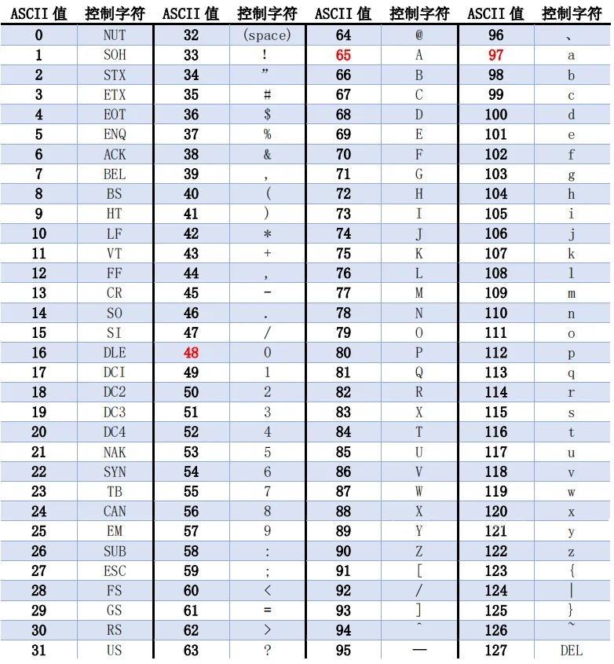

### 3、ISO-8859-1字符集

* 拉丁码表，别名Latin-1，用于显示欧洲使用的语言，包括荷兰语、德语、意大利语、葡萄牙语等
* ISO-8859-1使用单字节编码，兼容ASCII编码。

### 4、GBxxx字符集

* GB就是国标的意思，是为了`显示中文`而设计的一套字符集。
* **GB2312**：简体中文码表。一个小于127的字符的意义与原来相同，即向下兼容ASCII码。但两个大于127的字符连在一起时，就表示一个汉字，这样大约可以组合了包含`7000多个简体汉字`，此外数学符号、罗马希腊的字母、日文的假名们都编进去了，这就是常说的"全角"字符，而原来在127号以下的那些符号就叫"半角"字符了。
* **GBK**：最常用的中文码表。是在GB2312标准基础上的扩展规范，使用了`双字节`编码方案，共收录了`21003个`汉字，完全兼容GB2312标准，同时支持`繁体汉字`以及日韩汉字等。
* **GB18030**：最新的中文码表。收录汉字`70244个`，采用`多字节`编码，每个字可以由1个、2个或4个字节组成。支持中国国内少数民族的文字，同时支持繁体汉字以及日韩汉字等。

### 5、Unicode码

- Unicode编码为表达`任意语言的任意字符`而设计，也称为统一码、标准万国码。Unicode 将世界上所有的文字用`2个字节`统一进行编码，为每个字符设定唯一的二进制编码，以满足跨语言、跨平台进行文本处理的要求。

- Unicode 的缺点：这里有三个问题：
  - 第一，英文字母只用一个字节表示就够了，如果用更多的字节存储是`极大的浪费`。
  - 第二，如何才能`区别Unicode和ASCII`？计算机怎么知道两个字节表示一个符号，而不是分别表示两个符号呢？
  - 第三，如果和GBK等双字节编码方式一样，用最高位是1或0表示两个字节和一个字节，就少了很多值无法用于表示字符，`不够表示所有字符`。
- Unicode在很长一段时间内无法推广，直到互联网的出现，为解决Unicode如何在网络上传输的问题，于是面向传输的众多 UTF（UCS Transfer Format）标准出现。具体来说，有三种编码方案，UTF-8、UTF-16和UTF-32。

### 6、UTF-8

* Unicode是字符集，UTF-8、UTF-16、UTF-32是三种`将数字转换到程序数据`的编码方案。顾名思义，UTF-8就是每次8个位传输数据，而UTF-16就是每次16个位。其中，UTF-8 是在互联网上`使用最广`的一种 Unicode 的实现方式。
* 互联网工程工作小组（IETF）要求所有互联网协议都必须支持UTF-8编码。所以，我们开发Web应用，也要使用UTF-8编码。UTF-8 是一种`变长的编码方式`。它可以使用 1-4 个字节表示一个符号它使用一至四个字节为每个字符编码，编码规则：
  1. 128个US-ASCII字符，只需一个字节编码。
  2. 拉丁文等字符，需要二个字节编码。 
  3. 大部分常用字（含中文），使用三个字节编码。
  4. 其他极少使用的Unicode辅助字符，使用四字节编码。


- 举例

Unicode符号范围  | UTF-8编码方式

```
(十六进制)           | （二进制）

————————————————————|—–—–—–—–—–—–—–—–—–—–—–—–—–—–

0000 0000-0000 007F | 0xxxxxxx（兼容原来的ASCII）

0000 0080-0000 07FF | 110xxxxx 10xxxxxx

0000 0800-0000 FFFF | 1110xxxx 10xxxxxx 10xxxxxx

0001 0000-0010 FFFF | 11110xxx 10xxxxxx 10xxxxxx 10xxxxxx
```

### 7、小结

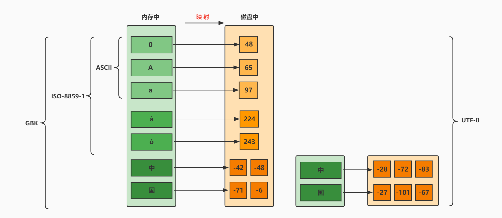

> 注意：在中文操作系统上，ANSI（美国国家标准学会、AMERICAN NATIONAL STANDARDS INSTITUTE: ANSI）编码即为GBK；在英文操作系统上，ANSI编码即为ISO-8859-1。

