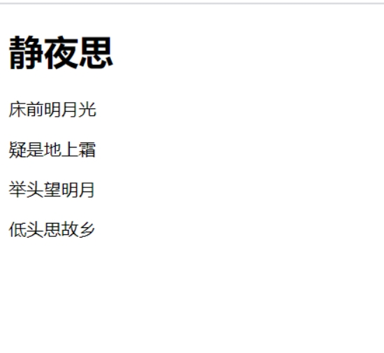
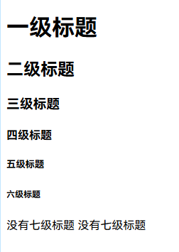
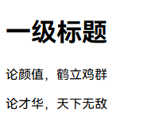
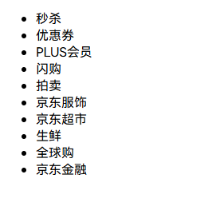
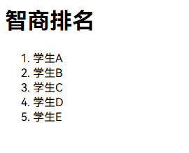
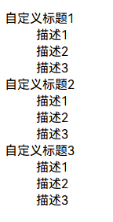
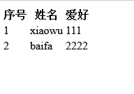
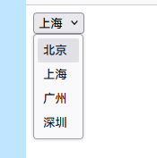
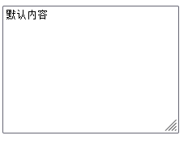

# HTML标签

## 一、HTML简介

>用户使用浏览器打开网页看到结果的过程就是：浏览器将服务端的文本文件(即网页文件)内容下载到本地，然后打开显示的过程。
>
>而文本文件的文档结构只有空格和换行两种组织方式，如此，文本文件在打开显示时，显示的效果将会非常非常非常的单一。
>
>为了让显示的效果不那么单调，我们会偏向使用word一类的文本编辑工具来编排文本内容，编排的原理就是：在编辑文件时会选中各部分内容，然后为内容打上不同的标记，比如什么是标题，什么是段落，然后存放硬盘里，等下次打开时，word会识别之前的标记，然后按照预先编排好的结果显示出来。
>
>站在显示文本内容的角度去看，浏览器与word的原理一样，我们可以将浏览器当成一个网页版的只读word，浏览器也必须有一套自己能识别的标记文本的规范，该规范被称为HTML,HTML全称是超文本标记语言（HyperText Markup Language）。
>
>“超文本”指的是用超链接的方法，将各种不同空间的文字信息组织在一起的网状文本。
>
>“标记”指的是在编辑文本时用特殊的记号标记一下各部分内容的意义，该记号称之为标签，比如用标签h1标记标题，用标签p标签段落，如此我们标记一首唐诗就成了如下格式：

```html
<h1>静夜思</h1>
<p>床前明月光</p>
<p>疑是地上霜</p>
<p>举头望明月</p>
<p>低头思故乡</p>
```

这样浏览器在接收到文本内容后，就可以按照事先规定好的记号去显示各部分的内容，显示结果如下图



## 二、HTML标签与文档结构

> 一个网页可以没有样式，可以没有交互，但是必须要有网页需要呈现的内容，而HTML作为一门标记语言，是通过各种各样的标签来标记网页内容的，所以HTML部分是整个前端的基础，我们学习HTML主要就是学习的HTML标签。

### 1、什么是标签呢？

>在HTML中规定标签使用英文的的尖括号即<和>包起来，如`<html>、<head>、<body>`都是标签，
>
>HTML中标签通常情况下是成对出现的，分为开始标签和结束标签，结束标签比开始标签多了一个/，开始标签和结束标签之间的就是标签的内容。
>
>有些标签功能比较简单，使用一个标签即可，这种标签叫做自闭和标签，例如:`<br/><hr/> <input/> `

### 2、标签格式

HTML中的标签存放于文本文件中，需要按照下述固定的文档结构组织：

```html
<!DOCTYPE HTML>
<html>
  <head>...</head>
  <body>...</body>
</html>
```

### 3、各部分解释

```html
<!DOCTYPE HTML>是文档声明，必须写在HTML文档的第一行，位于<html>标签之前，表明该文档是HTML5文档。

<html></html> 称为根标签，所有的网页标签都在<html></html>中。

HTML的lang属性可用于网页或部分网页的语言。通常用于搜索引擎和浏览器的统计分析,不定义也没什么影响。

根据 W3C 推荐标准，您应该通过 <html> 标签中的 lang 属性对每张页面中的主要语言进行声明，比如：<html lang="en"></html>

<head></head> 标签用于定义文档的头部，它是所有头部元素的容器。常见的头部元素有<title>、<script>、<style>、<link>和<meta>等标签，头部标签在下一节中会有详细介绍，<head>与</head>之间的内容不会在浏览器的文档窗口显示，但是其间的元素有特殊重要的意义。

在<body>和</body>标签之间的内容是网页的主要内容，最终会在浏览器中显示出来。
```

### 4、标签间关系

```html
并列（兄弟／平级）
  head与body
嵌套（父子／上下级）
  html内有body
```

### 5、HTML标签详细语法与注意点

#### 1.标签的语法：

```html
<标签名 属性1=“值1” 属性2=“值2” ......>内容部分</标签名>
<标签名 属性1=“值1” 属性2=“值2” ....../>
```

#### 2.标签注意事项!!!

```html
记号/标签是不会显示出来的。

标签只是用来做记号而不负责控制样式：虽然用<h1>标记的文本在显示时会被加大加粗，但请务必记住，HTML的作用只有一个它是专门用来对文件做记号来标识其语义的（语义指的是该文本是做什么用的），加大和加粗这种为文本添加样式的操作并不是HTML擅长的，虽然早期的时候确实也用HTML来制作样式，但以后我们专门用CSS来做这件事，这也是一种解耦合的思想

HTML标签不区分大小写，`<h1>`和`<H1>`是一样的，但是我们通常建议使用小写，大部分程序员都以小写为准。

HTML中有部分标签是可以嵌套的。例如：<div><p>段落</p></div>,但不能交叉<div><p></div></p>
```

### 6、HTML中标签分类

>单从是否可以嵌套子标签的角度去分，标签分为两类
>
>容器类标签
>
>容器类标签可以简单的理解为能嵌套其它所有标签的标签。

#### 1.常见容器级的标签: 

```html
  h系列 
  ul>li
  ol>li
  dl>dt+dd
  div
```

#### 2.文本类标签

文本级的标签对应容器级标签，只能嵌套文字/图片/超链接的标签。

常见文本级的标签:

```html
p
span
strong
em
ins
del
```

### 7、HTML注释

无论我们学习什么编程语言，一定要重视的就是注释，HTML中注释的格式:

```html
<!--这里是注释的内容-->
```

注意： 注释中可以直接使用回车换行。

并且我们习惯用注释的标签把HTML代码包裹起来。如：

```html
<!-- xx部分 开始 -->
  这里放你xx部分的HTML代码
<!-- xx部分 结束 -->
```

HTML注释的注意事项：

```html
1 HTML注释不支持嵌套。
2 HTML注释不能写在HTML标签中。
```

## 三、head内常用标签

```html
<meta>是HTML的元素，在网页头部<head>标签内定义，可提供与网页有关的结构化元数据，即网页的元信息(meta-information)。网页上并不会显示这些元信息,但计算机可以识别他们。
```

<meta>相关标签


```html
指定字符集
<meta charset="gbk">

页面描述
<meta name="Description" content="具体描述。。。">

关键字：有助于搜索引擎SEC优化，再怎么优化也抵不过竞价排名
<meta name="Keywords" content="网易，邮箱，游戏，新闻">

3秒后跳转
<meta http-equiv="refresh" content="3,http://www.baidu.com">

三秒刷新
<meta http-equiv="refresh" content="3">
```

非meta相关标签

```html
标题
<title>百度一下，你就知道</title>

网站的图标
<link rel="icon" href="https://www.baidu.com/favicon.ico">

定义内部样式
<style></style>

引入外部样式文件
<link rel="stylesheet" href="mystyle.css">

定义JavaScript代码或引入JavaScript文件
<script src="hello.js"></script>　
```

## 四、body内常用标签

### 1、HTML语义化

>body中的标签是会显示到浏览器窗口中的，body内的标签只有一个作用就是用来标记语义的，语义指的是从字面意思就可以理解被标记的内容是用来做什么的
>
>虽然不同的标签会有不同的显示样式，但我们一定要强制自己忘记所有标签的显示样式，只记它的语义。因为每个标签的样式各不相同，记忆不同标签的样式来控制显示样式，对前端开发来说将会是一种灾难，更何况添加样式并不是HTML擅长的事情，而且在布局的时候多使用语义化的标签，会方便搜索引擎在爬取网页文件时更好地解析文档结构，从而进行收录。
>
>提醒：对于那些只用来修改样式的标签将会被淘汰掉!

 

### 2、 字符实体

>在HTML中对空格／回车／tab不敏感，会把多个空格／回车／tab当作一个空格来处理。
>
>字符实体指的是在HTML中，有的字符是被HTML保留的比如大于号小于号
>
>有的HTML字符，在HTML中是有特殊含义的，是不能在浏览器中直接显示出来的，那么这些东西想显示出来就必须通过字符实体，如下

| 内容 | 代码 |
| ---- | ---- |
| 空格 |   `&nbsp;`   |
| >    | `&gt;`   |
| <    | `&lt;`    |
| &    | `&amp;`    |
| ¥    | `&yen;`    |
| 版权 | `&copy;`    |
| 注册 | `&reg;`    |

### 3、h系列标签

>H系列标签标记内容为一个标题，全称headline
>
>h系列标签从h1-h6共6个，没有h7标签，标记内容为1~6级标题，h1用作主标题（代表最重要的），其次是h2。。。

```html
<!DOCTYPE html>
<html lang="en">
    <head>
        <meta charset="UTF-8">
        <title>Title</title>
    </head>
    <body>
        <h1>一级标题</h1>
        <h2>二级标题</h2>
        <h3>三级标题</h3>
        <h4>四级标题</h4>
        <h5>五级标题</h5>
        <h6>六级标题</h6>
        <h7>没有七级标题</h7>
        没有七级标题
    </body>
</html>
```



>注意1：虽然h1-h6标签的显示样式是从大到小，但再次强调：记忆HTML标签的显示样式是没有意义的
>
>注意2：在企业开发中一定要慎用h系列标签，特别是h1标签，在企业开发中一般一个界面中只能出现一个h1标签（出于搜索引擎优化考虑，搜索引擎会使用标题将网页的结构和内容编制索引）。

### 4、p标签

> P标签标记内容为一个段落，全称paragraph

```html
 <!DOCTYPE HTML>
<html>
    <head lang='en'>
        <meta charset="utf-8">
        <title>Egon无敌</title>
    </head>
    <body>
        <h1>Egon</h1>
        <p>论颜值，鹤立鸡群</p>
        <p>论才华，天下无敌</p>
    </body>
</html>
```



### 5、img标签

>img标签为标记一个图片，全称image，具体的用法是：

```html

```

使用img标签有以下的几点注意事项：

>src指定的图片地址可以是网络地址，也可以是一个本地地址，本地地址可以用绝对或相对路径，但通常用相对路径，相对路径是以html文件当前所在路径为基准进行的
>图片的格式可以是png、jpg和gif
>alt="图片加载失败时显示的内容"  为img标签加上该属性可用于支持搜索引擎和盲人读屏软件。
>title = "鼠标悬停到图片上时显示的内容"
>如果没有指定图片的width和height则按照图片默认的宽高显示，如果指定图片的width和height则可能让图片变形，那如果又想指定宽度和高度，又不想让图片变形，我们可以只指定宽度和高度的一个值即可，只要指定了一个值，系统会根据该值计算另外一个值，并且都是等比拉伸的，图片将不会变形。

### 6、a标签

>a标签标记一个内容为超链接，全称anchor，也被称作锚。
>
>超链接标签是超文本文件的精髓，可以控制页面与页面之间的跳转，语法如下

```html
<a href="跳转到的目标页面地址" target="是否在新页面中打开" title="鼠标悬浮显示的内容">需要展现给用户查看的内容/也可以是图片</a>

href
    放url，用户点击就会跳转到该url页面
    放其他a标签的id值 点击即可跳转到对应的标签为止
target
    默认在当前页跳转 _self
    也可以新建页面跳转  _blank
```

使用a标签需要注意以下几点：

> a标签不仅可以标记文字，也可以标记图片

```html
    <a href="https://www.baidu.com">百度一下，你就知道</a>
```

a标签必须有href属性，href的值必须是http://或https://开头

> a标签还可以跳转到自己的页面

   ` <a href="template/aaa.html">跳转到自己这个页面 </a>`

> target="_blank"代表在新页面中打开，其余的值均无需记忆，如果页面中大量的a标签都需要设置target="_blank",那么我们可以在head标签内新增一个base标签进行统一设置

```html
<base target="_blank">
```

如果a标签自己设置了target，那么就以自己的为准，否则就会参照base的设置

> title="鼠标悬浮显示的内容"

>锚点

```html
标签具有的两个重要属性：
id值
    类似标签的身份证号，同一个html页面上唯一
class值
    类似面相对象里面的继承，一个标签可以继承多个class值

<a href="" id="d1">中间</a>
<h1 id="d2">底部</h1>

<a href="#d1">回到中间</a>
<a href="#d2">回到底部</a>
```

## 五、列表标签

列表标签可以标记一堆数据是一个整体或列表html中列表标签分为三种：

### 1、无序列表

提示：这是列表标签中使用最多的一种，非常重要，要重点掌握

无序列表可以制作导航条、商品列表、新闻列表等

无序列表的组合使用

```html
<!DOCTYPE html>
<html lang="en">
    <head>
        <meta charset="UTF-8">
        <title>Title</title>
    </head>
    <body>
        <ul>
            <li>秒杀</li>
            <li>优惠券</li>
            <li>PLUS会员</li>
            <li>闪购</li>
            <li>拍卖</li>
            <li>京东服饰</li>
            <li>京东超市</li>
            <li>生鲜</li>
            <li>全球购</li>
            <li>京东金融</li>
        </ul>
    </body>
</html>
```


注意点：ul与li是组合标签应该一起出现，并且ul的子标签只应该是li，而li的子标签则可以是任意其他标签

### 2、有序列表

提示：这种类型的列表在实际应用中并不多见，略微了解即可

```html
<!DOCTYPE html>
<html lang="en">
    <head>
        <meta charset="UTF-8">
        <title>Title</title>
    </head>
    <body>
        <h1>智商排名</h1>
        <ol>
            <li>学生A</li>
            <li>学生B</li>
            <li>学生C</li>
            <li>学生D</li>
            <li>学生E</li>
        </ol>
    </body>
</html>
```


提示：有序列表能干的事，完全可以用无序列表取代

### 3、自定义列表（也会经常使用）

作用分析

```html
选择用什么标签的唯一标准，是看文本的实际语义，而不是看长什么样子
无序列表：内容是并列的,没有先后顺序
有序列表：内容是有先后顺序的
自定义列表：对一个题目进行解释说明的时候，用自定义列表,可以做网站尾部相关信息，网易注册界面的输入框
```

自定义列表也是一个组合标签：dl>dt+dd

```html
dl: defination list，自定义列表
dt：defination title，自定义标题
dd：defination description，自定义描述
```

```html
<!DOCTYPE html>
<html lang="en">
    <head>
        <meta charset="UTF-8">
        <title>Title</title>
    </head>
    <body>
        <dl>
            <dt>自定义标题1</dt>
            <dd>描述1</dd>
            <dd>描述2</dd>
            <dd>描述3</dd>

            <dt>自定义标题2</dt>
            <dd>描述1</dd>
            <dd>描述2</dd>
            <dd>描述3</dd>

            <dt>自定义标题3</dt>
            <dd>描述1</dd>
            <dd>描述2</dd>
            <dd>描述3</dd>
        </dl>
    </body>
</html>
```



## 六、table标签

表格是一个二维数据空间，一个表格由若干行组成，一个行又有若干单元格组成，单元格里可以包含文字、列表、图案、表单、数字符号、预置文本和其它的表格等内容。
表格最重要的目的是显示表格类数据。表格类数据是指最适合组织为表格格式（即按行和列组织）的数据。

### 1、表格的格式

```html
<table>
  <thead>
  <tr>
    <th>序号</th>
    <th>姓名</th>
    <th>爱好</th>
  </tr>
  </thead>
  <tbody>
  <tr>
    <td>1</td>
    <td>jason</td>
    <td>杠娘</td>
  </tr>
  <tr>
    <td>2</td>
    <td>Yuan</td>
    <td>日天</td>
  </tr>
  </tbody>
</table>
```



```html
tr代表表格的一行数据
td表一行中的一个普通单元格th表示表头单元格
```

注意点：表格标签有一个边框属性，这个属性决定了边框的宽度。默认情况下这个属性的值为0，所以看不到边框

>属性

>- border: 表格边框.
>- cellpadding: 内边距
>- cellspacing: 外边距.
>- width: 像素 百分比.（最好通过css来设置长宽）
>- rowspan: 单元格竖跨多少行
>- colspan: 单元格横跨多少列（即合并单元格）

## 七、forms标签

### 1、功能：

>表单用于向服务器传输数据，从而实现用户与Web服务器的交互
>
>表单能够包含input系列标签，比如文本字段、复选框、单选框、提交按钮等等。
>
>表单还可以包含textarea、select、fieldset和 label标签。

### 2、表单属性

|      属性      |                            描述                            |
| :------------: | :--------------------------------------------------------: |
| accept-charset |    规定在被提交表单中使用的字符集（默认：页面字符集）。    |
|     action     |       规定向何处提交表单的地址（URL）（提交页面）。        |
|  autocomplete  |         规定浏览器应该自动完成表单（默认：开启）。         |
|    enctype     |        规定被提交数据的编码（默认：url-encoded）。         |
|     method     |      规定在提交表单时所用的 HTTP 方法（默认：GET）。       |
|      name      | 规定识别表单的名称（对于 DOM 使用：document.forms.name）。 |
|   novalidate   |                   规定浏览器不验证表单。                   |
|     target     |       规定 action 属性中地址的目标（默认：_self）。        |


### 3、表单元素

#### 1.基本概念

>HTML表单是HTML元素中较为复杂的部分，表单往往和脚本、动态页面、数据处理等功能相结合，因此它是制作动态网站很重要的内容。
>表单一般用来收集用户的输入信息

#### 2.工作原理

>访问者在浏览有表单的网页时，可填写必需的信息，然后按某个按钮提交。这些信息通过Internet传送到服务器上。 
>服务器上专门的程序对这些数据进行处理，如果有错误会返回错误信息，并要求纠正错误。当数据完整无误后，服务器反馈一个输入完成的信息。

### 4、input

> `<input>` 元素会根据不同的 type 属性，变化为多种形态。

| type属性值 |   表现形式   |                  对应代码                   |
| :--------: | :----------: | :-----------------------------------------: |
|    text    | 单行输入文本 |            <input type=text" />             |
|  password  |  密码输入框  |          <input type="password" />          |
|    date    |  日期输入框  |            <input type="date" />            |
|  checkbox  |    复选框    | <input type="checkbox" checked="checked" /> |
|   radio    |    单选框    |           <input type="radio" />            |
|   submit   |   提交按钮   |    <input type="submit" value="提交" />     |
|   reset    |   重置按钮   |     <input type="reset" value="重置" />     |
|   button   |   普通按钮   |  <input type="button" value="普通按钮" />   |
|   hidden   |  隐藏输入框  |           <input type="hidden" />           |
|    file    |  文本选择框  |            <input type="file" />            |

#### 1.属性说明

>- name：表单提交时的“键”，注意和id的区别
>- value：表单提交时对应项的值
>  - type="button", "reset", "submit"时，为按钮上显示的文本年内容
>  - type="text","password","hidden"时，为输入框的初始值
>  - type="checkbox", "radio", "file"，为输入相关联的值
>- checked：radio和checkbox默认被选中的项
>- readonly：text和password设置只读
>- disabled：所有input均适用

### 5、select标签

```html
<!DOCTYPE html>
<html lang="en">
    <head>
        <meta charset="UTF-8">
        <title>Title</title>
    </head>
    <body>
        <form action="" method="post">
          <select name="city" id="city">
            <option value="1">北京</option>
            <option selected="selected" value="2">上海</option>
            <option value="3">广州</option>
            <option value="4">深圳</option>
          </select>
        </form>
    </body>
</html>
```



#### 1.属性说明

>属性说明：
>
>- multiple：布尔属性，设置后为多选，否则默认单选
>- disabled：禁用
>- selected：默认选中该项
>- value：定义提交时的选项值

### 6、label标签

>定义：<label> 标签为 input 元素定义标注（标记）。
>说明：
>
>1. label 元素不会向用户呈现任何特殊效果。
>2. <label> 标签的 for 属性值应当与相关元素的 id 属性值相同。

```html
<!DOCTYPE html>
<html lang="en">
    <head>
        <meta charset="UTF-8">
        <title>Title</title>
    </head>
    <body>
        <form action="">
          <label for="username">用户名</label>
          <input type="text" id="username" name="username">
        </form>
    </body>
</html>
```


### 7、textarea多行文本

```html
<!DOCTYPE html>
<html lang="en">
    <head>
        <meta charset="UTF-8">
        <title>Title</title>
    </head>
    <body>
        <form action="">
            <textarea name="memo" id="memo" cols="30" rows="10">默认内容</textarea>
        </form>
    </body>
</html>
```



#### 1.属性说明

>- name：名称
>- rows：行数
>- cols：列数
>- disabled：禁用

