# CSS

## 一、CSS是什么

>CSS（Cascading Style Sheet，层叠样式表)定义如何显示 HTML 元素。
>当浏览器读到一个样式表，它就会按照这个样式表来对文档进行格式化（渲染）。
>CSS3 就是 css 语言，数字 3 是该语言的版本号
>css 语言开发的文件是以.css 为后缀，通过在 html 文件中引入该 css 文件来控制
>html 代码的样式（css 语言代码也可以直接写在 html 文件中）
>采用的语言是级联样式表 （Cascading Style Sheet），也属于标记语言。

## 二、CSS3语法

### 1、CSS实例

>每个 CSS 样式由两个组成部分：选择器和声明。声明又包括属性和属性值。每个
>声明之后用分号结束。

```css
h1 {color: red; font-size: 14px;}

/*
解释：
h1：选择器
{color: red; font-size: 14px;}：声明
color、font-size：属性
red、14px：属性对应的值
*/
```

### 2、CSS注释

```css
/*单行注释*/

/*
多行注释1
多行注释2
多行注释3
*/
```

## 三、css代码引入方式

>css 是来控制页面标签的样式，但是可以根据实际情况书写在不同的位置，放在不同位置有不同的专业叫法，可以分为行间式、内联式和外联式三种。

### 1、行间式

>css 样式书写在标签的 style 全局属性中，一条样式格式为 样式名: 样式值 单位;，可以同时出现多条样式

```html
<!-- 关键代码 -->
<!-- 给 div 标签设置宽高背景颜色 -->
<div style="width: 200px; height: 200px; background-color: orange;"></div>
```

### 2、内联式

>css 样式书写在 head 标签内的 style 标签中，样式格式为 css 选择器 { 样式块 }，样式块由一条条样式组成

```html
<!DOCTYPE html>
<html lang="en">
<!-- 关键代码 -->
<head>
    <style>
        /* css 语法下的注释语法 */
        /* 设置页面中所有 h2 标签宽高背景颜色 */
        h2 {
            width: 50px;
            height: 50px;
            background-color: orange;
        }
        /* 设置页面中所有 h3 标签宽高背景颜色 */
        h3 {
            width: 100px;
            height: 100px;
            background-color: red;
    }
</style>
</head>
<body>
    <h2>h2</h2>
    <h2>h2</h2>
    <h3>h3</h3>
    <h3>h3</h3>
</body>
</html>
```

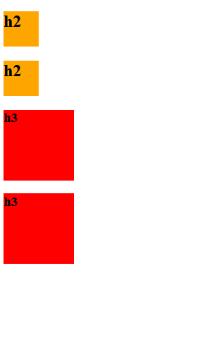

### 3、外联式

>css 样式的写法同内联式，但样式书写在 css 文件中，在 html 页面中用 link 标签
>引入 css 文件（建议在 head 标签中引入）

#### 1.css文件准备

```css
/* html 文件会引入该 css 文件，设置所有引入了 html 文件中的所有 p 标签宽高背景颜色 */
p {
    width: 50px;
    height: 50px;
    background-color: orange;
}
```

#### 2.html代码

```html
<!DOCTYPE html>
<html lang="en">
    <head>
        <meta charset="UTF-8">
        <title>Title</title>
        <!--
        rel="stylesheet"：引入的是层级样式表，也就是 css 文件
        type="text/css"：引入文件采用的是 css 语法书写文本类型代码
        href="css/my.css"：采用相当路径引入目标 css 文件
        -->
        <link rel="stylesheet" type="text/css" href="my.css">
    </head>
    <body>
        <!-- 该页面中的 p 标签样式都被 my.css 文件控制 -->
        <p></p>
        <p></p>
    </body>
</html>
```


### 4、总结

>总结：
>行间式控制样式最直接，但是样式多了直接导致页面可读性变差，且样式相同的标签样式也需要各自设置，复用性差；
>
>内联式可以用一套样式块同时控制多个标签，具有样式的复用性，但是 css 样式代码还是写在 html 文件中，在项目开发下，代码量剧增，导致 html 文件变得臃肿，不利于代码维护；
>
>外联式将 css 样式移到外部 css 文件中，不仅避免项目开发下 html 文件的臃肿问题，同时具有一套代码块控制多个标签，一个 css 样式文件服务于多个 html 两种复用性的好处，但是在学习阶段代码量不大时，样式不需要服务于多个 html 页面时，前面两种方式显然显得更便利。
>
>在行间式中，写在标签内部的样式自然是用来控制该标签的样式，那写在内联式和外联式中的样式又是通过什么样的联系来控制对应页面中标签的样式呢？答案就是用于建立 css 与 html 之间联系的 css 选择器。

## 四、选择器

### 1、介绍

>css 选择器本质就是 css 与 html 两种语法建立关联的特定标识符：
>
>就是在 css 语法中，通过 html 中标签的某种名字，与 html 具体的标签建立关联，从而使写在对应 css 选择器后的 css 样式能控制 html 中关联的标签或标签们。
>
>而表示标签名字的方式有多种，每一种名字在 css 语法中都对应这一种特定标识符，

### 2、基础选择器

#### 1.通配选择器

```html
/* 特定标识符 星号(*) -- 可以表示页面所有标签的名字 */
/* 通配选择器控制页面中所有的标签(不建议使用) */
* {
    /* 样式块 */
}
<!-- 页面中所有标签都能被匹配 -->
<html></html>
<body></body>
<div></div>
<p></p>
<i></i>
```

#### 2.标签选择器

```html
/* 特定标识符 标签名 */
/* 标签选择器控制页面中标签名为标签选择器名的所有标签*/
div { /* 控制页面中所有 div 标签的样式 */
    /* 样式块 */
}
<!-- 页面中所有的 div 标签都能被匹配 -->
<div></div>
<div class="sup">
    <div id='inner'></div>
</div>
```

#### 3.class 选择器（提倡使用）

```html
/* 特定标识符 点(.) */
/* class 选择器控制页面中标签全局属性 class 值为 class 择器名的所有标签*/
.box { /* 控制页面中所有标签全局属性 class 值为 box 标签的样式 */
    /* 样式块 */
}
<!-- 页面中 class 属性值为 box 的标签都能被匹配 -->
<div class="box"></div>
<p class="box">
    <i class="box"></i>
</p>
```

#### 4.id选择器

```html
/* 特定标识符 井号(#) */
/* id 选择器控制页面中标签全局属性 id 值为 id 择器名的唯一标签*/
#box { /* 控制页面中唯一标签全局属性 id 值为 box 标签的样式 */
    /* 样式块 */
}
<!-- 页面中 id 属性值为 box 的唯一标签备匹配，id 具有唯一性：一个页面中所有标签的 id 属性值不能重名 -->
<div id="box"></div>
```

#### 5.基础选择器优先级

>在一个页面中，难免会出现页面中的某一个标签的某一个样式被不同的选择器下的样式同时控制，也就是出现了多种方式下对目标标签的同一样式出现了重复控制，那到底是哪种选择器下的样式最终控制了目标标签，一定会有一套由弱到强的控制级别规则，这种规则就叫做优先级，下面的例子就很好的解释了各种基础选择器的优先级关系：

```html
<!DOCTYPE html>
<html lang="en">
    <head>
        <meta charset="UTF-8">
        <title>Title</title>
        <style>
        * {
            width: 50px;
            height: 50px;
            background-color: red;
            color: pink;
        }
        div {
            width: 60px;
            height: 60px;
            background-color: orange;
        }
        .box {
            width: 70px;
            height: 70px;
        }
        #ele {
            width: 80px;
        }
        </style>
    </head>
    <body>
        <div class="box" id="ele">文字内容</div>
    </body>
</html>
<!--
1. 四种选择器都控制目标标签的宽度，最终目标标签宽度为 80px，所以 id 选择器优先级最高
2. 三种选择器都控制目标标签的高度，最终目标标签宽度为 70px，所以 class 选择器优先级其次
3. 二种选择器都控制目标标签的背景颜色，最终目标标签背景颜色为 orange，所以标签选择器优先级再次
4. 只有一种选择器控制目标标签的字体颜色，目标标签字体颜色一定为 pink
优先级：通配选择器 < 标签选择器 < class 选择器 < id 选择器
-->
```

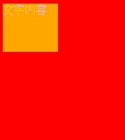

#### 6.优先级：案例2

```html
<!DOCTYPE html>
<html lang="en">
    <head>
        <meta charset="UTF-8">
            <title>Title</title>
        <meta name="viewport" content="width=device-width, initial-scale=1">
        <style>
        /*id 选择器*/
        #d1 { /*找到 id 是 d1 的标签 将文本颜色变成绿黄色*/
            color: greenyellow;
        }
        /*类选择器*/
        .c1 { /*找到 class 值里面包含 c1 的标签*/
            color: red;
        }
        /*元素(标签)选择器*/
        span { /*找到所有的 span 标签*/
            color: red;
        }
        /*通用选择器*/
        * { /*将 html 页面上所有的标签全部找到*/
            color: green;
        }
        </style>
    </head>
    <body>
        <div id="d1" class="c1 c2">div
            <p>div 里面的 p</p>
            <span>div 里面的 span</span>
        </div>
        <p id="d2" class="c1 c2">ppp</p>
        <span id="d3" class="c2">span111</span>
        <span id="d4" class="c3">span222</span>
    </body>
</html>
```

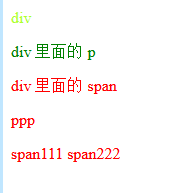

### 3、复杂选择器

#### 1.群组选择器

```html
/* 连接标识符 逗号(,) */
/* 群组选择器就是一套样式块同时控制用逗号连接(,)的所有目标标签 */
div, p, .box, #ele {
    /* 样式块 */
}
<!-- 页面中所有 div 标签、所有 p 标签、所有 class 属性值为 box、唯一 id 属性值为ele 的标签都能被匹配 -->
<div>
    <div></div>
</div>
<p></p>
<p></p>
<i class="box"></i>
<span class="box"></span>
<b id="ele"></b>
```

#### 2.后代选择器

```html
/* 连接标识符 空格( ) */
/* 后代选择器控制的是最后置的选择器位匹配到目标标签(们)，前置位的所有选择器都是修饰 */
body .box i {
/*最后置位的选择器为 i 标签选择器，前置位 body 标签选择器、class 值为 box 的 class 选择器都是修饰*/
    /* 样式块 */
}
<!-- body 标签内部的 class 属性值为 box 内部的 i 标签们都能被匹配，所以只匹配 i标签，其他都是修饰 -->
<body>
    <div class='box'>
        <span><i></i></span><!-- body 与.box 是直接父子关系，.box 与 i 是间接父子关系，能被匹配 -->
    </div>
    <div>
        <span class='box'><i></i></span><!-- body 与.box 是间接父子关系，.box 与 i 是直接父子关系，能被匹配 -->
    </div>
</body>
<!-- 标签的嵌套结构形成父子代标签，后代选择器可以匹配直接父子关系或间距父子关系形成的层次，所以两个 i 标签均能被匹配 -->
```

#### 3.子代选择器（儿子选择器）

```html
/* 连接标识符 大于号(>) */
/* 子代选择器控制的是最后置的选择器位匹配到目标标签(们)，前置位的所有选择器都是修饰 */
body>.box>i {
/*最后置位的选择器为 i 标签选择器，前置位 body 标签选择器、class 值为 box 的 class 选择器都是修饰*/
    /* 样式块 */
}
<!-- body>.box>i：同理 body 和.box 都是修饰位，i 才是目标匹配位 -->
<body>
    <div class='box'>
    	<span><i></i></span><!-- body 与.box 是直接父子关系，.box 与 i 是间接父子关系，不能被匹配 -->
    </div>
    <div>
    	<span class='box'><i></i></span><!-- body 与.box 是间接父子关系，.box 与 i 是直接父子关系，不能被匹配 -->
    </div>
    <div class='box'>
    	<i></i><!-- body 与.box 是直接父子关系，.box 与 i 是直接父子关系，能被匹配 -->
    </div>
</body>
<!-- 子代选择器只能匹配直接父子关系，所以只能匹配最后一个 i 标签 -->
```

#### 4.兄弟选择器(弟弟选择器)

```html
/* 连接标识符 波浪号(~) */
/* 兄弟选择器控制的是最后置的选择器位匹配到目标标签(们)，前置位的所有选择器都是修饰 */
#ele~div~i {
	/*最后置位的选择器为 i 标签选择器，前置位 id 值为 ele 的 id 选择器、div 标签选择器都是修饰*/
/* 样式块 */
}
<!-- #ele~div~i：同理#ele 和 div 都是修饰位，i 才是目标匹配位 -->
<h3 id="ele"></h3>
<div></div><!-- #ele 与 div 是直接兄弟关系 -->
<i></i><!-- div 与 i 是直接兄弟关系，能被匹配 -->
<div></div><!-- #ele 与 div 是间距兄弟关系 -->
<i></i><!-- div 与 i 是直接兄弟关系，能被匹配 -->
<!-- 标签的上下结构形成兄弟标签，兄弟选择器可以匹配直接兄弟关系或间距兄弟关系形成的层次，所以两个 i 标签均能被匹配 -->
```

#### 5.相邻选择器（毗邻选择器）

```html
/* 连接标识符 加号(+) */
/* 相邻选择器控制的是最后置的选择器位匹配到目标标签(们)，前置位的所有选择器都是修饰 */
#ele+div+i {
/*最后置位的选择器为 i 标签选择器，前置位 id 值为 ele 的 id 选择器、div 标签选
择器都是修饰*/
	/* 样式块 */
}
<!-- #ele+div+i：同理#ele 和 div 都是修饰位，i 才是目标匹配位 -->
<h3 id="ele"></h3>
<div></div><!-- #ele 与 div 是直接兄弟关系 -->
<i></i><!-- div 与 i 是直接兄弟关系，能被匹配 -->
<div></div><!-- #ele 与 div 是间距兄弟关系 -->
<i></i><!-- div 与 i 是直接兄弟关系，不能被匹配 -->
<!-- 相邻选择器只能匹配直接兄弟关系，所以只能匹配第一个 i 标签 -->
```

#### 6.交叉选择器

```html
/* 连接标识符 紧挨着(没有任何连接符) */
/* 交叉选择器本质上是对一个目标标签的多个名字的同时表示 */
div.box#ele.tag {
/*div 是标签名，box 和 tag 都是 class 属性值，ele 是 id 属性值*/
    /* 样式块 */
}
<!-- 标签名 div、class 名 box 及 tag 和 id 名 ele 都是对一个目标标签的修饰空格隔开 -->
<!-- class 属性拥有多个值时，多个值之间用空格隔开 -->
<div class="box tag" id="ele"></div>
```

#### 7.属性选择器

```css
/*用于选取带有指定属性的元素。*/
p[title] {
    color: red;
}

/*用于选取带有指定属性和值的元素。*/
p[title="213"] {
    color: green;
}
```

#### 8.不怎么常用的属性选择器

```css
/*找到所有 title 属性以 hello 开头的元素*/
[title^="hello"] {
	color: red;
}

/*找到所有 title 属性以 hello 结尾的元素*/
[title$="hello"] {
	color: yellow;
}

/*找到所有 title 属性中包含（字符串包含）hello 的元素*/
[title*="hello"] {
	color: red;
}

/*找到所有 title 属性(有多个值或值以空格分割)中有一个值为 hello 的元素：*/
[title~="hello"] {
	color: green;
}
```

#### 9.基础选择器优先级

>简单选择器存在优先级，优先级的前提就是不同选择器同时控制同一标签的同一属性，那么在复杂选择器下，一定会出现这种同时控制同一标签的同一属性情况，那复杂选择器的优先级又是如何来规定的呢？
>1. 复杂选择器的种类并不会影响优先级
>-- 后代：div #ele | 兄弟：div~#ele | 交叉：div#ele 优先级一样
>2. 复杂选择器本质是通过同类型(简单选择器)的个数来确定优先级
>-- 三层标签选择器后代：body div i 大于 两层标签选择器后代：div i |
>body i
>3. 简单选择器的优先级起关键性作用，也就是一个 id 选择器要大于无限个 class 选择
>器，一个 class 选择器要大于无限个标签选择器
>-- id 选择器：#i 大于 n 层 class 选择器：.box .i
>-- class 选择器：.box 大于 n 层标签选择器：body div

#### 10.案例

```html
<!DOCTYPE html>
<html lang="en">
    <head>
    <meta charset="UTF-8">
    <title>Title</title>
    <meta name="viewport" content="width=device-width, initial-scale=1">
        <style>
            /*后代选择器*/
            div span {
                color: red;
            }
            /*儿子选择器*/
            div>span {
                color: red;
            }
            /*毗邻选择器*/
            div+span { /*同级别紧挨着的下面的第一个*/
                color: aqua;
            }
            /*弟弟选择器*/
            div~span { /*同级别下面所有的 span*/
                color: red;
            }
        </style>
    </head>
    <body>
        <span>span1</span>
        <span>span2</span>
        <div>div
            <p>div p</p>
            <p>div p
                <span>div p span</span>
            </p>
            <span>span</span>
            <span>span</span>
        </div>
        <span>span</span>
        <span>span</span>
        <p>ppp</p>
        <span>span</span>
    </body>
</html>
```

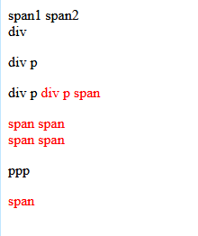

```html
<!DOCTYPE html>
<html lang="en">
    <head>
        <meta charset="UTF-8">
        <title>Title</title>
        <meta name="viewport" content="width=device-width, initial-scale=1">
        <style>
            [username] { /*将所有含有属性名是 username 的标签背景色改为红色*/
                background-color: red;
            }
            [username='11111'] { /*找到所有属性名是 username 并且属性值是 11111 的标签*/
                background-color: orange;
            }
            input[username='22222'] { /*找到所有属性名是 username 并且属性值是 22222 的 input 标签*/
                background-color: wheat;
            }
        </style>
    </head>
    <body>
        <input type="text" username>
        <input type="text" username="11111">
        <input type="text" username="22222">
        <p username="3333">3333</p>
        <div username="22222">22222</div>
        <span username="11111">11111 </span>
    </body>
</html>
```

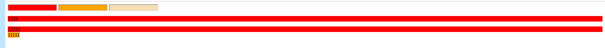

```html
<!DOCTYPE html>
<html lang="en">
    <head>
        <meta charset="UTF-8">
        <title>Title</title>
        <meta name="viewport" content="width=device-width, initial-scale=1">
    </head>
    <body>
        <input type="text" placeholder="用户名">
        <p id="d1" class="c1"></p>
    </body>
</html>
```

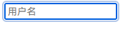


### 4、分组和嵌套

#### 1.分组

>当多个元素的样式相同的时候，我们没有必要重复地为每个元素都设置样式，我们可以通过在多个选择器之间使用逗号分隔的分组选择器来统一设置元素样式。

```css
div, p {
    color: red;
}
```

>上面的代码为 div 标签和 p 标签统一设置字体为红色。
>通常，我们会分两行来写，更清晰:

```css
div,
p {
    color: red;
}
```

#### 2.嵌套

>多种选择器可以混合起来使用，比如：.c1 类内部所有 p 标签设置字体颜色为红色。

```css
.c1 p {
    color: red;
}
```

#### 3.案例

```html
<!DOCTYPE html>
<html lang="en">
    <head>
    <meta charset="UTF-8">
    <title>Title</title>
    <meta name="viewport" content="width=device-width, initial-scale=1">
    <style>
        div,p,span { /*逗号表示并列关系*/
            color: yellow;
        }
        #d1,.c1,span {
            color: orange;
        }
        #d1 .c2 span{
            color: red;
        }
    </style>
    </head>
    <body>
        <div id="d1">div
            <p class="c2">div>p
                <span id="d3">div>p>span1</span>
                <span id="d4">div>p>span2</span>
            </p>
            <p class="c3">
                sadjasdjkasldj
            </p>
        </div>
        <p class="c1">p</p>
        <span>span</span>
    </body>
</html>
```

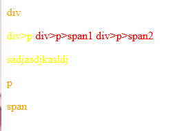

### 5、伪类选择器

```css
/* 未访问的链接 */
a:link {
	color: #FF0000
}

/* 鼠标移动到链接上 */
a:hover {
	color: #FF00FF
}

/* 选定的链接 */
a:active {
	color: #0000FF
}

/* 已访问的链接 */
a:visited {
	color: #00FF00
}

/*input 输入框获取焦点时样式*/
input:focus {
    outline: none;
    background-color: #eee;
}
```

#### 案例

```html
<!DOCTYPE html>
<html lang="en">
    <head>
        <meta charset="UTF-8">
        <title>Title</title>
        <meta name="viewport" content="width=device-width, initial-scale=1">
        <style>
            body {
                background-color: black;
            }
            a:link { /*访问之前的状态*/
                color: red;
            }
            a:hover { /*需要记住*/
                color: aqua; /*鼠标悬浮态*/
            }
            a:active {
                color: black; /*鼠标点击不松开的状态 激活态*/
            }
            a:visited {
                color: darkgray; /*访问之后的状态*/
            }
            p {
                color: darkgray;
                font-size: 48px;
            }
            p:hover {
                color: white;
            }
            input:focus { /*input 框获取焦点(鼠标点了 input 框)*/
                background-color: red;
            }
        </style>
    </head>
    <body>
        <a href="https://www.jd.com/">小轩在不在?</a>
        <p>点我有你好看哦</p>
        <input type="text">
    </body>
</html>
```

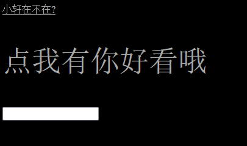

### 6、伪元素装饰器

```css
/*first-letter*/
/*常用的给首字母设置特殊样式：*/
p:first-letter {
    font-size: 48px;
    color: red;
}
/*before*/
/*在每个<p>元素之前插入内容*/
p:before {
    content:"*";
    color:red;
}
/*after*/
/*在每个<p>元素之后插入内容*/
p:after {
    content:"[?]";
    color:blue;
}
/*before 和 after 多用于清除浮动。*/
```

#### 案例

```html
<!DOCTYPE html>
<html lang="en">
    <head>
        <meta charset="UTF-8">
        <title>Title</title>
        <meta name="viewport" content="width=device-width, initial-scale=1">
        <style>
            p:first-letter {
                font-size: 48px;
                color: orange;
            }
            p:before { /*在文本开头 同 css 添加内容*/
                content: '你说的对';
                color: blue;
            }
            p:after {
                content: '雨露均沾';
                color: orange;
            }
        </style>
    </head>
    <body>
        <p>装备差进任何本都是血赚,装备差进任何本都是血赚</p>
    </body>
</html>
```

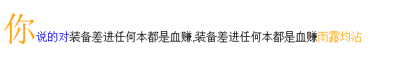

### 7、选择器优先级

#### 1.css继承

>继承是 CSS 的一个主要特征，它是依赖于祖先-后代的关系的。继承是一种机制，它允许样式不仅可以应用于某个特定的元素，还可以应用于它的后代。例如一个body 定义了的字体颜色值也会应用到段落的文本中。

```css
body {
    color: red;
}
```

>此时页面上所有标签都会继承 body 的字体颜色。然而 CSS 继承性的权重是非常低的，是比普通元素的权重还要低的 0。
>我们只要给对应的标签设置字体颜色就可覆盖掉它继承的样式。

```css
p {
    color: green;
}
```

>此外，继承是 CSS 重要的一部分，我们甚至不用去考虑它为什么能够这样，但 CSS继承也是有限制的。有一些属性不能被继承，如：border, margin, padding,background 等。

#### 2.选择器的优先级

>我们上面学了很多的选择器，也就是说在一个 HTML 页面中有很多种方式找到一个元素并且为其设置样式，那浏览器根据什么来决定应该应用哪个样式呢？

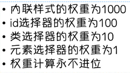

>除此之外还可以通过添加 !important 方式来强制让样式生效，但并不推荐使用。
>因为如果过多的使用!important 会使样式文件混乱不易维护。万不得已可以使用!important

```css
body {
	color : red !important;
}
```

#### 3.案例

>my.css

```css
p {
    color: greenyellow;
}
```

```html
<!DOCTYPE html>
<html lang="en">
    <head>
    <meta charset="UTF-8">
    <title>Title</title>
    <meta name="viewport" content="width=device-width, initial-scale=1">
    <style>
        /*
        1.选择器相同 书写顺序不同
        就近原则:谁离标签更近就听谁的
        2.选择器不同 ...
        行内 > id 选择器 > 类选择器 > 标签选择器
        精确度越高越有效
        */
        #d1 {
        color: aqua;
        }
        .c1 {
         color: orange;
        }
        p {
         color: red;
        }
    </style>
        <link rel="stylesheet" href="my.css">
    </head>
    <body>
        <p id="d1" class="c1" style="color: blue">庭中三千梨花树，再无一朵入我心。</p>
    </body>
</html>
```

## 五、CSS3 基础样式

### 1、宽和高

>width 属性可以为元素设置宽度。
>
>height 属性可以为元素设置高度。
>
>块级标签才能设置宽度，内联标签的宽度由内容来决定(行内标签无法设置宽度，设置了也不会生效)。

```html
<!DOCTYPE html>
<html lang="en">
    <head>
    <meta charset="UTF-8">
    <title>Title</title>
    <meta name="viewport" content="width=device-width, initial-scale=1">
    <style>
        p {
            background-color: red;
            height: 200px;
            width: 400px;
        }
        span {
            background-color: green;
            height: 200px;
            width: 400px;
            /*行内标签无法设置长宽 就算你写了 也不会生效*/
        }
    </style>
    </head>
    <body>
        <p>ppp</p>
        <span>span</span>
    </body>
</html>
```

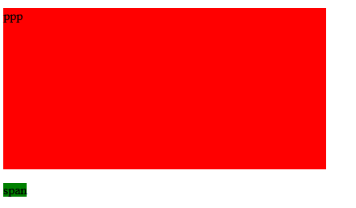

### 2、字体属性

#### 1.文字属性

>font-family 可以把多个字体名称作为一个“回退”系统来保存。如果浏览器不支持第一个字体，则会尝试下一个。浏览器会使用它可识别的第一个值。

```css
body {
    font-family: "Microsoft Yahei", "微软雅黑", "Arial", sans-serif
}
```

#### 2.字体大小

>如果设置成 inherit 表示继承父元素的字体大小值。

```css
p {
    font-size: 14px;
}
```

#### 3.字重（粗细）

>font-weight 用来设置字体的字重（粗细）。
>
>normal 默认值，标准粗细
>bold 粗体
>bolder 更粗
>lighter 更细
>100~900 设置具体粗细，400 等同于 normal，而 700 等同于 bold
>inherit 继承父元素字体的粗细值

#### 4.文本颜色

>颜色属性被用来设置文字的颜色。
>颜色是通过 CSS 最经常的指定：
>• 十六进制值 - 如: ＃FF0000
>• 一个 RGB 值 - 如: RGB(255,0,0)
>• 颜色的名称 - 如: red
>还有 rgba(255,0,0,0.3)，第四个值为 alpha, 指定了色彩的透明度/不透明度，它的范围为 0.0 到 1.0 之间。

#### 5.总结

```css
/*字族：STSong 作为首选字体, 微软雅黑作为备用字体*/
font-family: "STSong", "微软雅黑";

/*字体大小*/
font-size: 40px;

/*字重：100、200、300、400、500、600、700、800、900，值越大字越粗*/
font-weight: 900;

/*行高: 字体文本默认在行高中垂直居中显示*/
line-height: 200px;

/*字划线: overline(上划线) | line-through(中划线) | underline(下划线) | n技术星球：egonlin.com
one(取消划线) */
text-decoration: overline;

/*字间距*/
letter-spacing: 2px;

/*词间距*/
word-spacing: 5px;

/*首行缩进：1em 相当于一个字的宽度*/
text-indent: 2em;

/*字体颜色*/
color: red;

/* 文本水平排列方式：left(水平居左) | center(水平居中) | right(水平居右) */
text-align: center;
```

#### 6.案例

```html
<!DOCTYPE html>
<html lang="en">
    <head>
        <meta charset="UTF-8">
        <title>Title</title>
        <meta name="viewport" content="width=device-width, initial-scale=1">
        <style>
            p {
                font-family: "Arial Black","微软雅黑","..."; /*第一个不生效就用后面的 写多个备用*/
                font-size: 24px; /*字体大小*/
                font-weight: inherit; /*bolder lighter 100~900 inherit 继承父元素的粗细值*/
                color: red; /*直接写颜色英文*/
                color: #ee762e; /*颜色编号*/
                color: rgb(128,23,45); /*三基色 数字 范围 0-255*/
                color: rgba(23, 128, 91, 0.9); /*第四个参数是颜色的透明度范围是 0-1*/
                /*当你想要一些颜色的时候 可以利用现成的工具
                1 pycharm 提供的取色器
                2 qq 或者微信截图功能
                微信公众号:软件管家...
                */
            }
        </style>
    </head>
    <body>
        <p>曹老板 抬人！！！fuck off!</p>
    </body>
</html>
```

### 3、文字属性

#### 1.文字对齐

>text-align 属性规定元素中的文本的水平对齐方式。
>
>left 左边对齐 默认值
>right 右对齐
>center 居中对齐
>justify 两端对齐

#### 2.文字装饰

>text-decoration 属性用来给文字添加特殊效果。
>
>none 默认。定义标准的文本。
>underline 定义文本下的一条线。
>overline 定义文本上的一条线。
>line-through 定义穿过文本下的一条线。
>inherit 继承父元素的 text-decoration 属性的值。
>
>常用的为去掉 a 标签默认的自划线：
>
>```css
>a {
>    text-decoration: none;
>}
>```

#### 3.首行缩进

>将段落的第一行缩进 32 像素：
>```css
>p {
>	text-indent: 32px;
>}
>```

#### 4.案例

```html
<!DOCTYPE html>
<html lang="en">
    <head>
    <meta charset="UTF-8">
    <title>Title</title>
    <meta name="viewport" content="width=device-width, initial-scale=1">
        <style>
            p {
                /*text-align: center; !*居中*!*/
                /*text-align: right;*/
                /*text-align: left;*/
                /*text-align: justify; !*两端对齐*!*/
                /*text-decoration: underline;*/
                /*text-decoration: overline;*/
                /*text-decoration: line-through;*/
                /*text-decoration: none;*/
                /*在 html 中 有很多标签渲染出来的样式效果是一样的*/
                font-size: 16px;
                text-indent: 32px; /*缩进 32px*/
            }
            a {
            text-decoration: none; /*主要用于给 a 标签去掉自带的下划线 需要掌握*/
            }
        </style>
    </head>
        <body>
        <!-- <p>我要感谢我的导师，要不是他，我论文早写完了（狗头）</p>-->
        <!--<a href="https://www.mzitu.com/">点我</a>-->
        <p>我要感谢我的导师，要不是他，我论文早写完了（狗头）,我要感谢我的导师，要不是他，我论文早写完了（狗头）,我要感谢我的导师，要不是他，我论文早写完了（狗头）</p>
    </body>
</html>
```

### 4、背景属性

#### 1.基本使用

```css
/*背景颜色*/
background-color: red;

/*背景图片*/
background-image: url('1.jpg');

/*
背景重复
repeat(默认):背景图片平铺排满整个网页
repeat-x：背景图片只在水平方向上平铺
repeat-y：背景图片只在垂直方向上平铺
no-repeat：背景图片不平铺
*/
background-repeat: no-repeat;

/*背景位置*/
background-position: left top;
/*background-position: 200px 200px;*/
```

#### 2.支持简写

>```css
>background:#336699 url('1.png') no-repeat left top;
>```
>
>使用背景图片的一个常见案例就是很多网站会把很多小图标放在一张图片上，然后根据位置去显示图片。减少频繁的图片请求。

#### 3.案例

```html
<!DOCTYPE html>
<html lang="en">
    <head>
    <meta charset="UTF-8">
    <meta name="viewport" content="width=device-width, initial-scale=1.0">
    <meta http-equiv="X-UA-Compatible" content="ie=edge">
    <title>滚动背景图示例</title>
        <style>
        * {
            margin: 0;
        }
        .box {
            width: 100%;
            height: 100px;
            background: url("https://md2web.dudewu.top/favicon.ico") center center;
            background-attachment: fixed;
        }
        .d1 {
            height: 100px;
            background-color: tomato;
        }
        .d2 {
            height: 100px;
            background-color: steelblue;
        }
        .d3 {
            height: 100px;
            background-color: mediumorchid;
        }
        </style>
    </head>
    <body>
        <div class="d1"></div>
        <div class="box"></div>
        <div class="d2"></div>
        <div class="d3"></div>
    </body>
</html>
```

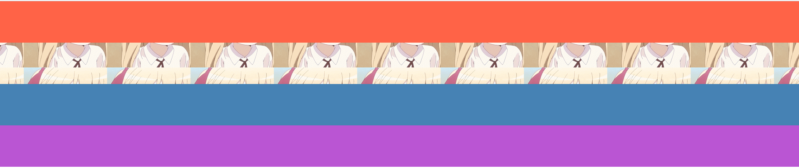

```css
<!DOCTYPE html>
<html lang="en">
    <head>
    <meta charset="UTF-8">
    <title>Title</title>
    <meta name="viewport" content="width=device-width, initial-scale=1">
        <style>
            div {
                height: 800px;
                width: 800px;
                /*background-color: red;*/
                /*背景图片*/
                /*background-image: url("222.png"); !*默认要全部铺满*!*/
                /*background-repeat: no-repeat; !*不铺*!*/
                /*background-repeat: no-repeat; !*不铺*!*/
                /*background-repeat:repeat-x; */
                /*background-repeat:repeat-y; */
                /*其实浏览器不是一个平面 是一个三维立体结构
                z 轴指向用户 越大离用户越近
                */
                /*background-position:center center; !*第一个左 第二个上*!
                */
                /*如果出现了多个属性名前缀是一样的情况 一般情况下都可以简写 只写
                前缀*/
                background: red url("https://md2web.dudewu.top/favicon.ico") no-repeat center center; /*
                只需要填上你想要加的参数即可 位置没有关系 参数个数也不做限制 加就显示不加就用
                默认的设置*/
            }
        </style>
    </head>
    <body>
        <div></div>
    </body>
</html>

```

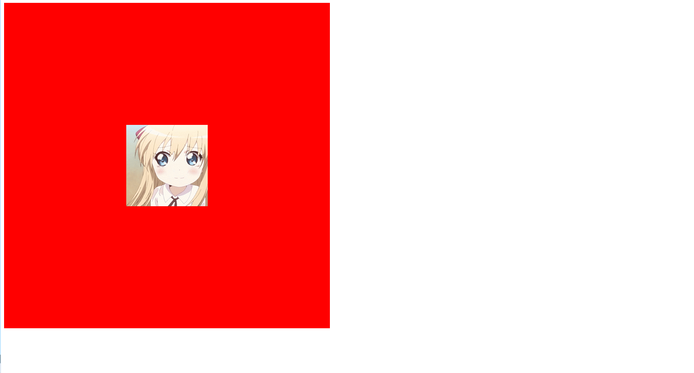

### 5、边框

#### 1.边框属性

```css
• border-width
• border-style
• border-color
#i1 {
    border-width: 2px;
    border-style: solid;
    border-color: red;
}

通常使用简写方式：
#i1 {
    border: 2px solid red;
}
```

#### 2.边框样式

>none 无边框。
>dotted 点状虚线边框。
>dashed 矩形虚线边框。
>solid 实线边框。
>除了可以统一设置边框外还可以单独为某一个边框设置样式，如下所示

```css
#i1 {
    border-top-style:dotted;
    border-top-color: red;
    border-right-style:solid;
    border-bottom-style:dotted;
    border-left-style:none;
}
```

#### 3.案例

```html
<!DOCTYPE html>
<html lang="en">
    <head>
        <meta charset="UTF-8">
        <title>Title</title>
        <meta name="viewport" content="width=device-width, initial-scale=1">
        <style>
            p {
                background-color: red;
                border-width: 5px;
                border-style: solid;
                border-color: green;
            }
            div {
                /*border-left-width: 5px;*/
                /*border-left-color: red;*/
                /*border-left-style: dotted;*/
                /*border-right-width: 10px;*/
                /*border-right-color: greenyellow;*/
                /*border-right-style: solid;*/
                /*border-top-width: 15px;*/
                /*border-top-color: deeppink;*/
                /*border-top-style: dashed;*/
                /*border-bottom-width: 10px;*/
                /*border-bottom-color: tomato;*/
                /*border-bottom-style: solid;*/
                border: 3px solid red; /*三者位置可以随意写*/
            }
            #d1 {
                background-color: greenyellow;
                height: 400px;
                width: 400px;
                border-radius: 50%; /*直接写 50%即可 长宽一样就是圆 不一样就是椭圆*/
            }
        </style>
    </head>
    <body>
        <p>穷人 被 diss 到了 哭泣.png</p>
        <div>妈拉个巴子,妈拉个巴子,妈拉个巴子,妈拉个巴子</div>
        <div id="d1"></div>
    </body>
</html>
```

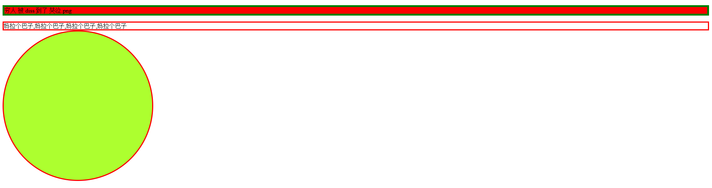

### 6、border-radius

>用这个属性能实现圆角边框的效果。
>将 border-radius 设置为长或高的一半即可得到一个圆形。
>
>```css
>#di{
>    border-radius:50%
>}
>```

### 7、display 属性（显示样式）

#### 1.介绍

>用于控制 HTML 元素的显示效果。
>
>
>
>display:"none"   HTML 文档中元素存在，但是在浏览器中不显示,占用位置也让出。一般用于配合 JavaScript 代码使用。
>
>display:"block"   默认占满整个页面宽度，如果设置了指定宽度，则会用margin 填充剩下的部分。
>display:"inline"   按行内元素显示，此时再设置元素的 width、height、margin-top、margin-bottom 和 float 属性都不会有什么影响。
>display:"inline-block"    使元素同时具有行内元素和块级元素的特点。
>
>display:"none"与 visibility:hidden 的区别：
>visibility:hidden:    可以隐藏某个元素，但隐藏的元素仍需占用与未隐藏之前一样的空间。也就是说，该元素虽然被隐藏了，但仍然会影响布局。
>display:none:    可以隐藏某个元素，且隐藏的元素不会占用任何空间。也就是说，该元素不但被隐藏了，而且该元素原本占用的空间也会从页面布局中消失。

#### 2.详细

>HTML5 预定义了很多系统标签，大家学习了 html 标签部分的时候，肯定注意到了，不同的标签在页面中的显示效果是不一样的，比如两个 div 之间默认会换行显示，而两个 span 标签却在一行来显示，到底是什么样式控制着标签这种显示效果呢，那就是显示样式 display 来控制的。

```html
• display: block;
<div style="display: block;"></div>
<span style="display: block;"></span>
<i style="display: block;"></i>
<!--
1. 任意标签的 display 样式值均可以设置为 block，那么该标签就会以 block 方式来显示
2. block 方式显示的标签，默认会换行
3. block 方式显示的标签，支持所有的 css 样式
4. block 方式显示的标签，可以嵌套所有显示方式的标签
注：标题标签和段落标签虽然也是 block 显示类标签，但不建议嵌套 block 显示类标签
-->


• display: inline;
<div style="display: inline;"></div>
<span style="display: inline;"></span>
<i style="display: inline;"></i>
<!--
1. 任意标签的 display 样式值均可以设置为 inline，那么该标签就会以 inline 方式来显示
2. inline 方式显示的标签，默认不会换
3. inline 方式显示的标签，不支持所有 css 样式(如：不支持手动设置该标签的宽高)
4. inline 方式显示的标签，建议只用来嵌套所有 inline 显示方式的标签
-->

• display: inline-block;
<div style="display: inline-block;"></div>
<span style="display: inline-block;"></span>
<i style="display: inline-block;"></i>
<!--
1. 任意标签的 display 样式值均可以设置为 inline-block，那么该标签就会以 inline-block 方式来显示
2. inline-block 方式显示的标签，具有 inline 特性，默认不换行
3. inline-block 方式显示的标签，也具备 block 特征，支持所有 css 样式
4. inline-block 方式显示的标签，不建议嵌套任意显示方式的标签
-->
```

#### 3.案例

```html
<!DOCTYPE html>
<html lang="en">
    <head>
    <meta charset="UTF-8">
    <title>Title</title>
    <meta name="viewport" content="width=device-width, initial-scale=1">
        <style>
            #d1 {
                display: none; /*隐藏标签不展示到前端页面并且原来的位置也不再占有了 但是还存在于文档上*/
             /*display: inline; !*将标签设置为行内标签的特点*!*/
            }
            #d2 {
                display: inline;
            }
            #d1 {
                display: block; /*将标签设置成块儿级标签的特点*/
            }
            #d2 {
                display: block;
            }
            #d1 {
                display: inline-block;
            }
            #d2 {
                display: inline-block; /*标签即可以在一行显示又可以设置长宽*/
            }
        </style>
    </head>
    <body>
        <div style="display: none">div1</div>
        <div>div2</div>
        <div style="visibility: hidden">单纯的隐藏 位置还在</div>
        <div>div4</div>
        <div id="d1" style="height: 100px;width: 100px;background-color: red">01</div>
        <div id="d2" style="height: 100px;width: 100px;background-color: greenyellow">02</div>
        <span id="d1" style="height: 100px;width: 100px;background-color: red">span</span>
        <span id="d2" style="height: 100px;width: 100px;background-color: greenyellow">span</span>
        <div id="d1" style="height: 100px;width: 100px;background-color: red">01</div>
        <div id="d2" style="height: 100px;width: 100px;background-color: greenyellow">02</div>
    </body>
</html>
```

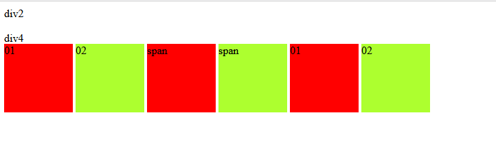

## 六、CSS基础布局

### 1、布局相关 的标签

>-  `<div></div>` 定义文档中的分区或节
>- `<span></span>` 这是一个行内元素，没有任何意义
>- `<header></header>` HTML5 新增 定义 section 或 page 的页眉
>- `<footer></footer>` HTML5 新增 定义 section 或 page 的页脚
>- `<main></main>` HTML5 新增 标签规定文档的主要内容。<main> 元素中的内容对于文档来说应当是唯一的。它不应包含在 文档中重复出现的内容，比如侧栏、导航栏、版权信息、站点标志或搜索表单。IE 都不识别
>- `<nav></nav>` HTML5 新增 表示链接导航部分 如果文档中有“前后”按钮，则应该把它放到元素中
>- `<section></section>` HTML5 新增 定义文档中的节 通常不推荐那些没有标题的内容使用 section
>- `<article></article>` HTML5 新增 定义文章 论坛帖子 报纸文章 博客条目用户评论
>- `<aside></aside>` HTML5 新增 相关内容，相关辅助信息，如侧边栏

### 2、盒子模型

#### 1.什么是盒子模型？

>以快递盒为例
>
>>margin（外边距）：标签与标签之间的距离（快递盒与快递盒之间的距离）
>>
>>border（边框）：标签边框的厚度（快递盒的厚度）
>>
>>padding（内边距）：内容到边框的距离（盒子里面的物体到盒子距离）
>>
>>content（内容）：内容的大小（盒子内部物体的大小）

>如果你想要调整标签与标签之间的距离 你就可以调整 margin
>
>浏览器会自带 8px 的 margin，一般情况下我们在写页面的时候，上来就会先将 body 的 margin 去除

#### 2.margin外边距

##### 1）基础使用-四边单独设置

```html
<!DOCTYPE html>
<html lang="en">
    <head>
    <meta charset="UTF-8">
    <title>Title</title>
    <meta name="viewport" content="width=device-width, initial-scale=1">
        <style>
            .box {
                margin-top:5px;
                margin-right:10px;
                margin-bottom:15px;
                margin-left:20px;
            }
        </style>
    </head>
    <body>
        <div class="box">This is a box with margin.</div>
    </body>
</html>
```

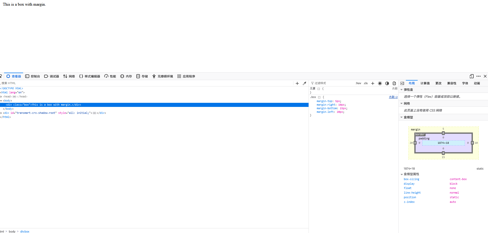

##### 2）简写-四边单独设置

>顺序：上右下左

```html
<!DOCTYPE html>
<html lang="en">
    <head>
    <meta charset="UTF-8">
    <title>Title</title>
    <meta name="viewport" content="width=device-width, initial-scale=1">
        <style>
            .box {
                margin: 5px 10px 15px 20px;
            }
        </style>
    </head>
    <body>
        <div class="box">This is a box with margin.</div>
    </body>
</html>
```

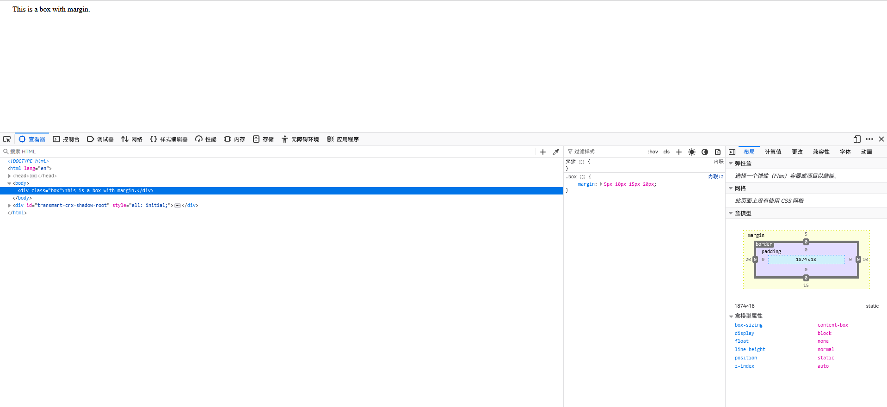

##### 3）简写-四边距离一样

```html
<!DOCTYPE html>
<html lang="en">
    <head>
    <meta charset="UTF-8">
    <title>Title</title>
    <meta name="viewport" content="width=device-width, initial-scale=1">
        <style>
            .box {
                margin: 5px;
            }
        </style>
    </head>
    <body>
        <div class="box">This is a box with margin.</div>
    </body>
</html>
```

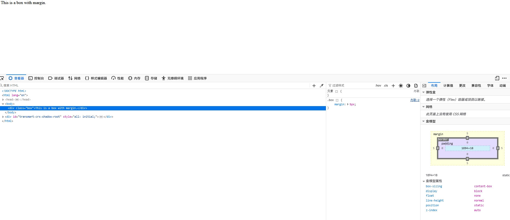

##### 4）去除自带body大小

>body的margin设置成0

```html
<!DOCTYPE html>
<html lang="en">
    <head>
    <meta charset="UTF-8">
    <title>Title</title>
    <meta name="viewport" content="width=device-width, initial-scale=1">
        <style>
            body {
                margin: 0;
            }
            .box {
                margin: 5px;
            }
        </style>
    </head>
    <body>
        <div class="box">This is a box with margin.</div>
    </body>
</html>
```

##### 5）居中

```html
<!DOCTYPE html>
<html lang="en">
    <head>
    <meta charset="UTF-8">
    <title>Title</title>
    <meta name="viewport" content="width=device-width, initial-scale=1">
        <style>
            #d1 {
                border: 3px solid red;
                height: 400px;
                width: 400px;
            }
            #d2 {
                border: 1px solid orange;
                height: 50px;
                width: 50px;
                background-color: blue;
                margin: 0 auto; /*只能做到标签的水平居中*/
            }
        </style>
    </head>
    <body>
        <div id="d1">
            <div id="d2">
            </div>
        </div>
    </body>
</html>
```

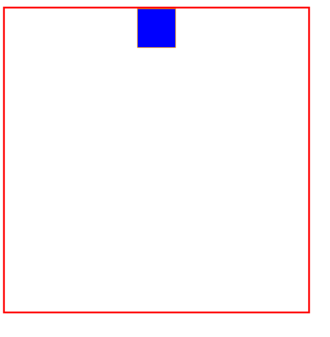

#### 3.padding 内填充

```html
.padding-test {
    padding-top: 5px;
    padding-right: 10px;
    padding-bottom: 15px;
    padding-left: 20px;
}

推荐使用简写：
.padding-test {
    padding: 5px 10px 15px 20px;
}

顺序：上右下左

补充 padding 的常用简写方式：
• 提供一个，用于四边；
• 提供两个，第一个用于上－下，第二个用于左－右；
• 如果提供三个，第一个用于上，第二个用于左－右，第三个用于下；
• 提供四个参数值，将按上－右－下－左的顺序作用于四边
```

```html
<!DOCTYPE html>
<html lang="en">
<head>
    <meta charset="UTF-8">
    <title>Title</title>
    <meta name="viewport" content="width=device-width, initial-scale=1">
    <style>
        p {
            border: 3px solid red;
            padding-left: 10px;
            padding-top: 20px;
            padding-right: 20px;
            padding-bottom: 50px;
            padding: 10px;
            padding: 10px 20px;
            padding: 10px 20px 30px;
            padding: 10px 20px 30px 40px; /*规律和 margin 一模一样*/
        }
    </style>
</head>
<body>
<p>ppp</p>
</body>
</html>
```

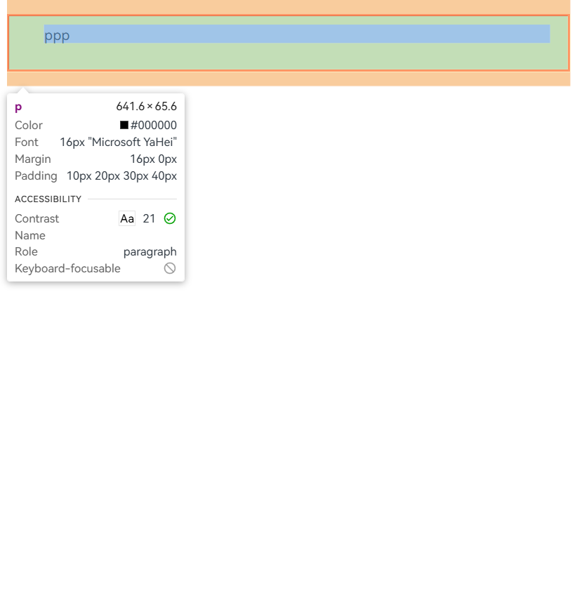

### 3、浮动（float）

#### 1.什么是浮动

>在 CSS 中，任何元素都可以浮动。
>浮动元素会生成一个块级框，而不论它本身是何种元素。
>浮动的元素 没有块儿级一说 本身多大浮起来之后就只能占多大
>
>关于浮动的两个特点：
>
>• 浮动的框可以向左或向右移动，直到它的外边缘碰到包含框或另一个浮动框的边框为止。
>• 由于浮动框不在文档的普通流中，所以文档的普通流中的块框表现得就像浮动框不存在一样。

#### 2.三种取值

>left：向左浮动
>right：向右浮动
>none：默认值，不浮动

#### 3.案例

```html
<!DOCTYPE html>
<html lang="en">
<head>
    <meta charset="UTF-8">
    <title>Title</title>
    <meta name="viewport" content="width=device-width, initial-scale=1">
    <style>
        body {
            margin: 0;
        }

        #d1 {
            height: 200px;
            width: 200px;
            background-color: red;
            float: left; /*浮动 浮到空中往左飘*/
        }

        #d2 {
            height: 200px;
            width: 200px;
            background-color: greenyellow;
            float: right; /*浮动 浮到空中往右飘*/
        }
    </style>
</head>
<body>
<div id="d1"></div>
<div id="d2"></div>
</body>
</html>
```


```html
<!DOCTYPE html>
<html lang="en">
<head>
    <meta charset="UTF-8">
    <title>Title</title>
    <meta name="viewport" content="width=device-width, initial-scale=1">
    <style>
        body {
            margin: 0;
        }

        #d1 {
            width: 20%;
            height: 1000px;
            background-color: #4e4e4e;
            float: left;
        }

        #d2 {
            width: 80%;
            height: 1000px;
            background-color: blue;
            float: right;
        }
    </style>
</head>
<body>
<div id="d1"></div>
<div id="d2"></div>
</body>
</html>
```

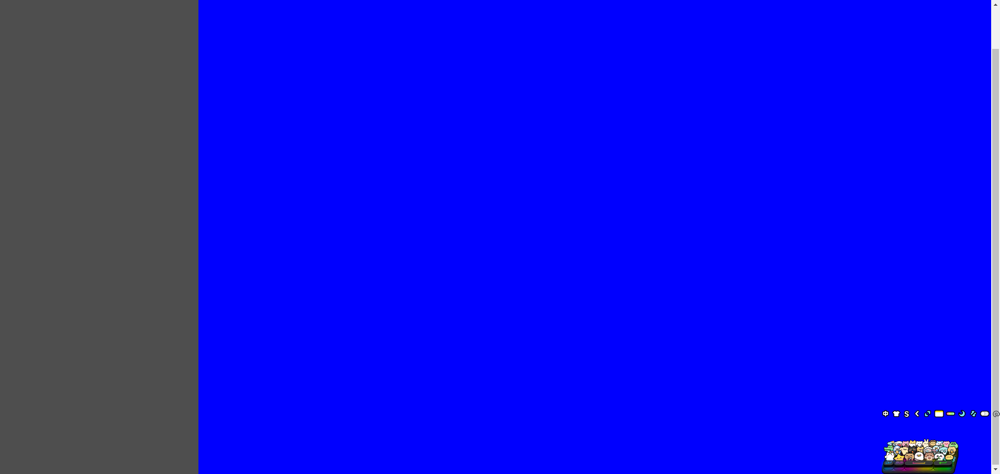

### 4、clear

>clear 属性规定元素的哪一侧不允许其他浮动元素。
>
>left: 在左侧不允许浮动元素。
>right: 在右侧不允许浮动元素。
>both: 在左右两侧均不允许浮动元素。
>none: 默认值。允许浮动元素出现在两侧。
>inherit: 规定应该从父元素继承 clear 属性的值。
>
>注意：clear 属性只会对自身起作用，而不会影响其他元素。

#### 1.清除浮动

##### 1）浮动带来的副作用

清除浮动的副作用（父标签塌陷问题）

##### 2）清除浮动的三种方式

>固定高度
>伪元素清除法
>overflow:hidden

>1.自己加一个 div 设置高度
>
>2.利用 clear 属性
>#d4 {
>    clear: left; /*该标签的左边(地面和空中)不能有浮动的元素*/
>}
>
>3.通用的解决浮动带来的影响方法
>在写 html 页面之前 先提前写好处理浮动带来的影响的 css 代码
>.clearfix:after {
>    content: '';
>    display: block;
>    clear:both;
>}
>之后只要标签出现了塌陷的问题就给该塌陷的标签加一个 clearfix 属性即可
>上述的解决方式是通用的 到哪都一样 并且名字就叫 clearfix

##### 3）案例

```html
<!DOCTYPE html>
<html lang="en">
<head>
    <meta charset="UTF-8">
    <title>Title</title>
    <meta name="viewport" content="width=device-width, initial-scale=1">
    <style>
        body {
            margin: 0;
        }

        #d1 {
            border: 3px solid black;
        }

        #d2 {
            height: 100px;
            width: 100px;
            background-color: red;
            float: left;
        }

        #d3 {
            height: 100px;
            width: 100px;
            background-color: greenyellow;
            float: left;
        }

        #d4 {
            /*height: 100px;*/
            clear: left; /*该标签的左边(地面和空中)不能有浮动的元素*/
        }

        .clearfix:after {
            content: '';
            display: block;
            clear: both;
        }
    </style>
</head>
<body>
<div id="d1" class="clearfix">
<div id="d2"></div>
<div id="d3"></div>
<!-- <div id="d4"></div>-->
</div>
</body>
</html>
```

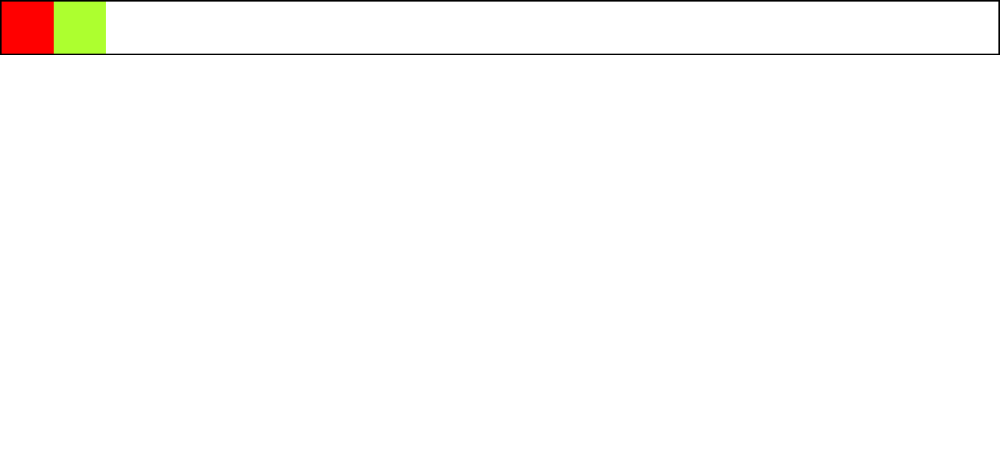

### 5、溢出属性

#### 1.overflow 取值

>visible: 默认值。内容不会被修剪，会呈现在元素框之外。
>hidden: 内容会被修剪，并且其余内容是不可见的。
>scroll: 内容会被修剪，但是浏览器会显示滚动条以便查看其余的内容。
>auto: 如果内容被修剪，则浏览器会显示滚动条以便查看其余的内容。
>inherit: 规定应该从父元素继承 overflow 属性的值。
>
>• overflow（水平和垂直均设置）
>• overflow-x（设置水平方向）
>• overflow-y（设置垂直方向）
>
>一个标签内文字太多，会导致文字溢出，可以选择以下参数控制溢出属性技术
>
>/*overflow: visible; !*默认就是可见 溢出还是展示*!*/
>/*overflow: hidden; !*溢出部分直接隐藏*!*/
>/*overflow: scroll; !*设置成上下滚动条的形式*!*/
>/*overflow: auto;*/ 自动，跟 hidden 差不多，了解即可

#### 2.案例

```html
<!DOCTYPE html>
<html lang="en">
<head>
    <meta charset="UTF-8">
    <title>Title</title>
    <meta name="viewport" content="width=device-width, initial-scale=1">
    <style>
        body {
            margin: 0;
        }

        p {
            height: 100px;
            width: 200px;
            border: 3px solid red;
            /*overflow: visible; !*默认就是可见 溢出还是展示*!*/
            /*overflow: hidden; !*溢出部分直接隐藏*!*/
            overflow: scroll; /*设置成上下滚动条的形式*/
            /*overflow: auto;*/
        }
    </style>
</head>
<body>
<p>我还在起始点 刚刚换上 2 档 准备发车!我还在起始点 刚刚换上 2 档 准备发
    车!我还在起始点 刚刚换上 2 档 准备发车!我还在起始点 刚刚换上 2 档 准备发车!我
    还在起始点 刚刚换上 2 档 准备发车!我还在起始点 刚刚换上 2 档 准备发车!我还在
    起始点 刚刚换上 2 档 准备发车!我还在起始点 刚刚换上 2 档 准备发车!我还在起始
    点 刚刚换上 2 档 准备发车!我还在起始点 刚刚换上 2 档 准备发车!我还在起始点
    刚刚换上 2 档 准备发车!我还在起始点 刚刚换上 2 档 准备发车!我还在起始点 刚刚
    换上 2 档 准备发车!我还在起始点 刚刚换上 2 档 准备发车!</p>
</body>
</html>
```


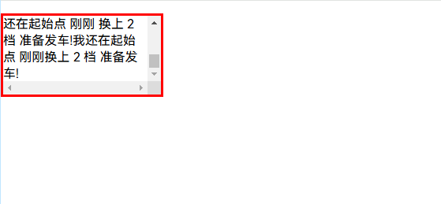


```html
<!DOCTYPE html>
<html lang="en">
<head>
    <meta charset="UTF-8">
    <title>Title</title>
    <meta name="viewport" content="width=device-width, initial-scale=1">
    <style>
        body {
            margin: 0;
            background-color: #4e4e4e;
        }

        #d1 {
            height: 120px;
            width: 120px;
            border-radius: 50%;
            border: 5px solid white;
            margin: 0 auto;
            overflow: hidden;
        }

        #d1 > img {
            /*max-width: 100%;*/
            width: 100%;
            /*占标签 100%比例*/
        }
    </style>
</head>
<body>
<div id="d1">
    
</div>
</body>
</html>
```

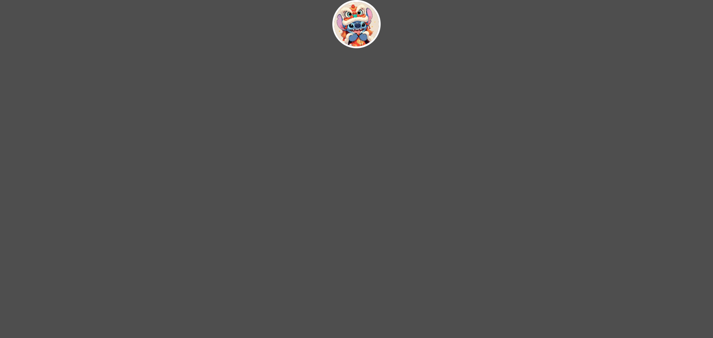

### 6、定位

#### 1.定位分类

>- 静态：所有的标签默认都是静态的 static，无法改变位置
>- 相对定位(了解)
>  相对于标签原来的位置做移动 relative
>- 绝对定位(常用)
>  相对于已经定位过的父标签做移动(如果没有父标签那么就以 body 为参照)
>  eg:小米网站购物车
>  当你不知道页面其他标签的位置和参数，只给了你一个父标签的参数，让你基于该标签做定位
>- 固定定位(常用)
>  相对于浏览器窗口固定在某个位置
>  eg:右侧小广告


