# apache环境部署

## 一、下载安装包

http://httpd.apache.org/

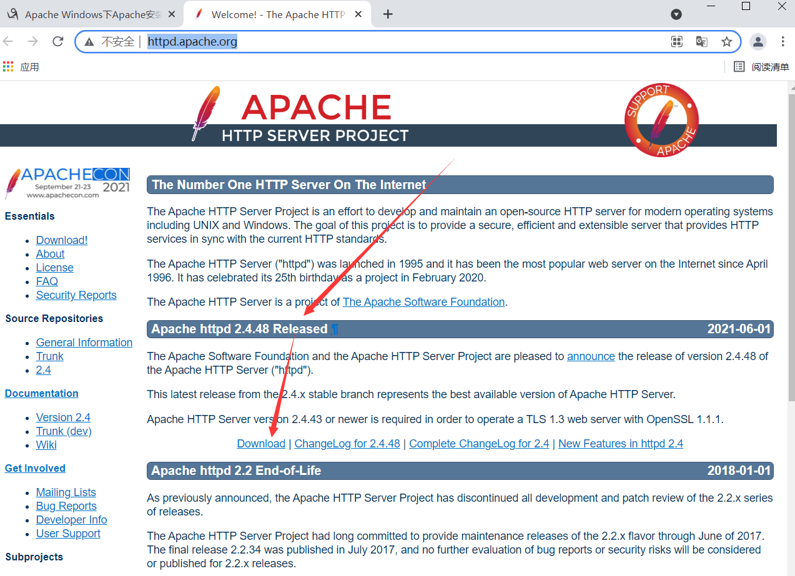

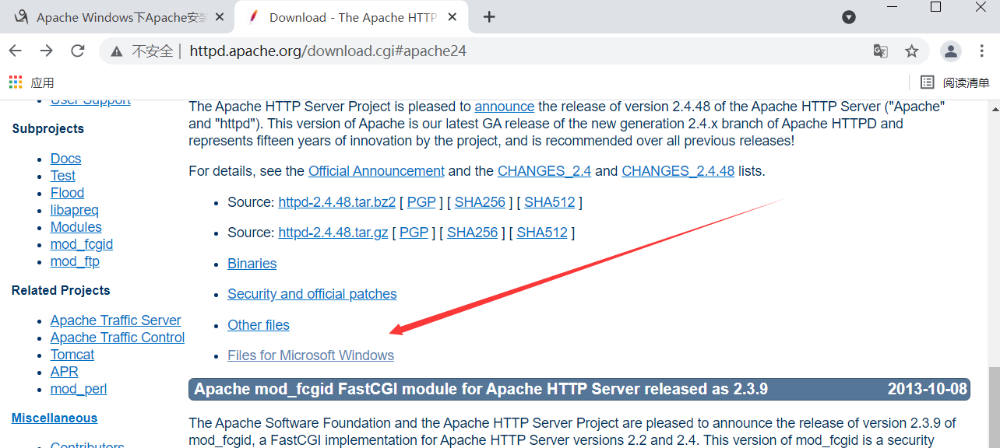

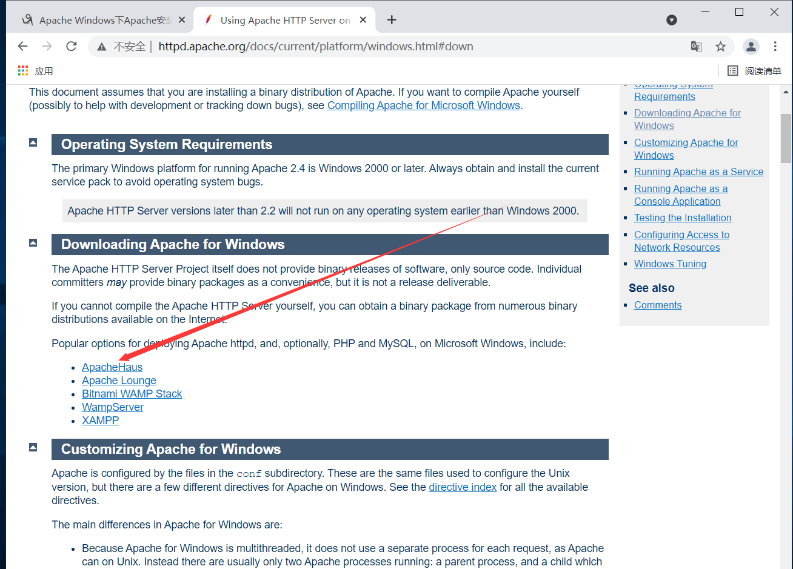

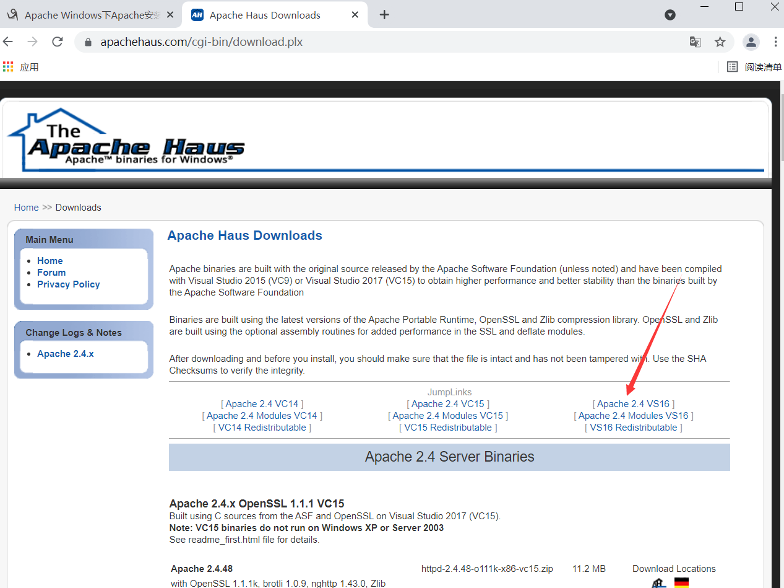


## 二、安装

### 1、创建安装目录

**虽然windows对中文支持比较友好，但是创建目录建议使用英文**

### 2、将安装包移动到安装目录


### 3、解压

目录结构大致和linux相似

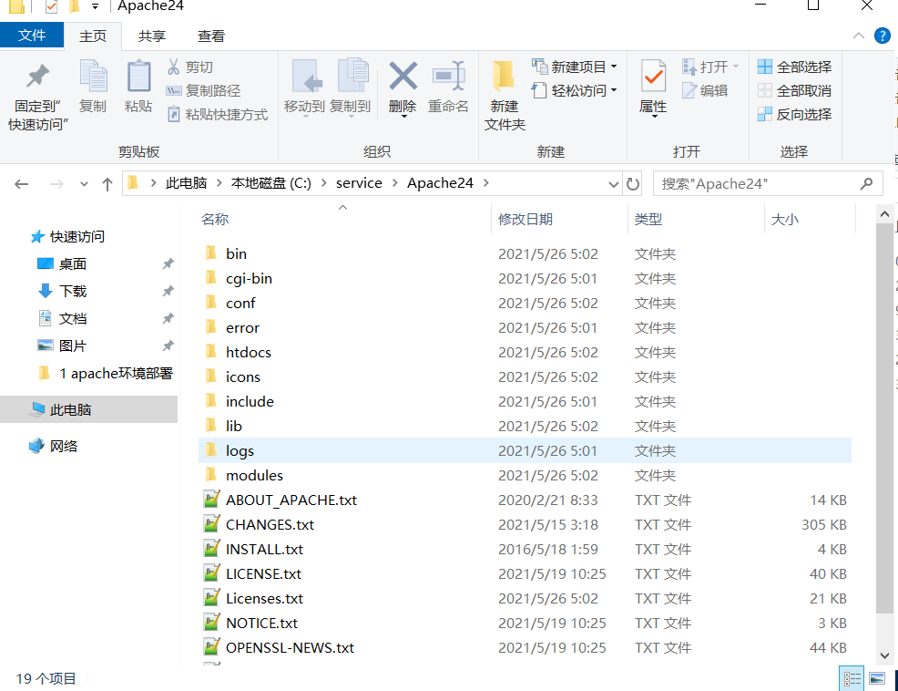


### 4、配置环境变量

此电脑--》属性

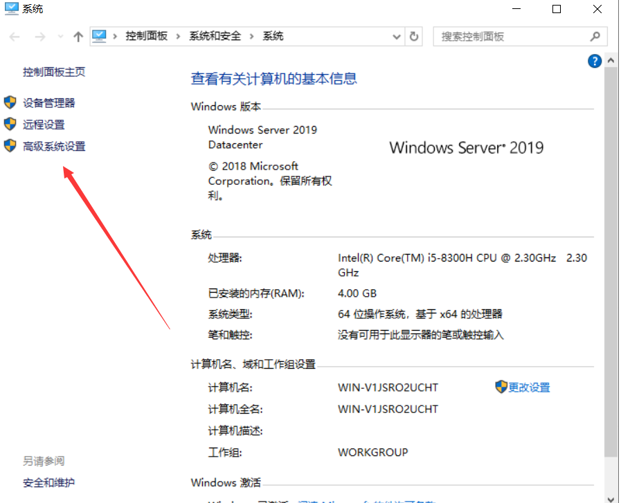

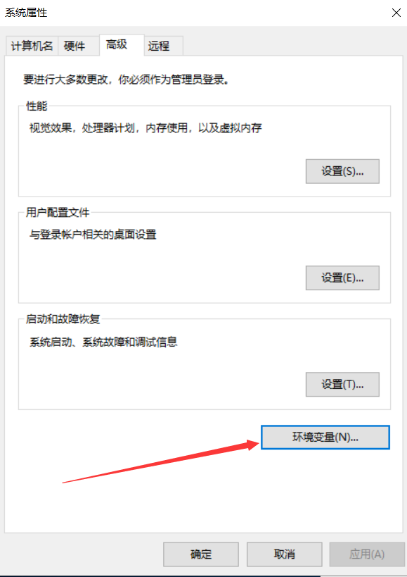

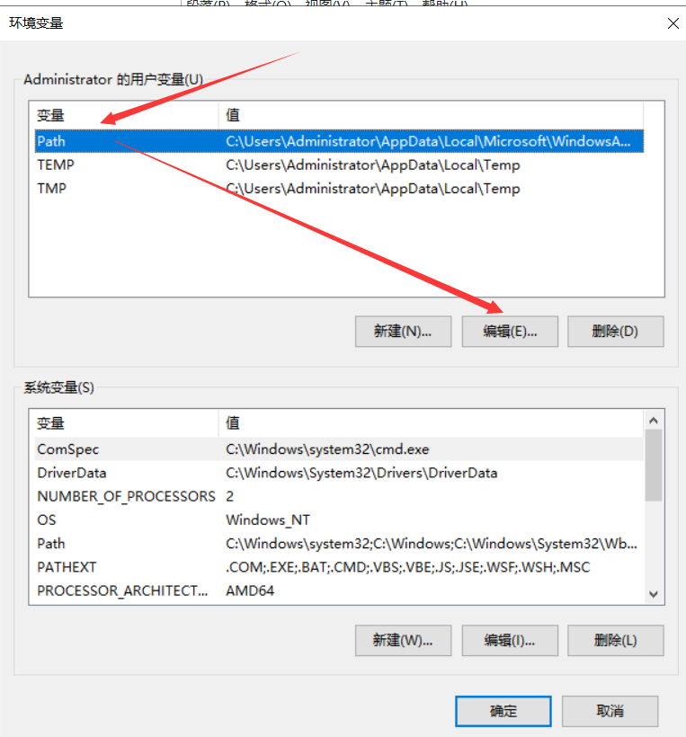

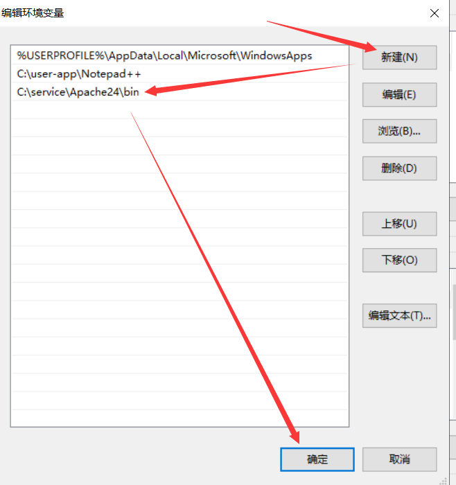

### 5、配置apache配置文件

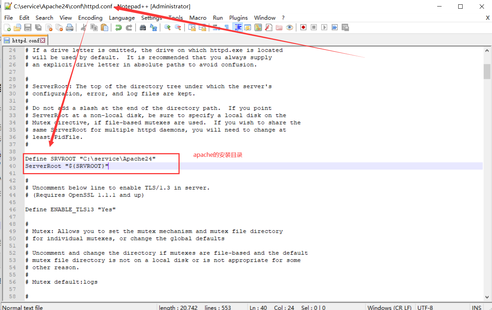

**确认配置语法，与nginx -t类似**

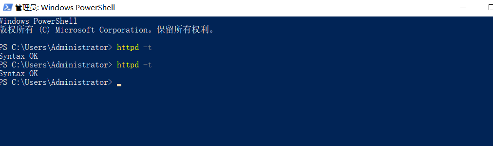

**如果命令执行失败，确认环境变量问题和系统编译器问题。手动运行bin目录下httpd.exe如果出现找不到vcruntime140.dll字样根据需求安装对应文件**

https://www.microsoft.com/zh-CN/download/details.aspx?id=48145

### 6、安装apache主服务

httpd -k install -n Apache

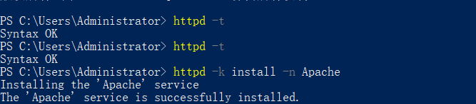

### 7、apache启停及重启

```bash
httpd -k start 		#不会提示详细的错误信息。
httpd -k start -n apache		#会提示详细的错误信息，其中的"apache"修改为你的Apache服务名,可以到计算机服务里找。 
httpd -k restart -n apache     #重启。
net start apache      #利用Windows托管服务命令。

httpd -k stop
httpd -k uninstall

Windows卸载服务命令：sc delete 服务名
```

**若Apache服务器软件不想用了，想要卸载，一定要先卸载apache服务，然后删除安装文件（切记，若直接删除安装路径的文件夹，会有残余文件在电脑，可能会造成不必要的麻烦），在cmd命令窗口先停止服务再卸载，（建议先停止服务再删除）：**

### 8、启动并访问apache

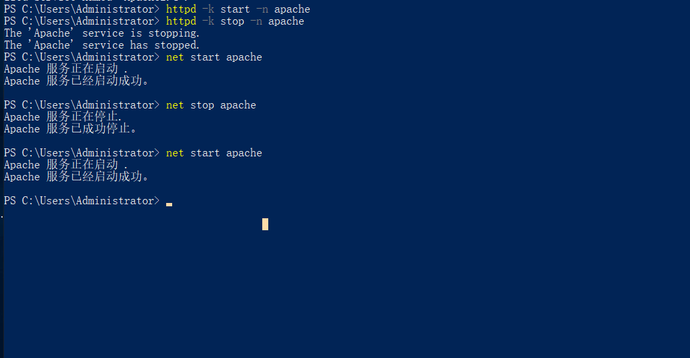

http://127.0.0.1/

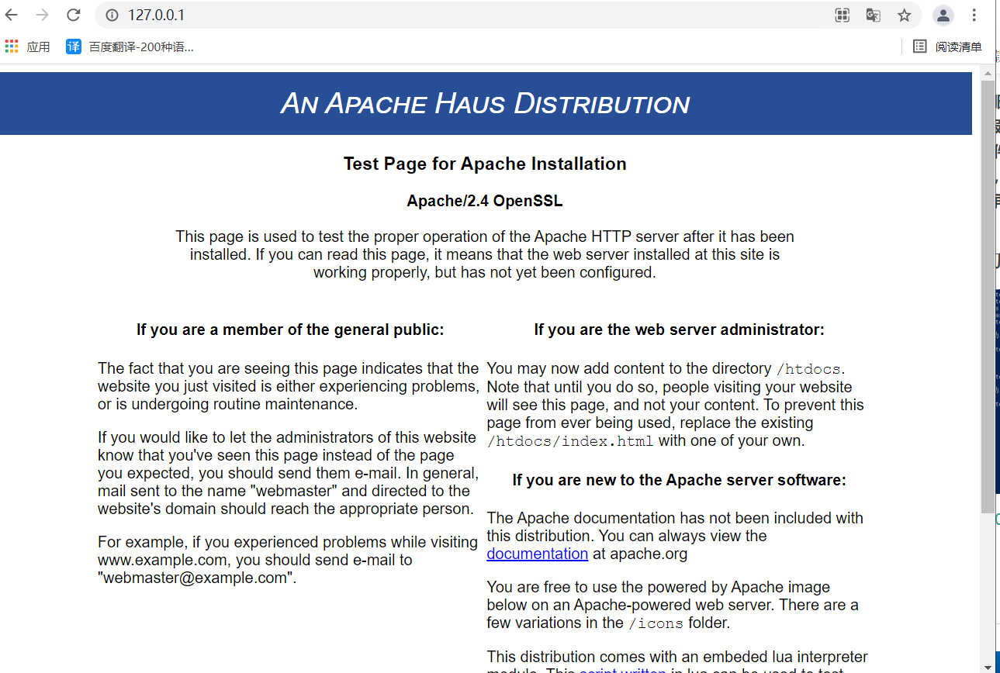