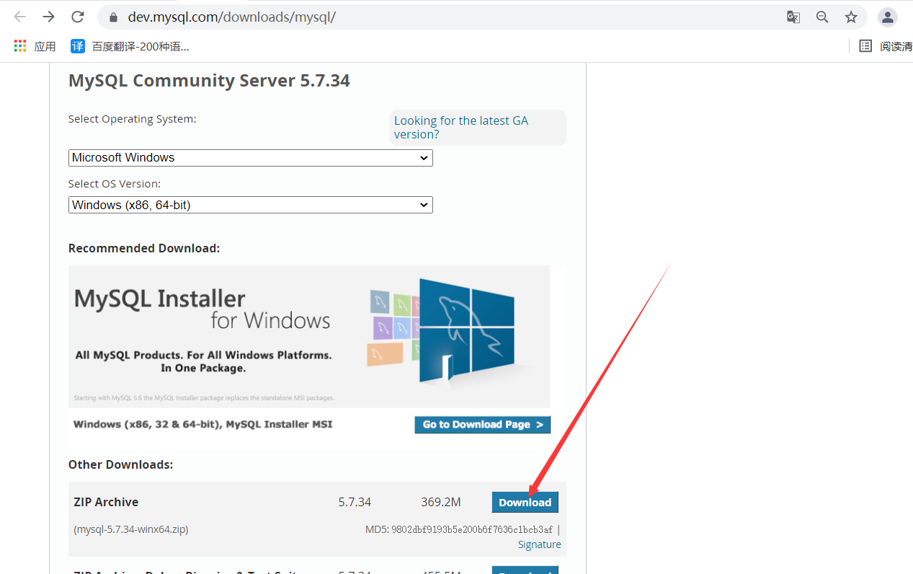
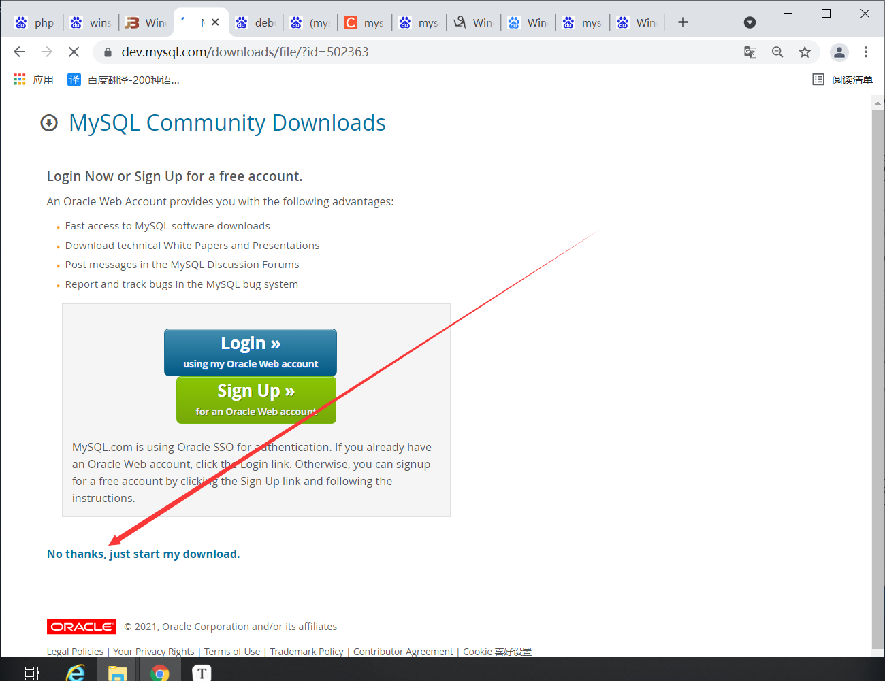
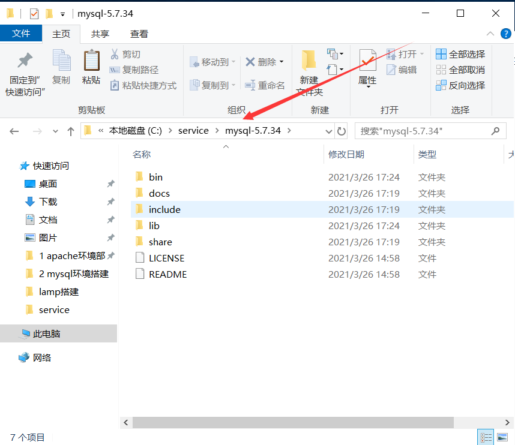
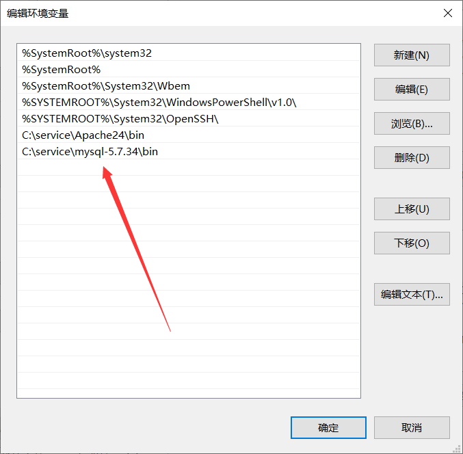
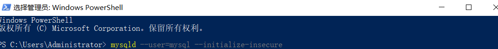
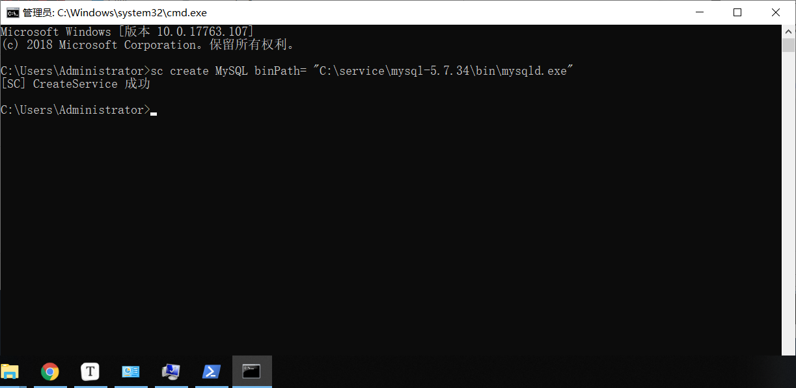

# mysql环境搭建

## 一、下载安装包

http://dev.mysql.com/downloads/mysql/





## 二、解压安装包到对应目录并重命名




## 三、安装运行依赖库

https://www.microsoft.com/zh-CN/download/details.aspx?id=40784

## 四、配置bin目录环境变量




## 五、创建数据目录和配置文件

**在根目录下添加 data 文件夹与 my.ini 文件（从 5.7.18 版本开始下载的文件里面不提供这两个东西）**

### 1、my.ini配置文件

```bash
[mysqld]
# 设置MySQL的根目录
basedir=C:\\service\\mysql-5.7.34
# 设置data目录
datadir=C:\\service\\mysql-5.7.34\\data
# 端口号
port=3306
# 设置默认编码
character-set-server=utf8mb4
# 设置默认存储引擎
default-storage-engine=INNODB
```

## 六、数据库初始化



```bash
mysqld --user=mysql --initialize-insecure
```


## 七、将mysql设置为系统服务

**只能通过cmd才能成功**

```bash
sc create MySQL binPath= "C:\service\mysql-5.7.34\bin\mysqld.exe"
```




## 八、mysql的启停

```bash
net start MySQL
net restart MySQL
net stop MySQL

##删除mysql服务（前提需要先停止 MySQL 服务）
mysqld -remove
```


## 九、修改密码

**初始化时没有设置密码，所以需要修改密码**

```bash
PS C:\Users\Administrator> mysql -uroot -p
Enter password:
mysql> SET PASSWORD=PASSWORD('123456');
```

