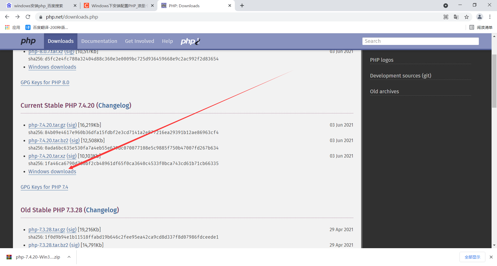
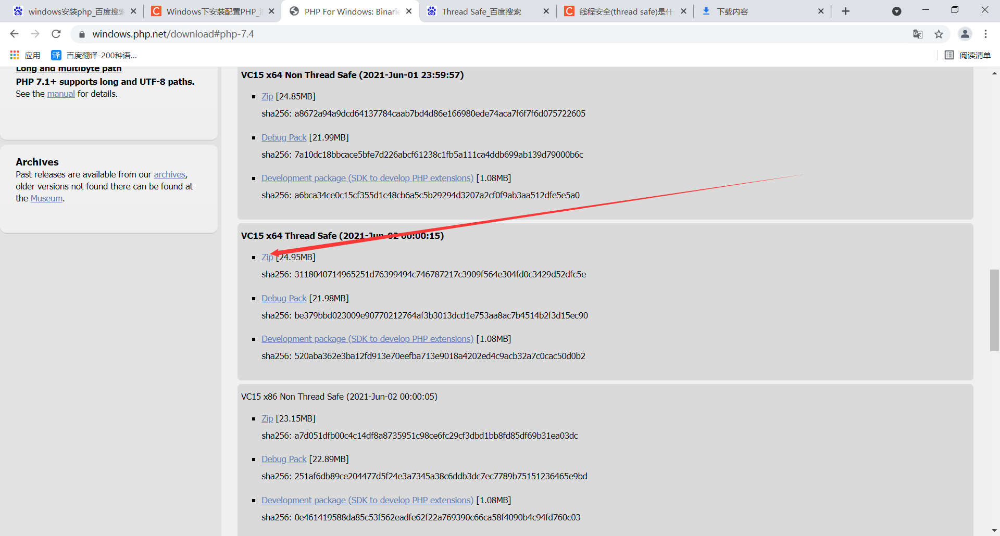
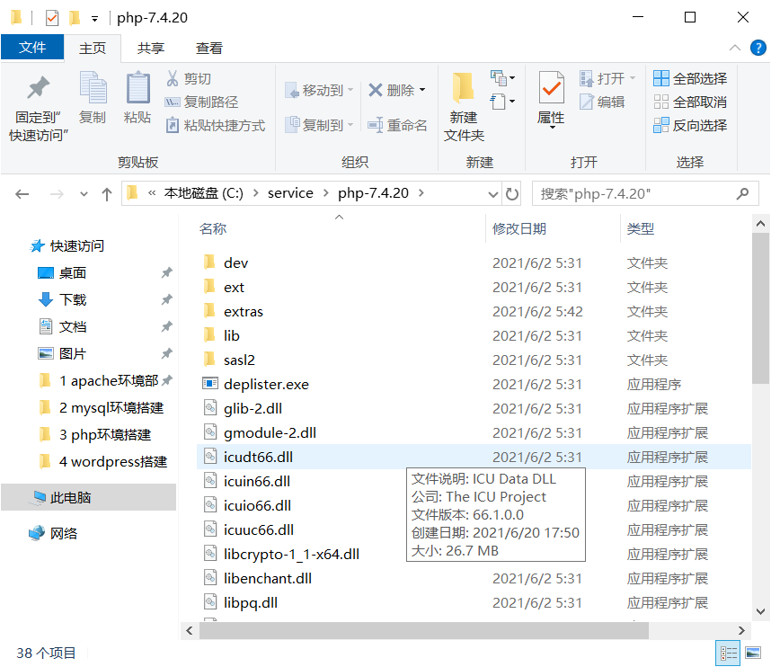
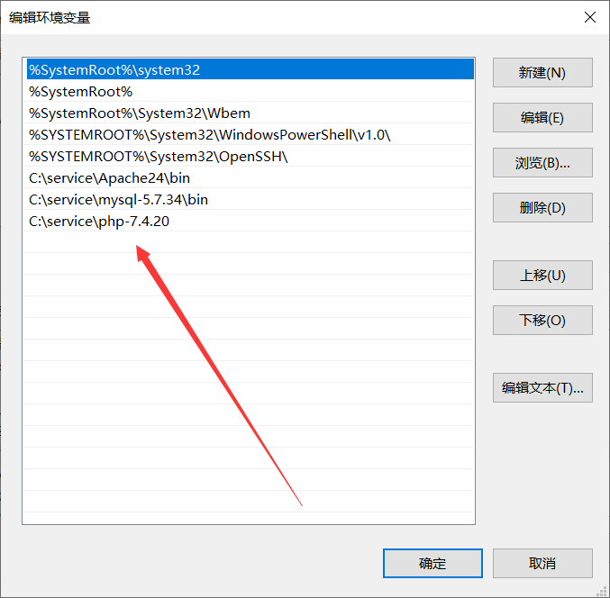
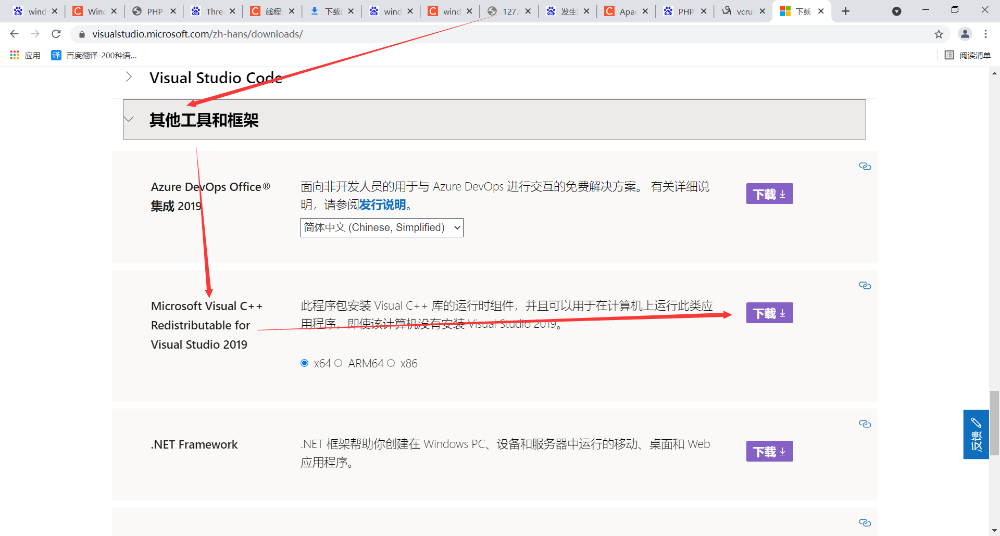

# php环境搭建

## 一、下载安装包

https://www.php.net/downloads.php





## 二、解压到指定目录并重命名



## 三、添加环境变量




## 四、安装运行依赖库

https://visualstudio.microsoft.com/zh-hans/downloads/



**下载安装即可**

## 五、检查php运行


## 六、php加入mysql模块

### 1、复制php安装目录php7ts.dll到c:/windows/system32下


### 2、复制php.ini-production到C:\Windows\php.ini


### 3、修改php.ini

**注意：php7中，已移除php_mysql.dll这个扩展，由php_mysqli.dll取代了**

```bash
#站点目录
doc_root = "C:\www\wordpress"
extension_dir = "C:\service\php-7.4.20\ext"
extension=php_gd2.dll
extension=php_curl.dll
extension=php_mbstring.dll
extension=php_openssl.dll
extension=php_mysqli.dll
extension=php_pdo_mysql.dll
date.timezone = Asia/Shanghai
```


