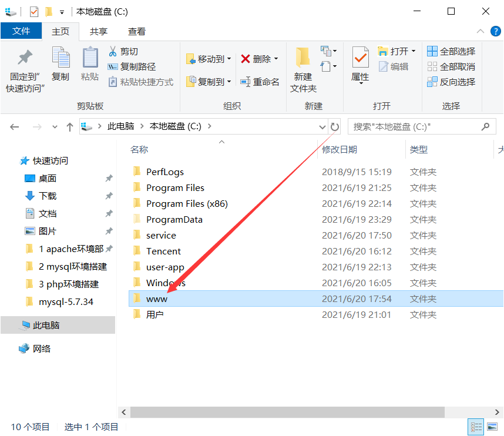
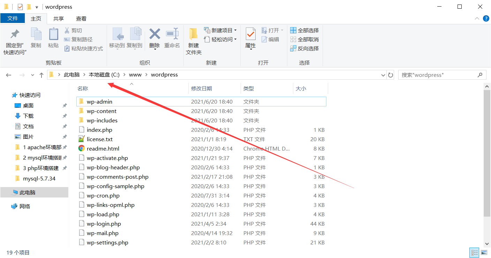
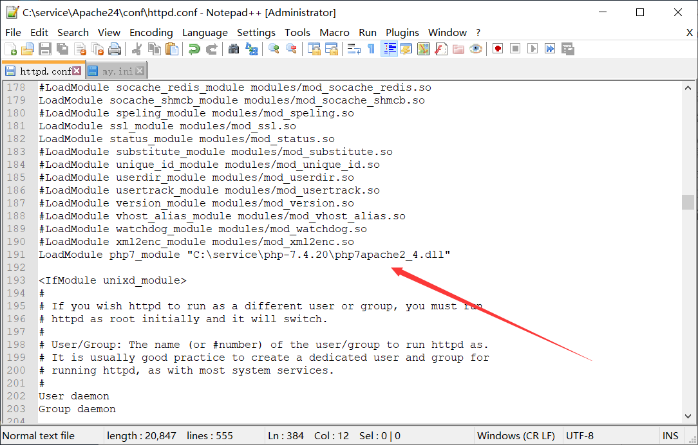
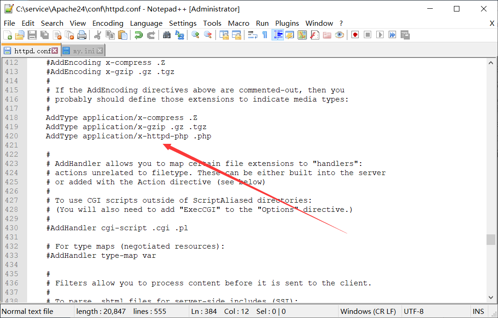
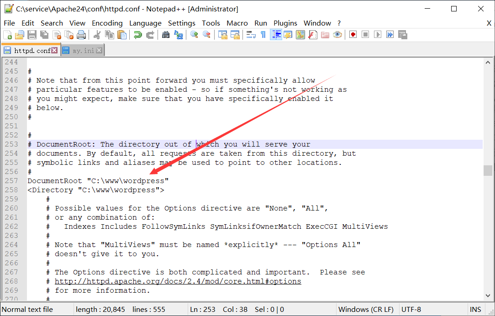
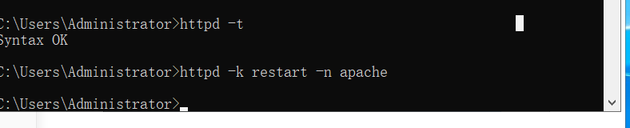

# wordpress环境搭建

## 一、创建站点目录



## 二、下载wordpress，并解压到站点目录

https://cn.wordpress.org/latest-zh_CN.tar.gz




## 三、配置apache配置文件

### 1、添加php模块

```bash
LoadModule php7_module "C:\service\php-7.4.20\php7apache2_4.dll"
```



### 2、匹配以.php结尾的文件

```bash
AddType application/x-httpd-php .php
...
    DirectoryIndex index.html index.php
```



### 3、配置站点目录

```bash
DocumentRoot "C:\www\wordpress"
<Directory "C:\www\wordpress">
```




### 4、验证语法并重启



## 四、创建数据库并授权

```bash
mysql> create database wordpress;
mysql> grant all on wordpress.* to root@'127.0.0.1' identified by '123456' with grant option;
```


## 五、访问
