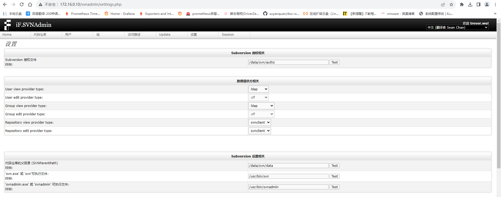
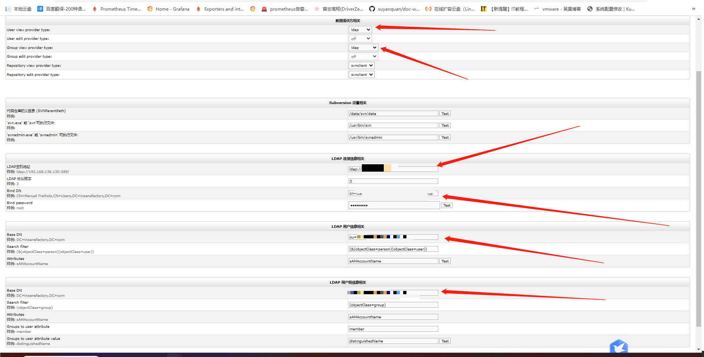

# svn+ldap+ifSVNadmin

## 一、安装apache、svn、php

### 1、安装apache依赖

```bash
apt-get install -y subversion apache2  subversion-tools libapache2-mod-svn software-properties-common 
```

### 2、安装php5.6环境

```bash
add-apt-repository ppa:ondrej/php
apt-get update
apt-get install -y php5.6 php5.6-curl php5.6-mbstring php5.6-xml  php5.6-intl php5.6-ldap libapache2-mod-php5.6 
```

## 二、环境检查

```bash
svnserve --version
php -v
apache2 -v
ll /etc/apache2/mods-available | grep svn
```

## 三、配置svn

```bash
# 进入数据目录
cd /data
# 创建svn数据存储目录
mkdir /data/svn/data
# 创建ldap+svn鉴权文件
touch /data/svn/authz
# 授权给apache
chmod 777 -R /data/svn
```

## 四、安装if.svnadmin

```bash
wget http://sourceforge.net/projects/ifsvnadmin/files/svnadmin-1.6.2.zip
unzip svnadmin-1.6.2.zip
mv iF.SVNAdmin-stable-1.6.2 /var/www/html/svnadmin
chmod 777 -R /var/www/html/svnadmin
```

## 五、apache配置

### 1、启动指定模块

```bash
a2enmod dav_svn
a2enmod authz_svn
a2enmod dav_svn
a2enmod authz_svn
a2enmod ldap
a2enmod authnz_ldap
a2enmod auth_basic
a2enmod authn_file
a2enmod authz_user
```

### 2、配置apache配置

>vim /etc/apache2/sites-enabled/svn.conf

```bash
<VirtualHost *:80>
    ServerName 192.168.0.10
    Alias /svnadmin /var/www/html/svnadmin
    <Location /svnadmin>
        Options Indexes FollowSymLinks
        AllowOverride None
        Require all granted
    </Location>

    <Location /svn>
        AddType charset=UTF-8 .md
        AddDefaultCharset UTF-8
        DAV svn
        SVNParentPath /data/svn/data
        AuthType Basic
        AuthName "Subversion repository"
        AuthzSVNAccessFile /data/svn/authz
        AuthBasicProvider ldap
        AuthLDAPURL "ldap://xxxxx:389/ou=xxxx,dc=xxxxx,dc=local?sAMAccountName?sub?(objectClass=user)"
        AuthLDAPBindDN "cn=xxxxx,ou=xxxx,dc=xxxxx,dc=local"
        AuthLDAPBindPassword "xxxxx"
        Require valid-user
        LogLevel debug
    </Location>
</VirtualHost>
```

## 六、启动服务

```bash
systemctl restart apache2 && systemctl enable apache2
```

## 七、访问if.svnadmin

>http://172.16.0.10/svnadmin/

## 八、访问失败解决

### 1、修改判断php版本语句

>vim /var/www/html/svnadmin/include/config.inc.php

```bash
##删除内容
// Check PHP version.
if (!checkPHPVersion("5.3")) {
 echo "Wrong PHP version. The minimum required version is: 5.3";
 exit(1);
}
```

> 重启

```bash
systemctl restart apache2
```

### 2、修改php花括号以兼容运行

>vim /var/www/html/svnadmin/include/ifcorelib/IF_HtPasswd.class.php

```bash
# 419行
419                         $text.= ($i & 1) ? chr(0) : $plainpasswd[0];
```

### 3、group名支持中文

>vim /var/www/html/svnadmin/include/ifcorelib/IF_SVNAuthFileC.class.php

```php
...
	public function createGroup($groupname)
	{
		// Validate the groupname.
		$pattern = '/^[A-Za-z0-9-_\x{4e00}-\x{9fa5}]+$/iu';
		if (!preg_match($pattern, $groupname))
		{
			throw new Exception('Invalid group name "' . $groupname .
					'". Allowed signs are: A-Z, a-z, Underscore, Dash, Chinese characters (no spaces!) ');
		}

		if (self::groupExists($groupname))
		{
			// The group already exists.
			return false;
		}

		$this->config->setValue($this->GROUP_SECTION, $groupname, "");
		return true;
	}
...
```


## 九、if.svnadmin初始化配置

### 1、基础配置



### 2、接入ldap



### 3、指定ldap中某个用户为管理员

```bash
vim /var/www/html/svnadmin/data/userroleassignments.ini
[admin]
Administrator=

[xxxx]
Administrator=
```

