# ceph介绍

## 一、存储分类

### 1、单机存储

> SCSI/IDE/SATA/SAS/USB/PCI-E/SSD/M.2
>
> raid


### 2、网络存储

>NFS（Network File System：网络文件系统)
>
>​    有单机故障，大容量使用sersync备份成本高
>
>Samba：是一种linux和windows之间进行文件共享的协议。安装该协议后，可以理解为在linux是插在windows上的一个U盘。
>
>​    问题同上
>
>NAS (Network Attached Storage：网络附属存储)
>
>​    共享文件存储
>
>SAN:（Storage Area Network，存储区域网络)共享块存储
>
>​    搭建成本高

## 二、常见的存储类型

### 1、单机

> 单机存储的磁盘空间问题、IO 问题、扩容问题、高可用问题:

### 2、商业存储

> 商业解决方案-EMC、NetAPP、戴尔、华为、浪潮

### 3、软件定义的分布式存储

> (软件定义的存储 Software Defined Storage SDS):
> https://www.vmware.com/cn/products/software-defined-storage.html
> 分布式存储：Ceph,TFS,FastDFS,MogileFS,MooseFS,GlusterFS

## 三、ceph介绍

### 1、ceph是什么？

> ceph一个统一的、分布式的存储系统，设计初衷是提供较好的性能、可靠性和可扩展性。

- “统一的”：意味着我们可以仅凭ceph这一套存储系统，同时提供对象存储、块存储和文件系统存储三种功能，这极大地简化了不同应用需求下的部署和运维工作。
- “分布式”：ceph实现了真正的去中心化，理论上可以无限扩展集群系统的规模

致敬作者

>Ceph项目最早起源于Sage就读博士期间的工作（最早的成果于2004年发表），并随后贡献给开源社区。在经过了数年的发展之后，目前已得到众多云计算厂商的支持并被广泛应用。RedHat及OpenStack都可与Ceph整合以支持虚拟机镜像的后端存储。

### 2、为什么要用ceph?


#### 1.分布式存储之间的对比

| 对比             | TFS             | FastDFS         | MogileFS | MooseFS         | GlusterFS                                | Ceph            |
| ---------------- | --------------- | --------------- | -------- | --------------- | ---------------------------------------- | --------------- |
| 开发语言         | C++             | C               | Perl     | C               | C                                        | C++             |
| 开源协议         | GPL V2          | GPL V3          | GPL      | GPL V3          | GPL V3                                   | LGPL            |
| 数据存储方式     | 块              | 文件/Trunk      | 文件     | 块              | 文件/块                                  | 对象/文件/块    |
| 集群节点通信协议 | 私有协议（TCP） | 私有协议（TCP） | HTTP     | 私有协议（TCP） | 私有协议（TCP）/RDAM（远程直接访问内存） | 私有协议（TCP） |
| 专用元数据存储点 | 占用NS          | 无              | 占用DB   | 占用MFS         | 无                                       | 占用MDS         |
| 在线扩容         | 支持            | 支持            | 支持     | 支持            | 支持                                     | 支持            |
| 冗余备份         | 支持            | 支持            | -        | 支持            | 支持                                     | 支持            |

#### 2.RAID 与 CEPH 比较

##### 1)raid

>（1）漫长的重建过程，而且在重建过程中，不能有第二块盘损坏，否则会引发更大的问题；
>
>（2）备用盘增加TCO，作为备用盘，当没有硬盘故障时，就会一直闲置的；
>
>（3）不能保证两块盘同时故障后，数据的可靠性；
>
>（4）在重建结束前，客户端无法获取到足够的IO资源；
>
>（5）无法避免网络、服务器硬件、操作系统、电源等故障。
>
> (6) 在做包含raid1的阵列时，磁盘会以最小磁盘的大小为构建阵列，磁盘大小浪费严重

##### 2)ceph

>（1）为了保证可靠性，采用了数据复制的方式，这意味着不再需要RAID，也就克服了 RAID 存在的诸多问题；
>
>​    解析：
>
>​       Ceph 数据存储原则：一个Pool 有若干PG，每个PG 包含若干对象，一个对象只能存储在一个PG 中，而Ceph 默认一个PG 包含三个 OSD ，每个OSD 都可看做一块硬盘。
>
>​       因此，一个对象存储在Ceph中时，就被保存了三份。当一个磁盘故障时，还剩下2个PG，系统就会从另外两个PG中复制数据到其他磁盘上。这个是由crush算法决定。
>
>（2）磁盘复制属性值可以通过管理员进行调整；
>
>（3）磁盘存储上使用了加权机制，所以磁盘大小不一致也不会出现问题。
>
> (4) 不需要购买专门的阵列卡来做raid

#### 3.ceph的优势

>Ceph本身确实具有较为突出的优势，ceph追求用最廉价的设备做最牛逼的存储。
>
>其先进的核心设计思想，概括为八个字—“无需查表，算算就好”。
>
>详细地讲，可以总结为以下四点：
>
>- 1、高性能
>  a. 摒弃了传统的集中式存储元数据寻址的方案，采用CRUSH算法，数据分布均衡，并行度高。
>   b. 考虑了容灾域的隔离，能够实现各类负载的副本放置规则，例如跨机房、机架感知等。
>   c. 能够支持上千个存储节点的规模，支持TB到PB级的数据。
>- 2、高可用性
>  a. 副本数可以灵活控制。
>   b. 支持故障域分隔，数据强一致性。
>   c. 多种故障场景自动进行修复自愈。
>   d. 没有单点故障，自动管理。
>   高可扩展性
>- 3、去中心化。
>  b. 扩展灵活。
>   c. 随着节点增加而线性增长。
>- 4、特性丰富
>  a. 支持三种存储接口：块存储、文件存储、对象存储。
>   b. 支持自定义接口，支持多种语言驱动。

## 四、储备知识：块存储、文件存储、对象存储

### 1、块级、文件级

我们来了解一下块级与文件级，然后再介绍块存储与文件存储、对象存储，你就能很好地理解他们内部的原理

#### 1.块级

```bash
磁盘的最小读写单位为扇区，1个或多个连续的扇区组成一个block块，也叫物理块。

可以通过下述命令查看block块大小
blockdev --getbsz /dev/sda1
```

#### 2.文件级

```bash
文件是文件系统提供的功能，单个文件可能由于一个或多个逻辑块组成，且逻辑块之间是不连续分布。逻辑块大于或等于物理块整数倍，

物理块与文件系统之间的映射关系为：扇区→物理块→逻辑块→文件系统，详见下图
注意：这么多层转换，肯定是需要耗费效率的，如果操作的是对象，则可以直接省去这么多层映射关系，效率自然是高
```

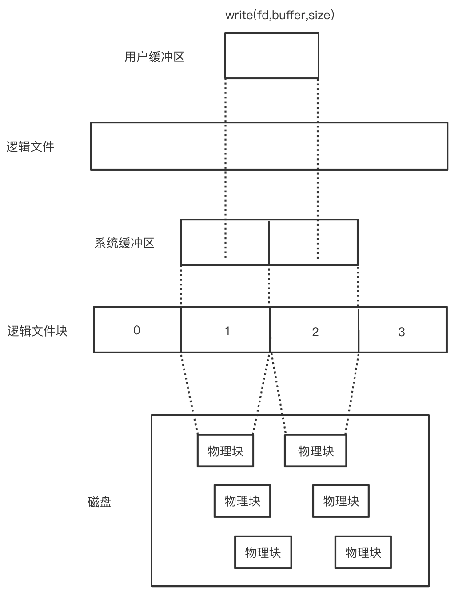

### 2、块存储、文件存储、对象存储

#### 1.介绍

>块存储: 如果存储设备提供给你的是一块裸盘，需要你自己分区格式化制作文件系统
>
>文件存储：如果存储设备提供给你的是一个文件夹，你自己直接操作文件
>
>对象：如果你只需要提供文件的元数据与真实数据，存储设备负责帮你生成文件，然后存到硬盘中，这就称之为对象存储

#### 2.他们之间的关系

##### 1）块存储不支持共享所以出现了文件存储

>    ​    块存储是最低级，最直接的，如果多个客户端共用一个块存储，客户端会把数据先缓存在本地，然后再写入块存储（详见6.3），这就会导致多个客户端数据不一致的问题，所以，通常一个块存储只给一个客户端用

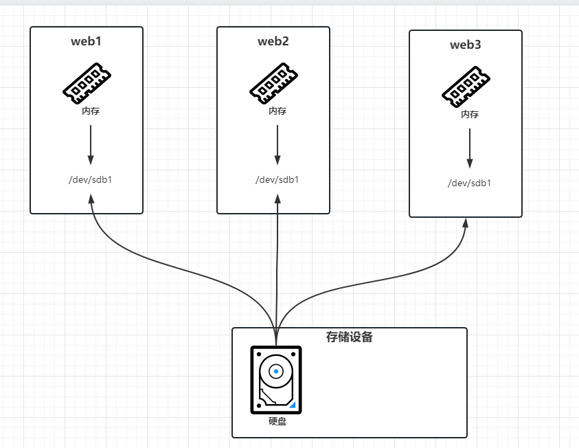

##### 2）nfs解决共享问题，但是影响集群扩展

>​    为了让多个客户端共享数据、并保证一致，于是诞生了文件存储，例如nfs，客户端挂载的都是服务端的同一个文件夹，数据是完全一致的，但是随着客户端数量越来越多，nfs服务器检索文件信息的压力会越来越大，最后不堪重负，一旦挂掉，则影响整个集群的工作，所以nfs严重影响了集群的扩展

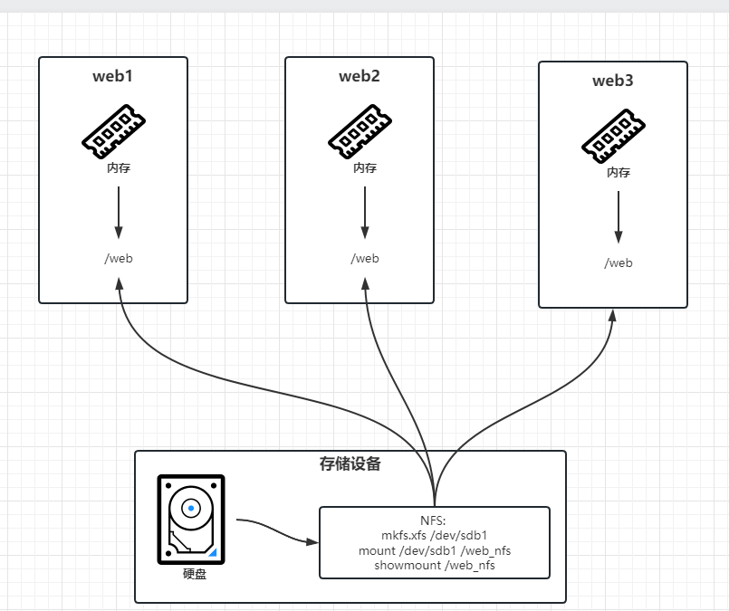

##### 3）对象存储,降低检索信息压力

>​    为了能够满足无限扩展的需求，诞生了对象存储，客户端无需操作文件，而是只需要提供文件相关的各部分信息即可，这些信息称之为一个个的对象，存储设备接收到对象后负责完成后续操作

#### 3.块存储

>- 1、客户端主要操作对象是磁盘，客户端可以自己格式化制作文件系统，
>
>- 2、块存储设备中划分出的是一块裸磁盘空间映射给客户端主机使用
>
>- 3、例如SCSI
>
>  ​    以 SCSI 为例，主要接口有 Read/Write/Read Capacity/Inquiry 等等。FC，iSCSI，也是块存储协议。和文件存储相比，没有文件和目录树的概念，一般协议也不会定义磁盘的创建和删除操作。协议更注重传输控制。

#### 4.文件存储

>- 1、客户端主要操作的是文件和文件夹，客户端无法格式化制作自己的文件系统，使用的是现成的文件系统。
>
>- 2、文件存储中已经做好了文件系统然后共享给客户端主机使用
>
>- 3、例如NFS
>
>  ​    文件存储支持 POSIX 协议，以 NFS 为例，文件相关的接口包括：LOOKUP/ACCESS/READ/WRITE/CREATE/REMOVE/RENAME 等等，文件夹相关的接口包括：MKDIR/RMDIR/READDIR 等等。同时也会有 FSSTAT/FSINFO 等接口用于提供文件系统级别的信息。POSIX，SAMBA 等也是文件存储协议。协议更注重接口的灵活，以及访问权限控制。

#### 5.对象存储

>- 1、客户端主要操作对象是对象（Object）
>
>- 2、对象存储使用一个统一的底层存储系统，把文件和底层介质的组织结构都管理好，然后给每个文件一个唯一的标识，客户端需要访问某个文件，直接提供文件的标识就可以了。此时存储系统可以用更高效的数据组织方式来管理这些标识以及其对应的存储介质上的块。
>
>  当然，对于不同的软件系统来说，一次访问需要获取的不一定是单个我们传统意义上的文件，根据不同的需要可能只是一个/组值，某个文件的一部分，也可能是多个文件的组合，甚至是某个块设备，统称为对象。这就是对象存储。
>
>- 3、例如S3
>
>​       以 S3 为例，主要接口有 PUT/GET/DELETE 等。和文件和对象存储相比，没有随机读写的接口。和文件存储相比，没有目录树的概念。协议更注重简洁。

#### 6.总结

>块存储: 是和主机打交道的, 如插一块硬盘
>文件存储: NAS, 网络存储, 用于多主机共享数据
>对象存储: 跟你自己开发的应用程序打交道, 如网盘
>它们的层级是越来越高的
>
>
>
>关于ceph的块存储、文件存储、对象存储
>
>- Block（块）：支持精简配置、快照、克隆。
>
>- File（文件系统）：Posix接口，支持快照。
>
>- Object(对象)：有原生的API，而且也兼容Swift和S3的API。
>

## 五、ceph初识

### 1、ceph系统的层次结构

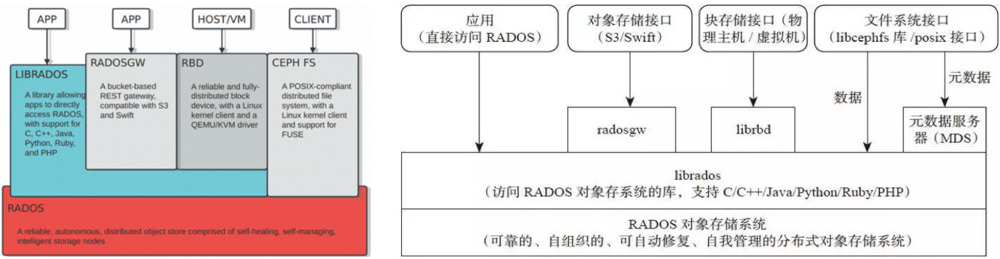

>- 自下向上，可以将Ceph系统分为四个层次：
>
>- - 基础存储系统RADOS（Reliable, Autonomic, Distributed Object Store，即可靠的、自动化的、分布式的对象存储）
>  - 基础库LIBRADOS
>  - 高层应用接口：包括了三个部分
>    - 1、对象存储接口：RADOS GW（RADOS Gateway）
>    - 2、块存储接口： RBD（Reliable Block Device）
>    - 3、文件存储接口：Ceph FS（Ceph File System）
>  - 应用层：基于高层接口或者基础库librados开发出来的各种APP，或者主机、VM等诸多客户端

**注意**

>rados集群是ceph的服务端，依据高层接口封装的应用则是客户端。

### 2、ceph的设计思想

>Ceph 的设计旨在实现以下目标：
>每一组件皆可扩展
>无单点故障
>基于软件(而非专用设备)并且开源(无供应商锁定)
>在现有的廉价硬件上运行
>尽可能自动管理，减少用户干预

### 3、ceph的版本历史

>​    Ceph 的第一个版本是 0.1,发布日期为 2008 年 1 月,多年来 ceph 的版本号一直采用递归更新的方式没变,直到 2015 年 4 月 0.94.1(Hammer 的第一个修正版)发布后,为了避免 0.99(以及 0.100 或 1.00),后期的命名方式发生了改变:
>​       x.0.z - 开发版（给早期测试者和勇士们）
>​       x.1.z - 候选版（用于测试集群、高手们）
>​       x.2.z - 稳定、修正版（给用户们）
>x 将从 9 算起，它代表 Infernalis(首字母 I 是英文单词中的第九个字母),这样我们第九个发布周期的第一个开发版就是 9.0.0,后续的开发版依次是 9.0.0->9.0.1->9.0.2 等,测试版本就是9.1.0->9.1.1->9.1.2,稳定版本就是 9.2.0->9.2.1->9.2.2.

>​    到 2017 年底，Ceph 项目都采取每年发布两个稳定版本的做法,从 Jewel 版到 Nautilus 之前，Ceph 经历过一段时间的每间隔 9 个月发布一个新版本,Nautilus 版本开始改为每年春季 3 月份发布一个稳定版本,并提供长达 26 个月左右的后期版本更新.

### 4、ceph 集群角色定义：

>https://docs.ceph.com/en/latest/start/intro/
>http://docs.ceph.org.cn/start/intro/

## 六、基础存储系统RADOS

### 1、引入

为了更好地理解RADOS的组成，我们从单块盘说起

> 单块硬盘的指标
>
> - 1、IO速度
> - 2、容量
>
> 单块硬盘的限制，单块硬盘就好像是一个矿泉水瓶
>
> - 1、IO速度受限与瓶口，容量受限与瓶体
> - 2、把长江的水倒入瓶子，首先瓶口太窄io太慢，其次容量不够空间太小装不下长江水
>
> 解决方案：
>
> ​	纵向扩展--->raid0? 能扩容提速，但是不靠谱
>
> ​	横向扩展--->raid1？能靠谱一些，但是没有提速扩容
>
> ​    纵横向扩展--->raid5/6/10...
>
> ​		n盘做raid，相当于一块大盘，在本机使用，但是单台机器可插硬盘的总数也是有限的，仍然会受到限制

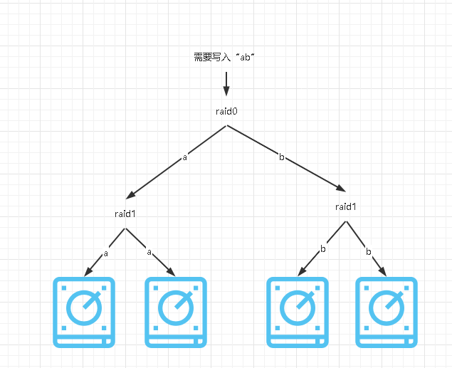

>​    如果能通过网络通信，那么就可以打破单台机器的限制：一堆硬盘+软件控制起来。做成硬盘的集群，相当于一个大的网络raid，这就是分布式存储，比如ceph

>​    ceph相当于一个网络版的raid，为了保证速度，需要用到万兆网络。 

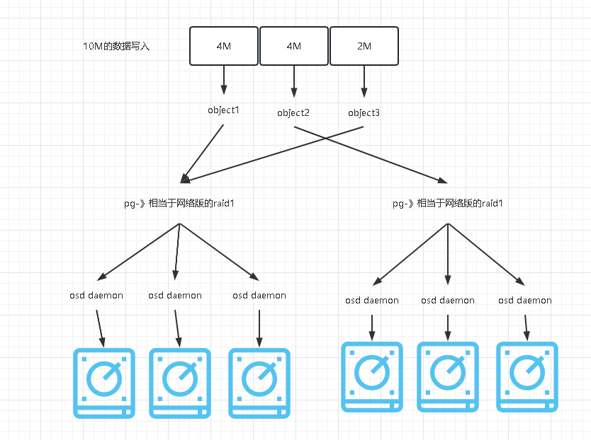

>本地的磁盘阵列写数据是轮询，因为阵列规模不大，所以数据分布相对均匀。
>
>而在ceph中pg数非常大，如果在采用轮询的方式，那么数据分配不均，所以object-》pg是通过算法算出来的，以保证尽可能的均匀。

### 2、RADOS的子集群

> Ceph的底层是Rados，而RADOS由多个子集群构成

#### 1.硬盘和文件系统

##### 1）硬盘选择

>1、若干个数据盘：一个Ceph 存储节点上可以有一个或者多个数据盘，在老版本的ceph比如hammer中每个数据盘上部署有特定的文件系统，比如 xfs，ext4 或者 btrfs，但是在最新的LTS版luminous中，数据盘是一块裸盘即可，无需制作文件系统（数据盘也可以由一块机械盘+一块固态盘）。可以是一个分区当一个disk，可以是一个raid当一个disk，也可以是一整块盘当一个disk，但是一整块盘当一个disk效率高更稳定。

##### 2）文件系统选择

>1、btrfs （B-tree 文件系统） ：功能强大，但耗费资源也高
>
>​    btrfs 是个很新的文件系统（Oracel 在2014年8月发布第一个稳定版），它将会支持许多非常高大上的功能，比如 透明压缩（ transparent compression）、可写的COW 快照（writable copy-on-write snapshots）、去重（deduplication ）和加密（encryption ）。因此，Ceph 建议用户在非关键应用上使用该文件系统。
>
>2、xfs(推荐)
>
>​    xfs 和 btrfs 相比较ext3/4而言，在高伸缩性数据存储方面具有优势。

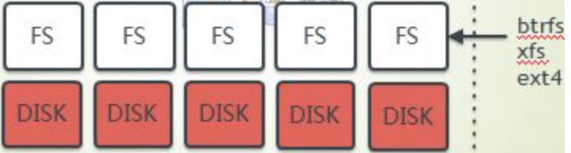

#### 2.OSD

OSD （Object Storage Device）集群：一个做好文件系统的disk由一个OSD Daemon管理，OSD Daemon负责

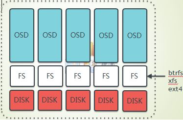

>1、负责控制数据盘上的文件读写操作，与client通信完成各种数据对象操作等等。
>2、负责数据的拷贝和恢复
>3、每个 OSD 守护进程监视它自己的状态，以及别的 OSD 的状态，并且报告给 Monitor

> 在一个服务器上，一个数据盘对应一个 OSD Daemon，而一个服务器上可以有多块数据盘，所以仅一台服务器就会运行多个OSD Daemon，该服务称之为OSD节点，一个CEPH集群中有n个OSD节点，综合算下来，OSD集群由一定数目的（从几十个到几万个） OSD Daemon 组成。

#### 3.MON

> ​    MON（Montior）集群：MON 集群由少量的、数目为奇数个的 Monitor 守护进程（Daemon）组成，负责ceph所有集群中所有OSD状态的发现与记录。理论上来讲，一个 MON 就可以完成这个任务，之所以需要一个多个守护进程组成的集群的原因是保证高可靠性。每个 Ceph node 上最多只能有一个 Monitor Daemon。
>
> ​    在一个主机上运行的一个守护进程，用于维护集群状态映射(maintains maps of the cluster state)，比如 ceph 集群中有多少存储池、每个存储池有多少 PG 以及存储池和 PG的 映 射 关 系 等 ， monitor map, manager map, the OSD map, the MDS map, and the CRUSH map，这些映射是 Ceph 守护程序相互协调所需的关键群集状态，此外监视器还负责管理守护程序和客户端之间的身份验证(认证使用 cephX 协议)。通常至少需要三个监视器才能实现冗余和高可用性。

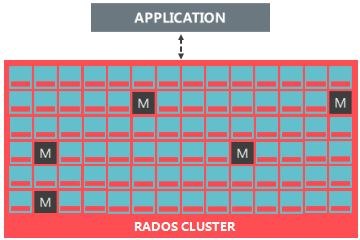

>1、要使用 CephFS，还需要 MDS 集群，用于保存 CephFS 的元数据
>
>2、要使用对象存储接口，还需要 RADOS Gateway， 它对外提供REST接口，兼容S3和Swift的API。

#### 4.有关monitor的问题

##### 1）monitor集群如何实现对ceph所有集群的状态检测和维护的

>​    OSD集群和monitor集群之间相互传输节点状态信息，共同得出系统的总体工作状态，并形成一个记录ceph系统全局状态数据结构，即所谓的cluster map。
>
>​    cluster map与RADOS提供的特定算法相配合，便实现了Ceph“无需查表，算算就好”的核心机制以及若干优秀特性，保证了数据的安全性
>
>Cluster map包括
>	1、mon map
>	2、osd map
>	3、pg map
>	4、crush map

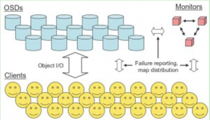

##### 2)monitor为何为奇数个--->paxos算法

>需知：集群状态是不断变化的，所以cluster map也是不断变化的
>
>为了标记最新的cluster map，monitor持有的每个cluster map都有一个视图版本号（Epoch），并且Epoch是单调递增的、伴随着cluster map的更新而更新，随着集群的运行，一些monitor节点的epoch可能会出现周期性落后的情况，那如何保持集群中所有monitor节点持有的cluster map是一致的呢，这就用到了paxos分布式强一致性算法。
>
>Paxos算法下所有monitor分为三种角色，通常应为奇数个
>
>- 1、leader：mon集群通过paxos算法选取出的主节点，主节点拥有最新版本号
>- 2、provider：正常的mon节点会找leader同步最新的版本号
>- 3、requester：请求者，down掉的mon节点，准备恢复中。（找leader同步信息，但是leader会交给provider处理）
>
>简单地讲就一句话：mon集群会依据paxos算法互相通信发现有最新的epoch存在，便会更新自己的视图版本
>

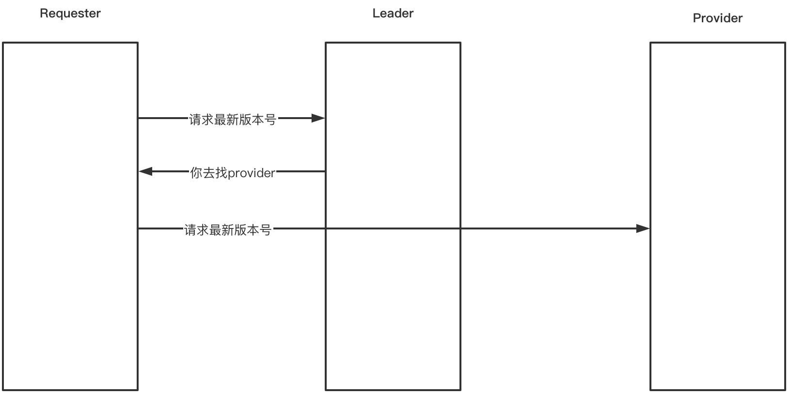


##### 3）monitor与OSD daemon是否可以在同一个节点上

>可以，但不好，最好还是分布式，杜绝集中式
>
>并且需要再次强调一点：一个节点只能有一个monitor进程，但可以有多个OSD daemon

##### 4)monitor节点的个数应该为多少？如果有3个，挂掉2个，集群还能工作吗？

> ​    一般来说，在实际运行中，ceph monitor的个数是2n+1(n>=0)个，在线上至少3个，只要正常的节点数>=n+1，ceph的paxos算法能保证系统的正常运行。所以，对于3个节点，同时只能挂掉一个。一般来说，同时挂掉2个节点的概率比较小，但是万一挂掉2个呢？
>
> ​    如果ceph的monitor节点超过半数挂掉，paxos算法就无法正常进行仲裁(quorum)，此时，ceph集群会阻塞对集群的操作，直到超过半数的monitor节点恢复。


### 3、rados的网络结构

>rados作为ceph最核心的部分，是整个ceph的大后端，应该如何架设呢???
>
>**首先：Ceph 使用以太网连接内部各存储节点以及连接 client 和rados集群。**
>
>然后：Ceph 推荐使用两个网络，这么做，主要是从性能（OSD 节点之间会有大量的数据拷贝操作）和安全性（两网分离）考虑。
>
>- 前端（北向）网络（ a public (front-side) network）连接客户端和集群
>- 后端/东西向网络 （a cluster (back-side) network）来连接 Ceph 各存储节点

>你可以在 Ceph 配置文件的 [global] 部分配置两个网络：

```bash
public network = {public-network/netmask}
cluster network = {cluster-network/netmask}
```

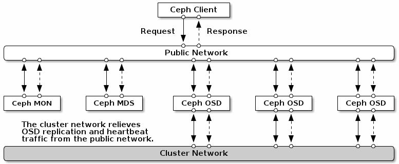

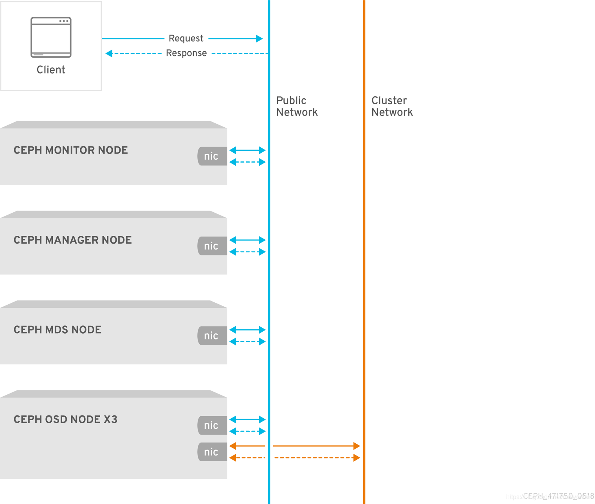

**提示**

>与客户通信的数据流为纵向，所以称之为北向网络，或称南北网络。
>集群内通信的数据流为横向，所以称之为东西网络。
>
>南北的含义是数据可以往外走，客户端是集群外的节点，其余为集群内节点
>东西的含义是数据流是横向的，数据流会在集群内节点通信，与外界无关

## 七、Ceph集群的逻辑结构

### 1、核心逻辑概念总览

#### 1.rados

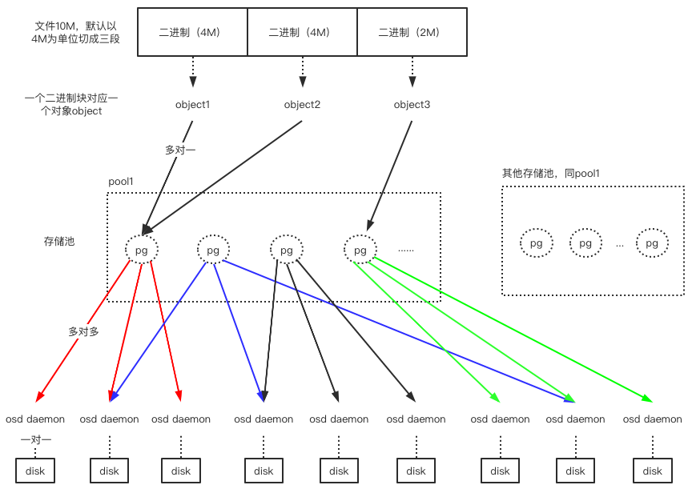

#### 2.rados构建完毕后，为客户端提供存储服务，需要：

>1、创建存储池pool，存储池中包含100个pg
>ceph osd pool create rbdtest 100
>
>2、设置pool池的副本数，即一个pg包含多少个osd daemon，往某一个pg中存的数据会在其包含的osd中都保存一份
>ceph osd pool set rbdtest size 3
>
>3、在存储池rdbtest中创建一个镜像给客户端用，一个image用的是存储池中的pg（并非指定的pg，而是只要是存在与pool中的pg都可能会用到），相当于一个配额
>rbd create -p rdbtest --size 10000 xiaowu  # image名为xiaowu，大小为10000M

>在客户端文件会被以4M为单位切成3块，每块对应一个object
>
>object 多对一 pg
>
>pg多对多osd daemon
>
>一个pool中有多个pg
>
>从pool中划分出image给用户用，image只是一个配额

>写入数据流程大致如下：
>
>
>
>```bash
>	librbd									                crush算法
>file—————————> object—————-—> pool中划分出来的image（一堆pg）———————------> osd daemon
>```
>
>ceph存储小文件效率不高
>
>底层osd daemon越多，存大文件效率越高
>
>ceph是伪数据平衡，如果只有一个PG，一个PG里副本数为3，永远只有一块盘被用到

>ceph的逻辑结构与lvm有点像
>
>pv -> osd 
>
>vg -> pool 
>
>lv -> image

### 2、pool

#### 1.pool介绍

> 存储池、分区，存储池的大小取决于底层的存储空间

**在rados集群构建完毕后、使用ceph时，需要用到诸多逻辑概念/结构，我们才能理解一个文件到底是如何写入到ceph中。ceph集群的逻辑结构主要由Pool与PG（Placement Group）来定义，本节我们先来介绍一下Pool。**


对比LVM逻辑卷

pv：把一系列的盘都做好标记，由LVM管理起来

vg：是把一系列的pv给归类到一起，相当于一块大磁盘

lv：相当于从vg这个”大磁盘“中分出的一个”分区“


> ceph的逻辑结构与lvm有点像，其对应关系如下


| LVM                                                          | Ceph                                                         |
| ------------------------------------------------------------ | ------------------------------------------------------------ |
| 对一块磁盘制作pv                                             | 一块磁盘被osd daemon管理起来                                 |
| 把一系列pv放到一个vg中，一个vg相当于一个”大磁盘“             | 在ceph中是先把n个osd daemon放到一个pg中，一个pg中接收到的一份数据会传给其所包含的osd daemon，然后一系列pg构成了pool，pool相当于一个大磁盘，与lvm中的vg类似。但是ceph中的pool只是一个逻辑概念，其所包含的存储空间都是由pg构成，须知pg并不是连续的存储空间 |
| 从vg中分出一个lv，lv相当于从vg这个”大磁盘“中分出的一个”分区“ | 从pool池中创建一个镜像image给客户端用，一个image相当于从pool这个”大磁盘“分出的一个分区。一个image用的是存储池中的pg，并非是指定的pg，而是只要存在于pool中的pg都可能会用到，所以image相当于是一个配额 |

#### 2.pool的四大属性

>- 1、所有性和访问权限
>- 2、对象副本数目，默认pool池中的一个pg只包含两个osd daemon，即一份数据交给pg后会存下2个副本，生产环境推荐设置为3个副本
>- 3、PG 数目，PG是pool的存储单位，pool的存储空间就由pg组成
>- 4、CRUSH 规则集合

#### 3.pool的两种类型

>1. Replicated pool（默认）：
>
>   拷贝型 pool，通过生成对象的多份拷贝
>
>   默认的存储池类型，把每个存入的对象（Object）存储为多个副本，其中分为主副本和从副本，从副本相当于备份副本，从而确保在部分 OSD 丢失的情况下数据不丢失。这种类型的 pool 需要更多的裸存储空间，但是它支持所有的 pool 操作。
>
>   如果客户端在上传对象的时候不指定副本数，默认为3个副本。在开始存数据之前会计算出该对象存储的主副本与从副本的位置，首先会将数据存入到主副本，然后主副本再将数据分别同步到从副本。主副本与从副本同步完毕后会通知主副本，这时候主副本再响应客户端，并表示数据上传成功。所以如果客户端收到存储成功的请求后，说明数据已经完成了所有副本的存储。
>
>   
>
>2. Erasure-coded pool：
>
>   此类型会将数据存储为K+M，其中K数据块数量。每个对象存储到Ceph集群的时候会分成多个数据块分开进行存储。而M为为编码块，也代表最多容忍可坏的数据块数量。类似于磁盘阵列RAID5，在最大化利用空间的同时，还能保证数据丢失可恢复性，相比副本池更节约磁盘的空间。 因为副本池很浪费存储空间，如果Ceph集群总容量为100T，如果使用副本池，那么实际可用空间按3个副本算，那么只有30T出头。而使用纠删码池就可以更大化的利用空间，但纠删码池更浪费计算资源。 如存储一个100M的资源，如果使用副本池，按3副本计算实际上要使用300M的空间。而使用纠删码池，如果将100M资源分为25块，如果将M指定为2，那么总共只需要108M空间即可，计算公式为100+100/25*2。 注意：如果存储RBD镜像，那么不支持纠删码池。关于此类型存储池使用不多，不做过多介绍。

#### 4.pool的能力

>1. Resilience（弹力）：即在确保数据不丢失的情况允许一定的 OSD 失败，这个数目取决于对象的拷贝（copy/replica）份数或称副本数。对拷贝型 pool 来说，Ceph 中默认的拷贝份数是2，这意味着除了对象自身外，它还有一个另外的备份。你可以自己决定一个 Pool 中的对象的拷贝份数，生产环境推荐为3，副本数越多数据越安全、真正可以空间越少
>
>2. PG（Placement Groups，放置组）：ceph用pg把存放相同副本的osd daemon归为一组。
>
>   客户端的文件会被切成多个object然后交给ceph存储，ceph中真正负责存储的是osd daemon守护进程，在存储时，ceph需要找到n个osd daemon、归类好哪些osd daemon存放的是同一个副本、然后把object交给它们，为了降低查找与归类成本，与是引入了pg的概念，将存放相同副本的osd daemon归为一个pg组
>
>3. CRUSH Rules （CRUSH 规则）：数据映射的策略。系统默认提供 “replicated_ruleset"。用户可以自定义策略来灵活地设置 object 存放的区域。比如可以指定 pool1中所有objecst放置在机架1上，所有objects的第1个副本放置在机架1上的服务器A上，第2个副本分布在机架1上的服务器B上。 pool2中所有的object分布在机架2、3、4上，所有Object的第1个副本分布在机架2的服务器上，第2个副本分布在机架3的服 器上，第3个副本分布在机架4的服务器上。后续egon会详细介绍crush rules。
>
>4. Snapshots（快照）：你可以对 pool 做快照。
>
>5. Set Ownership：设置 pool 的 owner 的用户 ID。
>
>6. Ceph 集群创建后，默认创建了 data，metadata 和 rbd 三个存储池。

### 3、pg

#### 1.概念

##### 1)介绍

>PG英文全称 Placement Group，中文称之为归置组。
>
>一个 pool 内部可以有多个 PG 存在，pool 和 PG 都是抽象的逻辑概念，一个 pool 中有多少个 PG 可以通过公式计算。

##### 2)作用

>​    PG的作用：PG相当于一个虚拟组件，出于集群伸缩，性能方面的考虑。Ceph将每个存储池分为多个PG，如果存储池为副本池类型，并会给该存储池每个PG分配一个主OSD和多个从OSD，当数据量大的时候PG将均衡的分布行不通集群中的每个OSD上面。

##### 3)核心概念

>- PG 也是对象的逻辑集合。pool中的副本数设置为3，则一个pg中包含3个osd daemon，同一个PG 接收到的所有object在这3个osd daemon上被复制。
>
>- Epoch：PG map 的版本号，它是一个单调递增的序列。
>
>- Peering：见下文的状态描述。
>
>- Acting set：支持一个 PG 的所有 osd daemon 的有序列表，其中第一个 OSD 是主OSD，其余为次。acting set 是 CRUSH 算法分配的，但是不一定已经生效了。
>
>- Up set：某一个 PG map 历史版本的 acting set。在大多数情况下，acting set 和 up set 是一致的，除非出现了 pg_temp。
>
>- Current Interval or Past Interval：若干个连续的版本号，这些版本中 acting 和 up set 保持不变。
>
>- PG temp：
>
>  一个PG组里有三个组员/OSD daemon，三个组员第一个是组长，组长负责对外提供服务，组员负责备份，一旦组长挂掉后，相当于公司中一个部门的项目经理挂了，公司会招聘一个新的项目经理，但新的项目经理刚来的时候还什么都不知道（即新加进来的osd daemon是没有任何组内数据的），此时公司会让某个组员先临时接替一下组长的职务、对外提供服务，一旦新来的组长了解了业务（即新加进来的osd daemon已经同步好数据了），那么就可以让新组长出山了，详解如下
>
>  > ​    在Ceph 正在往主 OSD 回填数据时，这个主OSD是不能提供数据服务的，这时候，它会向 MON 申请一个临时的 acting set，这就是 PG temp。举个例子，现在 acting set 是[0,1,2]，出现了一点事情后，它变为 [3,1,2]，此时 osd.3 还是空的因此它无法提供数据服务因此它还需要等待backfilling过程结束，因此，它会向 MON 申请一个临时的 set 比如 [1,2,3]，此时将由 osd.1 提供数据服务。回填过程结束后，该临时 set 会被丢弃，重新由 osd.3 提供服务。
>
>- 主 （primary） OSD：在 acting set 中的首个 OSD，负责接收客户端写入数据；默认情况下，提供数据读服务，但是该行为可以被修改。它还负责 peering 过程，以及在需要的时候申请 PG temp。
>
>- 次 （replica）OSD：在 acting set 中的除了第一个以外的其余 OSD。
>
>- 流浪 （stray） OSD：已经不是 acting set 中了，但是还没有被告知去删除数据 的 OSD。
>
>- PG 的 acting set 是由 CRUSH 算法根据 CRUSH Rules 动态地计算得出的。

#### 2.特点

##### 1）基本特点

>- 1）Ceph 引入 PG 的目的主要是为了减少直接将对象object映射到 OSD 的复杂度，即PG 确定了 pool 中的对象object和 OSD 之间的映射关系，一个 object 只会存在于一个 PG 中，但是多个object可以在同一个 PG 内。PG-Object-OSD 的关系如下图所示：
>
>  ​                                                  object与PG是多对一的关系
>
>  ​                                                  PG与OSD daemon是多对多的关系
>
>  ​                                                  OSD daemon与disk是一对一的关系
>
>  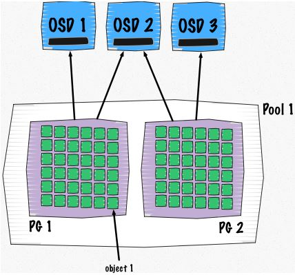
>
>- 2）一个OSD上的PG则可达到数百个。事实上，PG数量的设置牵扯到数据分布的均匀性问题。PG 和 OSD 之间的映射关系由 CRUSH 决定，而它做决定的依据是 CRUSH 规则（rules）。CRUSH 将所有的存储设备（OSD）组织成一个分层结构，该结构能区分故障域（failure domain），该结构中每个节点都是一个 CRUSH bucket。详细情况后续介绍。
>
>- 3）对象的副本数目，也就是被拷贝的次数，是在创建 Pool 时指定的。该分数决定了每个 PG 会在几个 OSD 上保存对象。如果一个拷贝型 Pool 的size（拷贝份数）为 2，它会包含指定数目的 PG，每个 PG 使用两个 OSD，其中，第一个为主 OSD （primary），其它的为从 OSD （secondary）。不同的 PG 可能会共享一个 OSD。
>
>- 4）PG 也是Ceph 集群做清理（scrubbing）的基本单位，也就是说数据清理是一个一个PG来做的。

##### 2）PG 和 OSD 的关系是动态的

>```bash
>	librbd									                crush算法
>file—————————> object—————-—> pool中划分出来的image（一堆pg）———————------> osd daemon
>```

- 1）一开始在 PG 被创建的时候，MON 根据 CRUSH 算法计算出 PG 所在的 OSD。这是它们之间的初始关系。

- 2）Ceph 集群中 OSD 的状态是不断变化的，它会在如下状态之间做切换：

  - up：守护进程运行中，能够提供IO服务；
  - down：守护进程不在运行，无法提供IO服务；
  - in：包含数据；
  - out：不包含数据

- 3）部分 PG 和 OSD 的关系会随着 OSD 状态的变化而发生变化。

  - 当新的 OSD 被加入集群后，已有OSD上部分PG将可能被挪到新OSD上；此时PG 和 OSD 的关系会发生改变。
  - 当已有的某 OSD down 了并变为 out 后，其上的 PG 会被挪到其它已有的 OSD 上。
  - 但是大部分的 PG 和 OSD 的关系将会保持不变，在状态变化时，Ceph 尽可能只挪动最少的数据。

- 4）客户端根据 Cluster map 以及 CRUSH Ruleset 使用 CRUSH 算法查找出某个 PG 所在的 OSD 列表。

#### 3.pg的创建过程

>  Pool 的 PG 数目是创建 pool 时候指定的，Ceph 官方有推荐的计算方法。其值与 OSD 的总数的关系密切。当Ceph 集群扩展 OSD 增多时，根据需要，可以增加 pool 的 PG 数目。
>
>  - 1）MON 节点上有PGMonitotor，它发现有 pool 被创建后，判断该 pool 是否有 PG。如果有PG，则逐一判断这些 PG 是否已经存在，如果不存在，则开始下面的创建 PG 的过程。
>  - 2）创建过程的开始，设置PG 状态为 Creating，并将它加入待创建PG队列 creating_pgs，等待被处理。
>  - 3）开始处理后，使用 CRUSH 算法根据当前的 OSD map 找出来 up/acting set，确定哪些osd属于哪些pg，然后加入队列 creating_pgs_by_osd，等待被处理
>  - 4）队列处理函数将该 OSD 上需要创建的 PG 合并，生成消息MOSDPGCreate，通过消息通道发给 OSD。
>  - 5）OSD 收到消息字为 MSG_OSD_PG_CREATE 的消息，得到消息中待创建的 PG 信息，判断类型，并获取该PG的其它OSD，加入队列 creating_pgs （似乎是由主 OSD 负责发起创建次 OSD 上的PG），再创建具体的 PG。
>  - 6）PG 被创建出来以后，开始 Peering 过程。

#### 4.PG 数目的确定（非常非常非常重要！！！）

##### 1)pg数量不合适的后果

>**创建 pool 时需要确定其 PG 的数目，在 pool 被创建后也可以调整该数字，但是增加池中的PG数是影响ceph集群的重大事件之一，生成环境中应该避免这么做，因为pool中pg的数目会影响到**
>
>- 1）数据的均匀分布性：CRUSH 算法会**伪随机**地保证 PG 被选中来存放客户端的数据，它还会尽可能地保证所有的 PG 均匀分布在所有的 OSD 上，即ceph是伪数据平衡，如果只有一个PG，一个PG里副本数为3，永远只有一块盘被用到
>
>```bash
>比方说，有10个OSD，但是只有一个 size 为 3 的 pool、它只有一个 PG，那么10个 OSD 中将只有三个 OSD 被用到。 CURSH 算法在计算的时候并不会考虑到OSD上已有数据的大小。如果10个OSD上存在1000个PG内，每个 OSD 上大概有400M 数据。再加进来一个400M的对象（假设它不会被分割），那么有三块 OSD 上将有 400M + 400M = 800 M 的数据，而其它七块 OSD 上只有 400M 数据。
>```
>
>- 2）资源消耗：PG 作为一个逻辑实体，它需要消耗一定的资源，包括内存，CPU 和带宽。太多 PG 的话，则占用资源会过多。
>
>- 3）清理时间：Ceph 的清理工作是以 PG 为单位进行的。如果一个 PG 内的数据太多，则其清理时间会很长。
>- 4）数据的持久性：Pool中的PG个数应该随着osd daemon的增多而增多，这样crush算法可以将pg与osd的对应关系尽量均匀一些、降低同一个osd属于很多很多个pg的几率，如果一个osd真的属于很多很多pg，这有可能会很糟糕
>
>```bash
>假设我们的pool副本size为3，则表示每个 PG 会将数据存放在 3 个 OSD 上，
>一旦某个osd daemon挂掉，因为一个osd daemon很多很多pg，则此时会出现很多pg只有两个2副本的情况，数据开始进行recovery 恢复，如recovery结束前，因为数据量过大，又有一个osd daemon（也属于很多很多pg）扛不住压力也崩溃掉了，那么将会有一部分pg只有一个副本，recovery 过程继续，情况继续恶化，如果再有第三个osd daemon挂掉，那么就可能会出现部分数据丢失。
>```
>
>可见，每个 OSD 上的PG数目不宜过大，否则，会降低数据的持久性，可以肯定的一点是osd数越多，存储池中包含的pg的数目也应对应增加，这样每个osd上的pg数才会尽量均匀、不会过大。那如何确定一个Pool中有多少 PG?Ceph不会自己计算,而是给出了一些参考原则,让Ceph用户自己计算，
>
>- 少于 5 个 OSD daemon， 建议将pool中的pg数设为  128
>- 5 到 10 个 OSD daemon，建议将pool中的pg数设为 512
>- 10 到 50 个 OSD daemon，建议将pool中的pg数设为 4096
>- 50 个 OSD daemon 以上，就需要有更多的权衡来确定 PG 数目，你可以使用 [pgcalc](http://ceph.com/pgcalc/) 工具https://ceph.com/pgcalc/，详解如下

##### 2）如何确定pg的数量

我们在创建存储池时

```bash
ceph osd pool create 存储池名 pg_num
```

如何设置存储中包含的pg_num，才能让crush算法尽可能保证pg在osd上分布均匀呢，官网的公式如下

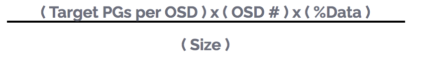

>Target PGs per OSD：crush为每个osd分配的pg数
>osd# ：通常为osd daemon的总数
>%data：该存储池的空间占ceph集群整体存储空间的百分比
>size：存储池中的副本数

>提示：官方建议每个osd上的pg数（即Target PGs per OSD）应该为
>
>如果在可预见的将来，集群中的osd数目不会增加，那么建议每个osd上分配的pg数为100个
>如果在可预见的将来，集群中的osd数目会增加（如增加一倍），那么建议每个osd上分配的pg数为200个

>
>
>按照上述公式得出结果后，还需要作出如下判断才能最终确定待创建的存储池中的pg数目
>
>- (1) 如果得出的值小于：osd总数 /size，那么值应该采用：osd 总数/size，这是为了通过为每个池的每个OSD分配至少一个主要或次要PG来确保均匀的负载/数据分布。
>
>- (2) 输出的值应该四舍五入到最接近的2次方，这利于crush算法的效率提升
>- (3) 如果最接近的2次方（比如为2^3）比得到原始值低25%以上，则使用下一个更高的2次方(应该取2^4)。
>
>举例：我们ceph集群的总空间为100T，我们先分出一个1T的存储池
>
>```bash
># 步骤一：先得到公式中各部分需要的4个值
>那么我们的存储池占总空间的百分比为0.01
>假设我们总共100个osd
>假设未来很长一段时间内我们的osd也不会再增加了，那么target PGS per OSD应该为100
>加上存储池中的副本数为3
>
># 步骤二：将4个值填入公式计算出结果
>100*100*0.01 / 3  得到值 33.333333333333336
>
># 步骤三：将得到的值与osd总数 /size，取大的那个值
>
>osd总数 /size 即 100 / 3 得33.333333333333336
>与步骤二算出的值比较，取一个大值
>
>最终选定33.333333333333336
>
># 步骤四：依据步骤三的值取最接近的2次方
>33.333333333333336取最接近的2次方，2^5结果为32
>```
>
>```bash
>ceph osd pool create egon_test 32
>```

>官网举例，https://ceph.com/pgcalc/，在官网中往表格中输入对应内容即可得出pg个数，很方便

官网例中：创建了一堆存储池，每个存储池占用总空间的一定比例，即%Data，该值带入公式时，因为是百分比，所以需要除以100后才可以，所有存储池的%Data加在一起为100%


#### 5.PG的状态是不断变化的

>其主要状态包括：
>
>- 1）Creating 创建中：PG 正在被创建。
>
>- 2）Peering 对等互联（处于该状态的PG不能响应IO请求）
>
>  Peering就是一个 PG 的所有 OSD 都需要互相通信来就PG 的对象及其元数据的状态达成一致的过程。
>
>  Peering的过程其实就是pg状态从初始状态然后到active+clean的变化过程。
>
>  一个 OSD 启动之后，上面的pg开始工作，状态为initial，这时进行比对所有osd上的pglog和pg_info，对pg的所有信息进行同步，并选举primary osd和replica osd，peering过程结束，然后把peering的结果交给recovering，由recovering过程进行数据的恢复工作。
>
>- 3）Active 活动的：Peering 过程完成后，PG 的状态就是 active 的。此状态下，在主次OSD 上的PG 数据都是可用的，即PG内主OSD和从OSD都处于就绪状态，可正常提供客户端请求。
>
>- 4）Clean 洁净的：此状态下，主次 OSD 都已经被 peered 了、都处于就绪状态，每个副本都就绪了。
>
>- 5）Down：PG 掉线了，因为存放其某些关键数据（比如 pglog 和 pginfo，它们也是保存在OSD上）的副本 down 了。
>
>- 6）Degraded 降级的：某个 OSD  daemon被发现停止服务 （down）了后，Ceph MON 将该 OSD 上的所有 PG 的状态设置为 degraded，即PG包含的osd数目不够，此时该 OSD 的 peer OSD 会继续提供数据服务。这时会有两种结果：
>
>  一是它会重新起来（比如重启机器时），需要再经过 peering 过程再到clean 状态，而且 Ceph 会发起 recovery （恢复）过程，使该 OSD 上过期的数据被恢复到最新状态；
>
>  二是 OSD 的 down 状态持续 300 秒后其状态被设置为 out踢出集群，Ceph 会启动自恢复操作，选择其它的 OSD 加入 acting set，并启动回填（backfilling）数据到新 OSD 的过程，使 PG 副本数恢复到规定的数目。 有时候某个OSD不可用，崩溃的时候也会处此此状态。详情可以参考 [PG 的数据恢复过程](http://my.oschina.net/u/2460844/blog/596895)。
>
>- 7）Remapped 重映射：每当 PG 的 acting set 改变后，就会发生从旧  acting set 到新 acting set 的数据迁移。此过程结束前，旧 acting set 中的主 OSD 将继续提供服务。一旦该过程结束，Ceph 将使用新 acting set 中的主 OSD 来提供服务。
>
>- 8）Stale 过期的：每个OSD daemon每隔 0.5 秒向 MON 报告其状态。如果因为任何原因，主 OSD 报告状态失败了，或者其它OSD已经报告其主 OSD down 了，Ceph MON 将会将它们的 PG 标记为 stale 状态。 
>
>- 9） Undersized：当PG中的副本数少于其存储池指定的个数的时候，就为此状态。
>
>- 10）Scrubbing：各OSD还会周期性的检查其持有的数据对象的完性，以确保主和从的数据一致，这时候状态就为此状态。 另外PG偶尔还需要查检确保一个对象的OSD上能按位匹配，这时候状态为scrubbing+deep。
>
>- 11）Recovering 恢复中（增量恢复）：一个 OSD down 后，其上面的 PG 的内容的版本会比其它OSD上的 PG 副本的版本落后。在它重启之后（比如重启机器时），Ceph 会启动 recovery 过程来使其数据得到更新。
>
>- 12）Backfilling 回填中（全量恢复）：一个新 OSD 加入集群后，Ceph 会尝试级将部分其它 OSD 上的 PG 挪到该新 OSD 上，此过程被称为回填。与 recovery 相比，回填（backfill）是在零数据的情况下做全量拷贝，而恢复（recovery）是在已有数据的基础上做增量恢复。
>
>- 13）PG 的所有的状态是一个类似树形的结构，每个状态可能存在子状态，子状态还可能存在子状态，如下图所示：

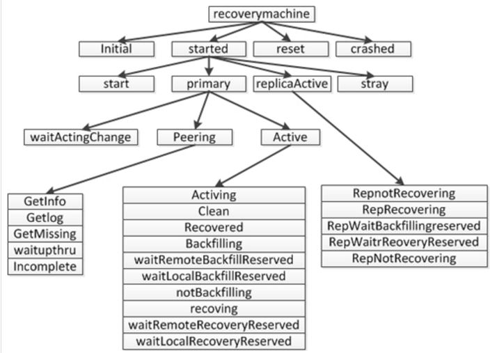

#### 6.Ceph 以 PG 为单位进行数据清理 scrubbing

>Ceph 以 PG 为单位进行数据清理 scrubbing，以保证数据的完整性，它的作用类似于文件系统的 fsck 工具。
>
>- - 1）Ceph 的 OSD daemon定期启动 scrub 线程来扫描部分对象，通过与其他osd daemon的副本比对来发现是否一致，如果存在不一致，抛出异常提示用户手动解决。管理员也可以手工发起。
>
>  - 2）在与其他osd daemon的副本进行比较时，有两种比较方式：
>
>    - light scrubbing：比较对象的size和属性，一般每天进行 
>    - deep scrubbing：读取对象的数据，比较检验码，一般每周进行。
>
>  - 3）OSD daemon定期启动 的scrub 线程会以 PG 为单位，对于每一个PG，scrub 线程会分析该 PG 下所有的对象, 产生一个类似于元数据信息摘要的数据结构，如对象大小，属性等，叫scrubmap, 比较主与副scrubmap，来保证是不是有object 丢失或者不匹配。
>
>  - 4）Scrub 的工作方式分成两种， "classic Scrub" vs "chunky Scrub"。
>
>    Scrub 流程需要提取对象的校验信息然后跟其他副本的校验信息对比，这期间被校验对象的数据是不能被修改的,所以 write 请求会被 block. 由于 PG 可能包含成千上万 objects, 
>
>    chunky Scrub 每一次的比较只取其中一部分 objects 来比较，这样只 block一小部分object的write请求。这是在ceph的Bobtail(v0.56  Jan 1 2013)引入的feature,称为chunky scrub。
>
>    Classic scrub 没有引入chunk， 会block所有的write请求。
>
>  - 5）该机制对保证数据的完整性非常重要，但是也会消耗大量的集群资源，block 住一部分对象的写入操作，降低集群的性能，特别是当一个OSD服务器上多个OSD同时进行深度清理的时候。这篇文章 [Ceph Deep-Scrubbing Impact Study](http://blog.simon.leinen.ch/2015/02/ceph-deep-scrubbing-impact.html) 说当有三个深度清理线程发生时，性能有明显的下降。

#### 7.pg带来的一些运维问题

>（1）扩容粒度
>
>Ceph在实践中，扩容受“容错域”制约，一次只能扩一个“容错域”。容错域就是：副本隔离级别，即同一个replica的数据，放在不同的磁盘/机器/Rack/机房。默认是机器，通常设为机架。
>
>Ceph扩容需要对PGs进行调整。正因为这个调整，导致Ceph受“容错域”制约。
>
>例如：有一个PG，是3副本，Ceph集群有一个配置是PG要向外提供正常服务，至少有2个完整的副本。而当这个数据pool的容错域是host时，同时扩容2台机器，一些PG就有可能把3副本中的2个都映射到2台新机器上去。而这2个副本都是新副本，都没有完整的最新数据。剩下的一个副本，无法满足老机器至少有完整的2副本的要求，也就不能提供正常读写服务了。这就会导致这个PG里的所有对象，停止对外服务。
>
>那在扩容时，一次只扩容一台机器时，是不是就安全了呢？这样就能保证所有PG都至少在老机器有2个完整的副本了。可是，即使是扩容一台机器，也还要面临扩容时老机器中有硬盘坏掉，导致PG的完整副本又下降为1的极端情况发生。
>
>办法是，在开始规划Ceph集群时，设定好更大层次的“容错域”，比如Rack。 可以是真实的Rack，即使没有也可以是逻辑的Rack。这样扩容时，可以扩一个逻辑“容错域”，就可以打破扩一台机器的限制，扩一整个Rack，至少有好几台机器。
>
>（2）扩容是 crushmap 变化带领的系统抖动
>
>Ceph是根据crushmap去放置PG的物理位置的，倘若在扩容进行了一半时，又有硬盘坏掉了，那Ceph的crushmap就会改变，Ceph又会重新进行PG的re-hash，很多PG的位置又会重新计算。如果运气比较差，很可能一台机器的扩容进度被迫进行了很久才回到稳定的状态。
>
>这个crushmap改变导致的Ceph重平衡，不单单在扩容时，几乎在任何时候，对一个大的存储集群都有些头疼。在建立一个新集群时，硬盘都比较新，因此故障率并不高。但是在运行了2-3年的大存储集群，坏盘真的是一个稀松平常的事情，1000台规模的集群一天坏个2-3块盘很正常。crushmap经常变动，对Ceph内部不稳定，影响真的很大。随之而来，可能是整体IO的下降（磁盘IO被反复的rebalance占满），甚至是某些数据暂时不可用。
>
>（3）OSD 增加时候的PG数量调整
>
>假设我们现在有10台机器，每台一块硬盘一共10块盘，有1024个PG，PG都是单副本，那么每个盘会存100个PG。此时这个设置非常健康，但当我们集群扩容到1000台机器，每台硬盘就只放一个PG了，这会导致伪随机造成的不平衡现象放大。因此，admin就要面临调整PG数量，这就带来了问题。调PG，基本也就意味着整个集群会进入一种严重不正常的状态。几乎50%的对象，涉及到调整后的PG都需要重新放置物理位置，这会引起服务质量的严重下降。
>
>（4）盘满造成的系统不可访问
>
>在集群整体使用率不高时，都没有问题。而在使用率达到70%后，就需要管理员介入了。因为方差大的盘，很有可能会触及95%这条红线。admin开始调低容量过高磁盘的reweight，但如果在这一批磁盘被调整reweight没有结束时，又有一些磁盘被写满了，那管理员就必须被迫在Ceph没有达到稳定状态前，又一次reweight过高的磁盘。  这就导致了crushmap的再一次变更，从而导致Ceph离稳定状态越来越远。而此时扩容又不及时的话，更是雪上加霜。而且之前的crushmap的中间状态，也会导致一些PG迁移了一半，这些“不完整的”PG并不会被马上删除，这给本来就紧张的磁盘空间又加重了负担。关于reweight 导致的 rebalance，可参考 <https://ceph.com/geen-categorie/ceph-osd-reweight/>。
>
>一块磁盘满了，Ceph为什么就不可用了。Ceph还真的就是这样设计的，因为Ceph没法保证新的对象是否落在空盘而不落在满盘，所以Ceph选择在有盘满了时，就拒绝服务。基本上大家的Ceph集群都是在达到50%使用率时，就要开始准备扩容了。

### 4、Ceph结构和状态地图cluster map

#### 1.介绍

>在Ceph中有很多的运行图，比如Monitor运行图，OSD运行图，集群运行图，MDS运行图和CRUSH运行图，它们统称为cluster map
>
>由若干个monitor共同负责整个Ceph集群中所有OSD状态的发现与记录，并且共同形成cluster map的master版本，然后扩散至全体OSD以及client。
>
>OSD daemon使用cluster map进行数据的维护，而client使用cluster map进行数据的寻址。
>monitor并不主动轮询各个OSD的当前状态。正相反，OSD需要向monitor上报状态信息。常见的上报有两种情况：
>
>一是新的OSD被加入集群
>
>二是某个OSD发现自身或者其他OSD发生异常。
>
>在收到这些上报信息后，monitor将更新cluster map信息并加以扩散，举例

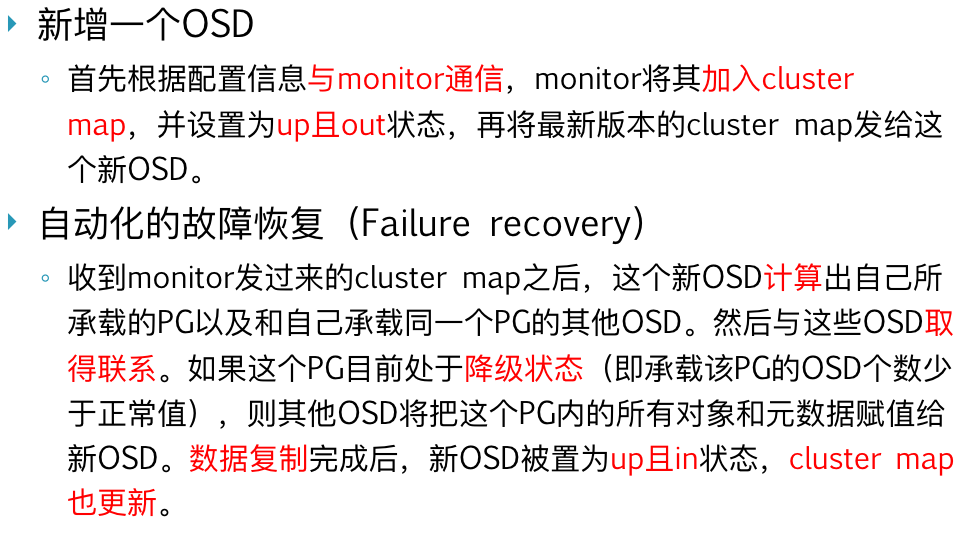

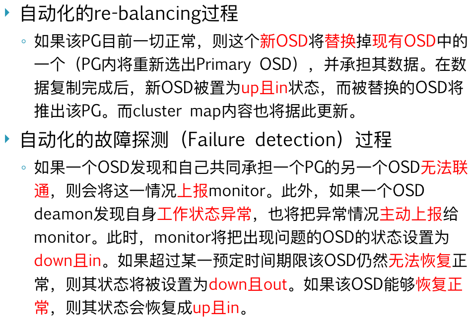

#### 2.内容

>- 1、Epoch，即版本号，为一个单调递增序列，Epoch越大，则cluster map版本越新。
>
>- 2、Monitor Map：MON 集群的状态
>
>- 3、OSD Map与PG Map：各个OSD的网络地址。各个OSD的状态。up或者down，表明OSD是否正常工作；in或者out，表明OSD是否在至少一个PG中。
>
>- 4、Crush Map：CRUSH算法配置参数。表明了Ceph集群的物理层级关系（cluster hierarchy），位置映射规则（placement rules）。

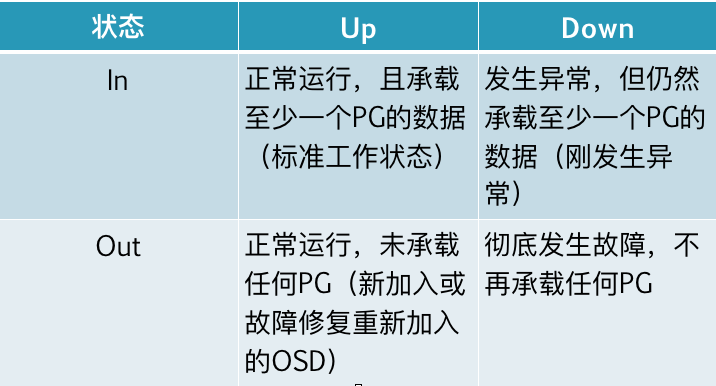

#### 3.Monitor map：Mon集群的状态图

```bash
ceph mon dump
```

#### 4.OSD Map：当前所有 Pool 的状态和所有 OSD 的状态

```bash
ceph osd dump
```

#### 5. PG Map（Placement Group）

> 包含PG 版本（version）、时间戳、最新的 OSD map epoch, full ratios, and 每个 PG 的详细信息比如 PG ID, Up Set, Acting Set, 状态 (e.g., active + clean), pool 的空间使用统计。可以通过ceph pg dump获得

```bash
ceph pg dump | awk '
 /^pg_stat/ { col=1; while($col!="up") {col++}; col++ }
 /^[0-9a-f]+\.[0-9a-f]+/ { match($0,/^[0-9a-f]+/); pool=substr($0, RSTART, RLENGTH); poollist[pool]=0;
 up=$col; i=0; RSTART=0; RLENGTH=0; delete osds; while(match(up,/[0-9]+/)>0) { osds[++i]=substr(up,RSTART,RLENGTH); up = substr(up, RSTART+RLENGTH) }
 for(i in osds) {array[osds[i],pool]++; osdlist[osds[i]];}
}
END {
 printf("\n");
 printf("pool :\t"); for (i in poollist) printf("%s\t",i); printf("| SUM \n");
 for (i in poollist) printf("--------"); printf("----------------\n");
 for (i in osdlist) { printf("osd.%i\t", i); sum=0;
 for (j in poollist) { printf("%i\t", array[i,j]); sum+=array[i,j]; poollist[j]+=array[i,j] }; printf("| %i\n",sum) }
 for (i in poollist) printf("--------"); printf("----------------\n");
 printf("SUM :\t"); for (i in poollist) printf("%s\t",poollist[i]); printf("|\n");
}'
```

其他脚本

```bash
ceph pg dump | awk '
BEGIN { IGNORECASE = 1 }
 /^PG_STAT/ { col=1; while($col!="UP") {col++}; col++ }
 /^[0-9a-f]+\.[0-9a-f]+/ { match($0,/^[0-9a-f]+/); pool=substr($0, RSTART, RLENGTH); poollist[pool]=0;
 up=$col; i=0; RSTART=0; RLENGTH=0; delete osds; while(match(up,/[0-9]+/)>0) { osds[++i]=substr(up,RSTART,RLENGTH); up = substr(up, RSTART+RLENGTH) }
 for(i in osds) {array[osds[i],pool]++; osdlist[osds[i]];}
}
END {
 printf("\n");
 printf("pool :\t"); for (i in poollist) printf("%s\t",i); printf("| SUM \n");
 for (i in poollist) printf("--------"); printf("----------------\n");
 for (i in osdlist) { printf("osd.%i\t", i); sum=0;
   for (j in poollist) { printf("%i\t", array[i,j]); sum+=array[i,j]; sumpool[j]+=array[i,j] }; printf("| %i\n",sum) }
 for (i in poollist) printf("--------"); printf("----------------\n");
 printf("SUM :\t"); for (i in poollist) printf("%s\t",sumpool[i]); printf("|\n");
}'
```

#### 6.CRUSH Map：Controlled Replication under Scalable Hashing

>**1、什么是crush？**
>
>CRUSH是一种类似于一致性hash的算法，用于为RADOS存储集群控制数据分布，全称为：Controlled Replication Under Scalable Hashing
>
>**2、crush在ceph集群中的作用？**
>
>负责数据从PG到OSD的存取。
>
>**3、故障域**
>
>可以把故障域理解为一个单元，这个单元有大有小，成一个倒树。其中最小为OSD，OSD之上为具体的服务器，服务器通过是放置在机架上，所以再者是机架，机排（一排机架），一个配电单元，机房，数据中心，根（root）。 正确的设置故障域可以降低数据丢失的风险，如果将故障域设置为OSD，那么同一条数据肯定将分布在不同OSD，有台服务器有可能会有多个OSD，有可能这条数据都在这台服务器上面，如果这台服务器宕机，有可能造成丢失。如果将故障域设置为host，那么一条数据肯定分布在不同的host，那么这时候如果有一台host宕机不会造成数据丢失（推荐）。 Ceph集群中默认的故障域有。
>
>- osd：硬盘
>- host：服务器
>- chassis：机箱
>- rack：机架（一个机架包含多个机箱）
>- row：机排
>- pdu：配电单元（有可能多个机排共用一个配电单元）
>- pod：多个机排
>- room：机房
>- datacenter：数据中心（有可能多个机房组成一个数据中心）
>- region：区域（华东1，华东2等）
>- root：最顶级，必须存在 注意：这些故障域也称之为Bucket，但有些Bucket非radowsgw里面的bucket。

CRUSH map 使用分层结构来组织集群中的所有存储设备：

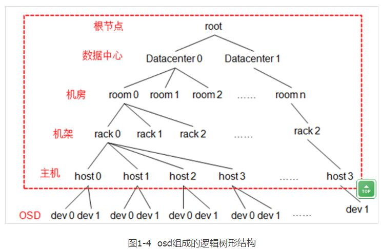


>**4、故障域算法**
>
>每个故障域都自己的算法，比如可以对每个故障域内的对象设置权重，这时候数据将以权重的大小比例将数据均分。比如硬盘大些的可能权重会高些，而硬盘小些的权重将低些。这样才可以保证数据存放到每个OSD的比例都差不多，而不是占用空间大小差不多。通常这样的过程需要一个算法来支持，一般有下面的一些算法。
>
>- uniform
>- list
>- tree
>- straw
>- straw2：straw的升级版，也是现在默认使用的版本，也推荐使用这个，其它的作为了解即可。
>
>
>
>**5、crush rules与crush的算法流程**
>
>CRUSH rules 主要有三个作用：
>
>- 指定从CRUSH Map 中的哪个节点开始查找
>- 指定使用那个节点作为故障隔离域
>- 指定定位副本的搜索模式（广度优先 or 深度优先）
>
>例子：
>
>```bash
>rule xiaowu_rule {                   # 规则集的命名，创建pool时可以指定rule集
>	id 1                           # id设置为1
>	type replicated                # 定义pool类型为replicated(还有esurecode模式)
>	min_size 1                     # pool中最小指定的副本数量不能小1
>	max_size 10                    # pool中最大指定的副本数量不能大于10
>	
>	step take datacenter0          # 定义pg查找副本的入口点
>	                               # 这一步选择一个根节点，这个节点不一定是root
>	                               # 这个节点可以是任何一个故障域
>	                               # 从指定选择的这个节点开始执行。
>	                               
>	step chooseleaf firstn 0 type rack  # 深度优先、隔离默认为host，设置为rack
>	step emit                      # 结束，返回结果
>}
>```


>PG 选择 OSD 的过程（详情可阅读 [PG选择osd的过程(crush 算法)](http://my.oschina.net/u/2460844/blog/531722)）：
>
>1. 首先要知道在 rules 中指明从 CRUSH map 中哪个节点开始查找，入口点默认为 default 也就是 root 节点
>2. 然后隔离域为 host 节点(也就是同一个host下面不能选择两个子节点)。由 default 到3个host的选择过程，这里由default根据节点的bucket类型选择下一个子节点，由子节点再根据本身的类型继续选择，知道选择到host，然后在host下选择一个osd。

### 5、crush算法与写入流程

>ceph 集群部署好之后,要先创建存储池才能向 ceph 写入数据，文件在向 ceph 保存之前要先进行一致性 hash 计算，计算后会把文件保存在某个对应的 PG 的，此文件一定属于某个pool 的一个 PG，在通过 PG 保存在 OSD 上。数据对象在写到主 OSD 之后再同步对从 OSD 以实现数据的高可用。

>ceph存储小文件效率不高，底层osd daemon越多，存大文件效率越高，为何？？？
>
>以rbd块存储客户端为例，客户端读写的都是rados中的对象object，读写object需要走完的流程是
>
>**File → (Pool, Object) → (Pool, PG) → OSD set → OSD/Disk** 

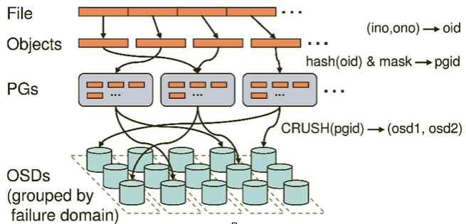

步骤解析如下:

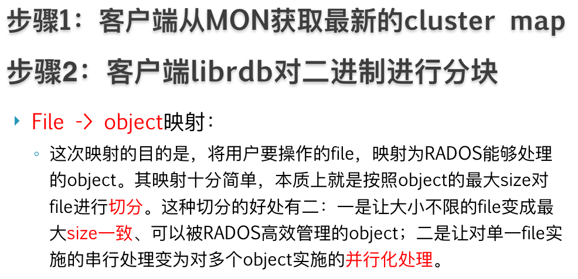

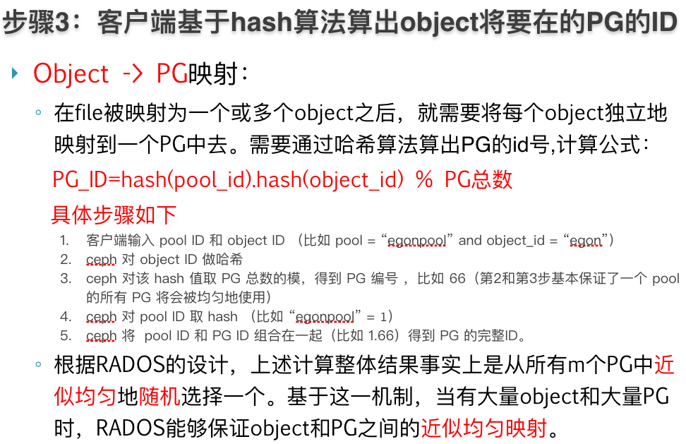


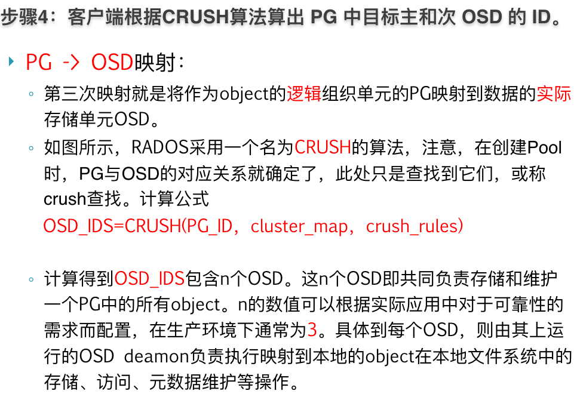

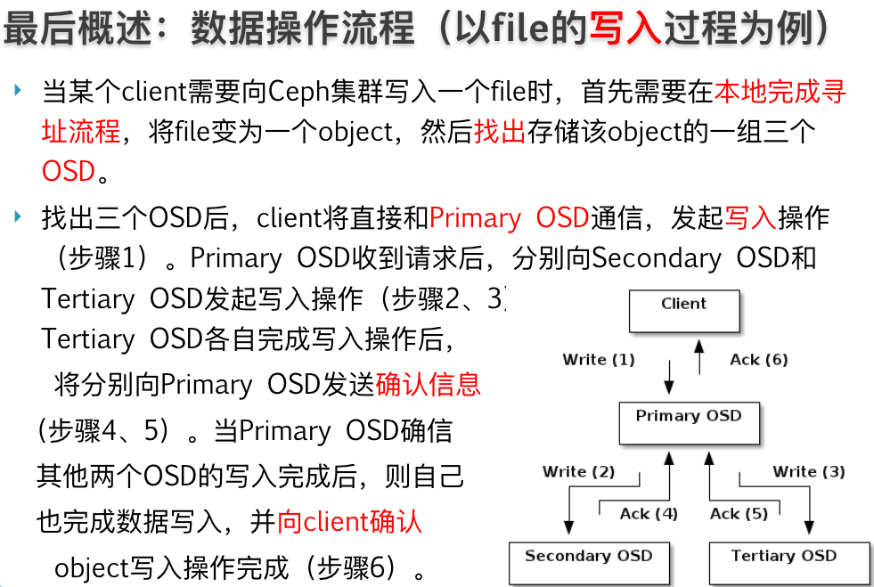

>注：存储文件过程：
>第一步: 计算文件到对象的映射:
>计算文件到对象的映射,假如 file 为客户端要读写的文件,得到 oid(object id) = ino + ono
>ino:inode number (INO)，File 的元数据序列号，File 的唯一 id。
>ono:object number (ONO)，File 切分产生的某个 object 的序号，默认以 4M 切分一个块大小。
>
>第二步：通过 hash 算法计算出文件对应的 pool 中的 PG:
>通过一致性 HASH 计算 Object 到 PG， Object -> PG 映射 hash(oid) & mask-> pgid
>
>第三步: 通过 CRUSH 把对象映射到 PG 中的 OSD
>通过 CRUSH 算法计算 PG 到 OSD，PG -> OSD 映射：[CRUSH(pgid)->(osd1,osd2,osd3)]
>在线进制转换：https://tool.oschina.net/hexconvert
>64-1=63(0~63=累计 64 个)，
>1100100=100(对象的 hash 值) 100&64=36,200&64=8
>
>0111111=63(PG 总数)
>
>0100100=36(与运算结果)
>
>第四步：PG 中的主 OSD 将对象写入到硬盘
>
>第五步: 主 OSD 将数据同步给备份 OSD,并等待备份 OSD 返回确认
>
>第六步: 主 OSD 将写入完成返回给客户端


## 八、高层应用接口详解

>介绍完ceph的大核心rados之后，我们来聊一下上层的应用，在第二章我们提过rados之上封装的是librados，在librados之上封装了：对象存储接口rados gw、块存储接口rbd，以及文件存储接口Ceph FS，本章节我们就来详细介绍一下他们

### 1、块设备存储接口

#### 1.什么是块设备？

>块设备是i/o设备中的一类，是将信息存储在固定大小的块中，每个块都有自己的地址，还可以在设备的任意位置读取一定长度的数据。看不懂？那就暂且认为块设备就是硬盘或虚拟硬盘吧。

查看下Linux环境中的设备：

```bash
ls /dev/
/dev/sda/ dev/sda1 /dev/sda2 /dev/sdb /dev/sdb1 /dev/hda 
/dev/rbd1 /dev/rbd2 …
```

**上面的/dev/sda、/dev/sdb和/dev/hda都是块设备文件，这些文件是怎么出现的呢？**

>​    当给计算机连接块设备（硬盘）后，系统检测的有新的块设备，该类型块设备的驱动程序就在/dev/下创建个对应的块设备设备文件，用户就可以通过设备文件使用该块设备了。

**它们怎么有的叫 sda？有的叫 sdb？有的叫 hda？**

>​    以sd开头的块设备文件对应的是SATA接口的硬盘，而以hd开头的块设备文件对应的是IDE接口的硬盘。那SATA接口的硬盘跟IDE接口的硬盘有啥区别？你只需要知道，IDE接口硬盘已经很少见到了，逐渐被淘汰中，而SATA接口的硬盘是目前的主流。而sda和sdb的区别呢？当系统检测到多个SATA硬盘时，会根据检测到的顺序对硬盘设备进行字母顺序的命名。PS：系统按检测顺序命名硬盘会导致了盘符漂移的问题。

**怎么还有的叫 rbd1 和 rbd2 呢?**

>​    被你发现了，rbd就是我们压轴主角了。rbd就是由Ceph集群提供出来的块设备。可以这样理解，sda和hda都是通过数据线连接到了真实的硬盘，而rbd是通过网络连接到了Ceph集群中的一块存储区域，往rbd设备文件写入数据，最终会被存储到Ceph集群的这块区域中。

**那么块设备怎么用呢？这里举个例子：**

>​    打个比方，一个块设备是一个粮仓，数据就是粮食。农民伯伯可以存粮食（写数据）了，需要存100斤玉米，粮仓（块设备）这么大放哪里呢，就挨着放（顺序写）吧。又需要存1000斤花生，还是挨着放吧。又需要存……
>
>​     后来，农民伯伯来提粮食（读数据）了，他当时存了1000斤小麦，哎呀妈呀，粮仓这么大，小麦在哪里啊？仓库管理员找啊找，然后哭晕在了厕所……
>
>​    新管理员到任后，想了个法子来解决这个问题，用油漆把仓库划分成了方格状，并且编了号，在仓库门口的方格那挂了个黑板，当农民伯伯来存粮食时，管理员在黑板记录，张三存了1000斤小麦在xx方格处。后来，农民伯伯张三来取粮食时，仓库管理员根据小黑板的记录很快提取了粮食。
>
>​     故事到此为止了，没有方格和黑板的仓库（块设备）称为裸设备。由上例可见，裸设备对于用户使用是很不友好的，直接导致了旧仓库管理员的狗带。例子中划分方格和挂黑板的过程其实是在块设备上构建文件系统的过程，文件系统可以帮助块设备对存储空间进行条理的组织和管理，于是新管理员通过文件系统（格子和黑板）迅速找到了用户（农民伯伯张三）存储的数据（1000斤小麦）。针对多种多样的使用场景，衍生出了很多的文件系统。有的文件系统能够提供更好的读性能，有的文件系统能提供更好的写性能。我们平时常用的文件系统如xfs、ext4是读写性能等各方面比较均衡的通用文件系统。

**能否直接使用不含有文件系统块设备呢？**

>​    可以的，xfs和ext4等通用的文件系统旨在满足大多数用户的存储需求，所以在数据存储的各方面的性能比较均衡。然而，很多应用往往并不需要这种均衡，而需要突出某一方面的性能，如小文件的存储性能。此时，xfs、ext4等通用文件系统如果不能满足应用的需求，应用往往会在裸设备上实现自己的数据组织和管理方式。简单的说，就是应用为了强化某种存储特性而实现自己定制的数据组织和管理方式，而不使用通用的文件系统。

#### 2.Ceph块设备接口怎么使用？

>在Ceph集群中创建块设备：
>
>```bash
>// 保证/etc/ceph目录下有Ceph集群的配置文件ceph.conf和ceph.client.admin.keyring 
>rbd create -s 1G xiaowurbd
>
>在用户机上挂载该Ceph块设备，可以理解为往用户机上插入硬盘：
>rbdmap xiaowu
>
>// 输出: 
>/dev/rbd1
>```
>
>将Ceph块设备格式化成文件系统并挂载：
>
>```bash
>mkfs.xfs /dev/rbd1
>mkdir -p /mnt/ceph_rbd
>mount /dev/rbd1 /mnt/ceph_rbd
>```
>
>**通过/mnt/ceph_rbd读写数据，都是在读写Ceph集群中该块设备对应的存储区域**
>
>总结一下，块设备可理解成一块硬盘，用户可以直接使用不含文件系统的块设备，也可以将其格式化成特定的文件系统，由文件系统来组织管理存储空间，从而为用户提供丰富而友好的数据操作支持。

### 2、文件存储接口

#### 1.介绍

>还记得上面说的块设备上的文件系统吗，用户可以在块设备上创建xfs文件系统，也可以创建ext4等其他文件系统。如图1，Ceph集群实现了自己的文件系统来组织管理集群的存储空间，用户可以直接将Ceph集群的文件系统挂载到用户机上使用。

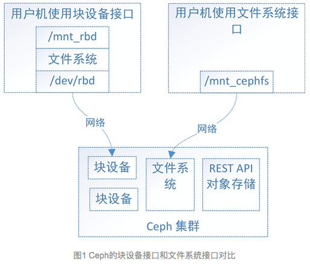

#### 2.为什么要使用文件存储接口

**Ceph有了块设备接口，在块设备上完全可以构建一个文件系统，那么Ceph为什么还需要文件系统接口呢？**

主要是因为应用场景的不同，Ceph的块设备具有优异的读写性能，但不能多处挂载同时读写，目前主要用在OpenStack上作为虚拟磁盘，而Ceph的文件系统接口读写性能较块设备接口差，但具有优异的共享性。

**为什么Ceph的块设备接口不具有共享性，而Ceph的文件系统接口具有呢？**

对于Ceph的块设备接口，如图2，文件系统的结构状态是维护在各用户机内存中的，假设Ceph块设备同时挂载到了用户机1和用户机2，当在用户机1上的文件系统中写入数据后，更新了用户机1的内存中文件系统状态，最终数据存储到了Ceph集群中，但是此时用户机2内存中的文件系统并不能得知底层Ceph集群数据已经变化而维持数据结构不变，因此用户无法从用户机2上读取用户机1上新写入的数据。

对于Ceph的文件系统接口，如图3，文件系统的结构状态是维护在远端Ceph集群中的，Ceph文件系统同时挂载到了用户机1和用户机2，当往用户机1的挂载点写入数据后，远端Ceph集群中的文件系统状态结构随之更新，当从用户机2的挂载点访问数据时会去远端Ceph集群取数据，由于远端Ceph集群已更新，所有用户机2能够获取最新的数据。

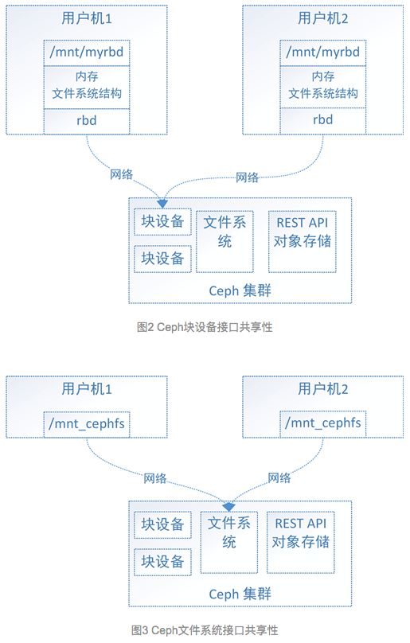

#### 3.如何使用

将Ceph的文件系统挂载到用户机目录

```bash
/* 保证/etc/ceph目录下有Ceph集群的配置文件ceph.conf和ceph.client.admin.keyring */
mkdir -p /mnt/ceph_fuse 
ceph-fuse /mnt/ceph_fuse
```

大功告成，在/mnt/ceph_fuse下读写数据，都是读写远程Ceph集群

总结一下，Ceph的文件系统接口弥补了Ceph的块设备接口在共享性方面的不足，Ceph的文件系统接口符合POSIX标准，用户可以像使用本地存储目录一样使用Ceph的文件系统的挂载目录。还是不懂？这样理解吧，无需修改你的程序，就可以将程序的底层存储换成空间无限并可多处共享读写的Ceph集群文件系统。

### 3、对象存储接口

#### 1.介绍

**首先，通过图4来看下对象存储接口是怎么用的？**

简单了说，使用方式就是通过http协议上传下载删除对象（文件即对象）。

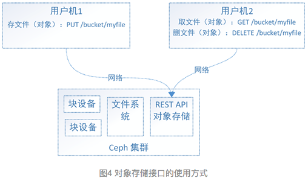

#### 2.为什么要使用对象存储

>原因是多方面的，主要原因是对象存储组织数据的方式相对简单，只有bucket和对象两个层次（对象存储在bucket中），对对象的操作也相对简单。而文件系统存储具有复杂的数据组织方式，目录和文件层次可具有无限深度，对目录和文件的操作也复杂的多，因此文件系统存储在维护文件系统的结构数据时会更加繁杂，从而导致文件系统的存储性能偏低。

#### 3.ceph的对象存储接口怎么使用呢？

Ceph的对象接口符合亚马逊S3接口标准和OpenStack的Swift接口标准，可以自行学习这两种接口。

总结一下，文件系统存储具有复杂的数据组织结构，能够提供给用户更加丰富的数据操作接口，而对象存储精简了数据组织结构，提供给用户有限的数据操作接口，以换取更好的存储性能。对象接口提供了REST API，非常适用于作为web应用的存储。

### 4、总结

概括一下，块设备速度快，对存储的数据没有进行组织管理，但在大多数场景下，用户数据读写不方便（以块设备位置offset + 数据的length来记录数据位置，读写数据）。而在块设备上构建了文件系统后，文件系统帮助块设备组织管理数据，数据存储对用户更加友好（以文件名来读写数据）。Ceph文件系统接口解决了“Ceph块设备+本地文件系统”不支持多客户端共享读写的问题，但由于文件系统结构的复杂性导致了存储性能较Ceph块设备差。对象存储接口是一种折中，保证一定的存储性能，同时支持多客户端共享读写。


## 九、块存储接口rbd的写入

### 1、块存储接口rbd的写入过程

客户端写入数据以块存储rbd为例，一般有两种方法：

- 第一种 是 Kernel rbd。就是创建了rbd设备后，把rbd设备map到内核中，形成一个虚拟的块设备，这时这个块设备同其他通用块设备一样，一般的设备文件为/dev/rbd0，后续直接使用这个块设备文件就可以了，可以把 /dev/rbd0 格式化后 mount 到某个目录，也可以直接作为裸设备使用。这时对rbd设备的操作都通过kernel rbd操作方法进行的。 
- 第二种是 librbd 方式。就是创建了rbd设备后，这时可以使用librbd、librados库进行访问管理块设备。这种方式不会map到内核，直接调用librbd提供的接口，可以实现对rbd设备的访问和管理，但是不会在客户端产生块设备文件。

应用写入rbd块设备的过程（假设后端存储引擎为filestore）

1. 应用调用 librbd 接口或者对linux 内核虚拟块设备写入二进制块。下面以 librbd 为例。
2. librbd 对二进制块进行分块，默认块大小为 4M，每一块都有名字，成为一个对象
3. librbd 调用 librados 将对象写入 Ceph 集群
4. librados 向主 OSD 写入分好块的二进制数据块 (先建立TCP/IP连接，然后发送消息给 OSD，OSD 接收后写入其磁盘)
5. 主 OSD 负责同时向一个或者多个次 OSD 写入副本。**注意这里是写到日志（Journal）就返回，因此，使用SSD作为Journal的话，可以提高响应速度，做到服务器端对客户端的快速同步返回写结果（ack）。**
6. 当主次OSD都写入完成后，主 OSD 向客户端返回写入成功。
7. 当一段时间（也许得几秒钟）后Journal 中的数据向磁盘写入成功后，Ceph通过事件通知客户端数据写入磁盘成功（commit），此时，客户端可以将写缓存中的数据彻底清除掉了。
8. 默认地，Ceph 客户端会缓存写入的数据直到收到集群的commit通知。如果此阶段内（在写方法返回到收到commit通知之间）OSD 出故障导致数据写入文件系统失败，Ceph 将会允许客户端重做尚未提交的操作（replay）。因此，PG 有个状态叫 replay：“The placement group is waiting for clients to replay operations after an OSD crashed.”。

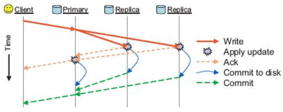

也就是，文件系统负责文件处理，librdb 负责块处理，librados 负责对象处理，OSD 负责将数据写入在Journal和磁盘中。

### 2、储备知识：常见的write cache种类

基于块存储接口rbd封装的块存储客户端具有写缓存机制，要了解它，我们先来了解一下write cache种类

| 缓存种类                     | 说明                                                         | 优劣势                                                       | 适合场景                                     |
| ---------------------------- | ------------------------------------------------------------ | ------------------------------------------------------------ | -------------------------------------------- |
| Write-through（直写/同步写） | 这种缓存方式在写 I/O 时把数据放入缓存，同时直接写入底层的持久存储，然后再向主机确认写入操作完成。 | 安全地保存数据，从缓存读，减少了读操作的延迟，但是写操作 的延迟没得到优化 | 适合于写较少，但是频繁度的应用               |
| Write-back （回写/异步写）   | 数据直接写入缓存，然后向主机返回写入完成。                   | 对频繁写应用减少了写的延迟，但是有数据丢失风险               | 对读写混合型应用有优势，但是需要考虑数据保护 |

缓存的通常位置分类：

- 服务器（主机）上：RAID 卡或者 HBA 卡上做缓存。
- VMM 内：在 Hypervisor 上做缓存。
- 客户机操作系统内：以 Windows 2012 为例，它提供 write-back 缓存机制。

### 3、RBD块存储缓存

默认情况下，Ceph RBD 是不使用缓存的，读和写直接到 Ceph 集群中的存储，写只有在所有 replication上写都完成后才给客户端返回写完成。Ceph 在较新的版本上陆续添加了 RBD 缓存支持：

- 从 0.46 版本开始，Ceph 支持 write-back 缓存，你可以在 ceph.conf 文件的 [client] 部分添加 rbd cache = true 来使得 write-back 缓存生效。这时候，写几乎是立即返回，但是数据只有在被 flushed 后才写入到实际存储。
- 从 0.47 版本开始，Ceph 支持 write-through 缓存机制。你只需要再添加配置项 rbd cache max dirty = 0 即可。
- 从 0.60 版本开始，Ceph 支持 rbd cache writethrough until flush 配置项。设置它为 true 时，会使得 write-through 机制变得更加安全，因为老的客户机操作系统（2.6.32 内核版本之前）可能不支持 flush 操作。因此，在设置了该配置项为 true 时，即使用户设置了使用 write-through 机制，Ceph 也会自动使用 write-back 机制，直到它收到第一个 flush 指令后才真正使用 write-through。

可见 RBD 缓存是在客户端做的，见如下图示：

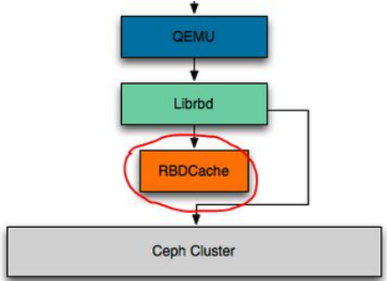

### 4、Cache tiering （缓存分层）

​    Ceph 还支持在集群段做缓存分层。其原理是，在较快的磁盘比如 SSD 上建立一个 cache pool，在建立存储池（storage pool）和它之间的 cache 关系，设置一定的缓存策略，实现类似于在客户端缓存同样的效果。

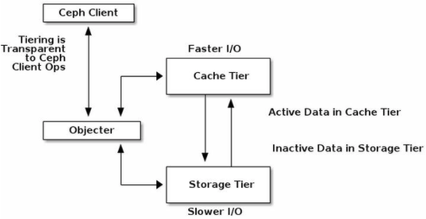

### 5、RBD Cache 和 Cache Tiering 的区别

  从上面的分析可以看出来，两者的区别在于缓存的位置不同：

- sCache tiering 是 RADOS 层在 OSD 端进行数据缓存，也就是说不论是块存储、对象存储还是文件存储都可以使用tier来提高读写速度

- RBD Cache是 rbd 层在客户端的缓存，也就是只支持块存储。

  Rbd cache是 客户端的缓存，当多个客户端使用同个块设备时，存在**客户端数据不一致**的问题。举个例子，用户A向块设备写入数据后，数据停留在客户自己的缓存中，没有立即刷新到磁盘，所以其它用户读取不到A写入的数据。但是tier不存在这个问题，因为所有用户的数据都直接写入到 ssd，用户读取数据也是在ssd中读取的，所以不存在客户端数据不一致问题。

  一般地，Tier 使用 SSD 做缓存，而 Rbd cache 只能使用内存做缓存。SSD和内存有两个方面的差别，一个是读写速度、另一个是掉电保护。掉电后内存中的数据就丢失了，而ssd中的数据不会丢失。

## 十、存储引擎

### 1、存储引擎介绍介绍

ceph后端支持多种存储引擎，以插件式的方式来进行管理使用，目前支持filestore，kvstore，memstore以及最新的bluestore。

在老版本的Ceph当中FileStore是默认的对象存储引擎，但FileStore是基于操作系统通用的文件系统层,例如Ext4和XFS等，这些都是日志文件系统，所以filestore在写数据前需要先写journal，会有写放大问题（即一次读写请求实际在低层磁盘发生的IO次数，再加上FileStore的日志双写，放大倍数成倍增加，推荐阅读https://blog.csdn.net/majianting/article/details/105517527)，并且filestore一开始只是对于机械盘进行设计的，没有专门针对ssd做优化考虑，因此整体性能欠佳。

于是bluestore应运而生，BlueStore设计的初衷就是为了减少写放大，并针对ssd做优化，而且直接管理裸盘，抛弃了ext4/xfs等本地文件系统，从理论上进一步减少文件系统如ext4/xfs等部分的开销、效率更高。


```bash
# BlueStore 
直接使用一个原始分区，ceph对象将直接写在块设备上，不再需要任何的文件系统,和osd一起进来的元数据将存储在 一个 名为 RocksDB 的键值对 数据库；

# 各层意义
RocksDB ：存储 WAL 日志和元数据（omap）
BlueRocksEnv: 与RocksDB 交互的接口
BlueFS  ： 一个类似文件系统的 mini C++，使 rocksdb 生效，ENv 接口（存储 RocksDB 日志和 sst 文件）；
因为rocksdb 一般跑在一个文件系统的上层，所以创建了 BlueFS。

# RocksDB 存放的数据类型
对象的元数据
write-ahead 日志
ceph omap  数据
allocator metadata(元数据分配器)：决定数据存放位置；此功能可插拔

# 默认BlueStore模型
第一个小分区（XFS或者ext4）,包括ceph files 
（init system descriptor,status,id,fsid,keyring 等）和RocksDB 文件
第二个分区是一个原始分区

# 优点
每一部分都可以存放在不同的磁盘中，RocksDB WAL 和 DB 可以存放在不同的磁盘或者小分区中
```


可以查看帮助文档

```bash
[root@admin ceph]# ceph-deploy osd --help
For bluestore, optional devices can be used::
。。。
For filestore, the journal must be specified, as well as the objectstore::

    ceph-deploy osd create {node} --filestore --data /path/to/data --journal /path/to/journal
```

https://ceph.com/community/new-luminous-bluestore/

https://baijiahao.baidu.com/s?id=1635414952916759127&wfr=spider&for=pc

### 7.2 Bluefs中的DB和WAL分区

https://www.cnblogs.com/linhaifeng/articles/14708563.html

### 7.3 基于bluestore管理osd

由于Luminous里默认使用Bluestore，直接在裸盘上进行操作即可，无需制作文件系统，所以压根不需要journal盘，但是需要block-db与block.wal，综合考虑

data盘我们使用sas口的机械硬盘，block-db与block.wal我们使用固态盘的两个分区(生产环境一块ssd磁盘会对应多块osd，所以我们需要把ssd多个分区)，

需知底层都会做逻辑卷

```bash
ceph-volume 是在 Luminous 推出的全新 OSD 部署和管理介质的工具，用于替换之前使用很多年的 ceph-disk。目前 ceph-volume 使用 LVM 作为设备的管理实现，也就是说，在 Luminous 以后，社区会强制使用 LVM 作为所有 OSD 的设备管理工具。但是为了兼容 ceph-disk 原本管理的设备，ceph-volume 仍然支持对旧设备的简单管理。在 12.2.2 版本后，ceph-disk 会正式废弃。

Sage 在上周邮件列表宣布了这一变化，短期来看，lvm 会被强制使用，暂时没有支持其他插件的计划。背后主要也是维护多套设备管理成本太高，另外 Redhat 对于 DeviceMapper 这块有巨大投入，更愿意整合 LVM 而不是其他工具。

对于 LVM 方式来说，好处是带来了众多 LVM 本身的功能，比如 dmcache，加密等，另一方面，LVM 也是 Linux 管理员熟识的工具，方便用户直接管理。不过问题是 LVM 毕竟是一层不可忽视的逻辑，对性能特别是高速介质还是有一些损耗，这个对于一些用户来说是个顾虑。

不过对于未来来说，社区仍然希望有其他插件来跟 LVM 并存，目前从 12.2.2 版本开始，用户已经可以使用 ceph-volume 了。
```

### 7.4 基于filestore管理osd

需要先对硬盘制作文件系统，每个制作过文件系统的disk最好对应一块journal盘，journal盘无需制作文件系统。

在6.1小节egon就给大家提过，主 OSD 负责同时向一个或者多个次 OSD 写入副本。**注意这里是写到日志（Journal）就返回，因此，使用SSD作为Journal的话，可以提高响应速度，做到服务器端对客户端的快速同步返回写结果（ack）。**


journal的信息建议使用硬盘或SSD盘单独存放，所以我们需要为OSD节点上的每个disk配一个journal日志盘，最好为ssd盘，说到ssd盘，需要先了解一下它得写放大现象：https://www.cnblogs.com/linhaifeng/articles/14692472.html


egon之前在公司做ceph的时候版本为hammer，osd节点上总共有个16+8+2块盘，16块为disk，8块为ssd，2块为ssd做raid1当系统盘，8块ssd每块分两个分区（固态硬盘讲究少分区、小分区，但分成两个分区还是可以的，你要有钱，你买16块ssd那自然最好），于是分成了16个journal与16个disk对应，具体一个disk应该对应多大的journal盘呢，有一个计算公式

```bahs
在ceph.conf中，日志大小osd journal size默认5120MB，即5G
注：如果是0表示整个块设备都用来存日志，建议初始设为1G

osd journal size至少为 2 * (expected throughput * filestore max sync interval)

其中throughput 为磁盘disk的转速和网络速率的最小值
filestore max sync interval最大的同步时间，默认为15s

请看egon老师的项目附件
磁盘disk的速率为6Gbps，而网络为10Gbps，选取最小的一个

2*(6Gbps*15)=180
180/8=30G，需要30G的日志盘，而我们一个ssd盘200G，分两个分区，每个分区100G，足足够了

监控硬盘的时候：
	分区使用率70%警告，80%报警
```

提示

```bash
# 1、Gbps
Gbps也称交换带宽，是衡量交换机总的数据交换能力的单位，以太网是IEEE802.3以太网标准的扩展，传输速度为每秒1000兆比特位(即1Gbps)。

# 2、Filestore sync interval
为了创建一个一致的提交点（consistent commit point），filestore需要停止写操作来执行syncfs()，也就是从日志中同步数据到数据盘，然后清理日志。更加频繁地同步操作，可以减少存储在日志中的数据量。这种情况下，日志就能充分得到利用。配置一个越小的同步值，越有利于文件系统合并小量的写，提升性能。下面的参数定义了两次同步之间最小和最大的时间周期。
filestore_min_sync_interval = 10
filestore_max_sync_interval = 15
```


对于hammer版ceph，后端的存储引擎为了filestore，部署osd时需要执行下述命令

格式为： osd节点的ip地址：osd磁盘：日志盘

```bash
ceph-deploy --overwrite-conf osd create $host:sdb1:/dev/sdh1 $host:sdc1:/dev/sdh2 $host:sdd1:/dev/sdi1 $host:sde1:/dev/sdi2 $host:sdf1:/dev/sdj1 $host:sdg1:/dev/sdj2
```


## 十一、ceph版本

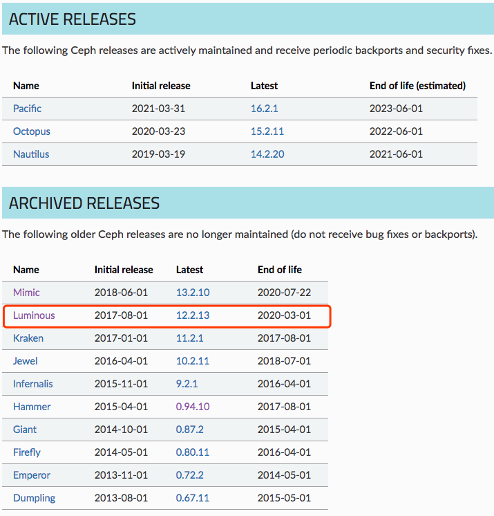

```bash
[root@admin ceph]# ceph --version
ceph version 12.2.13 (584a20eb0237c657dc0567da126be145106aa47e) luminous (stable)

Luminous v12.2.x是一个LTS长期稳定版本，官方建议所有用户升级到此版本。
```

ceph版本

https://docs.ceph.com/en/latest/releases/

http://docs.ceph.org.cn/releases/


ceph-deploy版本：https://docs.ceph.com/en/latest/install/

```bash
ceph-deploy --version
2.0.1 

ceph-deploye不再积极维护。它没有在比Nautilus新的Ceph版本上进行测试。它不支持RHEL8、CentOS 8或更新的操作系统。
```


## 十二、ceph集群角色定义

### 1、Monitor(ceph-mon) ceph 监视器

>​    在一个主机上运行的一个守护进程，用于维护集群状态映射(maintains maps of the cluster state)，比如 ceph 集群中有多少存储池、每个存储池有多少 PG 以及存储池和 PG的 映 射 关 系 等 ， monitor map, manager map, the OSD map, the MDS map, and the CRUSH map，这些映射是 Ceph 守护程序相互协调所需的关键群集状态，此外监视器还负责管理守护程序和客户端之间的身份验证(认证使用 cephX 协议)。通常至少需要三个监视器才能实现冗余和高可用性

### 2、Managers(ceph-mgr)

>​    在一个主机上运行的一个守护进程，Ceph Manager 守护程序（ceph-mgr）负责跟踪运行时指标和 Ceph 集群的当前状态，包括存储利用率，当前性能指标和系统负载。Ceph Manager 守护程序还托管基于 python 的模块来管理和公开 Ceph 集群信息，包括基于 Web的 Ceph 仪表板和 REST API。高可用性通常至少需要两个管理器。

### 3、Ceph OSDs(对象存储守护程序 ceph-osd)：

>   提供存储数据，操作系统上的一个磁盘就是一个 OSD 守护程序，OSD 用于处理 ceph集群数据复制，恢复，重新平衡，并通过检查其他 Ceph OSD 守护程序的心跳来向 Ceph监视器和管理器提供一些监视信息。通常至少需要 3 个 Ceph OSD 才能实现冗余和高可用性

### 4、MDS(ceph 元数据服务器 ceph-mds)：

>代表 ceph 文件系统(NFS/CIFS)存储元数据，(即 Ceph 块设备和 Ceph 对象存储网关不使用 MDS)

### 5、ceph的管理节点

>1.ceph 的常用管理接口是一组命令行工具程序，例如 rados、ceph、rbd 等命令，ceph 管理员可以从某个特定的 ceph-mon 节点执行管理操作
>2.推荐使用部署专用的管理节点对 ceph 进行配置管理、升级与后期维护，方便后期权限管理，管理节点的权限只对管理人员开放，可以避免一些不必要的误操作的发生。


