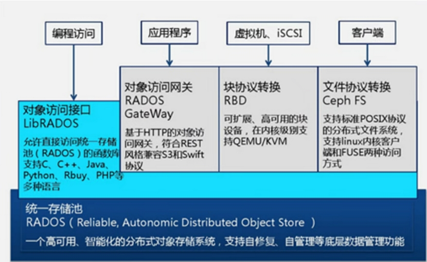
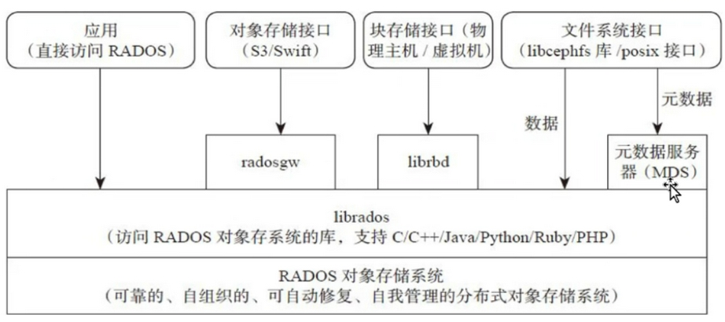
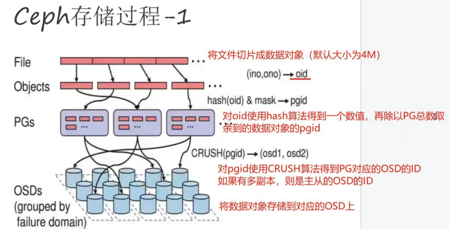

# ceph介绍

## 一、存储基础

### 1、单机存储设备

#### 1.分类

##### 1）DAS（直接附加存储，是直接接到计算机的主板总线上去的存储）

>IDE、SATA、SCSI、SAS、USB 接口的磁盘
>所谓接口就是一种存储设备驱动下的磁盘设备，提供块级别的存储

##### 2）NAS（网络附加存储，是通过网络附加到当前主机文件系统之上的存储）

>NFS、CIFS、FTP
>文件系统级别的存储，本身就是一个做好的文件系统，通过nfs接口在用户空间输出后，客户端基于内核模块与远程主机进行网络通信，把它转为好像本地文件系统一样来使用，这种存储服务是没办法对它再一次格式化创建文件系统块的

##### 3）SAN（存储区域网络）

>SCSI协议（只是用来传输数据的存取操作，物理层使用SCSI线缆来传输）、FCSAN（物理层使用光纤来传输）、iSCSI（物理层使用以太网来传输）
>也是一种网络存储，但不同之处在于SAN提供给客户端主机使用的接口是块级别的存储

#### 2.单机存储的问题

##### 1）存储处理能力不足

>传统的IDE的IO值是100次/秒，SATA固态磁盘500次/秒，固态硬盘达到2000-4000次/秒。即使磁盘的IO能力再大数十倍，也不够抗住网站访问高峰期数十万、数百万甚至上亿用户的同时访问，这同时还要受到主机网络IO能力的限制。

##### 2）存储空间能力不足

>单块磁盘的容量再大，也无法满足用户的正常访问所需的数据容量限制。

##### 3）单点故障问题

>单机存储数据存在单点故障问题

### 2、分布式存储(软件定义的存储SDS)

>Ceph、TFS、FastDFS、MooseFS（MFS）、HDFS、GlusterFS（GFS）
>存储机制会把数据分散存储到多个节点上，具有高扩展性、高性能、高可用性等优点。

#### 1.分布式存储的类型

##### 1）块存储：

>存储设备和客户端主机是一对一的关系，块存储设备只能被一个主机挂载使用，数据以块为单位进行存储的。
>
>典型代表：硬盘

##### 2）文件存储：

>一对多，能被多个主机同时挂载或传输使用，数据以文件的形式存储的，其中文件的元信息数据和实际数据是分开存储的，并且有目录的层级关系。
>
>典型代表：NFS、CIFS、FTP

##### 3）对象存储：

>一对多，能被多个主机或应用程序同时通过API接口访问使用，数据以文件的形式存储的，一个文件即是一个对象(object)，文件的元信息数据和实际数据是在一起的。
>
>典型代表：OSS(阿里云) S3(AWS亚马逊云) OBS(华为云)

## 二、Ceph简介

>Ceph使用C++语言开发，是一个开放、自我修复和自我管理的开源分布式存储系统。具有高扩展性、高性能、高可靠性的优点。
>
>Ceph目前已得到众多云计算厂商的支持并被广泛应用。RedHat及OpenStack，Kubernetes都可与Ceph整合以支持虚拟机镜像的后端存储。
>粗略估计，我国70%—80%的云平台都将Ceph作为底层的存储平台，由此可见Ceph俨然成为了开源云平台的标配。目前国内使用Ceph搭建分布式存储系统较为成功的企业有华为、阿里、中兴、华三、浪潮、中国移动、网易、乐视、360、星辰天合存储、杉岩数据等。

### 1、Ceph优势

>- 高扩展性：去中心化，支持使用普通X86服务器，支持上千个存储节点的规模，支持TB到EB级的扩展。
>- 高可靠性：没有单点故障，多数据副本，自动管理，自动修复。
>- 高性能：摒弃了传统的集中式存储元数据寻址的方案，采用 CRUSH 算法，数据分布均衡，并行度高。
>- 功能强大：Ceph是个大一统的存储系统，集块存储接口（RBD）、文件存储接口（CephFS）、对象存储接口（RadosGW）于一身，因而适用于不同的应用场景。

### 2、Ceph架构

**自下向上，可以将Ceph系统分为四个层次:**

#### 1.RADOS 基础存储系统

> （Reliab1e，Autonomic，Distributed object store，即可靠的、自动化的、分布式的对象存储）
> RADOS是Ceph最底层的功能模块，是一个无限可扩容的对象存储服务，能将文件拆解成无数个对象（碎片）存放在硬盘中，大大提高了数据的稳定性。它主要由OSD和Monitor两个组件组成，OSD和Monitor都可以部署在多台服务器中，这就是ceph分布式的由来，高扩展性的由来。

#### 2.LIBRADOS 基础库

>Librados提供了与RADOS进行交互的方式，并向上层应用提供Ceph服务的API接口，因此上层的RBD、RGW和CephFS都是通过Librados访问的，目前提供PHP、Ruby、Java、Python、Go、C和C++支持，以便直接基于RADOS（而不是整个Ceph）进行客户端应用开发。

#### 3.高层应用接口：包括了三个部分

##### 1）对象存储接口 RGW（RADOS Gateway）

> 网关接口，基于Librados开发的对象存储系统，提供S3和Swift兼容的RESTful API接口。

##### 2）块存储接口 RBD（Reliable Block Device）

> 基于Librados提供块设备接口，主要用于Host/VM。

##### 3）文件存储接口 CephFS（Ceph File System）

> Ceph文件系统，提供了一个符合POSIX标准的文件系统，它使用Ceph存储集群在文件系统上存储用户数据。基于Librados提供的分布式文件系统接口。

##### 4）应用层：

> 基于高层接口或者基础库Librados开发出来的各种APP，或者Host、VM等诸多客户端

### 3、Ceph 核心组件

> Ceph是一个对象式存储系统，它把每一个待管理的数据流（如文件等数据）切分为一到多个固定大小（默认4兆）的对象数据（Object），并以其为原子单元（原子是构成元素的最小单元）完成数据的读写。

#### 1.OSD（Object Storage Daemon，守护进程 ceph-osd）

>是负责物理存储的进程，一般配置成和磁盘一一对应，一块磁盘启动一个OSD进程。主要功能是存储数据、复制数据、平衡数据、恢复数据，以及与其它OSD间进行心跳检查，负责响应客户端请求返回具体数据的进程等。通常至少需要3个OSD来实现冗余和高可用性。

#### 2.PG（Placement Group 归置组）

>PG 是一个虚拟的概念而已，物理上不真实存在。它在数据寻址时类似于数据库中的索引：Ceph 先将每个对象数据通过HASH算法固定映射到一个 PG 中，然后将 PG 通过 CRUSH 算法映射到 OSD。

#### 3.Pool

> Pool 是存储对象的逻辑分区，它起到 namespace 的作用。每个 Pool 包含一定数量（可配置）的 PG。Pool 可以做故障隔离域，根据不同的用户场景统一进行隔离。

##### 1）Pool中数据保存方式支持两种类型：

>多副本（replicated）：类似 raid1，一个对象数据默认保存 3 个副本，放在不同的 OSD
>纠删码（Erasure Code）：类似 raid5，对 CPU 消耗稍大，但是节约磁盘空间，对象数据保存只有 1 个副本。由于Ceph部分功能不支持纠删码池，此类型存储池使用不多

##### 2）Pool、PG 和 OSD 的关系：

>一个Pool里有很多个PG；一个PG里包含一堆对象，一个对象只能属于一个PG；PG有主从之分，一个PG分布在不同的OSD上（针对多副本类型）

#### 4.Monitor（守护进程 ceph-mon）

>用来保存OSD的元数据。负责维护集群状态的映射视图（Cluster Map：OSD Map、Monitor Map、PG Map 和 CRUSH Map），维护展示集群状态的各种图表， 管理集群客户端认证与授权。一个Ceph集群通常至少需要 3 或 5 个（奇数个）Monitor 节点才能实现冗余和高可用性，它们通过 Paxos 协议实现节点间的同步数据。

#### 5.Manager（守护进程 ceph-mgr）

>负责跟踪运行时指标和 Ceph 集群的当前状态，包括存储利用率、当前性能指标和系统负载。为外部监视和管理系统提供额外的监视和接口，例如 zabbix、prometheus、 cephmetrics 等。一个 Ceph 集群通常至少需要 2 个 mgr 节点实现高可用性，基于 raft 协议实现节点间的信息同步。

●MDS（Metadata Server，守护进程 ceph-mds）
>是 CephFS 服务依赖的元数据服务。负责保存文件系统的元数据，管理目录结构。对象存储和块设备存储不需要元数据服务；如果不使用 CephFS 可以不安装。

### 4、OSD 存储后端

>OSD 有两种方式管理它们存储的数据。在 Luminous 12.2.z 及以后的发行版中，默认（也是推荐的）后端是 BlueStore。在 Luminous 发布之前， 默认是 FileStore， 也是唯一的选项。

#### 1.Filestore

>FileStore是在Ceph中存储对象的一个遗留方法。它依赖于一个标准文件系统（只能是XFS)，并结合一个键/值数据库（传统上是LevelDB，现在BlueStore是RocksDB），用于保存和管理元数据。
>FileStore经过了良好的测试，在生产中得到了广泛的应用。然而，由于它的总体设计和对传统文件系统的依赖，使得它在性能上存在许多不足。

#### 2.Bluestore

>BlueStore是一个特殊用途的存储后端，专门为OSD工作负载管理磁盘上的数据而设计。BlueStore 的设计是基于十年来支持和管理 Filestore 的经验。BlueStore 相较于 Filestore，具有更好的读写性能和安全性。

##### BlueStore 的主要功能包括：

>1）BlueStore直接管理存储设备，即直接使用原始块设备或分区管理磁盘上的数据。这样就避免了抽象层的介入（例如本地文件系统，如XFS)，因为抽象层会限制性能或增加复杂性。
>2）BlueStore使用RocksDB进行元数据管理。RocksDB的键/值数据库是嵌入式的，以便管理内部元数据，包括将对象名称映射到磁盘上的块位置。
>3）写入BlueStore的所有数据和元数据都受一个或多个校验和的保护。未经验证，不会从磁盘读取或返回给用户任何数据或元数据。
>4）支持内联压缩。数据在写入磁盘之前可以选择性地进行压缩。
>5）支持多设备元数据分层。BlueStore允许将其内部日志（WAL预写日志）写入单独的高速设备（如SSD、NVMe或NVDIMM)，以提高性能。如果有大量更快的可用存储，则可以将内部元数据存储在更快的设备上。
>6）支持高效的写时复制。RBD和CephFS快照依赖于在BlueStore中有效实现的即写即复制克隆机制。这将为常规快照和擦除编码池（依赖克隆实现高效的两阶段提交）带来高效的I/O。

### 5、Ceph 数据的存储过程

#### 1）客户端从 mon 获取最新的 Cluster Map

#### 2）数据切分为多个对象

在 Ceph 中，一切皆对象。Ceph 存储的数据都会被切分成为一到多个固定大小的对象（Object）。Object size 大小可以由管理员调整，通常为 2M 或 4M。

>每个对象都会有一个唯一的 OID，由 ino 与 ono 组成：
>●ino ：即是文件的 FileID，用于在全局唯一标识每一个文件
>●ono ：则是分片的编号
>比如：一个文件 FileID 为 A，它被切成了两个对象，一个对象编号0，另一个编号1，那么这两个文件的 oid 则为 A0 与 A1。
>OID 的好处是可以唯一标示每个不同的对象，并且存储了对象与文件的从属关系。由于 Ceph 的所有数据都虚拟成了整齐划一的对象，所以在读写时效率都会比较高。

#### 3）获取PGID

>通过对 OID 使用 HASH 算法得到一个16进制的特征码，用特征码与 Pool 中的 PG 总数取余，得到的序号则是 PGID 。
>即 Pool_ID + HASH(OID) % PG_NUM 得到 PGID

#### 4）副本复制

>通过对 OID 使用 HASH 算法得到一个16进制的特征码，用特征码与 Pool 中的 PG 总数取余，得到的序号则是 PGID 。
>即 Pool_ID + HASH(OID) % PG_NUM 得到 PGID

### 6、Ceph 版本发行生命周期

>Ceph从Nautilus版本（14.2.0）开始，每年都会有一个新的稳定版发行，预计是每年的3月份发布，每年的新版本都会起一个新的名称（例如，“Mimic”）和一个主版本号（例如，13代表Mimic，因为“M”是字母表的第13个字母）。

版本号的格式为 x.y.z，x 表示发布周期（例如，13 代表 Mimic，17 代表 Quincy），y 表示发布版本类型，即
>x.0.z ：y等于 0，表示开发版本
>x.1.z ：y等于 1，表示发布候选版本（用于测试集群）
>x.2.z ：y等于 2，表示稳定/错误修复版本（针对用户）