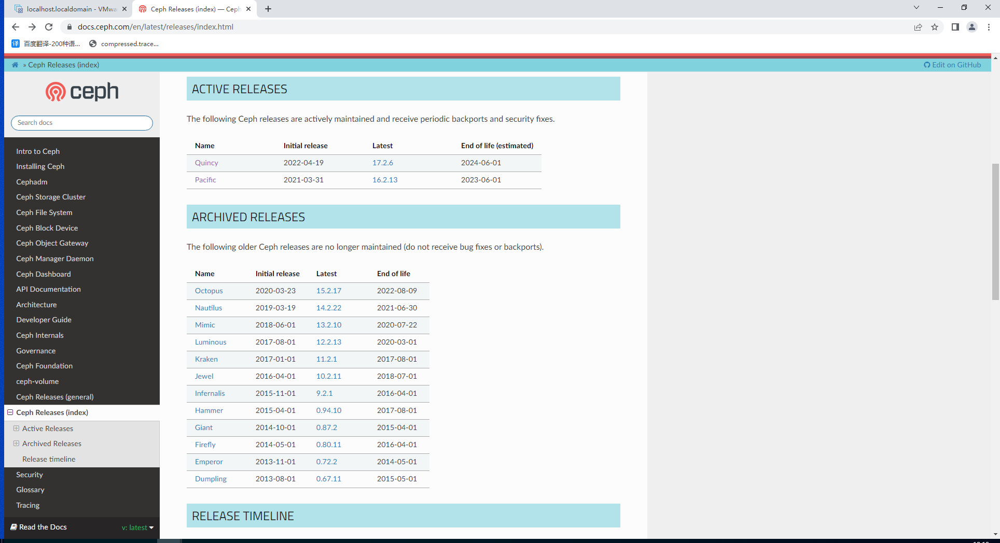
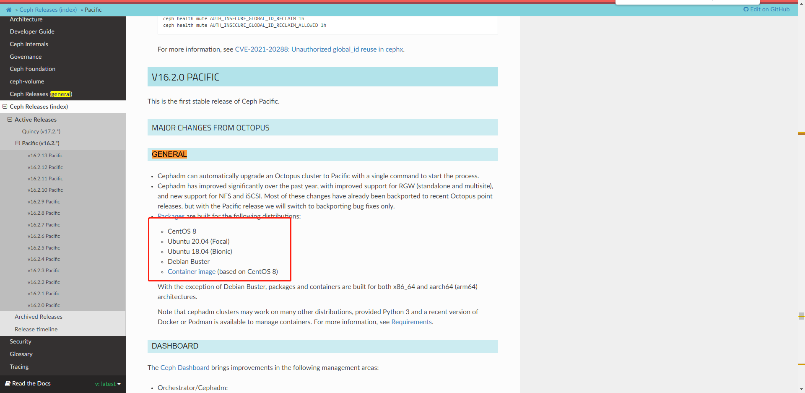
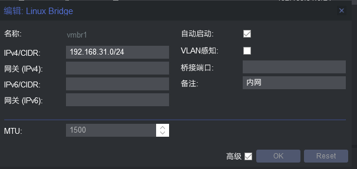

# ceph部署

>构建可靠的、低成本的、可扩展的、 与业务紧密结合使用的高性能分布式存储系统。

## 一、选择版本

### 1、了解

> https://github.com/ceph/ceph
> http://docs.ceph.org.cn/install/manual-deployment/ #简要部署过程

### 2、版本选择

#### 1.查看所有版本

> https://docs.ceph.com/en/latest/releases/index.html
>
> 选择即将维护完成的或者已经维护完成的



#### 2.查看制定版本支持的操作系统

> https://docs.ceph.com/en/latest/releases/pacific/ #ceph 16 即 octopus 版本支持的系统：



## 二、部署方式

>ceph-ansible：https://github.com/ceph/ceph-ansible #python
>ceph-salt：https://github.com/ceph/ceph-salt #python
>ceph-container：https://github.com/ceph/ceph-container #shell
>ceph-chef：https://github.com/ceph/ceph-chef #Ruby
>cephadm: https://docs.ceph.com/en/latest/cephadm/ #ceph 官方在 ceph 15 版本加入的
>ceph 部署工具
>ceph-deploy：https://github.com/ceph/ceph-deploy #python 是一个 ceph 官方维护的基于 ceph-deploy 命令行部署 ceph 集群的工具，基于 ssh 执行可以 sudo 权限的 shell 命令以及一些 python 脚本 实现 ceph 集群的部署和管理维护。Ceph-deploy 只用于部署和管理 ceph 集群，客户端需要访问 ceph，需要部署客户端工具。


## 三、服务器模板机初始化

### 1、主机安装

> 建议自定义模板机进行克隆，系统ubuntu22.04

### 2、安装SSH、VIM

> 设置root账户密码并允许root远程ssh登录

#### 1.安装ssh vim

```bash
sudo apt install -y vim ssh
```

#### 2.设置root账户密码

```bash
sudo passwd root
```

#### 3.允许root账户登录

```bash
sudo cat /etc/ssh/sshd_config
#PermitRootLogin prohibit-password
PermitRootLogin yes     #添加这句话


# 重启ssh服务
```

#### 4.使用自己的shell工具连接

### 2、添加host解析或者配置到dns服务器

```bash
vim /etc/hosts
172.31.0.1 hd-route
172.31.0.2 pve
172.31.0.3 istoreos

172.31.0.10 trevor-win

172.31.0.21 ubuntu-admin

192.168.31.31 k8s-master-01
192.168.31.32 k8s-master-02
192.168.31.33 k8s-master-03

192.168.31.41 k8s-node-01
192.168.31.42 k8s-node-02
192.168.31.43 k8s-node-03

192.168.31.110 mysql-proxy
192.168.31.111 mysql-node-01
192.168.31.112 mysql-node-02

192.168.31.121 ceph-node-01
192.168.31.122 ceph-node-02
192.168.31.123 ceph-node-03

172.31.0.149 ubuntu-template
```

### 3、添加DNS解析

```bash
vim /etc/resolv.conf
nameserver 114.114.114.114
```

### 4、开启命令行高亮

```bash
root@master01-virtual-machine:~# vim /root/.bashrc
force_color_prompt=yes   # 去掉这行注释

root@master01-virtual-machine:~# bash
```

### 5、修改网卡名称为eth*

#### 1.修改

```bash
root@master01-virtual-machine:~# vim /etc/default/grub
...
GRUB_CMDLINE_LINUX="net.ifnames=0 biosdevname=0"  # 只修改这行
```

#### 2.更新配置

```bash
root@master01-virtual-machine:~# update-grub
Sourcing file `/etc/default/grub'
Generating grub configuration file ...
Found linux image: /boot/vmlinuz-4.15.0-55-generic
Found initrd image: /boot/initrd.img-4.15.0-55-generic
done


###重启
reboot
```

> 重启后可能导致网卡配置失效，需要重新配置网卡

### 6、配置apt源及安装常用组件

#### 1.配源

>https://mirrors.tuna.tsinghua.edu.cn/help/ubuntu/

```bash
root@master01-virtual-machine:~# vim /etc/apt/sources.list
# 默认注释了源码镜像以提高 apt update 速度，如有需要可自行取消注释
deb https://mirrors.tuna.tsinghua.edu.cn/ubuntu/ jammy main restricted universe multiverse
# deb-src https://mirrors.tuna.tsinghua.edu.cn/ubuntu/ jammy main restricted universe multiverse
deb https://mirrors.tuna.tsinghua.edu.cn/ubuntu/ jammy-updates main restricted universe multiverse
# deb-src https://mirrors.tuna.tsinghua.edu.cn/ubuntu/ jammy-updates main restricted universe multiverse
deb https://mirrors.tuna.tsinghua.edu.cn/ubuntu/ jammy-backports main restricted universe multiverse
# deb-src https://mirrors.tuna.tsinghua.edu.cn/ubuntu/ jammy-backports main restricted universe multiverse

deb http://security.ubuntu.com/ubuntu/ jammy-security main restricted universe multiverse
# deb-src http://security.ubuntu.com/ubuntu/ jammy-security main restricted universe multiverse

# 预发布软件源，不建议启用
# deb https://mirrors.tuna.tsinghua.edu.cn/ubuntu/ jammy-proposed main restricted universe multiverse
# # deb-src https://mirrors.tuna.tsinghua.edu.cn/ubuntu/ jammy-proposed main restricted universe multiverse
```

#### 2.更新存储库索引

```
apt update
```

#### 3.升级可升级软件包

```bash
apt upgrade
```

#### 4.安装常用组件

```bash
apt-get install -y net-tools vim htop iftop bash-completion wget rsync tcpdump telnet lrzsz tree iotop unzip zip apt-transport-https ca-certificates curl software-properties-common gnupg-agent ntp ntpdate ntpstat systemd-timesyncd
```

### 7、关闭防火墙

> Ubuntu中无selinux，防火墙服务为ufw，因此关闭防火墙并禁止防火墙开机自启动命令如下：

```bash
root@k8s-master-01:~# ufw disable
Firewall stopped and disabled on system startup
```

### 8、配置systemd-timesyncd时间同步

#### 1.修改时区

```bash
sudo timedatectl set-timezone Asia/Shanghai
```

#### 2.设置上级ntp服务器

>/etc/systemd/timesyncd.conf

```bash
[Time]
NTP=ntp.aliyun.com
FallbackNTP=ntp.tencent.com
RootDistanceMaxSec=5
PollIntervalMinSec=32
PollIntervalMaxSec=2048
```

#### 3.重启

```bash
service systemd-timesyncd restart
```

### 9、创建秘钥

```bash
rm -rf /root/.ssh

ssh-keygen -t ed25519

cd /root/.ssh/

cp id_ed25519.pub authorized_keys
```


## 四、克隆主机-修改主机名（所有机器）

> 克隆主机后，每个节点输入对应的命令

```bash
hostnamectl set-hostname hd-route
hostnamectl set-hostname pve
hostnamectl set-hostname istoreos

hostnamectl set-hostname trevor-win

hostnamectl set-hostname ubuntu-admin

hostnamectl set-hostname k8s-master-01
hostnamectl set-hostname k8s-master-02
hostnamectl set-hostname k8s-master-03

hostnamectl set-hostname k8s-node-01
hostnamectl set-hostname k8s-node-02
hostnamectl set-hostname k8s-node-03

hostnamectl set-hostname mysql-proxy
hostnamectl set-hostname mysql-node-01
hostnamectl set-hostname mysql-node-02

hostnamectl set-hostname ceph-node-01
hostnamectl set-hostname ceph-node-02
hostnamectl set-hostname ceph-node-03
hostnamectl set-hostname ubuntu-template
```

## 五、pve创建虚拟网桥用于内网

### 1、创建网桥



### 2、启动网桥

```bash
cd /etc/network/
cp interfaces interfaces.old
cp interfaces.new interfaces
```

```bash
ifup ens2f0  # 如果桥接网卡了，则启动桥接网卡
ifup vmbr2
```

### 3、虚拟接绑定（略）

### 4、ubuntu设置网络

>增加eth1网卡设置

```bash
root@ceph-node-01:~# cat /etc/netplan/00-installer-config.yaml
# This is the network config written by 'subiquity'
network:
  ethernets:
    eth0:
      addresses:
      - 172.31.0.121/16
      nameservers:
        addresses:
        - 172.31.0.3
        search:
        - ubuntu
      routes:
      - to: default
        via: 172.31.0.3
    eth1:
      addresses:
      - 192.168.31.121/24
```

```bash
netplan apply
```

## 六、虚拟机sata直通

```bash
qm set 221 -sata0 /dev/disk/by-id/ata-ST1000DM003-1SB10C_S9A0GQEX
qm set 222 -sata0 /dev/disk/by-id/ata-ST1000DM003-1SB10C_S9A0HB4T
qm set 223 -sata0 /dev/disk/by-id/ata-ST1000DM003-1ER162_W4Y37T5T
```

## 七、ceph节点之间验证ssh免密，顺便添加指纹

```bash
root@ceph-node-03:~# ssh ceph-node-01
The authenticity of host 'ceph-node-01 (172.31.0.121)' can't be established.
ED25519 key fingerprint is SHA256:TkUTvJg79d7HWJDGGlBDX/AfHgszGFNMfn9FHOye4HQ.
This key is not known by any other names
Are you sure you want to continue connecting (yes/no/[fingerprint])? yes
Warning: Permanently added 'ceph-node-01' (ED25519) to the list of known hosts.
Welcome to Ubuntu 22.04.4 LTS (GNU/Linux 5.15.0-102-generic x86_64)

 * Documentation:  https://help.ubuntu.com
 * Management:     https://landscape.canonical.com
 * Support:        https://ubuntu.com/pro

  System information as of Sat Apr 13 11:50:56 PM CST 2024

  System load:  0.0                Processes:             128
  Usage of /:   3.9% of 195.80GB   Users logged in:       1
  Memory usage: 5%                 IPv4 address for eth0: 172.31.0.121
  Swap usage:   0%                 IPv4 address for eth1: 192.168.31.121


Expanded Security Maintenance for Applications is not enabled.

1 update can be applied immediately.
1 of these updates is a standard security update.
To see these additional updates run: apt list --upgradable

Enable ESM Apps to receive additional future security updates.
See https://ubuntu.com/esm or run: sudo pro status


Last login: Sat Apr 13 23:50:57 2024 from 172.31.0.122
root@ceph-node-01:~#
logout
Connection to ceph-node-01 closed.
root@ceph-node-03:~# ssh ceph-node-02
The authenticity of host 'ceph-node-02 (172.31.0.122)' can't be established.
ED25519 key fingerprint is SHA256:TkUTvJg79d7HWJDGGlBDX/AfHgszGFNMfn9FHOye4HQ.
This host key is known by the following other names/addresses:
    ~/.ssh/known_hosts:1: [hashed name]
Are you sure you want to continue connecting (yes/no/[fingerprint])? yes
Warning: Permanently added 'ceph-node-02' (ED25519) to the list of known hosts.
Welcome to Ubuntu 22.04.4 LTS (GNU/Linux 5.15.0-102-generic x86_64)

 * Documentation:  https://help.ubuntu.com
 * Management:     https://landscape.canonical.com
 * Support:        https://ubuntu.com/pro

  System information as of Sat Apr 13 11:51:28 PM CST 2024

  System load:  0.0                Processes:             129
  Usage of /:   3.9% of 195.80GB   Users logged in:       1
  Memory usage: 5%                 IPv4 address for eth0: 172.31.0.122
  Swap usage:   0%                 IPv4 address for eth1: 192.168.31.122


Expanded Security Maintenance for Applications is not enabled.

0 updates can be applied immediately.

Enable ESM Apps to receive additional future security updates.
See https://ubuntu.com/esm or run: sudo pro status


Last login: Sat Apr 13 23:49:13 2024 from 172.31.0.121
root@ceph-node-02:~#
logout
Connection to ceph-node-02 closed.
root@ceph-node-03:~#
```

## 八、Ceph安装

>https://www.cnblogs.com/klvchen/p/17944919
>
>https://blog.csdn.net/chenhongloves/article/details/134317674
>
>https://www.xiexianbin.cn/ceph/deploy/cephadm/index.html


### 1、docker安装(所有节点)

```bash
export DOWNLOAD_URL="https://mirrors.tuna.tsinghua.edu.cn/docker-ce"
curl -fsSL https://get.docker.com/ | sh
```

### 2、cephadmin安装（其中一个节点）

>https://docs.ceph.com/en/reef/cephadm/install/#curl-based-installation

```bash
CEPH_RELEASE=18.2.2
curl --silent --remote-name --location https://download.ceph.com/rpm-${CEPH_RELEASE}/el9/noarch/cephadm
chmod +x cephadm
mv cephadm /usr/local/sbin/
```

### 3、部署流程

>- 初始化第一个节点
>- 标记其他主机到集群
>- 添加其他 monitor
>- 添加 OSD
>- 添加 rgw
>- 添加 mds

### 4、准备ceph配置文件存储地址（所有节点）

```bash
mkdir -p /etc/cephadmin
mkdir -p /etc/ceph
```

### 5、安装ceph客户端

```bash
apt install -y ceph-common
```

### 6、初始化第一个节点

>在本地主机上为新集群创建 mon 和 mgr 守护程序。
>为 Ceph 集群生成新的 SSH 密钥并将其添加到 root 用户的 /root/.ssh/authorized_keys 文件中。
>将公钥的副本写入 /etc/ceph/ceph.pub 。
>将最小配置文件写入 /etc/ceph/ceph.conf 。需要此文件与新集群进行通信。
>将 client.admin 管理（特权！）密钥的副本写入 /etc/ceph/ceph.client.admin.keyring 。
>将 _admin 标签添加到引导主机。默认情况下，任何具有此标签的主机都将（也）获得 /etc/ceph/ceph.conf 和 /etc/ceph/ceph.client.admin.keyring 的副本。

#### 1.参数

```bash
### -image IMAGE         container image. Can also be set via the "CEPHADM_IMAGE" env var (default: None) - [cephadm 的参数]指定 ceph 的镜像，官方的镜像在 https://quay.io/repository/ceph/ceph?tab=tags&tag=latest 或者 https://hub.docker.com/r/quayioceph/ceph
### bootstrap --mon-ip MON_IP       mon IP - 指定 monitor 的地址，这里就本机地址
### bootstrap --allow-fqdn-hostname 允许完全限定的主机名（包含“.”）
### bootstrap --skip-firewalld      不配置firewalld
### bootstrap --skip-mon-network    基于bootstrap的mon公共网络集
### bootstrap --dashboard-password-noupdate 停止强制更改仪表板密码
### 更多的参数 cephadm --help, cephadm bootstrap --help
```


```bash
cephadm bootstrap --mon-ip 192.168.31.121 --allow-fqdn-hostname --skip-firewalld --skip-mon-network --dashboard-password-noupdate
```

#### 2.查看状态

```bash
root@ceph-node-01:~# cephadm shell -- ceph status
Inferring fsid b227ebe2-f9b8-11ee-826d-15b492408c47
Inferring config /var/lib/ceph/b227ebe2-f9b8-11ee-826d-15b492408c47/mon.ceph-node-01/config
Using ceph image with id '1c40e0e88d74' and tag 'v18' created on 2024-04-04 00:13:37 +0800 CST
quay.io/ceph/ceph@sha256:8c1697a0a924bbd625c9f1b33893bbc47b97b8a8c66666a715fe60b353b1d93e
  cluster:
    id:     b227ebe2-f9b8-11ee-826d-15b492408c47
    health: HEALTH_WARN
            OSD count 0 < osd_pool_default_size 3

  services:
    mon: 1 daemons, quorum ceph-node-01 (age 6m)
    mgr: ceph-node-01.doogpo(active, since 3m)
    osd: 0 osds: 0 up, 0 in

  data:
    pools:   0 pools, 0 pgs
    objects: 0 objects, 0 B
    usage:   0 B used, 0 B / 0 B avail
    pgs:
```

#### 3.标记其他主机到集群

>默认情况下， ceph.conf 文件和 client.admin 密钥环的副本保留在具有 _admin 标签的所有主机上的 /etc/ceph 中。该标签最初仅应用于引导主机。我们通常建议为一台或多台其他主机指定 _admin 标签，以便可以在多台主机上轻松访问 Ceph CLI（例如，通过 cephadm shell ）。要将 _admin 标签添加到其他主机，请运行以下形式的命令：
>
>```bash
>ceph orch host label add *<host>* _admin
>```

##### 1)添加公钥

```bash
root@ceph-node-01:~# ssh-copy-id -f -i /etc/ceph/ceph.pub ceph-node-02
/usr/bin/ssh-copy-id: INFO: Source of key(s) to be installed: "/etc/ceph/ceph.pub"

Number of key(s) added: 1

Now try logging into the machine, with:   "ssh 'ceph-node-02'"
and check to make sure that only the key(s) you wanted were added.

root@ceph-node-01:~# ssh-copy-id -f -i /etc/ceph/ceph.pub ceph-node-03
/usr/bin/ssh-copy-id: INFO: Source of key(s) to be installed: "/etc/ceph/ceph.pub"

Number of key(s) added: 1

Now try logging into the machine, with:   "ssh 'ceph-node-03'"
and check to make sure that only the key(s) you wanted were added.
```

##### 2)添加_admin标签

```bash
root@ceph-node-01:~# ceph orch host add ceph-node-02 192.168.31.122 _admin
Added host 'ceph-node-02' with addr '192.168.31.122'
root@ceph-node-01:~# ceph orch host add ceph-node-03 192.168.31.123 _admin
Added host 'ceph-node-03' with addr '192.168.31.123'
```

### 7、其他节点添加monitor

```bash
root@ceph-node-01:~# ceph orch daemon add mon ceph-node-02:192.168.31.122
Deployed mon.ceph-node-02 on host 'ceph-node-02'
root@ceph-node-01:~# ceph orch daemon add mon ceph-node-03:192.168.31.123
Deployed mon.ceph-node-03 on host 'ceph-node-03'
```

**验证**

```bash
root@ceph-node-01:~# ceph status
  cluster:
    id:     b227ebe2-f9b8-11ee-826d-15b492408c47
    health: HEALTH_WARN
            OSD count 0 < osd_pool_default_size 3

  services:
    mon: 3 daemons, quorum ceph-node-01,ceph-node-02,ceph-node-03 (age 97s)
    mgr: ceph-node-01.doogpo(active, since 26m), standbys: ceph-node-02.nlocus
    osd: 0 osds: 0 up, 0 in

  data:
    pools:   0 pools, 0 pgs
    objects: 0 objects, 0 B
    usage:   0 B used, 0 B / 0 B avail
    pgs:
```

### 8、添加所有节点硬盘-OSD

#### 1.查看各个节点可用磁盘

```bash
root@ceph-node-01:~# ceph orch device ls
HOST          PATH      TYPE  DEVICE ID                   SIZE  AVAILABLE  REFRESHED  REJECT REASONS
ceph-node-01  /dev/sdb  hdd   ATA_QEMU_HARDDISK_QM00005   931G  No         23s ago    Has GPT headers
ceph-node-02  /dev/sdb  hdd   ATA_QEMU_HARDDISK_QM00005   931G  No         7m ago     Has GPT headers
ceph-node-03  /dev/sdb  hdd   ATA_QEMU_HARDDISK_QM00005   931G  No         5m ago     Has GPT headers
```

#### 2.关闭自动发现磁盘自动创建OSD

```bash
root@ceph-node-01:~# ceph orch apply osd --all-available-devices --unmanaged=true
Scheduled osd.all-available-devices update...
```

#### 3.清除磁盘GPT

```bash
root@ceph-node-03:~# gdisk /dev/sdb
GPT fdisk (gdisk) version 1.0.8

The protective MBR's 0xEE partition is oversized! Auto-repairing.

Partition table scan:
  MBR: protective
  BSD: not present
  APM: not present
  GPT: present

Found valid GPT with protective MBR; using GPT.

Command (? for help): x

Expert command (? for help): z
About to wipe out GPT on /dev/sdb. Proceed? (Y/N): y
GPT data structures destroyed! You may now partition the disk using fdisk or
other utilities.
Blank out MBR? (Y/N): y
```

#### 4.手动添加硬盘

```bash
root@ceph-node-01:~# ceph orch daemon add osd ceph-node-01:/dev/sdb
Created osd(s) 0 on host 'ceph-node-01'
root@ceph-node-01:~# ceph orch daemon add osd ceph-node-02:/dev/sdb
Created osd(s) 1 on host 'ceph-node-02'
root@ceph-node-01:~# ceph orch daemon add osd ceph-node-03:/dev/sdb
Created osd(s) 2 on host 'ceph-node-03'
```

**验证**

```bash
root@ceph-node-01:~# ceph status
  cluster:
    id:     b227ebe2-f9b8-11ee-826d-15b492408c47
    health: HEALTH_OK

  services:
    mon: 3 daemons, quorum ceph-node-01,ceph-node-02,ceph-node-03 (age 24m)
    mgr: ceph-node-01.doogpo(active, since 50m), standbys: ceph-node-02.nlocus
    osd: 3 osds: 3 up (since 5m), 3 in (since 6m)

  data:
    pools:   1 pools, 1 pgs
    objects: 2 objects, 577 KiB
    usage:   82 MiB used, 2.7 TiB / 2.7 TiB avail
    pgs:     1 active+clean
```

### 9、所有节点添加RGW

```bash
root@ceph-node-01:~# ceph orch apply rgw ceph-rgw  --placement="3" --port=80
Scheduled rgw.ceph-rgw update...
root@ceph-node-01:~# ceph status
  cluster:
    id:     b227ebe2-f9b8-11ee-826d-15b492408c47
    health: HEALTH_OK

  services:
    mon: 3 daemons, quorum ceph-node-01,ceph-node-02,ceph-node-03 (age 27m)
    mgr: ceph-node-01.doogpo(active, since 52m), standbys: ceph-node-02.nlocus
    osd: 3 osds: 3 up (since 7m), 3 in (since 8m)
    rgw: 3 daemons active (3 hosts, 1 zones)

  data:
    pools:   5 pools, 5 pgs
    objects: 91 objects, 583 KiB
    usage:   81 MiB used, 2.7 TiB / 2.7 TiB avail
    pgs:     5 active+clean

  io:
    client:   81 KiB/s rd, 6.0 KiB/s wr, 103 op/s rd, 50 op/s wr
```

### 10、所有节点添加MDS

```bash
root@ceph-node-01:~# ceph fs volume create ceph-fs --placement="3"
root@ceph-node-01:~# ceph status
  cluster:
    id:     b227ebe2-f9b8-11ee-826d-15b492408c47
    health: HEALTH_OK

  services:
    mon: 3 daemons, quorum ceph-node-01,ceph-node-02,ceph-node-03 (age 29m)
    mgr: ceph-node-01.doogpo(active, since 54m), standbys: ceph-node-02.nlocus
    mds: 1/1 daemons up, 2 standby
    osd: 3 osds: 3 up (since 10m), 3 in (since 10m)
    rgw: 3 daemons active (3 hosts, 1 zones)

  data:
    volumes: 1/1 healthy
    pools:   7 pools, 131 pgs
    objects: 218 objects, 585 KiB
    usage:   149 MiB used, 2.7 TiB / 2.7 TiB avail
    pgs:     131 active+clean

```

### 11、设置dashboard-password密码

```bash
root@ceph-node-01:~# ceph dashboard set-login-credentials admin -i /etc/cephadmin/dashboard-passwd.txt
******************************************************************
***          WARNING: this command is deprecated.              ***
*** Please use the ac-user-* related commands to manage users. ***
******************************************************************
Username and password updated
```

### 12、设置全局网络

```bash
ceph config set mon public_network 192.168.31.0/24
```
