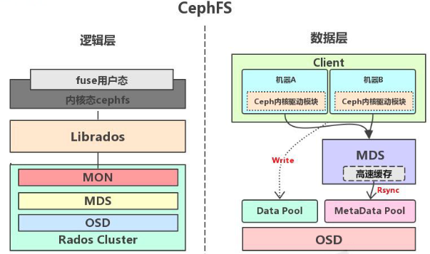
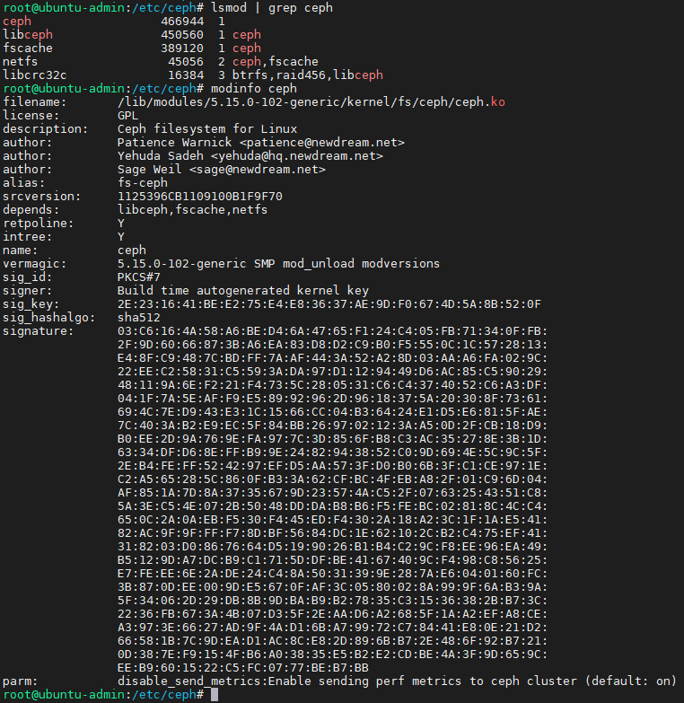

# Ceph-FS文件存储

## 一、介绍

https://docs.ceph.com/en/latest/cephfs/

>Ceph FS 即 ceph filesystem，可以实现文件系统共享功能(POSIX 标准),客户端通过 ceph 协议挂载并使用 ceph 集群作为数据存储服务器。
>
>Ceph FS 需要运行 Meta Data Services(MDS)服务，其守护进程为 ceph-mds，ceph-mds进程管理与 cephFS 上存储的文件相关的元数据，并协调对 ceph 存储集群的访问。

>在 linux 系统使用 ls 等操作查看某个目录下的文件的时候，会有保存在磁盘上的分区表记录文件的名称、创建日期、大小、inode 及存储位置等元数据信息，在 cephfs 由于数据是被打散为若干个离散的 object 进行分布式存储，因此并没有统一保存文件的元数据，而且将文件的元数据保存到一个单独的存储出 matedata pool，但是客户端并不能直接访问matedata pool 中的元数据信息，而是在读写数的时候有 MDS(matadata server)进行处理，读数据的时候有 MDS 从 matedata pool 加载元数据然后缓存在内存(用于后期快速响应其它客户端的请求)并返回给客户端，写数据的时候有 MDS 缓存在内存并同步到 matedata pool

>数据的元数据保存在单独的一个存储池 cephfs-metadata(名字可自定义)，因此元数据也是基于 3 副本提高可用性，另外使用专用的 MDS 服务器在内存缓存元数据信息以提高对客户端的读写响应性能。



## 二、使用

### 1、部署MDS服务

>之前部署的时候已经安装过了

```bash
root@ceph-node-01:~# ceph fs volume create ceph-fs --placement="3"
root@ceph-node-01:~# ceph status
  cluster:
    id:     b227ebe2-f9b8-11ee-826d-15b492408c47
    health: HEALTH_OK

  services:
    mon: 3 daemons, quorum ceph-node-01,ceph-node-02,ceph-node-03 (age 29m)
    mgr: ceph-node-01.doogpo(active, since 54m), standbys: ceph-node-02.nlocus
    mds: 1/1 daemons up, 2 standby
    osd: 3 osds: 3 up (since 10m), 3 in (since 10m)
    rgw: 3 daemons active (3 hosts, 1 zones)

  data:
    volumes: 1/1 healthy
    pools:   7 pools, 131 pgs
    objects: 218 objects, 585 KiB
    usage:   149 MiB used, 2.7 TiB / 2.7 TiB avail
    pgs:     131 active+clean
```

### 2、验证 MDS 服务

```bash
root@ceph-node-01:~# ceph mds stat
ceph-fs:1 {0=ceph-fs.ceph-node-02.updzys=up:active} 2 up:standby
```

>- `ceph-fs:1`: 这是文件系统的名称和元数据池ID。
>- `{0=ceph-fs.ceph-node-02.updzys=up:active}`: 这表示有一个 MDS 守护进程（ID 0）正在活动状态，并且与名称为 `ceph-node-02` 的节点关联。
>- `2 up:standby`: 这表示还有两个 MDS 守护进程处于待命状态。
>- 这表明你的 Ceph 文件系统当前有一个活动的 MDS 守护进程和两个待命的 MDS 守护进程，这是一个正常的配置，提供了高可用性。

### 3、创建 CephFS metadata 和 data 存储池

>cephadmin默认已经为我们创建了fs

```bash
root@ceph-node-01:~# ceph fs ls
name: ceph-fs, metadata pool: cephfs.ceph-fs.meta, data pools: [cephfs.ceph-fs.data ]
```

>使用 CephFS 之前需要事先于集群中创建一个文件系统，并为其分别指定元数据和数据相关的存储池，如下命令将创建名为 mycephfs 的文件系统，它使用 cephfs-metadata 作为元数据存储池，使用 cephfs-data 为数据存储池：

```bash
#保存 metadata 的 pool
ceph osd pool create cephfs-metadata 32 32

#保存数据的 pool
ceph osd pool create cephfs-data 64 64

ceph -s
```

### 4、创建 cephFS 并验证

```bash
ceph fs new <fs_name> <metadata> <data> {--force} {--allow-dangerous-metadata-overlay}

ceph fs new mycephfs cephfs-metadata cephfs-data

ceph fs ls

ceph fs status mycephfs
```

### 5、验证 cepfFS 服务状态

```bash
ceph mds stat

#cephfs 状态现在已经转变为活动状态
```

### 6、查看默认fs

```bash
root@ceph-node-01:~# ceph fs status ceph-fs
ceph-fs - 0 clients
=======
RANK  STATE               MDS                 ACTIVITY     DNS    INOS   DIRS   CAPS
 0    active  ceph-fs.ceph-node-02.updzys  Reqs:    0 /s    10     13     12      0
        POOL           TYPE     USED  AVAIL
cephfs.ceph-fs.meta  metadata   118k   884G
cephfs.ceph-fs.data    data       0    884G
        STANDBY MDS
ceph-fs.ceph-node-03.dwabks
ceph-fs.ceph-node-01.hswcvk
MDS version: ceph version 18.2.2 (531c0d11a1c5d39fbfe6aa8a521f023abf3bf3e2) reef (stable)
```

```bash
    ceph-fs: 文件系统的名称。

    0 clients: 当前没有客户端连接到该文件系统。

    RANK 0:
        STATE: MDS 守护进程的状态为活动（active）。
        MDS: 活动的 MDS 守护进程的名称是 ceph-fs.ceph-node-02.updzys。
        ACTIVITY: 活动 MDS 的请求速率为 0 请求/秒。
        DNS: 目录（Dentries）数量为 10。
        INOS: inode 数量为 13。
        DIRS: 目录数量为 12。
        CAPS: 客户端能力（capabilities）为 0。

    POOLS:
        cephfs.ceph-fs.meta: 元数据池，使用了118k，可用空间为884G。
        cephfs.ceph-fs.data: 数据池，使用了0，可用空间为884G。

    STANDBY MDS:
        ceph-fs.ceph-node-03.dwabks
        ceph-fs.ceph-node-01.hswcvk

    MDS version: 当前使用的 Ceph 版本是 18.2.2。
```

### 7、客户端挂载准备

>在 ceph 的客户端测试 cephfs 的挂载，需要指定 mon 节点的 6789 端口，并且要制定客户端名称和密钥

#### 1.创建客户端账户

```bash
# 创建
root@ceph-node-01:~# ceph auth add client.xiaowufs mon 'allow r' mds 'allow rw' osd 'allow rwx pool=cephfs.ceph-fs.data'
added key for client.xiaowufs
# 验证
root@ceph-node-01:~# ceph auth get client.xiaowufs
[client.xiaowufs]
        key = AQBFOR1m3Y2qGxAAYRvb25Mtcjq18zSJf3Nb0Q==
        caps mds = "allow rw"
        caps mon = "allow r"
        caps osd = "allow rwx pool=cephfs.ceph-fs.data"
# 创建keyring文件
root@ceph-node-01:~# ceph auth get client.xiaowufs -o ceph.client.xiaowufs.keyring
# #创建 key 文件
root@ceph-node-01:~/keyring# ceph auth print-key client.xiaowufs > ceph.client.xiaowufs.key
```

#### 2.在客户端安装 ceph-common，同步认证文件

```bash
apt-get install ceph-common -y

rsync -avz root@172.31.0.121:/root/keyring/ceph.client.xiaowufs.*  /etc/ceph/
```

#### 3.验证权限

```bash
root@ubuntu-admin:/etc/ceph# ceph --user xiaowufs -s
  cluster:
    id:     b227ebe2-f9b8-11ee-826d-15b492408c47
    health: HEALTH_OK

  services:
    mon: 3 daemons, quorum ceph-node-01,ceph-node-02,ceph-node-03 (age 60m)
    mgr: ceph-node-01.doogpo(active, since 60m), standbys: ceph-node-02.nlocus
    mds: 1/1 daemons up, 2 standby
    osd: 3 osds: 3 up (since 60m), 3 in (since 44h)
    rgw: 3 daemons active (3 hosts, 1 zones)

  data:
    volumes: 1/1 healthy
    pools:   7 pools, 146 pgs
    objects: 250 objects, 586 KiB
    usage:   221 MiB used, 2.7 TiB / 2.7 TiB avail
    pgs:     146 active+clean

  io:
    client:   40 KiB/s rd, 0 B/s wr, 39 op/s rd, 26 op/s wr
```

### 8、内核空间挂载 ceph-fs

>客户端挂载有两种方式，一是内核空间一是用户空间，内核空间挂载需要内核支持 ceph 模块，用户空间挂载需要安装 ceph-fuse

#### 1.客户端通过key文件挂载

```bash
root@ubuntu-admin:/etc/ceph# mkdir /datafs
root@ubuntu-admin:/etc/ceph# mount -t ceph 192.168.31.121:6789,192.168.31.122:6789,192.168.31.123:6789:/ /datafs -o name=xiaowufs,secretfile=/etc/ceph/ceph.client.xiaowufs.key
root@ubuntu-admin:/etc/ceph# df -h
Filesystem                                                     Size  Used Avail Use% Mounted on
tmpfs                                                          392M 1008K  391M   1% /run
/dev/sda2                                                      196G  8.0G  178G   5% /
tmpfs                                                          2.0G     0  2.0G   0% /dev/shm
tmpfs                                                          5.0M     0  5.0M   0% /run/lock
tmpfs                                                          392M  4.0K  392M   1% /run/user/0
192.168.31.121:6789,192.168.31.122:6789,192.168.31.123:6789:/  885G     0  885G   0% /datafs
```

#### 2.客户端通过key值挂载

```bash
mount -t ceph 192.168.31.121:6789,192.168.31.122:6789,192.168.31.123:6789:/ /datafs -o name=xiaowufs,secret=AQCxpdhfjQt1OxAAGe0mqTMveNu2ZMEem3tb0g==
```

#### 3.开机自动挂载

```bash
编辑/etc/fstab 将挂载命令追加即可
```

#### 4.查看内核模块

>客户端内核加载 ceph.ko 模块挂载 cephfs 文件系统



### 9、用户空间挂载Ceph-FS

>如果内核本较低而没有 ceph 模块，那么可以安装 ceph-fuse 挂载，但是推荐使用内核模块挂载。

#### 1.安装ceph-fuse

```bash
apt install ceph-fuse -y
```

#### 2.客户端和权限文件准备，同上

#### 3.挂载

```bash
root@ubuntu-admin:/etc/ceph# ceph-fuse --name client.xiaowufs -m 192.168.31.121:6789,192.168.31.122:6789,192.168.31.123:6789 /datafs
2024-04-15T22:54:12.844+0800 7fd671e783c0 -1 init, newargv = 0x556dc13b41c0 newargc=13

2024-04-15T22:54:12.844+0800 7fd671e783c0 -1 init, args.argv = 0x556dc13b4310 args.argc=4

ceph-fuse[1337]: starting ceph client
ceph-fuse[1337]: starting fuse
root@ubuntu-admin:/etc/ceph# df -TH
Filesystem     Type            Size  Used Avail Use% Mounted on
tmpfs          tmpfs           411M  1.1M  410M   1% /run
/dev/sda2      ext4            211G  8.6G  191G   5% /
tmpfs          tmpfs           2.1G     0  2.1G   0% /dev/shm
tmpfs          tmpfs           5.3M     0  5.3M   0% /run/lock
tmpfs          tmpfs           411M  4.1k  411M   1% /run/user/0
ceph-fuse      fuse.ceph-fuse  951G     0  951G   0% /datafs
```

### 10、通过 ganesha 将 cephfs 导出为 NFS

>https://www.server-world.info/en/note?os=Ubuntu_20.04&p=ceph15&f=8
