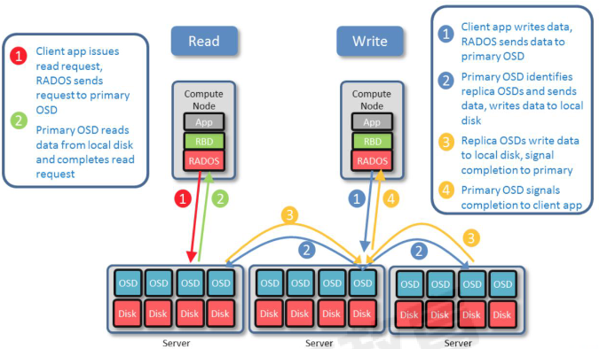
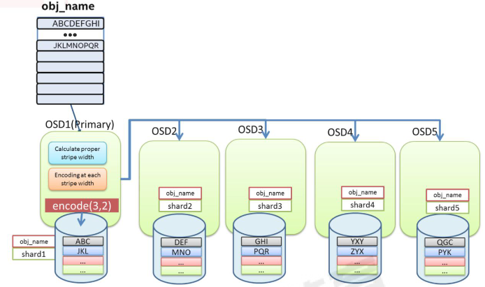

# 存储池、PG 与 CRUSH

## 一、简介

>副本池:replicated，定义每个对象在集群中保存为多少个副本，默认为三个副本，一主两备，实现高可用，副本池是 ceph 默认的存储池类型。

>纠删码池(erasure code): 把各对象存储为 N=K+M 个块(chunk)，其中 K 为数据块数量，M为编码快数量，因此存储池的总大小 N 等于 K+M。
>
>即数据保存在 K 个数据块，并提供 M 个冗余块提供数据高可用，那么最多能故障的块就是M 个，实际的磁盘占用就是 K+M 块，因此相比副本池机制比较节省存储资源，一般采用8+4 机制( 默认为 2+2)，即 8 个数据块+4 个冗余块，那么也就是 12 个数据块有 8 个数据块保存数据，有 4 个实现数据冗余，即 1/3 的磁盘空间用于数据冗余，比默认副本池的三倍冗余节省空间，但是不能出现大于一定数据块故障。

>但是不是所有的应用都支持纠删码池，RBD 只支持副本池而 radosgw 则可以支持纠删码池

## 二、副本池IO

>将一个数据对象存储为多个副本在客户端写入操作时，ceph 使用 CRUSH 算法计算出与对象相对应的 PG ID 和 primary OSD主 OSD 根据设置的副本数、对象名称、存储池名称和集群运行图(cluster map)计算出 PG的各辅助 OSD，然后由 OSD 将数据再同步给辅助 OSD。

>读取数据：
>
>1.客户端发送读请求，RADOS 将请求发送到主 OSD。
>
>2.主 OSD 从本地磁盘读取数据并返回数据，最终完成读请求。
>
>
>
>写入数据：
>
>1.客户端 APP 请求写入数据，RADOS 发送数据到主 OSD。
>
>2.主 OSD 识别副本 OSDs，并发送数据到各副本 OSD。
>
>3.副本 OSDs 写入数据，并发送写入完成信号给主 OSD。
>
>4.主 OSD 发送写入完成信号给客户端 APP。



## 三、纠删码池 IO

### 1、介绍

>http://ceph.org.cn/2016/08/01/ceph-%E7%BA%A0%E5%88%A0%E7%A0%81%E4%BB%8B%E7%BB%8D/

>Ceph 从 Firefly 版本开始支持纠删码，但是不推荐在生产环境使用纠删码池。
>纠删码池降低了数据保存所需要的磁盘总空间数量，但是读写数据的计算成本要比副本池高。
>RGW 可以支持纠删码池，RBD 不支持。
>纠删码池可以降低企业的前期 TCO 总拥有成本。

>纠删码写：
>数据将在主 OSD 进行编码然后分发到相应的 OSDs 上去。
>1.计算合适的数据块并进行编码
>2.对每个数据块进行编码并写入 OSD



### 2、使用

#### 1.创建纠删码池

```bash
ceph osd pool create erasure-testpool 16 16 erasure

ceph osd erasure-code-profile get default
```

>k=2 #k 为数据块的数量，即要将原始对象分割成的块数量，例如，如果 k = 2，则会将一个10kB 对象分割成两个(k)各为 5kB 的对象。
>m=2 #编码块(chunk)的数量，即编码函数计算的额外块的数量。如果有 2 个编码块，则表示有两个额外的备份，最多可以从当前 pg 中宕机 2 个 OSD，而不会丢失数据。
>plugin=jerasure #默认的纠删码池插件
>technique=reed_sol_van

#### 2.写入数据

```bash
sudo rados put -p erasure-testpool testfile1 /var/log/syslog
```

#### 3.验证数据

```bash
ceph osd map erasure-testpool testfile1

#验证当前 pg 状态
ceph pg ls-by-pool erasure-testpool | awk '{print $1,$2,$15}

#测试获取数据
rados --pool erasure-testpool get testfile1 -

sudo rados get -p erasure-testpool testfile1 /tmp/testfile1
```

## 四、PG 与 PGP

>PG = Placement Group #归置组，默认每个 PG 三个 OSD(数据三个副本)
>PGP = Placement Group for Placement purpose #归置组的组合，pgp 相当于是 pg 对应
>
>osd 的一种逻辑排列组合关系(在不同的 PG 内使用不同组合关系的 OSD)。
>假如 PG=32，PGP=32，那么:
>
>​    数据最多被拆分为 32 份(PG)，写入到有 32 种组合关系(PGP)的 OSD 上。

>归置组(placement group)是用于跨越多 OSD 将数据存储在每个存储池中的内部数据结构。
>
>归置组在 OSD 守护进程和 ceph 客户端之间生成了一个中间层，CRUSH 算法负责将每个对象动态映射到一个归置组，然后再将每个归置组动态映射到一个或多个 OSD 守护进程，从而能够支持在新的 OSD 设备上线时进行数据重新平衡。

>相对于存储池来说，PG 是一个虚拟组件，它是对象映射到存储池时使用的虚拟层。
>
>可以自定义存储池中的归置组数量。
>
>ceph 出于规模伸缩及性能方面的考虑，ceph 将存储池细分为多个归置组，把每个单独的对象映射到归置组，并为归置组分配一个主 OSD。
>
>存储池由一系列的归置组组成，而 CRUSH 算法则根据集群运行图和集群状态，将个 PG 均匀、伪随机(基于 hash 映射,每次的计算结果够一样)的分布到集群中的 OSD 之上。
>
>如果某个 OSD 失败或需要对集群进行重新平衡，ceph 则移动或复制整个归置组而不需要单独对每个镜像进行寻址。

五、PG 与 OSD 的关系

>ceph 基于 crush 算法将归置组 PG 分配至 OSD
>当一个客户端存储对象的时候，CRUSH 算法映射每一个对象至归置组(PG)

## 六、PG 分配计算

>归置组(PG)的数量是由管理员在创建存储池的时候指定的，然后由 CRUSH 负责创建和使用，PG 的数量是 2 的 N 次方的倍数,每个 OSD 的 PG 不要超出 250 个 PG，官方是每个OSD 100个左右:
>
>​    https://docs.ceph.com/en/mimic/rados/configuration/pool-pg-config-ref/

>Ensure you have a realistic number of placement groups. We recommend approximately100 per OSD. E.g., total number of OSDs multiplied by 100 divided by the number of replicas (i.e., osd pool default size). So for 10 OSDs and osd pool default size = 4, we'drecommend approximately
>确保设置了合适的归置组大小，我们建议每个 OSD 大约 100 个，例如，osd 总数乘以 100除以副本数量（即 osd 池默认大小），因此，对于 10 个 osd、存储池为 4 个，我们建议每个存储池大约(100 * 10) / 4 = 256

>1.通常，PG 的数量应该是数据的合理力度的子集。
>    例如：一个包含 256 个 PG 的存储池，每个 PG 中包含大约 1/256 的存储池数据
>
>2.当需要将 PG 从一个 OSD 移动到另一个 OSD 的时候，PG 的数量会对性能产生影响。
>    PG 的数量过少，一个 OSD 上保存的数据数据会相对加多，那么 ceph 同步数据的时候产生的网络负载将对集群的性能输出产生一定影响。
>    PG 过多的时候，ceph 将会占用过多的 CPU 和内存资源用于记录 PG 的状态信息
>
>3.PG 的数量在集群分发数据和重新平衡时扮演者重要的角色作用
>    在所有 OSD 之间进行数据持久存储以及完成数据分布会需要较多的归置组，但是他们的数量应该减少到实现 ceph 最大性能所需的最小 PG 数量值，以节省 CPU 和内存资源。
>    一般来说，对于有着超过 50 个 OSD 的 RADOS 集群，建议每个 OSD 大约有 50-100 个PG 以平衡资源使用及取得更好的数据持久性和数据分布，而在更大的集群中，每个 OSD可以有 100-200 个 PG
>
>​    至于一个 pool 应该使用多少个 PG，可以通过下面的公式计算后，将 pool 的 PG 值四舍五入到最近的 2 的 N 次幂，如下先计算出 ceph 集群的总 PG 数：
>​           Total OSDs * PGPerOSD/replication factor => total PGs
>​           磁盘总数 x 每个磁盘 PG 数/副本数 => ceph 集群总 PG 数(略大于 2^n 次方)
>
>​           官方的计算公式：
>​           Total PGs = (Total_number_of_OSD * 100) / max_replication_count
>
>单个 pool 的 PG 计算如下：
>    有 100 个 osd，3 副本，5 个 pool
>    Total PGs =100*100/3=3333
>    每个 pool 的 PG=3333/5=512，那么创建 pool 的时候就指定 pg 为 512。
>
>需要结合数据数量、磁盘数量及磁盘空间计算出 PG 数量，8、16、32、64、128、256等 2 的 N 次方。
>
>一个 RADOS 集群上会存在多个存储池，因此管理员还需要考虑所有存储池上的 PG 分布后每个 OSD 需要映射的 PG 数量。
>
>ceph 的 pg 数量推荐是 2 的整次幂，比如 2 的平方叫二次幂,立方叫三次幂,幂的大小是整数。

>如果不是 2 的整次方输入下方命令查看会有提示

```bash
ceph health detail
```

## 七、验证 PG 与 PGP 组合

```bash
ceph pg ls-by-pool mypool
ceph pg ls-by-pool mypool | awk '{print $1,$2,$15}'
```
