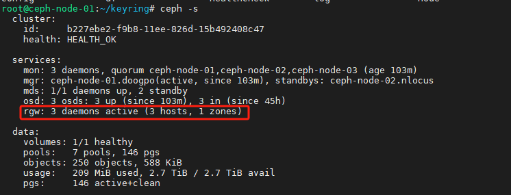
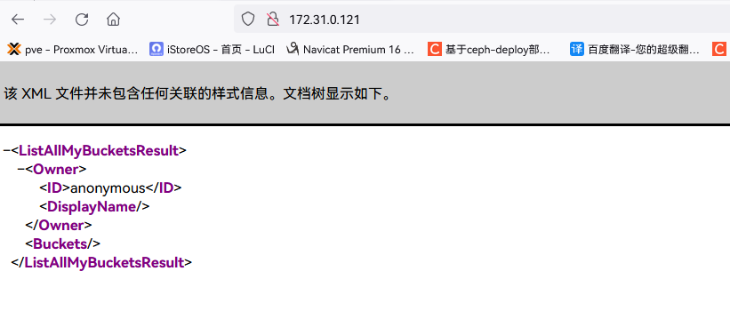

# Ceph对象存储网关RadosGW

>http://docs.ceph.org.cn/radosgw/

>数据不需要放置在目录层次结构中，而是存在于平面地址空间内的同一级别应用通过唯一地址来识别每个单独的数据对象。
>每个对象可包含有助于检索的元数据。
>通过 RESTful API 在应用级别（而非用户级别）进行访问。

## 一、简介

>​    RadosGW 是对象存储(OSS,Object Storage Service)的一种实现方式，RADOS 网关也称为Ceph 对象网关、RadosGW、RGW，是一种服务，使客户端能够利用标准对象存储 API 来访 问 Ceph 集 群 ， 它 支 持 AWS S3 和 Swift API ， 在 ceph 0.8 版 本 之 后 使 用 Civetweb(https://github.com/civetweb/civetweb) 的 web 服 务 器 来 响 应 api 请 求 ， 客 户 端 使 用http/https 协议通过 RESTful API 与 RGW 通信，而 RGW 则通过 librados 与 ceph 集群通信，RGW 客户端通过 s3 或者 swift api 使用 RGW 用户进行身份验证，然后 RGW 网关代表用户利用 cephx 与 ceph 存储进行身份验证

>S3 由 Amazon 于 2006 年推出，全称为 Simple Storage Service,S3 定义了对象存储，是对象存储事实上的标准，从某种意义上说，S3 就是对象存储，对象存储就是 S3,它是对象存储市场的霸主，后续的对象存储都是对 S3 的模仿

## 二、特点

>- 通过对象存储将数据存储为对象，每个对象除了包含数据，还包含数据自身的元数据。
>- 对象通过 Object ID 来检索，无法通过普通文件系统的方式通过文件路径及文件名称操作来直接访问对象，只能通过 API 来访问，或者第三方客户端（实际上也是对 API 的封装）。
>- 对象存储中的对象不整理到目录树中，而是存储在扁平的命名空间中，Amazon S3 将这个扁平命名空间称为 bucket，而 swift 则将其称为容器。
>- 无论是 bucket 还是容器，都不能嵌套。
>- bucket 需要被授权才能访问到，一个帐户可以对多个 bucket 授权，而权限可以不同。
>- 方便横向扩展、快速检索数据
>- 不支持客户端挂载,且需要客户端在访问的时候指定文件名称。
>- 不是很适用于文件过于频繁修改及删除的场景。

>ceph 使用 bucket 作为存储桶(存储空间)，实现对象数据的存储和多用户隔离，数据存储在bucket 中，用户的权限也是针对 bucket 进行授权，可以设置用户对不同的 bucket 拥有不同的权限，以实现权限管理。

### 1、bucket 特性

>- 存储空间是用于存储对象（Object）的容器，所有的对象都必须隶属于某个存储空间，可以设置和修改存储空间属性用来控制地域、访问权限、生命周期等，这些属性设置直接作用于该存储空间内所有对象，因此可以通过灵活创建不同的存储空间来完成不同的管理功能。
>
>- 同一个存储空间的内部是扁平的，没有文件系统的目录等概念，所有的对象都直接隶属于其对应的存储空间。
>- 每个用户可以拥有多个存储空间
>- 存储空间的名称在 OSS 范围内必须是全局唯一的，一旦创建之后无法修改名称。
>- 存储空间内部的对象数目没有限制。

### 2、bucket 命名规范

>只能包括小写字母、数字和短横线（-）。
>必须以小写字母或者数字开头和结尾。
>长度必须在 3-63 字节之间。
>存储桶名称不能使用用 IP 地址格式。
>Bucket 名称必须全局唯一。

## 三、对象存储访问对比

### 1、Amazon S3

>提供了 user、bucket 和 object 分别表示用户、存储桶和对象，其中 bucket隶属于 user，可以针对 user 设置不同 bucket 的名称空间的访问权限，而且不同用户允许访问相同的 bucket。

### 2、OpenStack Swift

>提供了 user、container 和 object 分别对应于用户、存储桶和对象，不过它还额外为 user 提供了父级组件 account，account 用于表示一个项目或租户(OpenStack用户)，因此一个 account 中可包含一到多个 user，它们可共享使用同一组 container，并为container 提供名称空间。

### 3、RadosGW

>提供了 user、subuser、bucket 和 object，其中的 user 对应于 S3 的 user，而subuser 则对应于 Swift 的 user，不过 user 和 subuser 都不支持为 bucket 提供名称空间，
>因此，不同用户的存储桶也不允许同名；不过，自 Jewel 版本起，RadosGW 引入了 tenant（租户）用于为 user 和 bucket 提供名称空间，但它是个可选组件，RadosGW 基于 ACL
>为不同的用户设置不同的权限控制，如：
>    Read 读权限
>    Write 写权限
>    Readwrite 读写权限
>    full-control 全部控制权限

## 四、服务端准备

### 1、服务端状态验证



### 2、radosgw 的存储池类型

```bash
root@ceph-node-01:~/keyring# ceph osd pool ls
.mgr
.rgw.root
default.rgw.log
default.rgw.control
default.rgw.meta
cephfs.ceph-fs.meta
cephfs.ceph-fs.data
```

>- .rgw.root： 包含 realm(领域信息)，比如 zone 和 zonegroup。
>- default.rgw.log： 存储日志信息，用于记录各种 log 信息。
>- default.rgw.control： 系统控制池，在有数据更新时，通知其它 RGW 更新缓存。
>- default.rgw.meta： 元数据存储池，通过不同的名称空间分别存储不同的 rados 对象，这些名称空间包括⽤⼾UID 及其 bucket 映射信息的名称空间 users.uid、⽤⼾的密钥名称空间users.keys、⽤⼾的 email 名称空间 users.email、⽤⼾的 subuser 的名称空间 users.swift，以及 bucket 的名称空间 root 等。
>- default.rgw.buckets.index： 存放 bucket 到 object 的索引信息。
>- default.rgw.buckets.data： 存放对象的数据。
>- default.rgw.buckets.non-ec #数据的额外信息存储池
>- default.rgw.users.uid： 存放用户信息的存储池。
>- default.rgw.data.root： 存放 bucket 的元数据，结构体对应 RGWBucketInfo，比如存放桶名、桶 ID、data_pool 等。

### 3、查看默认RadosGW信息

```bash
root@ceph-node-01:~/keyring# radosgw-admin zone get --rgw-zone=default --rgw-zonegroup=default
{
    "id": "02ea5c1b-98f3-4d1f-b31d-9d4c4e00606d",
    "name": "default",
    "domain_root": "default.rgw.meta:root",
    "control_pool": "default.rgw.control",
    "gc_pool": "default.rgw.log:gc",
    "lc_pool": "default.rgw.log:lc",
    "log_pool": "default.rgw.log",
    "intent_log_pool": "default.rgw.log:intent",
    "usage_log_pool": "default.rgw.log:usage",
    "roles_pool": "default.rgw.meta:roles",
    "reshard_pool": "default.rgw.log:reshard",
    "user_keys_pool": "default.rgw.meta:users.keys",
    "user_email_pool": "default.rgw.meta:users.email",
    "user_swift_pool": "default.rgw.meta:users.swift",
    "user_uid_pool": "default.rgw.meta:users.uid",
    "otp_pool": "default.rgw.otp",
    "system_key": {
        "access_key": "",
        "secret_key": ""
    },
    "placement_pools": [
        {
            "key": "default-placement",
            "val": {
                "index_pool": "default.rgw.buckets.index",
                "storage_classes": {
                    "STANDARD": {
                        "data_pool": "default.rgw.buckets.data"
                    }
                },
                "data_extra_pool": "default.rgw.buckets.non-ec",
                "index_type": 0,
                "inline_data": "true"
            }
        }
    ],
    "realm_id": "",
    "notif_pool": "default.rgw.log:notif"
}
```

### 4、网页访问



## 五、radosgw http容灾优化

### 1、实现高可用

>haproxy反向代理

### 2、radosgw https+高可用

>k8s-ingress/nginx反向代理

### 3、日志及其它优化配置

```bash
# 创建日志目录
mkdir /var/log/radosgw
chown ceph.ceph /var/log/radosgw

# 当前配置
vim ceph.conf

[client.rgw.ceph-mgr2]
rgw_host = ceph-mgr2
rgw_frontends = "civetweb port=9900+9443s
ssl_certificate=/etc/ceph/certs/civetweb.pem
error_log_file=/var/log/radosgw/civetweb.error.log
access_log_file=/var/log/radosgw/civetweb.access.log
request_timeout_ms=30000 num_threads=200"

#https://docs.ceph.com/en/mimic/radosgw/config-ref/
num_threads 默认值等于 rgw_thread_pool_size=100

# 重启服务
```

## 六、客户端(s3cmd)测试数据读写

### 1、RGW Server 配置

>在实际的生产环境，RGW1 和 RGW2 的配置参数是完全一样的

```bash
$ cat /etc/ceph/ceph.conf
[global]
fsid = 1883278f-95fe-4f85-b027-3a6eba444e61
public_network = 172.31.0.0/21
cluster_network = 192.168.0.0/21
mon_initial_members = ceph-mon1
mon_host = 172.31.6.101
auth_cluster_required = cephx
auth_service_required = cephx
auth_client_required = cephx
[client.rgw.ceph-mgr1]
rgw_host = ceph-mgr1
rgw_frontends = civetweb port=9900
rgw_dns_name = rgw.xiaowu.net
[client.rgw.ceph-mgr2]
rgw_host = ceph-mgr2
rgw_frontends = civetweb port=9900
rgw_dns_name = rgw.xiaowu.net
```

### 2、创建 RGW 账户

```bash
radosgw-admin user create --uid="user1" --display-name="user1"
```

### 3、安装s3cmd客户端

>s3cmd 是一个通过命令行访问 ceph RGW 实现创建存储同桶、上传、下载以及管理数据到对象存储的命令行客户端工具

### 4、配置s3cmd客户端执行环境

#### 1.s3cmd 客户端添加域名解析

#### 2.配置命令执行环境

```bash
s3cmd --help
s3cmd --configure
Enter new values or accept defaults in brackets with Enter.
Refer to user manual for detailed description of all options.
Access key and Secret key are your identifiers for Amazon S3.
Leave them empty forusing the env variables.
Access Key: JIJX25OFEJ40JEBECDZV #输入用户 access key
Secret Key: vBa23pj4AhGk9GPeSrhL9NLaldShudVfjQ4AC90E #输入用户 secret key
Default Region [US]: #region 选项,直接回车
Use "s3.amazonaws.com" for S3 Endpoint and not modify it to the target Amazon S3.
S3 Endpoint [s3.amazonaws.com]: rgw.xiaowu.net:9900 #RGW 域名
Use "%(bucket)s.s3.amazonaws.com" to the target Amazon S3. "%(bucket)s" and "%(location)s" vars can be used
if the target S3 system supports dns based buckets.
DNS-style bucket+hostname:port template for accessing a bucket
[%(bucket)s.s3.amazonaws.com]: rgw.magedu.net:9900/%(bucket) #bucket 域名格式
Encryption password is used to protect your files from reading
by unauthorized persons while in transfer to S3
Encryption password: #密码
Path to GPG program [/usr/bin/gpg]: #gpg 命令路径，用于认证管理
When using secure HTTPS protocol all communication with Amazon S3
servers is protected from 3rd party eavesdropping. This method is
slower than plain HTTP, and can only be proxied with Python 2.7 or newer
Use HTTPS protocol [Yes]: No #是否使用 https
On some networks all internet access must go through a HTTP proxy.
Try setting it here if you can't connect to S3 directly
HTTP Proxy server name: #代理
New settings: #最终配置
New settings:
Access Key: JIJX25OFEJ40JEBECDZV
Secret Key: vBa23pj4AhGk9GPeSrhL9NLaldShudVfjQ4AC90E
Default Region: US
S3 Endpoint: rgw.magedu.net:9900
DNS-style bucket+hostname:port template for accessing a bucket:
rgw.magedu.net:9900/%(bucket)
Encryption password:
Path to GPG program: /usr/bin/gpg
Use HTTPS protocol: False
HTTP Proxy server name:
HTTP Proxy server port: 0
Test access with supplied credentials? [Y/n] y
Please wait, attempting to list all buckets...
Success. Your access key and secret key worked fine :-)
Now verifying that encryption works...
Not configured. Never mind.
Save settings? [y/N] y #是否保存以上配置
Configuration saved to '/var/lib/ceph/.s3cfg' #配置文件保存路径
```

#### 3.验证认证文件

```bash
vim /root/.s3cfg

[default]
access_key = JIJX25OFEJ40JEBECDZV
。。
host_base = rgw.xiaowu.net:9900
host_bucket = %(bucket)s.rgw.xiaowu.net:9900
。。
secret_key = vBa23pj4AhGk9GPeSrhL9NLaldShudVfjQ4AC90E
。。
```

### 5、命令行客户端 s3cmd 验证数据上传

#### 1.查看帮助信息

```bash
s3cmd --help
```

#### 2.创建 bucket 以验证权限

>存储空间（Bucket）是用于存储对象（Object）的容器，在上传任意类型的 Object 前，您需要先创建 Bucket

```bash
s3cmd mb s3://mybucket
s3cmd mb s3://css
s3cmd mb s3://images
```

#### 3.验证上传数据

```bash
wget https://img1.jcloudcs.com/portal/brand/2021/fl1-2.jpg

# 上传数据
s3cmd put fl1-2.jpg s3://test-s3cmd/
s3cmd put fl1-2.jpg s3://images/jpg/

# 验证数据
s3cmd ls s3://images/
s3cmd ls s3://images/jpg/
```

#### 4.验证下载文件

```bash
s3cmd get s3://images/fl1-2.jpg /opt/
ls /opt/
```

#### 5.删除文件

```bash
# 验证当前文件
s3cmd ls s3://images/

# 删除文件
s3cmd rm s3://images/fl1-2.jpg

# 验证是否被删除
s3cmd ls s3://images/
```


https://www.cnblogs.com/wangguishe/p/15666853.html

https://blog.csdn.net/gengduc/article/details/134913678
