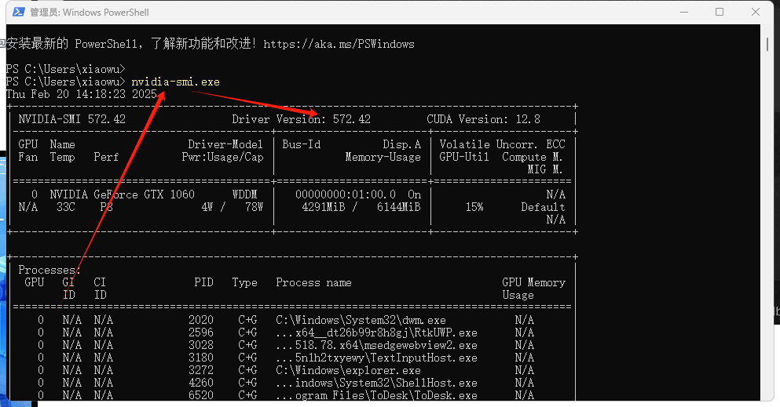
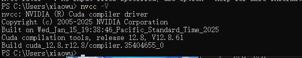
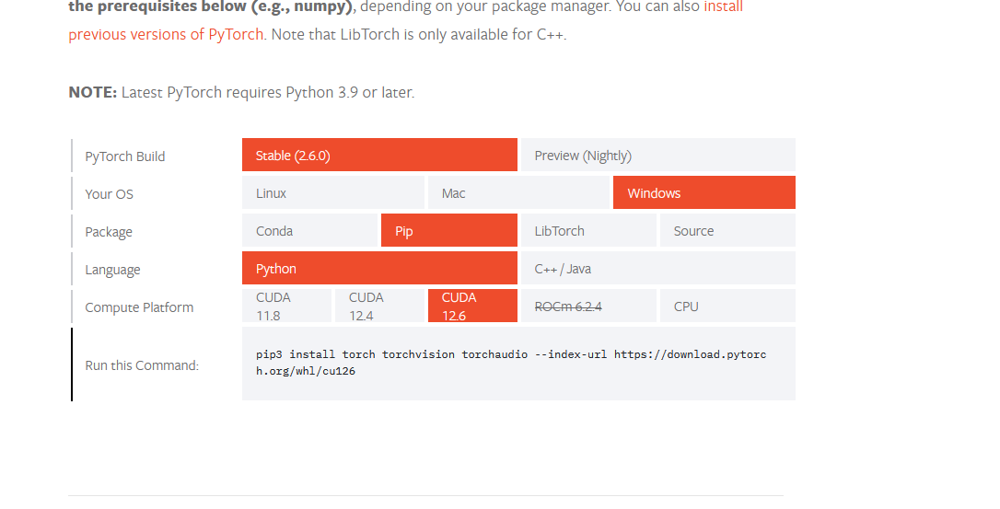
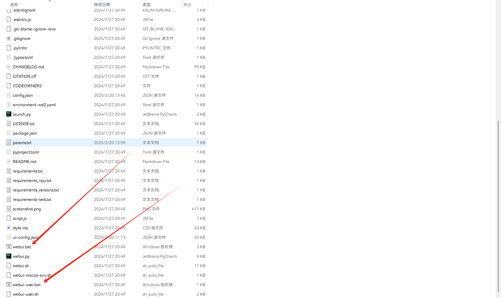
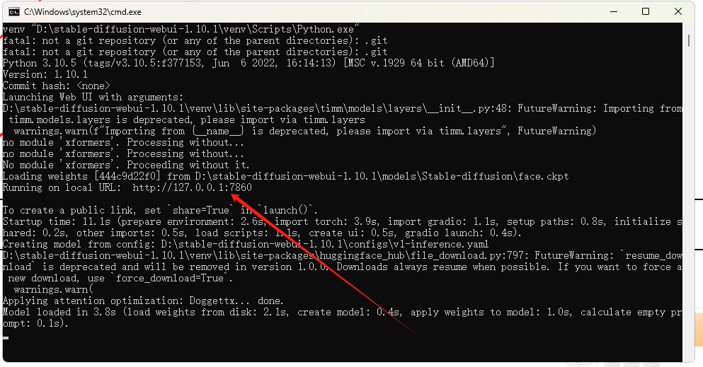
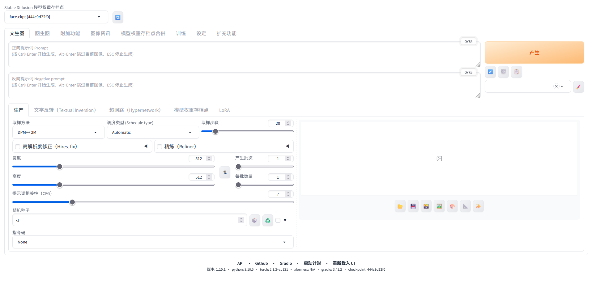

# 安装以及配置中文

## 一、需要的工具

>Python 3.10.5
>git客户端

## 二、安装CUDA

### 1、查看自己图像驱动版本

```powershell
PS C:\Users\xiaowu> nvidia-smi.exe
```



### 2、根据版本下载并安装完整CUDA

https://developer.nvidia.com/cuda-toolkit-archive

### 3、检查



### 3、Cudnn下载

https://developer.nvidia.com/rdp/cudnn-archive

>这不是安装包，解压开之后，把里面的dll文件复制到对应的先前安装目录下。例如我的CUDA安装目录是

```cmd
C:\Program Files\NVIDIA GPU Computing Toolkit\CUDA
```

>cudnn/bin/*.dll --> CUDA/v12.8/bin/
> cudnn/indclude/*.dll --> CUDA/v12.8/include/
> cudnn/lib/x64/*.dll --> CUDA/v12.8/lib/x64/

## 三、安装支持cuda的torch

>https://pytorch.org/get-started/locally/

>根据自己环境获取pip 下载命令



## 四、检查pytorch模块是否支持CUDA

```python
import torch
print(torch.cuda.is_available())  # 应该输出 True 如果 GPU 可以使用
print(torch.cuda.device_count())  # 应该输出大于 0 的数字，表示有 GPU 设备可用
print(torch.cuda.get_device_name(0))  # 输出 GPU 的名称
print(f'torch的版本是：{torch.__version__}')
print(f'torch是否能使用cuda：{torch.cuda.is_available()}')

# 结果
True
1
NVIDIA GeForce GTX 1060
torch的版本是：2.6.0+cu126
torch是否能使用cuda：True
```

## 五、SD安装

>https://github.com/AUTOMATIC1111/stable-diffusion-webui

```bash
git clone https://github.com/AUTOMATIC1111/stable-diffusion-webui.git
```

>运行bat脚本，二选一







## 六、汉化教程

>https://zhuanlan.zhihu.com/p/624396825

